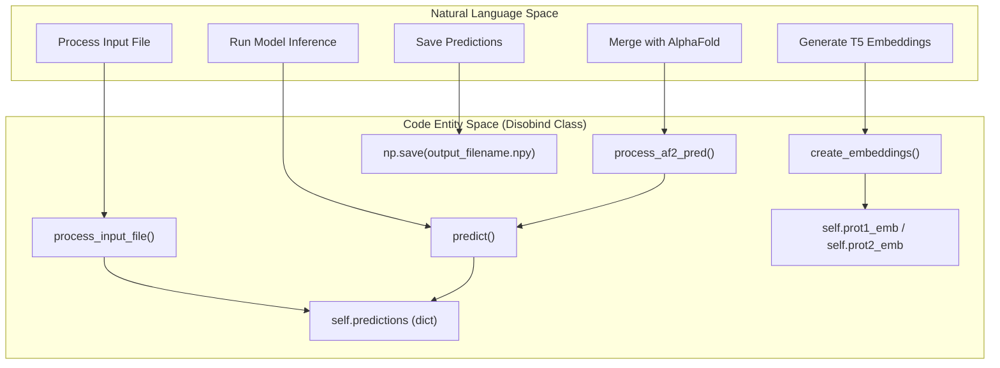
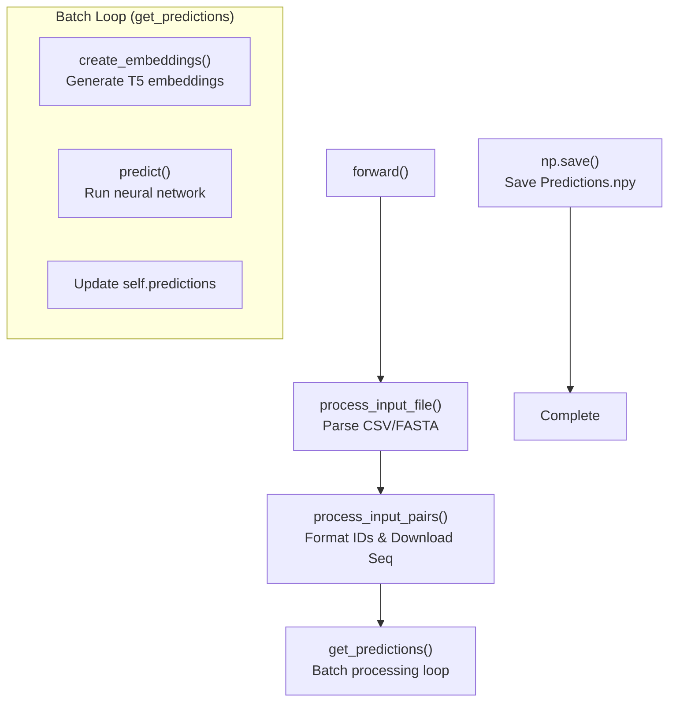
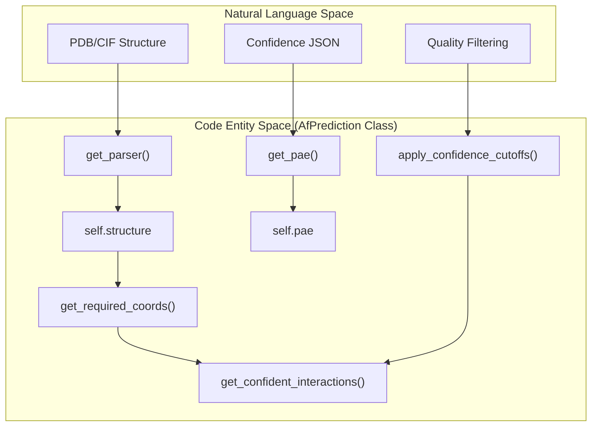
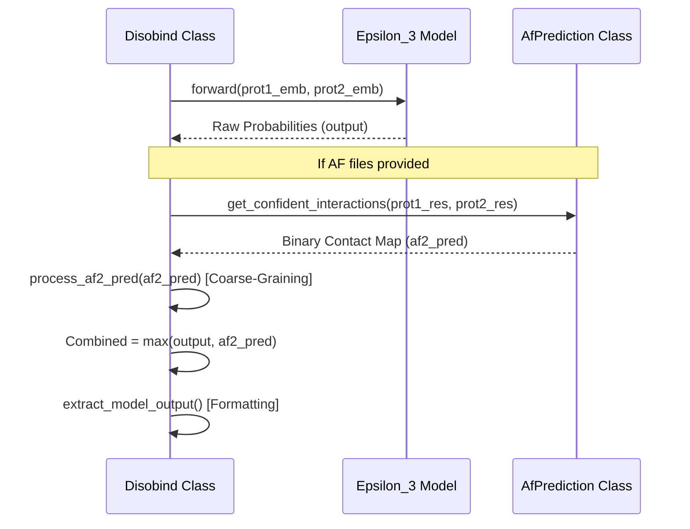

# Core Prediction Classes

> **Relevant source files**
> * [example/test.fasta](https://github.com/isblab/disobind/blob/5fffcf84/example/test.fasta)
> * [run_disobind.py](https://github.com/isblab/disobind/blob/5fffcf84/run_disobind.py)

This page documents the core prediction classes used by Disobind for making disorder-aware protein interaction predictions. These classes form the foundation of the prediction pipeline and handle model loading, input preparation, inference, and AlphaFold integration.

---

## Overview of Core Classes

The prediction system consists of two primary classes that work together to produce enhanced predictions:

| Class | Location | Primary Responsibility |
| --- | --- | --- |
| `Disobind` | [run_disobind.py L44-L826](https://github.com/isblab/disobind/blob/5fffcf84/run_disobind.py#L44-L826) | Main prediction pipeline, model loading, and output generation |
| `AfPrediction` | [run_disobind.py L831-L1173](https://github.com/isblab/disobind/blob/5fffcf84/run_disobind.py#L831-L1173) | AlphaFold structure parsing, confidence filtering, and contact map extraction |

These classes are designed to work independently or in combination, where `Disobind` can optionally integrate predictions from `AfPrediction` to enhance accuracy.

**Sources:** [run_disobind.py L44-L1173](https://github.com/isblab/disobind/blob/5fffcf84/run_disobind.py#L44-L1173)

---

## Disobind Class

### Class Definition and Purpose

The `Disobind` class orchestrates the complete prediction workflow from input parsing to final output generation. It handles UniProt sequence downloads, embedding generation using the `Embeddings` class, model loading, and optional AlphaFold integration.

### Bridge: Natural Language to Code Entity Space (Disobind)

This diagram maps the high-level prediction steps to the specific class methods and internal state transitions.

**Sources:** [run_disobind.py L44-L126](https://github.com/isblab/disobind/blob/5fffcf84/run_disobind.py#L44-L126)

 [run_disobind.py L212-L255](https://github.com/isblab/disobind/blob/5fffcf84/run_disobind.py#L212-L255)

 [run_disobind.py L375-L395](https://github.com/isblab/disobind/blob/5fffcf84/run_disobind.py#L375-L395)

 [run_disobind.py L532-L661](https://github.com/isblab/disobind/blob/5fffcf84/run_disobind.py#L532-L661)

### Constructor

The constructor initializes all configuration parameters and creates the output directory:

**Signature:** `__init__(self, args)` [run_disobind.py L45](https://github.com/isblab/disobind/blob/5fffcf84/run_disobind.py#L45-L45)

**Key Parameters (from argparse):**

| Parameter | Attribute | Type | Description |
| --- | --- | --- | --- |
| `-f` | `self.input_file` | str | Path to input CSV or FASTA file [run_disobind.py L51](https://github.com/isblab/disobind/blob/5fffcf84/run_disobind.py#L51-L51) |
| `-i` | `self.input_type` | str | Input file type: "fasta" or "csv" [run_disobind.py L53](https://github.com/isblab/disobind/blob/5fffcf84/run_disobind.py#L53-L53) |
| `-c` | `self.cores` | int | Number of CPU cores for parallelism [run_disobind.py L55](https://github.com/isblab/disobind/blob/5fffcf84/run_disobind.py#L55-L55) |
| `-cm` | `self.predict_cmap` | bool | Whether to predict contact maps [run_disobind.py L57](https://github.com/isblab/disobind/blob/5fffcf84/run_disobind.py#L57-L57) |
| `-cg` | `self.required_cg` | int | Coarse-graining level: 1, 5, or 10 [run_disobind.py L59](https://github.com/isblab/disobind/blob/5fffcf84/run_disobind.py#L59-L59) |
| `-o` | `self.output_dir` | str | Name for output directory [run_disobind.py L61](https://github.com/isblab/disobind/blob/5fffcf84/run_disobind.py#L61-L61) |
| `-d` | `self.device` | str | Device: "cpu" or "cuda" [run_disobind.py L68](https://github.com/isblab/disobind/blob/5fffcf84/run_disobind.py#L68-L68) |

**Sources:** [run_disobind.py L45-L109](https://github.com/isblab/disobind/blob/5fffcf84/run_disobind.py#L45-L109)

### Main Execution Flow

The `forward()` method orchestrates the complete prediction pipeline:

**Sources:** [run_disobind.py L111-L126](https://github.com/isblab/disobind/blob/5fffcf84/run_disobind.py#L111-L126)

 [run_disobind.py L168-L208](https://github.com/isblab/disobind/blob/5fffcf84/run_disobind.py#L168-L208)

### Input and Embedding Methods

#### process_input_file()

Supports two modes:

1. **CSV:** Allows multiple jobs; limited to UniProt entries [run_disobind.py L224-L255](https://github.com/isblab/disobind/blob/5fffcf84/run_disobind.py#L224-L255)
2. **FASTA:** Allows custom sequences; limited to one prediction per run [run_disobind.py L258-L279](https://github.com/isblab/disobind/blob/5fffcf84/run_disobind.py#L258-L279)

#### create_embeddings()

Utilizes the `Embeddings` class [dataset/create_input_embeddings.py](https://github.com/isblab/disobind/blob/5fffcf84/dataset/create_input_embeddings.py)

 to generate T5 protein embeddings. It writes a temporary FASTA file, runs the embedding model, and stores results in an HDF5 file (`.h5`) [run_disobind.py L375-L395](https://github.com/isblab/disobind/blob/5fffcf84/run_disobind.py#L375-L395)

### Model Management

#### apply_settings()

Configures the internal `self.objective` list which determines the task behavior:

* `objective[0]`: "interaction" or "interface" [run_disobind.py L438-L444](https://github.com/isblab/disobind/blob/5fffcf84/run_disobind.py#L438-L444)
* `objective[1]`: Coarse-graining bin size (1, 5, or 10) [run_disobind.py L445-L451](https://github.com/isblab/disobind/blob/5fffcf84/run_disobind.py#L445-L451)
* `objective[2]`: Boolean for binning input embeddings [run_disobind.py L453-L458](https://github.com/isblab/disobind/blob/5fffcf84/run_disobind.py#L453-L458)

#### load_model()

Loads a pre-trained model based on the version string. It fetches configuration from `./params/Model_config_{model_ver}.yml` and weights from a `.pth` file [run_disobind.py L399-L429](https://github.com/isblab/disobind/blob/5fffcf84/run_disobind.py#L399-L429)

### Prediction Logic

#### get_input_tensors()

Prepares NumPy embeddings for the neural network by converting them to `torch.tensor`, applying padding, and coarse-graining via `prepare_input()` [run_disobind.py L475-L529](https://github.com/isblab/disobind/blob/5fffcf84/run_disobind.py#L475-L529)

#### predict()

Iterates through each protein pair and task. If AlphaFold files are provided in the input, it instantiates `AfPrediction` to retrieve structural contacts and merges them with Disobind's output using a `max` operation [run_disobind.py L532-L661](https://github.com/isblab/disobind/blob/5fffcf84/run_disobind.py#L532-L661)

**Sources:** [run_disobind.py L433-L661](https://github.com/isblab/disobind/blob/5fffcf84/run_disobind.py#L433-L661)

---

## AfPrediction Class

### Class Definition and Purpose

The `AfPrediction` class extracts structural contact maps from AlphaFold2/3 outputs. It filters these contacts using pLDDT (per-residue confidence) and PAE (Predicted Aligned Error) to ensure only high-confidence structural interactions are considered.

### Bridge: Natural Language to Code Entity Space (AlphaFold)

This diagram maps AlphaFold data concepts to the internal methods of `AfPrediction`.

**Sources:** [run_disobind.py L831-L1173](https://github.com/isblab/disobind/blob/5fffcf84/run_disobind.py#L831-L1173)

### Key Methods

#### get_confident_interactions()

The primary interface for this class. It performs the following:

1. Extracts residues for the specified fragments [run_disobind.py L1152](https://github.com/isblab/disobind/blob/5fffcf84/run_disobind.py#L1152-L1152)
2. Retrieves coordinates, pLDDT, and PAE [run_disobind.py L1162](https://github.com/isblab/disobind/blob/5fffcf84/run_disobind.py#L1162-L1162)
3. Calculates a distance-based contact map (threshold: 8Å) [run_disobind.py L1108](https://github.com/isblab/disobind/blob/5fffcf84/run_disobind.py#L1108-L1108)
4. Applies thresholds: pLDDT >= 70 and PAE <= 5 [run_disobind.py L1118-L1128](https://github.com/isblab/disobind/blob/5fffcf84/run_disobind.py#L1118-L1128)
5. Returns the element-wise product of the contact map and confidence masks [run_disobind.py L1172](https://github.com/isblab/disobind/blob/5fffcf84/run_disobind.py#L1172-L1172)

#### get_pae()

Parses the AlphaFold JSON file. It handles both AF2 and AF3 formats by looking for `predicted_aligned_error` or `pae` keys. It symmetrizes the matrix using `(PAE + PAE.T) / 2` [run_disobind.py L942-L955](https://github.com/isblab/disobind/blob/5fffcf84/run_disobind.py#L942-L955)

#### extract_perresidue_quantity()

Helper to extract specific data from BioPython `Residue` objects, such as `"res_pos"`, `"coords"` (CA atom), and `"plddt"` (B-factor) [run_disobind.py L898-L922](https://github.com/isblab/disobind/blob/5fffcf84/run_disobind.py#L898-L922)

**Sources:** [run_disobind.py L831-L1173](https://github.com/isblab/disobind/blob/5fffcf84/run_disobind.py#L831-L1173)

---

## Data Flow: Prediction Integration

When running in combined mode, the data flows from both the neural network and the structural parser into a final merged result.

**Sources:** [run_disobind.py L616-L660](https://github.com/isblab/disobind/blob/5fffcf84/run_disobind.py#L616-L660)

 [run_disobind.py L664-L693](https://github.com/isblab/disobind/blob/5fffcf84/run_disobind.py#L664-L693)

### Implementation Detail: Coarse-Graining AF2

The `process_af2_pred` method ensures structural contacts match the Disobind task resolution. It uses `MaxPool2d` with a kernel size equal to the CG level (1, 5, or 10) to aggregate the binary contact map [run_disobind.py L676-L681](https://github.com/isblab/disobind/blob/5fffcf84/run_disobind.py#L676-L681)

**Sources:** [run_disobind.py L664-L693](https://github.com/isblab/disobind/blob/5fffcf84/run_disobind.py#L664-L693)