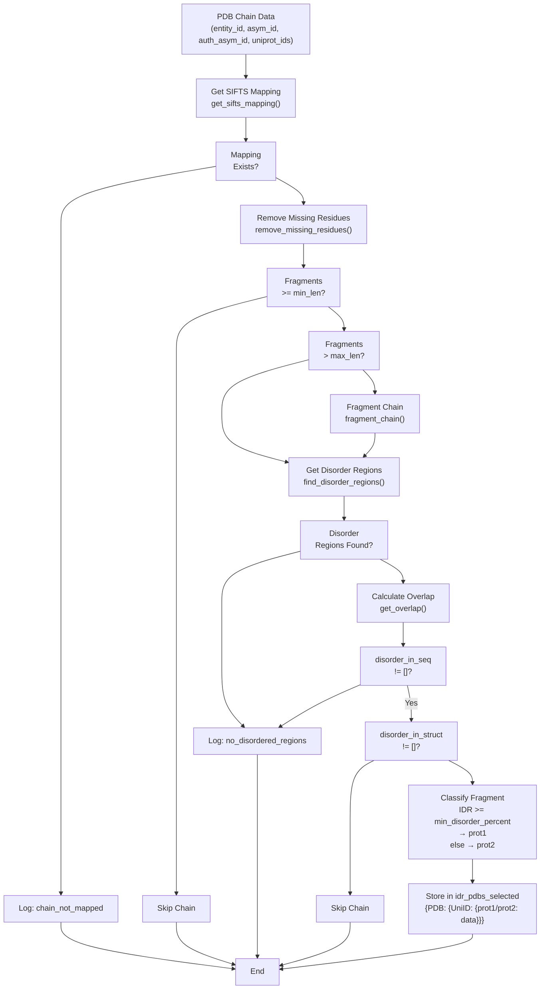
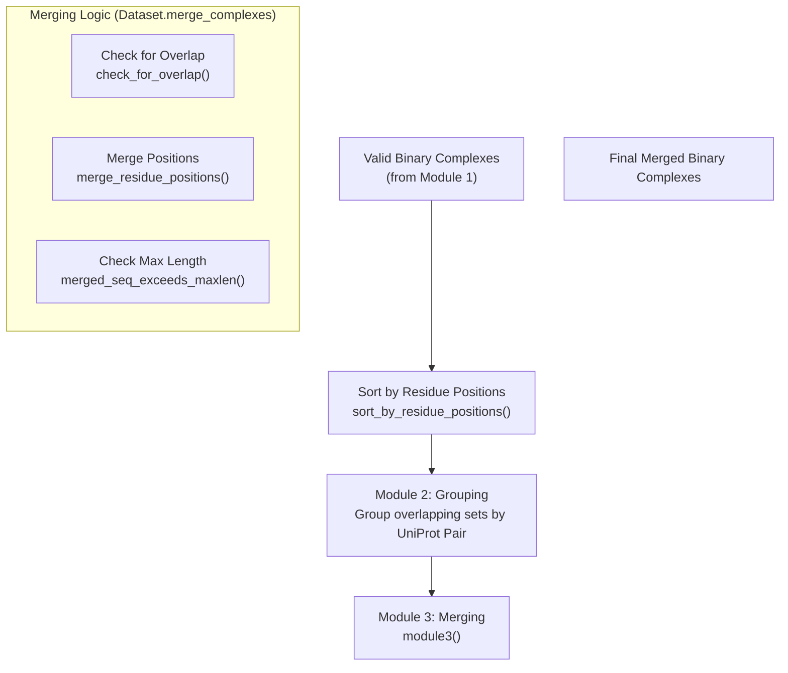

# Creating Binary Complexes

> **Relevant source files**
> * [dataset/2_create_database_dataset_files.py](https://github.com/isblab/disobind/blob/5fffcf84/dataset/2_create_database_dataset_files.py)
> * [dataset/3_create_merged_binary_complexes.py](https://github.com/isblab/disobind/blob/5fffcf84/dataset/3_create_merged_binary_complexes.py)
> * [dataset/from_APIs_with_love.py](https://github.com/isblab/disobind/blob/5fffcf84/dataset/from_APIs_with_love.py)
> * [dataset/parse_sifts.py](https://github.com/isblab/disobind/blob/5fffcf84/dataset/parse_sifts.py)

## Purpose and Scope

This page describes the process of creating binary protein complexes from PDB structures for the Disobind dataset. A binary complex consists of two protein chains: one containing intrinsically disordered regions (IDRs) and one partner protein (which may be ordered or disordered). This step follows [Data Collection from Databases](/isblab/disobind/3.1-data-collection-from-databases) and precedes [Non-Redundant Dataset Creation](/isblab/disobind/3.3-non-redundant-dataset-creation).

The binary complex creation involves:

1. Identifying IDRs and ordered regions in protein chains from PDB structures.
2. Classifying chains based on disorder content.
3. Creating all possible binary combinations between IDR-containing chains and partner chains.
4. Validating structural coordinates and contact maps for the resulting pairs.
5. Merging overlapping fragments to maximize sequence coverage.

---

## Overview

Binary complex creation is performed by the `parse_pdbs_for_idrs` class in `dataset/2_create_database_dataset_files.py` and refined by the `Dataset` class in `dataset/3_create_merged_binary_complexes.py`.

| Script | Class | Key Stage | Purpose |
| --- | --- | --- | --- |
| `2_create_database_dataset_files.py` | `parse_pdbs_for_idrs` | `parallelize_dataset_creation()` | Identify disordered and ordered chains in each PDB structure. |
| `2_create_database_dataset_files.py` | `parse_pdbs_for_idrs` | `create_binary_complexes()` | Generate all-vs-all binary combinations from identified chains. |
| `3_create_merged_binary_complexes.py` | `Dataset` | `module1()` | Validate coordinates and ensure contact existence between chains. |
| `3_create_merged_binary_complexes.py` | `Dataset` | `module3()` | Merge overlapping fragments for the same UniProt pair. |

**Sources:** [dataset/2_create_database_dataset_files.py L44-L45](https://github.com/isblab/disobind/blob/5fffcf84/dataset/2_create_database_dataset_files.py#L44-L45)

 [dataset/2_create_database_dataset_files.py L287-L381](https://github.com/isblab/disobind/blob/5fffcf84/dataset/2_create_database_dataset_files.py#L287-L381)

 [dataset/3_create_merged_binary_complexes.py L39-L40](https://github.com/isblab/disobind/blob/5fffcf84/dataset/3_create_merged_binary_complexes.py#L39-L40)

 [dataset/3_create_merged_binary_complexes.py L103-L210](https://github.com/isblab/disobind/blob/5fffcf84/dataset/3_create_merged_binary_complexes.py#L103-L210)

---

## IDR Identification and Fragment Classification

### Fragment Processing Workflow

The `where_the_magic_happens()` method processes each chain in a PDB structure to identify IDR-containing fragments.

**Diagram: Fragment Processing Workflow**



**Sources:** [dataset/2_create_database_dataset_files.py L1003-L1249](https://github.com/isblab/disobind/blob/5fffcf84/dataset/2_create_database_dataset_files.py#L1003-L1249)

### Key Processing Steps

#### 1. SIFTS Mapping and Missing Residues

The pipeline uses `get_sifts_mapping` from `from_APIs_with_love.py` to align PDB residues to UniProt accessions. The `remove_missing_residues()` method removes residues that lack structural coordinates. Missing residues split a chain into separate fragments.

**Sources:** [dataset/2_create_database_dataset_files.py L470-L511](https://github.com/isblab/disobind/blob/5fffcf84/dataset/2_create_database_dataset_files.py#L470-L511)

 [dataset/from_APIs_with_love.py L287-L320](https://github.com/isblab/disobind/blob/5fffcf84/dataset/from_APIs_with_love.py#L287-L320)

#### 2. Fragment Length Control

Fragments are filtered and split based on `min_len` (default 20) and `max_len` (default 200). `fragment_chain()` recursively calls `split_frag()` to ensure no fragment exceeds the length limit.

**Sources:** [dataset/2_create_database_dataset_files.py L514-L554](https://github.com/isblab/disobind/blob/5fffcf84/dataset/2_create_database_dataset_files.py#L514-L554)

#### 3. Disorder Classification

`find_disorder_regions()` retrieves annotations from DisProt, IDEAL, and MobiDB. A fragment is classified as **prot1** (the disordered query) if its `disorder_percentage` (disordered residues in structure / total fragment length) is $\ge$ `min_disorder_percent` (default 0.2). Otherwise, it is **prot2** (the partner).

**Sources:** [dataset/2_create_database_dataset_files.py L1102-L1169](https://github.com/isblab/disobind/blob/5fffcf84/dataset/2_create_database_dataset_files.py#L1102-L1169)

 [dataset/utility.py L911-L967](https://github.com/isblab/disobind/blob/5fffcf84/dataset/utility.py#L911-L967)

---

## Binary Complex Generation and Validation

### All-vs-All Combination

`create_binary_complexes()` generates pairs for every `prot1` and `prot2` fragment found in a PDB. If `uni_id1 == uni_id2`, the system checks for positional overlap using `check_for_overlap()` to prevent self-interaction artifacts.

**Sources:** [dataset/2_create_database_dataset_files.py L1254-L1450](https://github.com/isblab/disobind/blob/5fffcf84/dataset/2_create_database_dataset_files.py#L1254-L1450)

 [dataset/utility.py L821-L837](https://github.com/isblab/disobind/blob/5fffcf84/dataset/utility.py#L821-L837)

### Structural Validation (Module 1)

In `3_create_merged_binary_complexes.py`, the `module1()` method performs strict structural checks:

1. **Coordinate Retrieval**: Uses `get_coordinates()` to extract $C\alpha$ positions.
2. **Contact Map Calculation**: Uses `get_contact_map()` with a default `contact_threshold` of 8Å.
3. **Contact Validation**: Complexes with zero contacts between the two chains are discarded.

**Sources:** [dataset/3_create_merged_binary_complexes.py L133-L153](https://github.com/isblab/disobind/blob/5fffcf84/dataset/3_create_merged_binary_complexes.py#L133-L153)

 [dataset/3_create_merged_binary_complexes.py L280-L450](https://github.com/isblab/disobind/blob/5fffcf84/dataset/3_create_merged_binary_complexes.py#L280-L450)

 [dataset/utility.py L100-L147](https://github.com/isblab/disobind/blob/5fffcf84/dataset/utility.py#L100-L147)

---

## Merging Overlapping Complexes

To reduce redundancy and increase the context for the model, overlapping fragments of the same UniProt pair are merged.

**Diagram: Merging and Validation Pipeline**



**Sources:** [dataset/3_create_merged_binary_complexes.py L155-L210](https://github.com/isblab/disobind/blob/5fffcf84/dataset/3_create_merged_binary_complexes.py#L155-L210)

 [dataset/3_create_merged_binary_complexes.py L644-L800](https://github.com/isblab/disobind/blob/5fffcf84/dataset/3_create_merged_binary_complexes.py#L644-L800)

 [dataset/utility.py L840-L863](https://github.com/isblab/disobind/blob/5fffcf84/dataset/utility.py#L840-L863)

### Merging Rules

1. **Overlap Requirement**: Two fragments are merged if their UniProt position ranges overlap.
2. **Length Constraint**: The resulting merged sequence must not exceed `max_len` (100 for this stage).
3. **Coordinate Handling**: If multiple PDB structures cover the same region, the system retains the coordinates from the first encountered structure in the sorted list.

**Sources:** [dataset/3_create_merged_binary_complexes.py L80-L82](https://github.com/isblab/disobind/blob/5fffcf84/dataset/3_create_merged_binary_complexes.py#L80-L82)

 [dataset/3_create_merged_binary_complexes.py L720-L780](https://github.com/isblab/disobind/blob/5fffcf84/dataset/3_create_merged_binary_complexes.py#L720-L780)

---

## Data Structures and Storage

### Directory Structure

```markdown
database/
├── Disobind_dataset_200_20_0.2/
│   ├── IDR_PDBs/                # Classified chains (.json)
│   └── Binary_complexes_None/    # Initial all-vs-all pairs (.json)
└── v_{version}/
    ├── Valid_Binary_Complexes/   # Structurally validated pairs
    └── merged_binary_complexes/  # Final merged pairs (.json)
```

**Sources:** [dataset/2_create_database_dataset_files.py L83-L105](https://github.com/isblab/disobind/blob/5fffcf84/dataset/2_create_database_dataset_files.py#L83-L105)

 [dataset/3_create_merged_binary_complexes.py L46-L72](https://github.com/isblab/disobind/blob/5fffcf84/dataset/3_create_merged_binary_complexes.py#L46-L72)

### Binary Complex Schema

The final complexes are stored as JSON dictionaries indexed by a key created via `create_key()` (format: `uni_id1--uni_id2`).

| Field | Description |
| --- | --- |
| `PDB ID` | Source PDB accession |
| `Asym ID1 / 2` | Internal PDB chain identifiers |
| `Uniprot positions1 / 2` | Residue indices in UniProt sequence |
| `PDB positions1 / 2` | Residue indices in PDB file |

**Sources:** [dataset/2_create_database_dataset_files.py L557-L568](https://github.com/isblab/disobind/blob/5fffcf84/dataset/2_create_database_dataset_files.py#L557-L568)

 [dataset/3_create_merged_binary_complexes.py L74-L78](https://github.com/isblab/disobind/blob/5fffcf84/dataset/3_create_merged_binary_complexes.py#L74-L78)