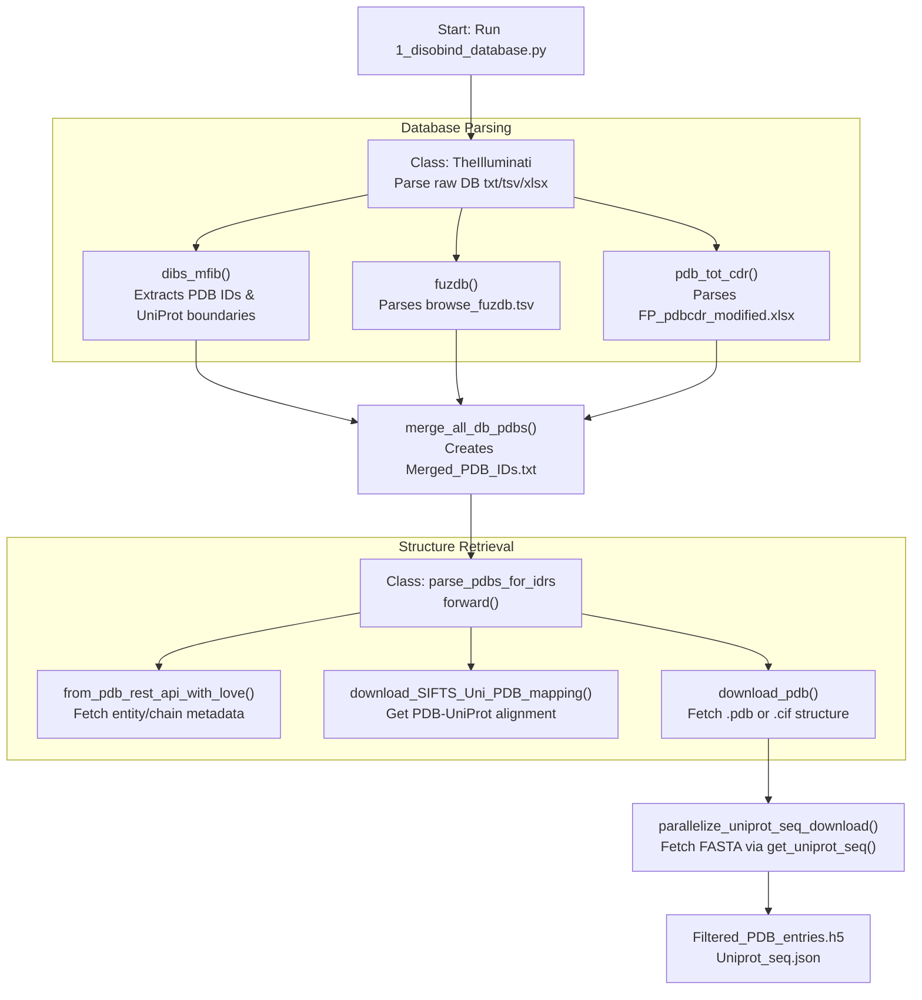
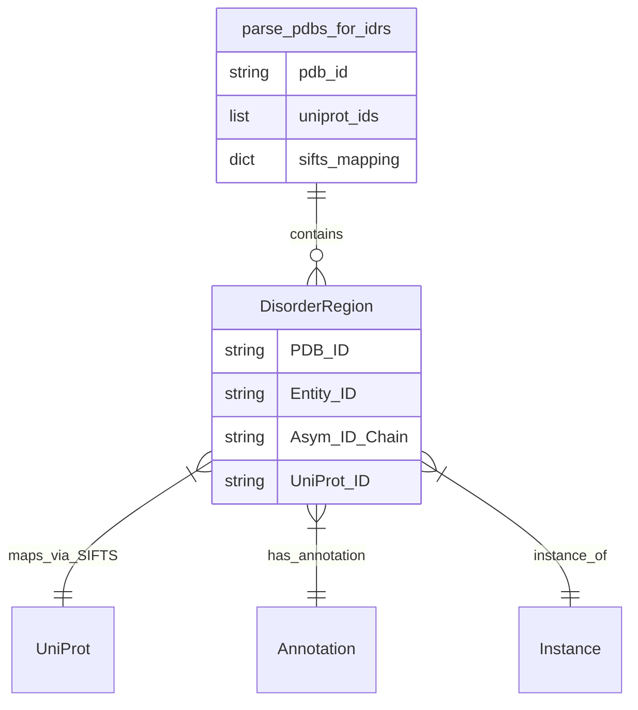
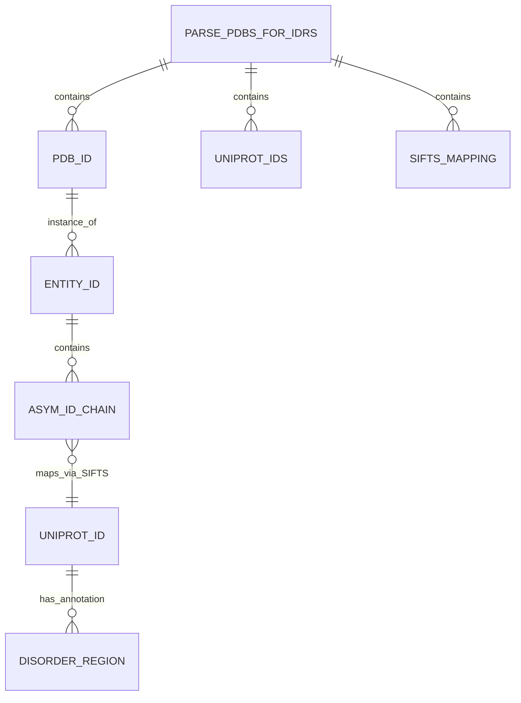

# Data Collection from Databases

> **Relevant source files**
> * [database/input_files/DIBS_MFIB.csv](https://github.com/isblab/disobind/blob/5fffcf84/database/input_files/DIBS_MFIB.csv)
> * [database/input_files/DisProt.csv](https://github.com/isblab/disobind/blob/5fffcf84/database/input_files/DisProt.csv)
> * [database/input_files/IDEAL.csv](https://github.com/isblab/disobind/blob/5fffcf84/database/input_files/IDEAL.csv)
> * [database/input_files/Merged_PDB_IDs.txt](https://github.com/isblab/disobind/blob/5fffcf84/database/input_files/Merged_PDB_IDs.txt)
> * [database/input_files/MobiDB.csv](https://github.com/isblab/disobind/blob/5fffcf84/database/input_files/MobiDB.csv)
> * [database/raw/DIBS_complete_17Apr24.txt](https://github.com/isblab/disobind/blob/5fffcf84/database/raw/DIBS_complete_17Apr24.txt)
> * [dataset/1_disobind_databases.py](https://github.com/isblab/disobind/blob/5fffcf84/dataset/1_disobind_databases.py)

## Purpose and Scope

This page describes the initial data collection phase of the Disobind dataset creation pipeline. It covers how to collect PDB IDs from multiple disorder protein databases, download PDB structures, obtain PDB-to-UniProt mappings via SIFTS, and download UniProt sequences. This is the first step in creating training data for Disobind models.

The primary entry point for this stage is the script `1_disobind_database.py`, which utilizes the `TheIlluminati` class to parse raw database files and the `parse_pdbs_for_idrs` class to orchestrate the retrieval of structural data.

**Sources:** [dataset/1_disobind_databases.py L1-L36](https://github.com/isblab/disobind/blob/5fffcf84/dataset/1_disobind_databases.py#L1-L36)

 [dataset/2_create_database_dataset_files.py L1-L150](https://github.com/isblab/disobind/blob/5fffcf84/dataset/2_create_database_dataset_files.py#L1-L150)

---

## Overview of Disorder Databases

Disobind collects PDB IDs and disorder annotations from several specialized databases. These databases provide the ground truth for intrinsically disordered regions (IDRs) and their binding interfaces.

| Database | Full Name | Code Reference / Implementation |
| --- | --- | --- |
| **DisProt** | Database of Protein Disorder | Parsed from `DisProt.csv` [dataset/1_disobind_databases.py L471-L475](https://github.com/isblab/disobind/blob/5fffcf84/dataset/1_disobind_databases.py#L471-L475) |
| **IDEAL** | Intrinsically Disordered proteins with Extensive Annotations and Literature | Parsed from `IDEAL.csv` [dataset/1_disobind_databases.py L477-L481](https://github.com/isblab/disobind/blob/5fffcf84/dataset/1_disobind_databases.py#L477-L481) |
| **MobiDB** | Database of Protein Disorder and Mobility Annotations | Parsed from `MobiDB.csv` [dataset/1_disobind_databases.py L483-L487](https://github.com/isblab/disobind/blob/5fffcf84/dataset/1_disobind_databases.py#L483-L487) |
| **DIBS** | Disordered Binding Sites | `dibs_mfib()` method [dataset/1_disobind_databases.py L175-L214](https://github.com/isblab/disobind/blob/5fffcf84/dataset/1_disobind_databases.py#L175-L214) |
| **MFIB** | Mutual Folding Induced by Binding | `dibs_mfib()` method [dataset/1_disobind_databases.py L175-L214](https://github.com/isblab/disobind/blob/5fffcf84/dataset/1_disobind_databases.py#L175-L214) |
| **FuzDB** | Fuzzy Complexes Database | `fuzdb()` method [dataset/1_disobind_databases.py L273-L315](https://github.com/isblab/disobind/blob/5fffcf84/dataset/1_disobind_databases.py#L273-L315) |
| **PDBtot** | PDB Total | `pdb_tot_cdr()` method [dataset/1_disobind_databases.py L318-L364](https://github.com/isblab/disobind/blob/5fffcf84/dataset/1_disobind_databases.py#L318-L364) |
| **PDBcdr** | PDB Circular Dichroism | `pdb_tot_cdr()` method [dataset/1_disobind_databases.py L318-L364](https://github.com/isblab/disobind/blob/5fffcf84/dataset/1_disobind_databases.py#L318-L364) |

**Sources:** [dataset/1_disobind_databases.py L38-L56](https://github.com/isblab/disobind/blob/5fffcf84/dataset/1_disobind_databases.py#L38-L56)

 [dataset/1_disobind_databases.py L175-L364](https://github.com/isblab/disobind/blob/5fffcf84/dataset/1_disobind_databases.py#L175-L364)

---

## Data Collection Workflow

The following diagram bridges the high-level data flow with the specific code entities responsible for each step.

### System Data Flow and Code Entities

**Workflow Summary:**

1. **Parsing**: `TheIlluminati` class reads raw database files (e.g., `DIBS_complete_17Apr24.txt`) and converts them into structured dictionaries using `convert_txt_to_dict` [dataset/1_disobind_databases.py L58-L172](https://github.com/isblab/disobind/blob/5fffcf84/dataset/1_disobind_databases.py#L58-L172)
2. **Merging**: PDB IDs from all sources are aggregated and written to `Merged_PDB_IDs.txt` [dataset/1_disobind_databases.py L429-L456](https://github.com/isblab/disobind/blob/5fffcf84/dataset/1_disobind_databases.py#L429-L456)
3. **Validation**: `parse_pdbs_for_idrs` checks for obsolete PDB IDs using `get_superseding_pdb_id` [dataset/from_APIs_with_love.py L726-L749](https://github.com/isblab/disobind/blob/5fffcf84/dataset/from_APIs_with_love.py#L726-L749)
4. **Mapping**: SIFTS mappings are downloaded to align PDB residues to UniProt positions [dataset/from_APIs_with_love.py L586-L612](https://github.com/isblab/disobind/blob/5fffcf84/dataset/from_APIs_with_love.py#L586-L612)
5. **Sequencing**: UniProt sequences are fetched and filtered by length (default `uni_max_len = 10000`) [dataset/2_create_database_dataset_files.py L779-L818](https://github.com/isblab/disobind/blob/5fffcf84/dataset/2_create_database_dataset_files.py#L779-L818)

**Sources:** [dataset/1_disobind_databases.py L429-L467](https://github.com/isblab/disobind/blob/5fffcf84/dataset/1_disobind_databases.py#L429-L467)

 [dataset/2_create_database_dataset_files.py L147-L285](https://github.com/isblab/disobind/blob/5fffcf84/dataset/2_create_database_dataset_files.py#L147-L285)

 [dataset/from_APIs_with_love.py L586-L612](https://github.com/isblab/disobind/blob/5fffcf84/dataset/from_APIs_with_love.py#L586-L612)

---

## Key Classes and Implementation

### TheIlluminati Class

This class is responsible for the initial extraction of PDB IDs and UniProt metadata from external disorder databases.

* **`convert_txt_to_dict(txt)`**: A manual parser for the DIBS/MFIB text format. It identifies entries via `[Entry]` tags and extracts PDB IDs, chain IDs, and UniProt boundaries [dataset/1_disobind_databases.py L58-L172](https://github.com/isblab/disobind/blob/5fffcf84/dataset/1_disobind_databases.py#L58-L172)
* **`merge_all_db_pdbs()`**: Aggregates IDs from all loaded DataFrames, ensuring a unique set of PDB identifiers for the download pipeline [dataset/1_disobind_databases.py L429-L456](https://github.com/isblab/disobind/blob/5fffcf84/dataset/1_disobind_databases.py#L429-L456)

**Sources:** [dataset/1_disobind_databases.py L31-L56](https://github.com/isblab/disobind/blob/5fffcf84/dataset/1_disobind_databases.py#L31-L56)

 [dataset/1_disobind_databases.py L58-L172](https://github.com/isblab/disobind/blob/5fffcf84/dataset/1_disobind_databases.py#L58-L172)

### parse_pdbs_for_idrs Class

The main orchestrator for downloading and validating structural data.

* **`parallelize_PDB_download()`**: Uses a `multiprocessing.Pool` to execute `download_pdb_and_sift` across multiple cores [dataset/2_create_database_dataset_files.py L571-L610](https://github.com/isblab/disobind/blob/5fffcf84/dataset/2_create_database_dataset_files.py#L571-L610)
* **`download_pdb_and_sift(pdb_id)`**: The atomic unit of work for structure collection. It performs the following sequence: 1. Check for superseding IDs [dataset/2_create_database_dataset_files.py L642-L646](https://github.com/isblab/disobind/blob/5fffcf84/dataset/2_create_database_dataset_files.py#L642-L646) 2. Fetch metadata via `from_pdb_rest_api_with_love` [dataset/2_create_database_dataset_files.py L657-L658](https://github.com/isblab/disobind/blob/5fffcf84/dataset/2_create_database_dataset_files.py#L657-L658) 3. Verify the entry is not a monomer (if `create_dataset=True`) [dataset/2_create_database_dataset_files.py L699-L703](https://github.com/isblab/disobind/blob/5fffcf84/dataset/2_create_database_dataset_files.py#L699-L703) 4. Download SIFTS mapping [dataset/2_create_database_dataset_files.py L734-L738](https://github.com/isblab/disobind/blob/5fffcf84/dataset/2_create_database_dataset_files.py#L734-L738) 5. Download PDB/CIF file [dataset/2_create_database_dataset_files.py L749-L753](https://github.com/isblab/disobind/blob/5fffcf84/dataset/2_create_database_dataset_files.py#L749-L753)

**Sources:** [dataset/2_create_database_dataset_files.py L613-L776](https://github.com/isblab/disobind/blob/5fffcf84/dataset/2_create_database_dataset_files.py#L613-L776)

---

## Detailed Data Flow: PDB to UniProt Mapping

One of the most critical steps is ensuring that structural coordinates can be mapped back to the canonical UniProt sequence.

### Mapping Entity Relationships

--- 

**Implementation Details:**

* **SIFTS Parsing**: The `parse_sifts.py` script (called via shell) converts XML mappings into a TSV format containing `PDB_pos` and `Uniprot_pos` [dataset/from_APIs_with_love.py L527-L582](https://github.com/isblab/disobind/blob/5fffcf84/dataset/from_APIs_with_love.py#L527-L582)
* **Chimeric Chains**: The pipeline explicitly checks if a single PDB chain maps to multiple UniProt IDs using `is_chimera()`. These are typically excluded to avoid ambiguity in interaction labeling [dataset/from_APIs_with_love.py L843-L853](https://github.com/isblab/disobind/blob/5fffcf84/dataset/from_APIs_with_love.py#L843-L853)
* **Non-Protein Entities**: Entities like DNA, RNA, or small molecules are filtered out by checking the `rcsb_entity_polymer_info.type` field in the PDB REST API response [dataset/from_APIs_with_love.py L826-L834](https://github.com/isblab/disobind/blob/5fffcf84/dataset/from_APIs_with_love.py#L826-L834)

**Sources:** [dataset/from_APIs_with_love.py L527-L582](https://github.com/isblab/disobind/blob/5fffcf84/dataset/from_APIs_with_love.py#L527-L582)

 [dataset/from_APIs_with_love.py L826-L853](https://github.com/isblab/disobind/blob/5fffcf84/dataset/from_APIs_with_love.py#L826-L853)

---

## Output Files and Formats

The collection process produces several intermediate and final files in the `database/input_files/` and project-specific dataset directories.

| File Name | Format | Content Description |
| --- | --- | --- |
| `Merged_PDB_IDs.txt` | Text (CSV) | A flat list of all PDB IDs collected from disorder databases [dataset/1_disobind_databases.py L456](https://github.com/isblab/disobind/blob/5fffcf84/dataset/1_disobind_databases.py#L456-L456) |
| `Selected_PDBs_info.h5` | HDF5 (DataFrame) | Metadata including PDB ID, Entity ID, Asym ID, and associated UniProt IDs [dataset/2_create_database_dataset_files.py L221](https://github.com/isblab/disobind/blob/5fffcf84/dataset/2_create_database_dataset_files.py#L221-L221) |
| `Uniprot_seq.json` | JSON | Dictionary mapping UniProt Accession to `[sequence, protein_name]` [dataset/2_create_database_dataset_files.py L248](https://github.com/isblab/disobind/blob/5fffcf84/dataset/2_create_database_dataset_files.py#L248-L248) |
| `Filtered_PDB_entries.h5` | HDF5 (DataFrame) | The final set of PDB-UniProt mappings after excluding obsolete IDs and long sequences [dataset/2_create_database_dataset_files.py L273](https://github.com/isblab/disobind/blob/5fffcf84/dataset/2_create_database_dataset_files.py#L273-L273) |

**Sources:** [dataset/1_disobind_databases.py L456](https://github.com/isblab/disobind/blob/5fffcf84/dataset/1_disobind_databases.py#L456-L456)

 [dataset/2_create_database_dataset_files.py L221-L273](https://github.com/isblab/disobind/blob/5fffcf84/dataset/2_create_database_dataset_files.py#L221-L273)

---

## Parallelization and API Handling

To handle the thousands of PDB entries, the pipeline employs robust parallelization and error handling.

* **CPU Parallelization**: The number of cores is set via the `-c` argument in `1_disobind_database.py` [dataset/1_disobind_databases.py L524-L528](https://github.com/isblab/disobind/blob/5fffcf84/dataset/1_disobind_databases.py#L524-L528)
* **API Resilience**: The `from_APIs_with_love.py` module wraps all `requests.get` calls in retry logic with exponential backoff. * `max_trials` (default 10-25) [dataset/from_APIs_with_love.py L10-L11](https://github.com/isblab/disobind/blob/5fffcf84/dataset/from_APIs_with_love.py#L10-L11) * `wait_time` (default 5-20 seconds) [dataset/from_APIs_with_love.py L10-L11](https://github.com/isblab/disobind/blob/5fffcf84/dataset/from_APIs_with_love.py#L10-L11)
* **Large File Handling**: The system checks for the existence of files before downloading, allowing for interrupted runs to be resumed without redundant API calls [dataset/2_create_database_dataset_files.py L734-L753](https://github.com/isblab/disobind/blob/5fffcf84/dataset/2_create_database_dataset_files.py#L734-L753)

**Sources:** [dataset/1_disobind_databases.py L524-L528](https://github.com/isblab/disobind/blob/5fffcf84/dataset/1_disobind_databases.py#L524-L528)

 [dataset/from_APIs_with_love.py L10-L20](https://github.com/isblab/disobind/blob/5fffcf84/dataset/from_APIs_with_love.py#L10-L20)

 [dataset/2_create_database_dataset_files.py L734-L753](https://github.com/isblab/disobind/blob/5fffcf84/dataset/2_create_database_dataset_files.py#L734-L753)