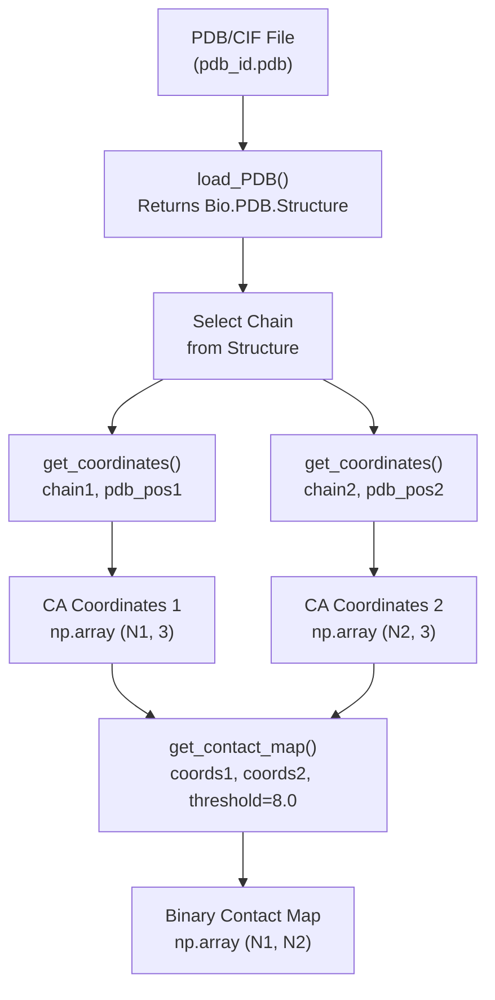
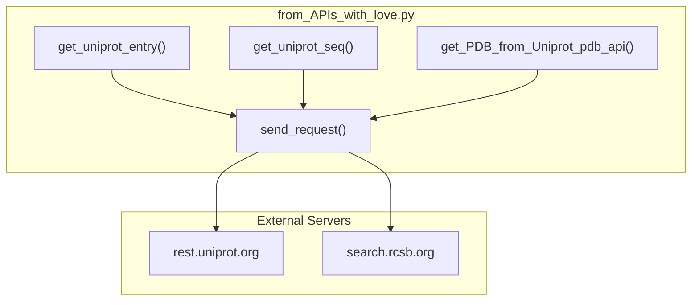
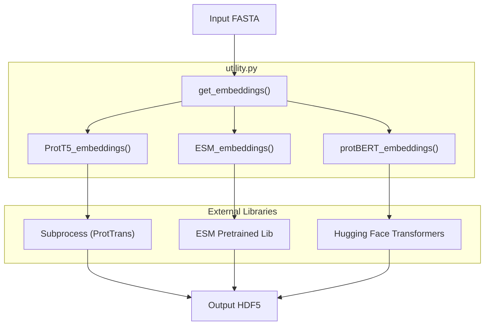

# Data Processing Utilities

> **Relevant source files**
> * [dataset/from_APIs_with_love.py](https://github.com/isblab/disobind/blob/5fffcf84/dataset/from_APIs_with_love.py)
> * [dataset/parse_sifts.py](https://github.com/isblab/disobind/blob/5fffcf84/dataset/parse_sifts.py)
> * [dataset/utility.py](https://github.com/isblab/disobind/blob/5fffcf84/dataset/utility.py)

This page documents the low-level utility functions in `dataset/utility.py` and `dataset/from_APIs_with_love.py` that support the Disobind dataset creation pipeline. These functions handle structural data processing, coordinate transformations, sequence encoding, embedding generation, and external database queries.

For information about the high-level dataset creation workflow, see [Dataset Creation Pipeline](https://github.com/isblab/disobind/blob/5fffcf84/Dataset Creation Pipeline)

 For specific dataset preparation tasks, see [Creating Binary Complexes](https://github.com/isblab/disobind/blob/5fffcf84/Creating Binary Complexes)

 and [Generating Embeddings](https://github.com/isblab/disobind/blob/5fffcf84/Generating Embeddings)

---

## Overview

The data processing utilities provide fundamental operations for:

* **Structural Processing**: Loading PDB/CIF files and extracting atomic coordinates.
* **Coordinate Transformations**: Converting between PDB and UniProt residue numbering systems.
* **Contact Map Generation**: Creating binary contact maps from 3D coordinates.
* **Disorder Region Processing**: Loading and querying disorder databases (DisProt, IDEAL, MobiDB).
* **Sequence Encoding**: One-hot encoding and tokenization of amino acid sequences.
* **Embedding Generation**: Creating T5, ESM, BERT, and other protein embeddings.
* **Structural Alignment**: Running MMSeqs2, MMalign, and USalign tools.
* **External API Calls**: Fetching data from UniProt and PDB web servers.

Sources: [dataset/utility.py L1-L30](https://github.com/isblab/disobind/blob/5fffcf84/dataset/utility.py#L1-L30)

 [dataset/from_APIs_with_love.py L1-L16](https://github.com/isblab/disobind/blob/5fffcf84/dataset/from_APIs_with_love.py#L1-L16)

---

## PDB Structure Processing

### Loading PDB Files

The `load_PDB()` function reads PDB or CIF format structure files using BioPython parsers.

**Function Signature**: `load_PDB(pdb, pdb_path)` [dataset/utility.py L26-L59](https://github.com/isblab/disobind/blob/5fffcf84/dataset/utility.py#L26-L59)

| Parameter | Type | Description |
| --- | --- | --- |
| `pdb` | str | PDB ID to load |
| `pdb_path` | str | Directory containing PDB/CIF files |
| **Returns** | Bio.PDB.Structure | All models from the structure file |

The function automatically detects whether a `.pdb` or `.cif` file exists and selects the appropriate parser (`PDBParser` or `MMCIFParser`) [dataset/utility.py L53-L56](https://github.com/isblab/disobind/blob/5fffcf84/dataset/utility.py#L53-L56)

### Coordinate Extraction

The `get_coordinates()` function extracts Cα atom coordinates for specified residues from a protein chain.

**Function Signature**: `get_coordinates(chain, pdb_pos)` [dataset/utility.py L64-L103](https://github.com/isblab/disobind/blob/5fffcf84/dataset/utility.py#L64-L103)

| Parameter | Type | Description |
| --- | --- | --- |
| `chain` | Bio.PDB.Chain | Chain object from BioPython |
| `pdb_pos` | list[int] | List of residue positions to extract (empty list = all residues) |
| **Returns** | np.ndarray | Coordinates array of shape (N, 3) |

**Processing Logic**:

* Only extracts ATOM entries (residue.id[0] == " "), ignoring HETATM entries [dataset/utility.py L85-L87](https://github.com/isblab/disobind/blob/5fffcf84/dataset/utility.py#L85-L87)
* Handles missing residues or absent Cα atoms gracefully via try-except blocks [dataset/utility.py L90-L91](https://github.com/isblab/disobind/blob/5fffcf84/dataset/utility.py#L90-L91)
* Returns coordinates as float32 for memory efficiency [dataset/utility.py L103](https://github.com/isblab/disobind/blob/5fffcf84/dataset/utility.py#L103-L103)

### Contact Map Generation

The `get_contact_map()` function creates binary contact maps based on Cα-Cα distance thresholds.

**Function Signature**: `get_contact_map(coords1, coords2, contact_threshold)` [dataset/utility.py L108-L124](https://github.com/isblab/disobind/blob/5fffcf84/dataset/utility.py#L108-L124)

The function computes pairwise Euclidean distances using NumPy broadcasting and applies the threshold to create a binary matrix [dataset/utility.py L121-L122](https://github.com/isblab/disobind/blob/5fffcf84/dataset/utility.py#L121-L122)

### Workflow Diagram

Sources: [dataset/utility.py L26-L124](https://github.com/isblab/disobind/blob/5fffcf84/dataset/utility.py#L26-L124)

---

## External Data Retrieval (from_APIs_with_love)

The `from_APIs_with_love.py` module handles programmatic access to biological databases.

### Core Request Handler

The `send_request()` function is a robust wrapper for `requests.get()` that implements basic retry logic and exponential backoff [dataset/from_APIs_with_love.py L19-L77](https://github.com/isblab/disobind/blob/5fffcf84/dataset/from_APIs_with_love.py#L19-L77)

### UniProt API Integration

* **`get_uniprot_entry()`**: Fetches full JSON metadata for a UniProt accession [dataset/from_APIs_with_love.py L85-L113](https://github.com/isblab/disobind/blob/5fffcf84/dataset/from_APIs_with_love.py#L85-L113)
* **`get_uniprot_seq()`**: Retrieves the FASTA sequence for a given UniProt ID [dataset/from_APIs_with_love.py L158-L186](https://github.com/isblab/disobind/blob/5fffcf84/dataset/from_APIs_with_love.py#L158-L186)
* **`get_PDB_from_Uniprot_uni_api()`**: Queries UniProt for all PDB cross-references [dataset/from_APIs_with_love.py L205-L224](https://github.com/isblab/disobind/blob/5fffcf84/dataset/from_APIs_with_love.py#L205-L224)

### PDB API Integration

* **`get_PDB_from_Uniprot_pdb_api()`**: Queries the RCSB PDB Search API to find structures associated with a UniProt ID [dataset/from_APIs_with_love.py L232-L261](https://github.com/isblab/disobind/blob/5fffcf84/dataset/from_APIs_with_love.py#L232-L261)

### API Integration Diagram

Sources: [dataset/from_APIs_with_love.py L19-L261](https://github.com/isblab/disobind/blob/5fffcf84/dataset/from_APIs_with_love.py#L19-L261)

---

## Residue Position Transformations

Disobind converts between PDB residue numbering and UniProt residue numbering using SIFTS mapping data.

### Basis Conversion Functions

#### change_basis()

Converts residue positions between PDB and UniProt coordinate systems [dataset/utility.py L971-L1010](https://github.com/isblab/disobind/blob/5fffcf84/dataset/utility.py#L971-L1010)

| Parameter | Description |
| --- | --- |
| `mapped_uni_pos` | UniProt positions from SIFTS mapping |
| `mapped_pdb_pos` | PDB positions from SIFTS mapping |
| `target_pos` | Positions to convert |
| `forward` | If True: PDB→UniProt, else UniProt→PDB |

#### change_basis2()

Alternative basis conversion using index lists for efficiency when working with continuous residue ranges [dataset/utility.py L1038-L1093](https://github.com/isblab/disobind/blob/5fffcf84/dataset/utility.py#L1038-L1093)

### Missing Residue Handling

* **`add_residue_positions()`**: Adds "null" placeholders to align target positions with a reference [dataset/utility.py L1096-L1124](https://github.com/isblab/disobind/blob/5fffcf84/dataset/utility.py#L1096-L1124)
* **`remove_nulls()`**: Removes all "null" or NaN values from position lists [dataset/utility.py L1146-L1182](https://github.com/isblab/disobind/blob/5fffcf84/dataset/utility.py#L1146-L1182)
* **`remove_nulls2()`**: Removes nulls and returns a list of continuous fragments [dataset/utility.py L1185-L1236](https://github.com/isblab/disobind/blob/5fffcf84/dataset/utility.py#L1185-L1236)
* **`ranges()`**: Identifies continuous residue ranges and returns start-end tuples [dataset/utility.py L1240-L1272](https://github.com/isblab/disobind/blob/5fffcf84/dataset/utility.py#L1240-L1272)

Sources: [dataset/utility.py L971-L1272](https://github.com/isblab/disobind/blob/5fffcf84/dataset/utility.py#L971-L1272)

---

## Overlap and Merging Operations

These functions detect and merge overlapping protein regions, which is critical for creating non-redundant datasets.

* **`get_intersection()`**: Finds intersecting positions between two lists [dataset/utility.py L660-L682](https://github.com/isblab/disobind/blob/5fffcf84/dataset/utility.py#L660-L682)
* **`check_for_overlap()`**: Efficiently checks for overlap between two regions [dataset/utility.py L709-L741](https://github.com/isblab/disobind/blob/5fffcf84/dataset/utility.py#L709-L741)
* **`merge_residue_positions()`**: Merges two lists of residue positions into a sorted, unique array [dataset/utility.py L745-L761](https://github.com/isblab/disobind/blob/5fffcf84/dataset/utility.py#L745-L761)
* **`merge_overlapping_tuples()`**: Merges overlapping disorder region tuples (e.g., `[(1,10), (5,15)]` -> `[(1,15)]`) [dataset/utility.py L790-L841](https://github.com/isblab/disobind/blob/5fffcf84/dataset/utility.py#L790-L841)
* **`consolidate_regions()`**: Parses comma-separated strings (e.g., "1-10,5-15") and merges them [dataset/utility.py L860-L883](https://github.com/isblab/disobind/blob/5fffcf84/dataset/utility.py#L860-L883)

Sources: [dataset/utility.py L660-L883](https://github.com/isblab/disobind/blob/5fffcf84/dataset/utility.py#L660-L883)

---

## Disorder Region Processing

### Loading Disorder Databases

The `load_disorder_dbs()` function loads CSV files from DisProt, IDEAL, and MobiDB [dataset/utility.py L887-L908](https://github.com/isblab/disobind/blob/5fffcf84/dataset/utility.py#L887-L908)

### Finding Disorder Regions

The `find_disorder_regions()` function queries these databases for a list of UniProt IDs and returns overlapping disordered regions as position arrays [dataset/utility.py L911-L966](https://github.com/isblab/disobind/blob/5fffcf84/dataset/utility.py#L911-L966)

Sources: [dataset/utility.py L887-L966](https://github.com/isblab/disobind/blob/5fffcf84/dataset/utility.py#L887-L966)

---

## Sequence Encoding

### One-Hot Encoding

* **`create_one_hot_vectors()`**: Creates a dictionary mapping amino acids (`ACDEFGHIKLMNPQRSTVWYX`) to 21-dimensional vectors [dataset/utility.py L456-L478](https://github.com/isblab/disobind/blob/5fffcf84/dataset/utility.py#L456-L478)
* **`one_hot_encodings()`**: Generates one-hot encoded representations for sequences with optional padding [dataset/utility.py L481-L509](https://github.com/isblab/disobind/blob/5fffcf84/dataset/utility.py#L481-L509)

### Tokenization

* **`create_tokens()`**: Generates integer tokens for amino acids (1-21, with 22 for padding) [dataset/utility.py L512-L533](https://github.com/isblab/disobind/blob/5fffcf84/dataset/utility.py#L512-L533)
* **`tokenizer()`**: Converts protein sequences to integer token arrays [dataset/utility.py L536-L569](https://github.com/isblab/disobind/blob/5fffcf84/dataset/utility.py#L536-L569)

Sources: [dataset/utility.py L456-L569](https://github.com/isblab/disobind/blob/5fffcf84/dataset/utility.py#L456-L569)

---

## Protein Embedding Generation

### Master Embedding Function

The `get_embeddings()` function acts as a dispatcher for various language models [dataset/utility.py L155-L181](https://github.com/isblab/disobind/blob/5fffcf84/dataset/utility.py#L155-L181)

| Embedding Type | Function | Dimension |
| --- | --- | --- |
| **T5** | `ProtT5_embeddings()` | 1024 |
| **ESM2-650M** | `ESM_embeddings()` | 1280 |
| **ESM2-3B** | `ESM_embeddings()` | 2560 |
| **BERT** | `protBERT_embeddings()` | 1024 |

### ESM2 Embeddings

The `ESM_embeddings()` function uses `esm.pretrained` models. It extracts representations from the last hidden layer and saves them in HDF5 format as float16 [dataset/utility.py L231-L304](https://github.com/isblab/disobind/blob/5fffcf84/dataset/utility.py#L231-L304)

### ProtBERT Embeddings

The `protBERT_embeddings()` function uses the Hugging Face `transformers` library. It tokenizes sequences with spaces between residues and extracts the `last_hidden_state` [dataset/utility.py L184-L227](https://github.com/isblab/disobind/blob/5fffcf84/dataset/utility.py#L184-L227)

### Embedding Generation Diagram

Sources: [dataset/utility.py L155-L402](https://github.com/isblab/disobind/blob/5fffcf84/dataset/utility.py#L155-L402)

---

## Structural Alignment Utilities

* **`mmseqs_cluster()`**: Wraps MMSeqs2 for sequence-based clustering [dataset/utility.py L1325-L1351](https://github.com/isblab/disobind/blob/5fffcf84/dataset/utility.py#L1325-L1351)
* **`mmalign()`**: Wraps MMalign for structural alignment of monomers [dataset/utility.py L1372-L1394](https://github.com/isblab/disobind/blob/5fffcf84/dataset/utility.py#L1372-L1394)
* **`usalign()`**: Wraps USalign for multi-chain/oligomeric structural alignment [dataset/utility.py L1398-L1445](https://github.com/isblab/disobind/blob/5fffcf84/dataset/utility.py#L1398-L1445)
* **`get_aligned_TM_score()`**: Parses TM-score values from alignment output files [dataset/utility.py L1448-L1474](https://github.com/isblab/disobind/blob/5fffcf84/dataset/utility.py#L1448-L1474)

Sources: [dataset/utility.py L1325-L1474](https://github.com/isblab/disobind/blob/5fffcf84/dataset/utility.py#L1325-L1474)