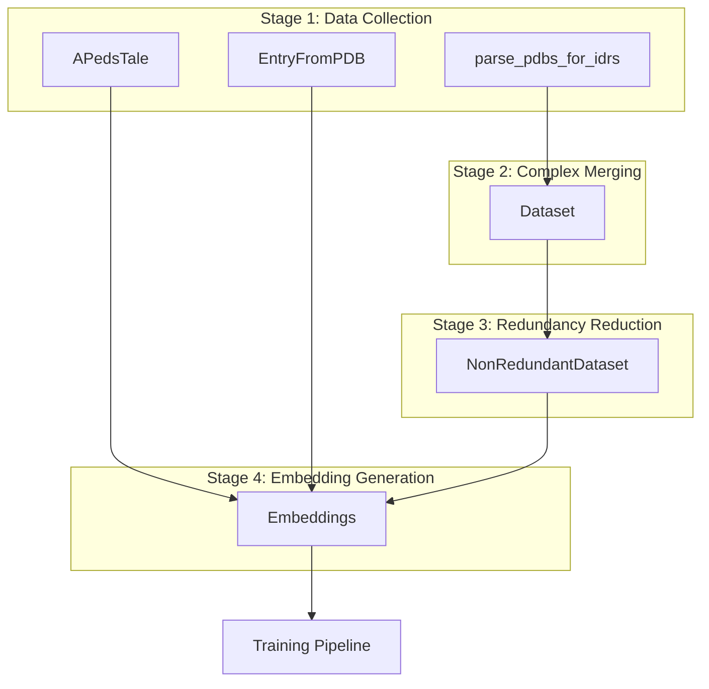
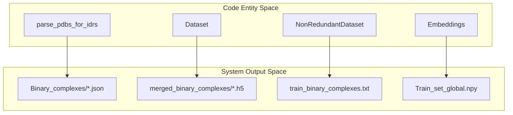
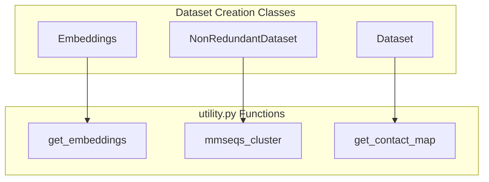

# Dataset Creation Classes

> **Relevant source files**
> * [dataset/2_create_database_dataset_files.py](https://github.com/isblab/disobind/blob/5fffcf84/dataset/2_create_database_dataset_files.py)
> * [dataset/create_input_embeddings.py](https://github.com/isblab/disobind/blob/5fffcf84/dataset/create_input_embeddings.py)
> * [dataset/get_ped_ensembles.py](https://github.com/isblab/disobind/blob/5fffcf84/dataset/get_ped_ensembles.py)
> * [dataset/prepare_entry_from_pdb.py](https://github.com/isblab/disobind/blob/5fffcf84/dataset/prepare_entry_from_pdb.py)

This page provides API reference documentation for the core classes used in the Disobind dataset creation pipeline. These classes handle downloading PDB structures, creating binary complexes, redundancy reduction, and embedding generation, as well as specialized preparation for ensemble data.

**Sources:** [dataset/2_create_database_dataset_files.py](https://github.com/isblab/disobind/blob/5fffcf84/dataset/2_create_database_dataset_files.py)

 [dataset/3_create_merged_binary_complexes.py](https://github.com/isblab/disobind/blob/5fffcf84/dataset/3_create_merged_binary_complexes.py)

 [dataset/4_create_non_redundant_dataset.py](https://github.com/isblab/disobind/blob/5fffcf84/dataset/4_create_non_redundant_dataset.py)

 [dataset/create_input_embeddings.py](https://github.com/isblab/disobind/blob/5fffcf84/dataset/create_input_embeddings.py)

 [dataset/get_ped_ensembles.py](https://github.com/isblab/disobind/blob/5fffcf84/dataset/get_ped_ensembles.py)

 [dataset/prepare_entry_from_pdb.py](https://github.com/isblab/disobind/blob/5fffcf84/dataset/prepare_entry_from_pdb.py)

---

## Overview of Dataset Creation Classes

The dataset creation system consists of several primary classes that execute sequentially to transform raw database records into training-ready tensors.

**Sources:** [dataset/2_create_database_dataset_files.py L44-L145](https://github.com/isblab/disobind/blob/5fffcf84/dataset/2_create_database_dataset_files.py#L44-L145)

 [dataset/3_create_merged_binary_complexes.py L39-L100](https://github.com/isblab/disobind/blob/5fffcf84/dataset/3_create_merged_binary_complexes.py#L39-L100)

 [dataset/4_create_non_redundant_dataset.py L31-L143](https://github.com/isblab/disobind/blob/5fffcf84/dataset/4_create_non_redundant_dataset.py#L31-L143)

 [dataset/create_input_embeddings.py L18-L104](https://github.com/isblab/disobind/blob/5fffcf84/dataset/create_input_embeddings.py#L18-L104)

 [dataset/get_ped_ensembles.py L20-L52](https://github.com/isblab/disobind/blob/5fffcf84/dataset/get_ped_ensembles.py#L20-L52)

 [dataset/prepare_entry_from_pdb.py L20-L68](https://github.com/isblab/disobind/blob/5fffcf84/dataset/prepare_entry_from_pdb.py#L20-L68)

---

## Class: parse_pdbs_for_idrs

The `parse_pdbs_for_idrs` class orchestrates initial data collection, downloads structures, and splits multi-chain PDBs into binary protein complexes.

**Location:** [dataset/2_create_database_dataset_files.py L44-L1420](https://github.com/isblab/disobind/blob/5fffcf84/dataset/2_create_database_dataset_files.py#L44-L1420)

### Constructor Parameters

* `cores` (int): Number of CPU cores for parallel processing [dataset/2_create_database_dataset_files.py L53](https://github.com/isblab/disobind/blob/5fffcf84/dataset/2_create_database_dataset_files.py#L53-L53)
* `create_dataset` (bool): If True, creates Disobind training dataset; if False, creates the StrIDR database [dataset/2_create_database_dataset_files.py L57](https://github.com/isblab/disobind/blob/5fffcf84/dataset/2_create_database_dataset_files.py#L57-L57)

### Key Methods

* `forward()`: Main execution loop that coordinates directory creation, disorder database loading, and parallelized PDB/UniProt downloads [dataset/2_create_database_dataset_files.py L147-L285](https://github.com/isblab/disobind/blob/5fffcf84/dataset/2_create_database_dataset_files.py#L147-L285)
* `download_pdb_and_sift()`: Worker function that handles superseded PDB IDs, downloads PDB/CIF files, and retrieves SIFTS mappings [dataset/2_create_database_dataset_files.py L571-L777](https://github.com/isblab/disobind/blob/5fffcf84/dataset/2_create_database_dataset_files.py#L571-L777)
* `create_binary_complexes()`: Splits non-binary complexes into all possible pairwise combinations between entities [dataset/2_create_database_dataset_files.py L1364-L1420](https://github.com/isblab/disobind/blob/5fffcf84/dataset/2_create_database_dataset_files.py#L1364-L1420)

**Sources:** [dataset/2_create_database_dataset_files.py L44-L1420](https://github.com/isblab/disobind/blob/5fffcf84/dataset/2_create_database_dataset_files.py#L44-L1420)

---

## Class: Dataset

The `Dataset` class merges overlapping binary complexes from the same UniProt ID pair to handle structural heterogeneity and different fragments.

**Location:** [dataset/3_create_merged_binary_complexes.py L39-L1100](https://github.com/isblab/disobind/blob/5fffcf84/dataset/3_create_merged_binary_complexes.py#L39-L1100)

### Key Methods

* `forward()`: Orchestrates the filtering of invalid PDBs, grouping of overlapping sets, and final merging of contact maps [dataset/3_create_merged_binary_complexes.py L103-L232](https://github.com/isblab/disobind/blob/5fffcf84/dataset/3_create_merged_binary_complexes.py#L103-L232)
* `create_contact_map()`: Aggregates contact maps across all models (e.g., NMR ensembles) using an 8Å CA-CA distance threshold [dataset/3_create_merged_binary_complexes.py L294-L372](https://github.com/isblab/disobind/blob/5fffcf84/dataset/3_create_merged_binary_complexes.py#L294-L372)
* `merge_binary_complexes()`: Performs logical OR operations on contact maps and unions residue positions to create a single merged representation [dataset/3_create_merged_binary_complexes.py L795-L869](https://github.com/isblab/disobind/blob/5fffcf84/dataset/3_create_merged_binary_complexes.py#L795-L869)

**Sources:** [dataset/3_create_merged_binary_complexes.py L39-L1100](https://github.com/isblab/disobind/blob/5fffcf84/dataset/3_create_merged_binary_complexes.py#L39-L1100)

---

## Class: NonRedundantDataset

The `NonRedundantDataset` class creates sequence non-redundant train and out-of-distribution (OOD) test sets using MMseqs2.

**Location:** [dataset/4_create_non_redundant_dataset.py L31-L1035](https://github.com/isblab/disobind/blob/5fffcf84/dataset/4_create_non_redundant_dataset.py#L31-L1035)

### Redundancy Logic

* **OOD Set:** Created using a strict 20% sequence identity cutoff against the AlphaFold2 PDB70 training set [dataset/4_create_non_redundant_dataset.py L547-L640](https://github.com/isblab/disobind/blob/5fffcf84/dataset/4_create_non_redundant_dataset.py#L547-L640)
* **Train Set:** Created from remaining entries, optionally clustered at a 40% identity cutoff [dataset/4_create_non_redundant_dataset.py L114](https://github.com/isblab/disobind/blob/5fffcf84/dataset/4_create_non_redundant_dataset.py#L114-L114)

### AF2/AF3 Integration

* `create_af2_input()`: Generates FASTA files and a path list for AlphaFold2-Multimer predictions [dataset/4_create_non_redundant_dataset.py L760-L804](https://github.com/isblab/disobind/blob/5fffcf84/dataset/4_create_non_redundant_dataset.py#L760-L804)
* `create_af3_input()`: Generates JSON batch files compatible with the AlphaFold3 server [dataset/4_create_non_redundant_dataset.py L806-L858](https://github.com/isblab/disobind/blob/5fffcf84/dataset/4_create_non_redundant_dataset.py#L806-L858)

**Sources:** [dataset/4_create_non_redundant_dataset.py L31-L1035](https://github.com/isblab/disobind/blob/5fffcf84/dataset/4_create_non_redundant_dataset.py#L31-L1035)

---

## Class: Embeddings

The `Embeddings` class generates protein language model embeddings and creates final padded `.npy` files for training.

**Location:** [dataset/create_input_embeddings.py L18-L712](https://github.com/isblab/disobind/blob/5fffcf84/dataset/create_input_embeddings.py#L18-L712)

### Configuration

* `scope`: "global" (full sequence) or "local" (fragment only) [dataset/create_input_embeddings.py L34](https://github.com/isblab/disobind/blob/5fffcf84/dataset/create_input_embeddings.py#L34-L34)
* `embedding_type`: Supports "T5", "ProstT5", "ProSE", "ESM2", and "BERT" [dataset/create_input_embeddings.py L36](https://github.com/isblab/disobind/blob/5fffcf84/dataset/create_input_embeddings.py#L36-L36)
* `max_len`: Pads all sequences and contact maps to a fixed size (default 100) [dataset/create_input_embeddings.py L42](https://github.com/isblab/disobind/blob/5fffcf84/dataset/create_input_embeddings.py#L42-L42)

### Data Flow

1. `initialize()`: Calls `get_embeddings` from `utility.py` to generate vectors [dataset/create_input_embeddings.py L239-L273](https://github.com/isblab/disobind/blob/5fffcf84/dataset/create_input_embeddings.py#L239-L273)
2. `split_dataset()`: Partitions keys into Train, Dev, and Test sets [dataset/create_input_embeddings.py L153](https://github.com/isblab/disobind/blob/5fffcf84/dataset/create_input_embeddings.py#L153-L153)
3. `apply_padding()`: Zero-pads embeddings to `max_len` and creates a `target_mask` [dataset/create_input_embeddings.py L371-L408](https://github.com/isblab/disobind/blob/5fffcf84/dataset/create_input_embeddings.py#L371-L408)
4. `create_input()`: Concatenates padded embeddings and contact maps into a single 3D tensor [dataset/create_input_embeddings.py L412-L489](https://github.com/isblab/disobind/blob/5fffcf84/dataset/create_input_embeddings.py#L412-L489)

**Sources:** [dataset/create_input_embeddings.py L18-L712](https://github.com/isblab/disobind/blob/5fffcf84/dataset/create_input_embeddings.py#L18-L712)

---

## Specialized Dataset Classes

### APedsTale

Downloads entries from the Protein Ensemble Database (PED) and processes ensembles of disordered proteins.

* **Purpose:** Creates specialized test sets for conformational ensembles [dataset/get_ped_ensembles.py L21-L25](https://github.com/isblab/disobind/blob/5fffcf84/dataset/get_ped_ensembles.py#L21-L25)
* **Key Logic:** Aggregates contact maps across all structural models in the PED entry [dataset/get_ped_ensembles.py L140-L155](https://github.com/isblab/disobind/blob/5fffcf84/dataset/get_ped_ensembles.py#L140-L155)

### EntryFromPDB

A utility class for preparing Disobind input/target files for a specific user-defined list of PDB IDs.

* **Purpose:** Ad-hoc dataset creation for specific complexes [dataset/prepare_entry_from_pdb.py L20-L23](https://github.com/isblab/disobind/blob/5fffcf84/dataset/prepare_entry_from_pdb.py#L20-L23)
* **Key Logic:** Maps PDB chains to UniProt IDs via SIFTS and extracts residue-level coordinates [dataset/prepare_entry_from_pdb.py L157-L175](https://github.com/isblab/disobind/blob/5fffcf84/dataset/prepare_entry_from_pdb.py#L157-L175)

**Sources:** [dataset/get_ped_ensembles.py L20-L210](https://github.com/isblab/disobind/blob/5fffcf84/dataset/get_ped_ensembles.py#L20-L210)

 [dataset/prepare_entry_from_pdb.py L20-L200](https://github.com/isblab/disobind/blob/5fffcf84/dataset/prepare_entry_from_pdb.py#L20-L200)

---

## Data Entity Space Mapping

**Title: Code Entities to Data Outputs**

**Sources:** [dataset/2_create_database_dataset_files.py L94-L96](https://github.com/isblab/disobind/blob/5fffcf84/dataset/2_create_database_dataset_files.py#L94-L96)

 [dataset/3_create_merged_binary_complexes.py L68-L72](https://github.com/isblab/disobind/blob/5fffcf84/dataset/3_create_merged_binary_complexes.py#L68-L72)

 [dataset/4_create_non_redundant_dataset.py L97-L101](https://github.com/isblab/disobind/blob/5fffcf84/dataset/4_create_non_redundant_dataset.py#L97-L101)

 [dataset/create_input_embeddings.py L95-L97](https://github.com/isblab/disobind/blob/5fffcf84/dataset/create_input_embeddings.py#L95-L97)

**Title: Class Interactions with Utility Functions**

**Sources:** [dataset/create_input_embeddings.py L14](https://github.com/isblab/disobind/blob/5fffcf84/dataset/create_input_embeddings.py#L14-L14)

 [dataset/4_create_non_redundant_dataset.py L27](https://github.com/isblab/disobind/blob/5fffcf84/dataset/4_create_non_redundant_dataset.py#L27-L27)

 [dataset/3_create_merged_binary_complexes.py L35](https://github.com/isblab/disobind/blob/5fffcf84/dataset/3_create_merged_binary_complexes.py#L35-L35)