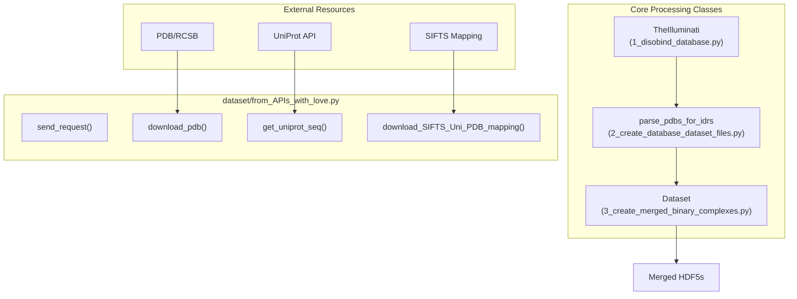
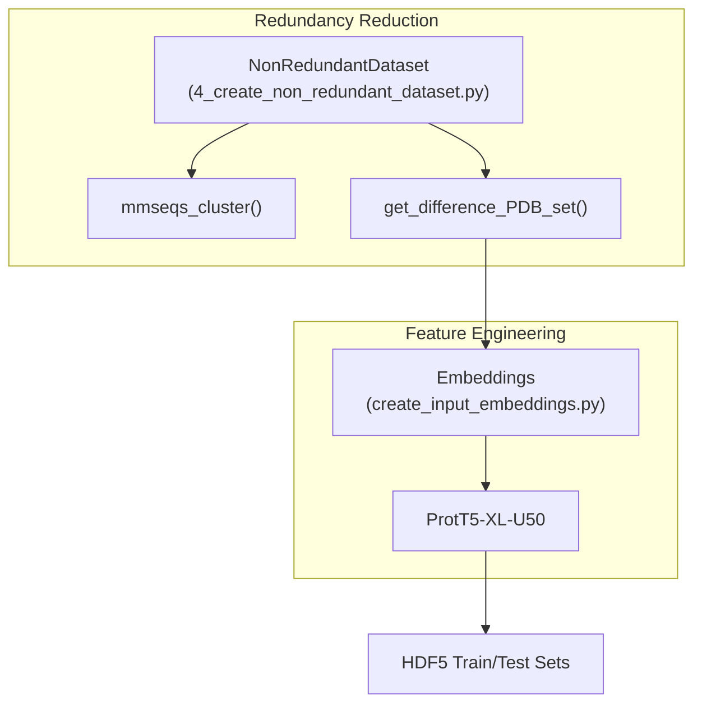

# Dataset Creation Pipeline

> **Relevant source files**
> * [analysis/README.md](https://github.com/isblab/disobind/blob/5fffcf84/analysis/README.md?plain=1)
> * [dataset/1_disobind_databases.py](https://github.com/isblab/disobind/blob/5fffcf84/dataset/1_disobind_databases.py)
> * [dataset/README.md](https://github.com/isblab/disobind/blob/5fffcf84/dataset/README.md?plain=1)

## Purpose and Scope

This document provides a high-level overview of the Disobind dataset creation pipeline. The system transforms raw structural data from the Protein Data Bank (PDB) and various disorder databases (DisProt, IDEAL, MobiDB, DIBS, MFIB, FuzDB) into curated, non-redundant training and evaluation datasets.

The pipeline handles the complexity of mapping PDB chains to UniProt sequences, identifying disordered regions, creating binary interaction complexes, and ensuring structural novelty in test sets.

**Sources:** [dataset/README.md L1-L27](https://github.com/isblab/disobind/blob/5fffcf84/dataset/README.md?plain=1#L1-L27)

 [analysis/README.md L1-L68](https://github.com/isblab/disobind/blob/5fffcf84/analysis/README.md?plain=1#L1-L68)

---

## Pipeline Stages

The pipeline is organized into five sequential stages, each controlled by a numbered script in the `dataset/` directory.

| Stage | Script | Description | Details |
| --- | --- | --- | --- |
| **1** | `1_disobind_database.py` | **Data Collection**: Aggregates PDB IDs from specialized disorder databases. | [Data Collection from Databases](/isblab/disobind/3.1-data-collection-from-databases) |
| **2** | `2_create_database_dataset_files.py` | **Complex Creation**: Downloads structures and fragments them into binary complexes. | [Creating Binary Complexes](/isblab/disobind/3.2-creating-binary-complexes) |
| **3** | `3_create_merged_binary_complexes.py` | **Merging**: Combines overlapping fragments into unified interaction windows. | [Creating Binary Complexes](/isblab/disobind/3.2-creating-binary-complexes) |
| **4** | `4_create_non_redundant_dataset.py` | **Redundancy Reduction**: Performs sequence clustering and OOD splitting. | [Non-Redundant Dataset Creation](/isblab/disobind/3.3-non-redundant-dataset-creation) |
| **5** | `create_input_embeddings.py` | **Embeddings**: Generates ProtT5-XL-U50 features for the final sequences. | [Generating Embeddings](/isblab/disobind/3.4-generating-embeddings) |

**Sources:** [dataset/README.md L1-L27](https://github.com/isblab/disobind/blob/5fffcf84/dataset/README.md?plain=1#L1-L27)

 [dataset/2_create_database_dataset_files.py L44-L147](https://github.com/isblab/disobind/blob/5fffcf84/dataset/2_create_database_dataset_files.py#L44-L147)

---

## System Architecture: Code to Entity Mapping

The following diagrams illustrate how high-level pipeline stages map to specific classes and modules within the codebase.

### Data Acquisition and Processing Flow

This diagram maps the data flow from external APIs to the primary processing classes.

**Sources:** [dataset/1_disobind_databases.py L31-L36](https://github.com/isblab/disobind/blob/5fffcf84/dataset/1_disobind_databases.py#L31-L36)

 [dataset/2_create_database_dataset_files.py L44-L50](https://github.com/isblab/disobind/blob/5fffcf84/dataset/2_create_database_dataset_files.py#L44-L50)

 [dataset/3_create_merged_binary_complexes.py L39-L45](https://github.com/isblab/disobind/blob/5fffcf84/dataset/3_create_merged_binary_complexes.py#L39-L45)

 [dataset/from_APIs_with_love.py L19-L25](https://github.com/isblab/disobind/blob/5fffcf84/dataset/from_APIs_with_love.py#L19-L25)

### Dataset Partitioning and Embedding Generation

This diagram bridges the transition from raw structural fragments to model-ready HDF5 files.

**Sources:** [dataset/4_create_non_redundant_dataset.py L31-L40](https://github.com/isblab/disobind/blob/5fffcf84/dataset/4_create_non_redundant_dataset.py#L31-L40)

 [dataset/create_input_embeddings.py L1-L20](https://github.com/isblab/disobind/blob/5fffcf84/dataset/create_input_embeddings.py#L1-L20)

---

## Stage Details and Child Pages

### 3.1 Data Collection from Databases

The initial stage uses the `TheIlluminati` class in `1_disobind_database.py` to parse flat files and query APIs for PDB entries containing disordered proteins. It considers databases like DIBS, MFIB, and FuzDB.
For details, see [Data Collection from Databases](/isblab/disobind/3.1-data-collection-from-databases).

**Sources:** [dataset/1_disobind_databases.py L31-L56](https://github.com/isblab/disobind/blob/5fffcf84/dataset/1_disobind_databases.py#L31-L56)

 [dataset/README.md L4-L7](https://github.com/isblab/disobind/blob/5fffcf84/dataset/README.md?plain=1#L4-L7)

### 3.2 Creating and Merging Binary Complexes

This stage involves two major steps:

1. **Fragmentation**: `parse_pdbs_for_idrs` downloads structures and identifies disordered segments, creating initial binary pairs.
2. **Merging**: `Dataset.module3()` merges these pairs into larger interaction windows (up to 100-200 residues) to capture the full context of the binding interface. For details, see [Creating Binary Complexes](/isblab/disobind/3.2-creating-binary-complexes).

**Sources:** [dataset/2_create_database_dataset_files.py L1003-L1201](https://github.com/isblab/disobind/blob/5fffcf84/dataset/2_create_database_dataset_files.py#L1003-L1201)

 [dataset/3_create_merged_binary_complexes.py L736-L869](https://github.com/isblab/disobind/blob/5fffcf84/dataset/3_create_merged_binary_complexes.py#L736-L869)

### 3.3 Non-Redundant Dataset Creation

To ensure the model generalizes, the `NonRedundantDataset` class removes sequence redundancy using MMSeqs2. It specifically creates an **Out-Of-Distribution (OOD)** test set by excluding any PDB IDs present in the AlphaFold2 PDB70 training set.
For details, see [Non-Redundant Dataset Creation](/isblab/disobind/3.3-non-redundant-dataset-creation).

**Sources:** [dataset/4_create_non_redundant_dataset.py L380-L402](https://github.com/isblab/disobind/blob/5fffcf84/dataset/4_create_non_redundant_dataset.py#L380-L402)

 [dataset/4_create_non_redundant_dataset.py L437-L473](https://github.com/isblab/disobind/blob/5fffcf84/dataset/4_create_non_redundant_dataset.py#L437-L473)

### 3.4 Generating Embeddings

The final stage uses the `Embeddings` class to convert protein sequences into high-dimensional vectors using a pre-trained ProtT5 model. These are stored in HDF5 format for efficient loading during training.
For details, see [Generating Embeddings](/isblab/disobind/3.4-generating-embeddings).

**Sources:** [dataset/create_input_embeddings.py L1-L27](https://github.com/isblab/disobind/blob/5fffcf84/dataset/create_input_embeddings.py#L1-L27)

### 3.5 Special Dataset Preparation

Disobind includes utilities for specialized benchmarks, such as the IDPPI dataset and NMR ensemble processing (PEDS). These require specific aggregation logic for contact maps across multiple structural models.
For details, see [Special Dataset Preparation](/isblab/disobind/3.5-special-dataset-preparation).

**Sources:** [dataset/README.md L42-L56](https://github.com/isblab/disobind/blob/5fffcf84/dataset/README.md?plain=1#L42-L56)

 [analysis/README.md L24-L34](https://github.com/isblab/disobind/blob/5fffcf84/analysis/README.md?plain=1#L24-L34)

### 3.6 Data Processing Utilities

The pipeline relies on a robust set of utilities in `utility.py` and `from_APIs_with_love.py` for tasks like coordinate extraction (`get_coordinates`), contact map calculation (`get_contact_map`), and handling PDB obsolescence.
For details, see [Data Processing Utilities](/isblab/disobind/3.6-data-processing-utilities).

**Sources:** [dataset/from_APIs_with_love.py L1-L952](https://github.com/isblab/disobind/blob/5fffcf84/dataset/from_APIs_with_love.py#L1-L952)

 [dataset/3_create_merged_binary_complexes.py L29-L32](https://github.com/isblab/disobind/blob/5fffcf84/dataset/3_create_merged_binary_complexes.py#L29-L32)