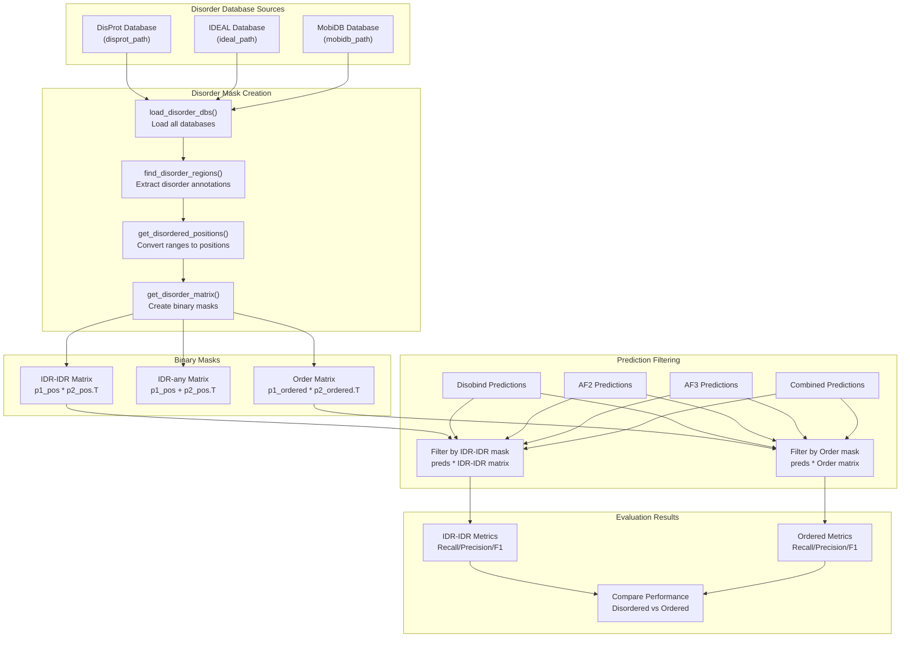
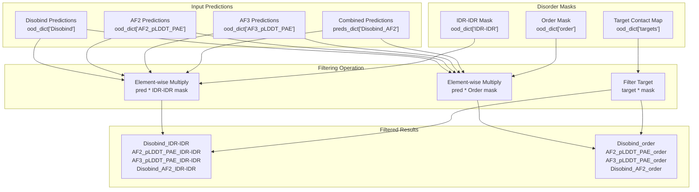
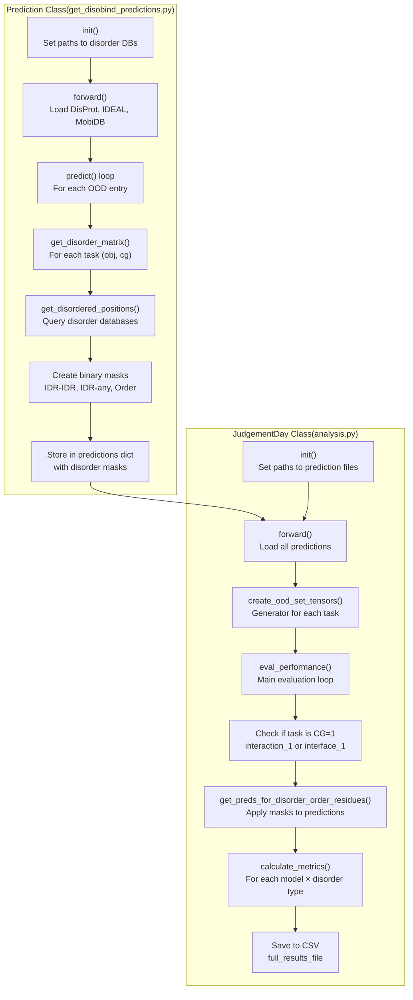

# Disorder-Specific Analysis

> **Relevant source files**
> * [analysis/analysis.py](https://github.com/isblab/disobind/blob/5fffcf84/analysis/analysis.py)
> * [analysis/get_af_prediction.py](https://github.com/isblab/disobind/blob/5fffcf84/analysis/get_af_prediction.py)
> * [analysis/get_disobind_predictions.py](https://github.com/isblab/disobind/blob/5fffcf84/analysis/get_disobind_predictions.py)
> * [analysis/get_other_method_preds.py](https://github.com/isblab/disobind/blob/5fffcf84/analysis/get_other_method_preds.py)
> * [analysis/params.py](https://github.com/isblab/disobind/blob/5fffcf84/analysis/params.py)

## Purpose and Scope

This page explains how Disobind evaluates predictions specifically for different disorder contexts: interactions between intrinsically disordered regions (IDR-IDR) versus interactions between ordered regions. This analysis reveals how well Disobind and competing methods perform on disordered versus structured protein interactions.

For the overall analysis pipeline, see [JudgementDay Analysis Pipeline](/isblab/disobind/5.1-judgementday-analysis-pipeline). For generating the base predictions that are filtered by disorder type, see [Generating OOD Predictions](/isblab/disobind/5.2-generating-ood-predictions). For comparison with partner-independent interface predictors, see [Comparing with Other Methods](/isblab/disobind/5.6-comparing-with-other-methods).

**Key Points:**

* Disorder-specific analysis is performed only at **CG=1** (residue-level resolution) [analysis/analysis.py L464-L465](https://github.com/isblab/disobind/blob/5fffcf84/analysis/analysis.py#L464-L465)
* Evaluates performance on **IDR-IDR** and **ordered** interaction categories [analysis/analysis.py L354-L360](https://github.com/isblab/disobind/blob/5fffcf84/analysis/analysis.py#L354-L360)
* Uses specialized masks for **LIPs**, **aromatic**, **hydrophobic**, **polar**, and **disorder-promoting** amino acids [analysis/get_disobind_predictions.py L6-L9](https://github.com/isblab/disobind/blob/5fffcf84/analysis/get_disobind_predictions.py#L6-L9)
* Uses disorder annotations from DisProt, IDEAL, and MobiDB databases [analysis/get_disobind_predictions.py L78-L81](https://github.com/isblab/disobind/blob/5fffcf84/analysis/get_disobind_predictions.py#L78-L81)
* Compares Disobind, AlphaFold2, AlphaFold3, and combined predictions [analysis/analysis.py L361-L362](https://github.com/isblab/disobind/blob/5fffcf84/analysis/analysis.py#L361-L362)

Sources: [analysis/analysis.py L1-L8](https://github.com/isblab/disobind/blob/5fffcf84/analysis/analysis.py#L1-L8)

 [analysis/get_disobind_predictions.py L1-L9](https://github.com/isblab/disobind/blob/5fffcf84/analysis/get_disobind_predictions.py#L1-L9)

 [analysis/analysis.py L464-L465](https://github.com/isblab/disobind/blob/5fffcf84/analysis/analysis.py#L464-L465)

 [analysis/analysis.py L354-L360](https://github.com/isblab/disobind/blob/5fffcf84/analysis/analysis.py#L354-L360)

## Overview

Disorder-specific analysis addresses a fundamental question: does Disobind perform better on disordered versus ordered protein interactions? By creating binary masks that identify disordered and ordered residues, the system filters predictions into distinct categories and calculates separate performance metrics for each.

The analysis evaluates:

1. **IDR-IDR interactions**: Both proteins have disordered regions interacting [analysis/get_disobind_predictions.py L538-L540](https://github.com/isblab/disobind/blob/5fffcf84/analysis/get_disobind_predictions.py#L538-L540)
2. **Ordered interactions**: Both proteins have ordered regions interacting [analysis/get_disobind_predictions.py L560-L562](https://github.com/isblab/disobind/blob/5fffcf84/analysis/get_disobind_predictions.py#L560-L562)
3. **Residue-type specific interactions**: Performance on aromatic, hydrophobic, polar, and disorder-promoting residues [analysis/get_disobind_predictions.py L6-L7](https://github.com/isblab/disobind/blob/5fffcf84/analysis/get_disobind_predictions.py#L6-L7)
4. **LIPs (Linear Interaction Peptides)**: Specific analysis for motifs that mediate IDR interactions [analysis/get_disobind_predictions.py L8](https://github.com/isblab/disobind/blob/5fffcf84/analysis/get_disobind_predictions.py#L8-L8)



**Diagram: Disorder-Specific Analysis Workflow**

Sources: [analysis/get_disobind_predictions.py L134-L179](https://github.com/isblab/disobind/blob/5fffcf84/analysis/get_disobind_predictions.py#L134-L179)

 [analysis/analysis.py L354-L412](https://github.com/isblab/disobind/blob/5fffcf84/analysis/analysis.py#L354-L412)

 [analysis/get_disobind_predictions.py L538-L562](https://github.com/isblab/disobind/blob/5fffcf84/analysis/get_disobind_predictions.py#L538-L562)

## Disorder Database Integration

The disorder-specific analysis relies on three disorder databases to identify intrinsically disordered regions:

| Database | Purpose | File Path |
| --- | --- | --- |
| **DisProt** | Experimentally validated disorder annotations | `../database/input_files/DisProt.csv` [analysis/get_disobind_predictions.py L79](https://github.com/isblab/disobind/blob/5fffcf84/analysis/get_disobind_predictions.py#L79-L79) |
| **IDEAL** | Intrinsically disordered proteins with function | `../database/input_files/IDEAL.csv` [analysis/get_disobind_predictions.py L80](https://github.com/isblab/disobind/blob/5fffcf84/analysis/get_disobind_predictions.py#L80-L80) |
| **MobiDB** | Computational disorder predictions and LIPs | `../database/input_files/MobiDB.csv` [analysis/get_disobind_predictions.py L81](https://github.com/isblab/disobind/blob/5fffcf84/analysis/get_disobind_predictions.py#L81-L81) |

The `Prediction` class loads these databases during initialization:

```markdown
# From analysis/get_disobind_predictions.pyself.disprot, self.ideal, self.mobidb = load_disorder_dbs(    disprot_path = self.disprot_path,     ideal_path = self.ideal_path,     mobidb_path = self.mobidb_path )
```

[analysis/get_disobind_predictions.py L142-L144](https://github.com/isblab/disobind/blob/5fffcf84/analysis/get_disobind_predictions.py#L142-L144)

The disorder annotations are consolidated across databases using `find_disorder_regions()` from `dataset.utility`, which merges overlapping disorder annotations and returns unified disorder ranges for each UniProt ID [analysis/get_disobind_predictions.py L423-L430](https://github.com/isblab/disobind/blob/5fffcf84/analysis/get_disobind_predictions.py#L423-L430)

Sources: [analysis/get_disobind_predictions.py L78-L144](https://github.com/isblab/disobind/blob/5fffcf84/analysis/get_disobind_predictions.py#L78-L144)

 [analysis/get_disobind_predictions.py L422-L450](https://github.com/isblab/disobind/blob/5fffcf84/analysis/get_disobind_predictions.py#L422-L450)

## Creating Specialized Masks

The `Prediction` class creates binary masks for different amino acid properties and interaction motifs to enable fine-grained analysis.

### LIP and Amino Acid Type Masks

The pipeline creates masks for specific biological features:

1. **LIPs (Linear Interaction Peptides)**: Identified using `create_lip_masks()` [analysis/get_disobind_predictions.py L164](https://github.com/isblab/disobind/blob/5fffcf84/analysis/get_disobind_predictions.py#L164-L164)
2. **Amino Acid Types**: Identified using `create_aa_masks()` [analysis/get_disobind_predictions.py L165](https://github.com/isblab/disobind/blob/5fffcf84/analysis/get_disobind_predictions.py#L165-L165) * **Disorder-promoting**: A, R, G, Q, S, P, E, K. * **Aromatic**: F, W, Y, H. * **Hydrophobic**: V, I, L, M, F, W, Y. * **Polar**: S, T, N, Q.

### Interaction Matrices

For each binary complex, binary vectors are created where `1` indicates the presence of a feature and `0` indicates its absence. These are then converted into interaction matrices:

```markdown
# IDR-IDR interactions (both proteins disordered)disorder_mat1 = p1_pos * p2_pos.T [analysis/get_disobind_predictions.py:538-540]() # Ordered interactions (both proteins ordered)order_mat = p1_ordered * p2_ordered.T [analysis/get_disobind_predictions.py:560-562]()
```

For **interface** tasks, the vectors are concatenated:

```markdown
# target: ( N, L1, L2 ) --> ( N, L1+L2 )target = torch.cat( ( p1_target, p2_target ), axis = 0 ) [analysis/analysis.py:176]()
```

Sources: [analysis/get_disobind_predictions.py L538-L588](https://github.com/isblab/disobind/blob/5fffcf84/analysis/get_disobind_predictions.py#L538-L588)

 [analysis/analysis.py L176](https://github.com/isblab/disobind/blob/5fffcf84/analysis/analysis.py#L176-L176)

 [analysis/get_disobind_predictions.py L164-L165](https://github.com/isblab/disobind/blob/5fffcf84/analysis/get_disobind_predictions.py#L164-L165)

## Interaction Type Categories

The disorder-specific analysis evaluates two primary categories:

### IDR-IDR Interactions

**Definition**: Interactions where **both** proteins have disordered residues at the interacting positions [analysis/get_disobind_predictions.py L538-L540](https://github.com/isblab/disobind/blob/5fffcf84/analysis/get_disobind_predictions.py#L538-L540)

**Biological Significance**: These represent interactions between intrinsically disordered regions, which are challenging for structure-based methods like AlphaFold since disorder implies lack of stable structure.

### Ordered Interactions

**Definition**: Interactions where **both** proteins have ordered (structured) residues at the interacting positions [analysis/get_disobind_predictions.py L560-L562](https://github.com/isblab/disobind/blob/5fffcf84/analysis/get_disobind_predictions.py#L560-L562)

**Biological Significance**: These represent traditional protein-protein interactions between structured domains, which AlphaFold is designed to predict accurately.

Sources: [analysis/get_disobind_predictions.py L538-L563](https://github.com/isblab/disobind/blob/5fffcf84/analysis/get_disobind_predictions.py#L538-L563)

 [analysis/analysis.py L363-L364](https://github.com/isblab/disobind/blob/5fffcf84/analysis/analysis.py#L363-L364)

## Filtering Predictions by Disorder Type

The `JudgementDay` class filters predictions by disorder type using the `get_preds_for_disorder_order_residues()` method [analysis/analysis.py L354](https://github.com/isblab/disobind/blob/5fffcf84/analysis/analysis.py#L354-L354)



**Diagram: Prediction Filtering by Disorder Type**

The filtering process applies the binary masks to both the prediction and the target contact map to isolate specific interaction types [analysis/analysis.py L375-L376](https://github.com/isblab/disobind/blob/5fffcf84/analysis/analysis.py#L375-L376)

Sources: [analysis/analysis.py L354-L382](https://github.com/isblab/disobind/blob/5fffcf84/analysis/analysis.py#L354-L382)

## Model Comparison Across Disorder Categories

The disorder-specific analysis evaluates four model types on both IDR-IDR and ordered interactions [analysis/analysis.py L361-L362](https://github.com/isblab/disobind/blob/5fffcf84/analysis/analysis.py#L361-L362)

:

| Model Type | Description | Key |
| --- | --- | --- |
| **Disobind** | Sequence-based Disobind predictions | `"Disobind"` |
| **AF2** | AlphaFold2 predictions (with confidence filtering) | `"AF2_pLDDT_PAE"` |
| **AF3** | AlphaFold3 predictions (with confidence filtering) | `"AF3_pLDDT_PAE"` |
| **Disobind+AF2** | Combined Disobind and AF2 predictions | `"Disobind_AF2"` |

### Evaluation Scope

**Performed only at CG=1**: Disorder-specific analysis is restricted to residue-level predictions [analysis/analysis.py L464-L465](https://github.com/isblab/disobind/blob/5fffcf84/analysis/analysis.py#L464-L465)

**Metrics Calculated**: For each model-disorder combination, the following metrics are computed using `torch_metrics()` [analysis/analysis.py L476](https://github.com/isblab/disobind/blob/5fffcf84/analysis/analysis.py#L476-L476)

:

* Recall, Precision, F1-score
* Average Precision, MCC, AUROC, Accuracy [src/metrics.py L20-L21](https://github.com/isblab/disobind/blob/5fffcf84/src/metrics.py#L20-L21)  (referenced in [analysis/analysis.py L20](https://github.com/isblab/disobind/blob/5fffcf84/analysis/analysis.py#L20-L20) )

Sources: [analysis/analysis.py L438-L509](https://github.com/isblab/disobind/blob/5fffcf84/analysis/analysis.py#L438-L509)

 [analysis/analysis.py L464-L470](https://github.com/isblab/disobind/blob/5fffcf84/analysis/analysis.py#L464-L470)

 [analysis/analysis.py L361-L362](https://github.com/isblab/disobind/blob/5fffcf84/analysis/analysis.py#L361-L362)

## Implementation Code Flow

The complete disorder-specific analysis involves coordination between two classes:



**Diagram: Code Flow for Disorder-Specific Analysis**

### Key Methods

**In `Prediction` class** ([analysis/get_disobind_predictions.py](https://github.com/isblab/disobind/blob/5fffcf84/analysis/get_disobind_predictions.py)

):

| Method | Lines | Purpose |
| --- | --- | --- |
| `get_disordered_positions()` | 422-450 | Query disorder databases for a UniProt ID |
| `get_disorder_matrix()` | 454-592 | Create IDR-IDR, IDR-any, and Order matrices |
| `predict()` | 810-896 | Main prediction loop that calls disorder matrix creation |

**In `JudgementDay` class** ([analysis/analysis.py](https://github.com/isblab/disobind/blob/5fffcf84/analysis/analysis.py)

):

| Method | Lines | Purpose |
| --- | --- | --- |
| `create_ood_set_tensors()` | 192-316 | Load predictions and masks into unified format |
| `get_preds_for_disorder_order_residues()` | 354-382 | Filter predictions by disorder type |
| `eval_performance()` | 438-509 | Calculate metrics for all model-disorder combinations |

Sources: [analysis/get_disobind_predictions.py L134-L896](https://github.com/isblab/disobind/blob/5fffcf84/analysis/get_disobind_predictions.py#L134-L896)

 [analysis/analysis.py L25-L509](https://github.com/isblab/disobind/blob/5fffcf84/analysis/analysis.py#L25-L509)

## Output Files

Disorder-specific analysis results are written to:

**Main Results**: `Analysis_OOD_{version}_{iptm}/Results_OOD_set_{version}.csv` [analysis/analysis.py L84-L85](https://github.com/isblab/disobind/blob/5fffcf84/analysis/analysis.py#L84-L85)

* Contains metrics for all models including disorder-specific variants.

**Logs**: `Predictions_ood_v_{version}/Logs.json` [analysis/get_disobind_predictions.py L129](https://github.com/isblab/disobind/blob/5fffcf84/analysis/get_disobind_predictions.py#L129-L129)

* Contains disorder statistics: `"IDR-IDR_interactions"`, `"IDR-any_interactions"`, `"Ordered_interactions"` [analysis/get_disobind_predictions.py L575-L577](https://github.com/isblab/disobind/blob/5fffcf84/analysis/get_disobind_predictions.py#L575-L577)

**Disorder Dictionary**: `Predictions_ood_v_{version}/disorder_dict.json` [analysis/get_disobind_predictions.py L125](https://github.com/isblab/disobind/blob/5fffcf84/analysis/get_disobind_predictions.py#L125-L125)

* Cached disorder positions for each UniProt ID to avoid redundant database queries [analysis/get_disobind_predictions.py L153-L155](https://github.com/isblab/disobind/blob/5fffcf84/analysis/get_disobind_predictions.py#L153-L155)

Sources: [analysis/get_disobind_predictions.py L84-L129](https://github.com/isblab/disobind/blob/5fffcf84/analysis/get_disobind_predictions.py#L84-L129)

 [analysis/analysis.py L81-L96](https://github.com/isblab/disobind/blob/5fffcf84/analysis/analysis.py#L81-L96)

 [analysis/get_disobind_predictions.py L575-L577](https://github.com/isblab/disobind/blob/5fffcf84/analysis/get_disobind_predictions.py#L575-L577)