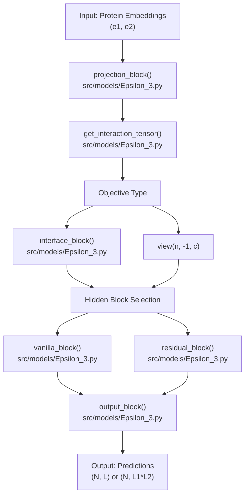
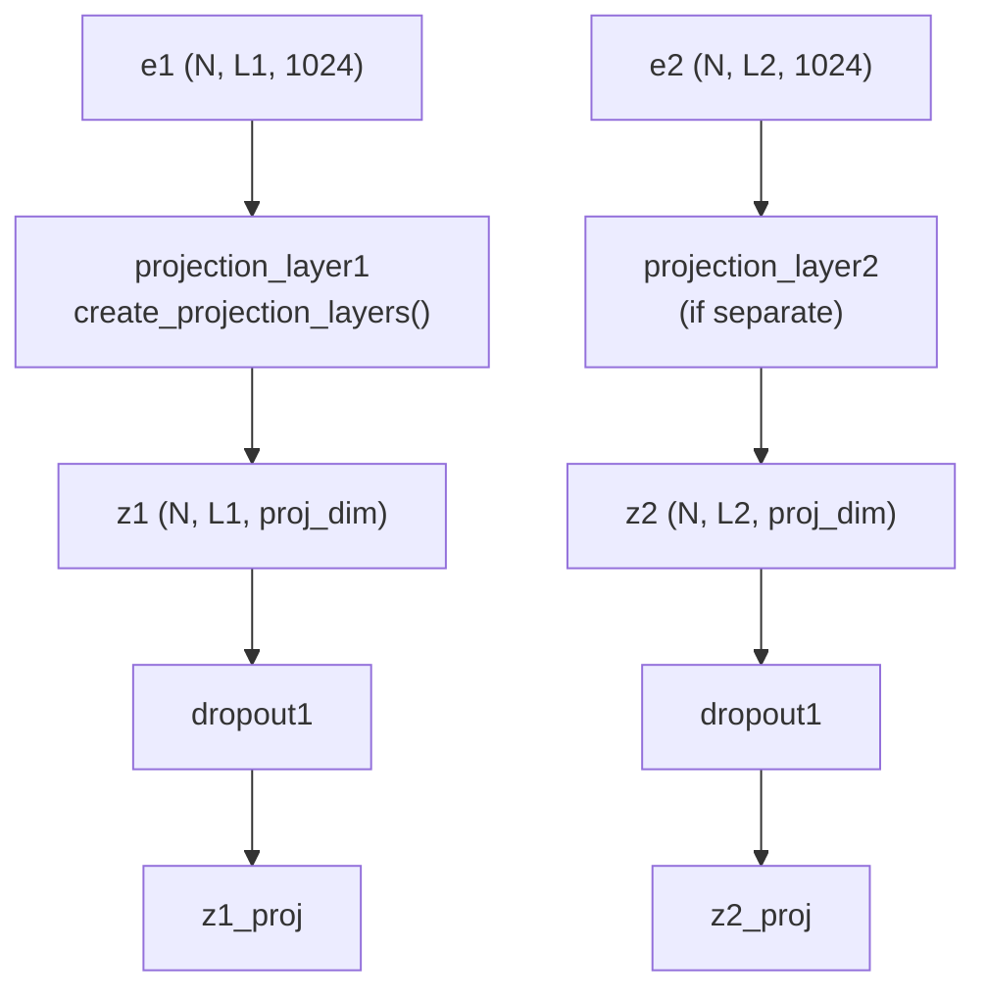
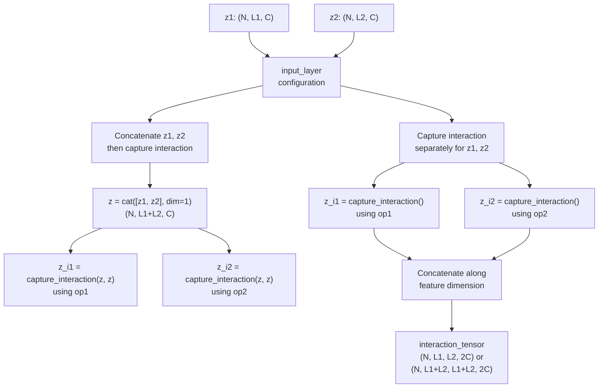
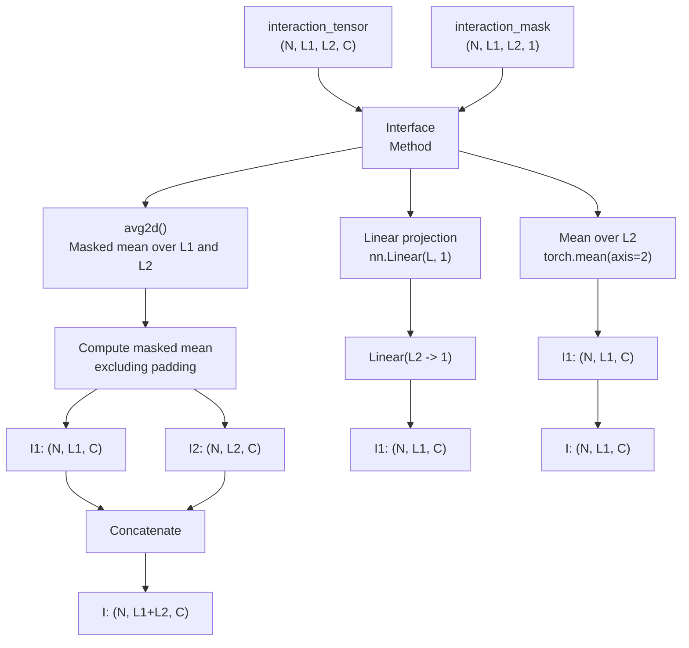

# Epsilon_3 Network Design

> **Relevant source files**
> * [src/model_versions.py](https://github.com/isblab/disobind/blob/5fffcf84/src/model_versions.py)
> * [src/models/Epsilon_3.py](https://github.com/isblab/disobind/blob/5fffcf84/src/models/Epsilon_3.py)
> * [src/models/get_activation.py](https://github.com/isblab/disobind/blob/5fffcf84/src/models/get_activation.py)
> * [src/models/get_layers.py](https://github.com/isblab/disobind/blob/5fffcf84/src/models/get_layers.py)
> * [src/models/get_model.py](https://github.com/isblab/disobind/blob/5fffcf84/src/models/get_model.py)

## Purpose and Scope

This document provides a detailed technical explanation of the **Epsilon_3** neural network architecture, which is the core prediction model used in Disobind for predicting disordered protein interactions. The Epsilon_3 architecture is implemented in `src/models/Epsilon_3.py`() and supports multiple prediction tasks including contact map prediction (interaction) and interface residue prediction (interface) at various coarse-graining levels.

For information about:

* Model configuration files and hyperparameters, see [4.2](https://github.com/isblab/disobind/blob/5fffcf84/4.2)
* Training the Epsilon_3 models, see [4.3](https://github.com/isblab/disobind/blob/5fffcf84/4.3)
* Different trained model versions and checkpoints, see [4.4](https://github.com/isblab/disobind/blob/5fffcf84/4.4)
* Running predictions with trained models, see [2](https://github.com/isblab/disobind/blob/5fffcf84/2)

---

## Architecture Overview

The Epsilon_3 model is a feed-forward neural network that processes pairs of protein embeddings to predict either residue-residue contacts (interaction task) or interface residues (interface task). The architecture consists of four main blocks executed sequentially:

**Architecture Flow (Code Entity Mapping)**

**Sources:** `src/models/Epsilon_3.py:131-151`, `src/models/Epsilon_3.py:15-20`

### Model Initialization Parameters

The `Epsilon_3` constructor accepts the following key parameters defined in configuration files:

| Parameter | Type | Purpose | Example Values |
| --- | --- | --- | --- |
| `emb_size` | int | Input embedding dimension | 1024 (T5) |
| `projection_layer` | list | Projection configuration [dim, type, bias, multiplier, separate] | [128, "ln2", True, 1, ""] |
| `input_layer` | list | Interaction capture method [aggregate, concatenate, interface, placement] | ["op-od", "vanilla", "avg2d"] |
| `num_hid_layers` | list | Hidden layer configuration [US, DS, blocks, scale, type, residual] | [0, 0, 0, 0, "vanilla", ""] |
| `activation1` | list | Hidden layer activation [name, param] | ["elu", None] |
| `activation2` | list | Output activation [name, apply] | ["sigmoid", True] |
| `dropouts` | list | Dropout probabilities [dropout1, dropout2, us, ds, mc] | [0.2, 0, 0, 0, 0] |
| `norm` | list | Normalization configuration [apply, type] | [True, "LN"] |
| `objective` | list | Task specification [obj, bin_size, pool, bin_post_proj, bin_input, single_output] | ["interface_bin", 10, "avg", False, True, False] |

**Sources:** `src/models/Epsilon_3.py:16-48`, `src/model_versions.py:50-87`

---

## Projection Block

The projection block transforms input protein embeddings from their original dimension (typically 1024 for T5 embeddings) to a lower-dimensional representation.

**Projection Data Flow**

**Sources:** `src/models/Epsilon_3.py:155-178`, `src/models/get_layers.py:17-86`

### Projection Layer Types

The projection layer type is specified by `projection_layer[1]`. Available types are defined in `src/models/get_layers.py` and include:

* **`"vanilla"`**: `Linear` → `Activation`. `src/models/get_layers.py:22-27`
* **`"ln1"`**: `LayerNorm` → `Linear` → `Activation`. `src/models/get_layers.py:29-35`
* **`"ln2"`**: `Linear` → `Activation` → `LayerNorm`. `src/models/get_layers.py:37-43`
* **`"in1/in2"`**: Variants using `InstanceNorm1d` (requires dimension permutation). `src/models/get_layers.py:45-64`
* **`"bn1/bn2"`**: Variants using `BatchNorm1d`. `src/models/get_layers.py:66-84`

### Separate vs Shared Projection Layers

The model supports either:

* **Shared projection**: Both proteins use `projection_layer1` (when `projection_layer[4]` is empty). `src/models/Epsilon_3.py:79-80`
* **Separate projection**: Each protein has its own projection layer (when `projection_layer[4]` is `"separate"`). `src/models/Epsilon_3.py:71-78`

---

## Interaction Tensor Creation

The `get_interaction_tensor()` method combines the two protein representations into an interaction tensor capturing pairwise residue relationships.

**Interaction Tensor Logic**

**Sources:** `src/models/Epsilon_3.py:267-296`

### Interaction Capture Operations

The `capture_interaction()` method supports multiple aggregation operations specified in `input_layer[0]` (e.g., `"op-od"`):

| Operation | Code Identifier | Formula | Use Case |
| --- | --- | --- | --- |
| Outer Sum | `"os"` | `z1.unsqueeze(2) + z2.unsqueeze(1)` | Additive residue features |
| Outer Diff | `"od"` | `abs(z1.unsqueeze(2) - z2.unsqueeze(1))` | Feature difference magnitude |
| Outer Product | `"op"` | `z1.unsqueeze(2) * z2.unsqueeze(1)` | Multiplicative interaction |
| Sum | `"add"` | `z1 + z2` | Element-wise sum |
| Product | `"multiply"` | `z1 * z2` | Element-wise product |

The standard configuration uses `"op-od"`, producing a tensor with `2*projection_dim` channels.

**Sources:** `src/models/Epsilon_3.py:228-263`

---

## Interface Block

For interface prediction tasks, the interaction tensor is reduced to interface representations for each protein via the `interface_block()` method.

**Interface Aggregation Flow**

**Sources:** `src/models/Epsilon_3.py:205-225`, `src/models/Epsilon_3.py:181-201`

---

## Hidden Layers

The Epsilon_3 architecture supports two hidden processing blocks: **vanilla** and **residual**, determined by `num_hid_layers[4]`.

### Vanilla Block

The `vanilla_block()` applies sequential downsampling and upsampling without skip connections.

**Sources:** `src/models/Epsilon_3.py:300-306`

### Residual Block

The `residual_block()` applies transformations within a residual connection, repeated for `num_blocks` iterations. It supports three connection types:

* **`"vanilla"`**: `o = o + o_` `src/models/Epsilon_3.py:326-327`
* **`"addnorm"`**: `o = norm_layer(o + o_)` `src/models/Epsilon_3.py:329-330`
* **`"addactivnorm"`**: `o = norm_layer(activ1(o + o_))` `src/models/Epsilon_3.py:332-333`

### Downsampling and Upsampling

* **Downsampling**: halving/reducing features via `create_downsampling_layers()`. `src/models/get_layers.py:152-188`
* **Upsampling**: doubling/increasing features via `create_upsampling_layers()`. `src/models/get_layers.py:87-150`

---

## Output Block

The `output_block()` produces final predictions using a linear layer (`self.contact`) followed by optional temperature scaling and activation.

| Component | Code Entity | Purpose |
| --- | --- | --- |
| Linear Layer | `self.contact` | Maps hidden state to `output_dim` |
| Temperature | `self.temperature` | Scales logits for calibration |
| Activation | `self.activation2` | Sigmoid or other output activation |

**Sources:** `src/models/Epsilon_3.py:125-127`, `src/models/Epsilon_3.py:338-354`

---

## Key Architectural Features

### Activation Functions

Supported activations are managed by `get_activation()` in `src/models/get_activation.py`:

* **Standard**: `sigmoid`, `tanh`, `relu`, `leakyrelu`, `elu`, `gelu`. `src/models/get_activation.py:29-55`
* **Custom**: `LogisticActivation` (generalized sigmoid). `src/models/get_activation.py:7-23`

### Dropout Regularization

* `dropout1`: Applied after projection block. `src/models/Epsilon_3.py:176`
* `mc_dropout`: Used for Monte Carlo dropout uncertainty estimation. `src/models/Epsilon_3.py:38`

### Coarse-Graining Support

Coarse-graining is controlled by the `objective` parameter. If `bin_input` is True, the model handles pooled representations.

* **Pooling**: Supported via `avg` or `max` pooling (referenced in `objective` list). `src/model_versions.py:34-41`

**Sources:** `src/model_versions.py:26`, `src/models/Epsilon_3.py:47`