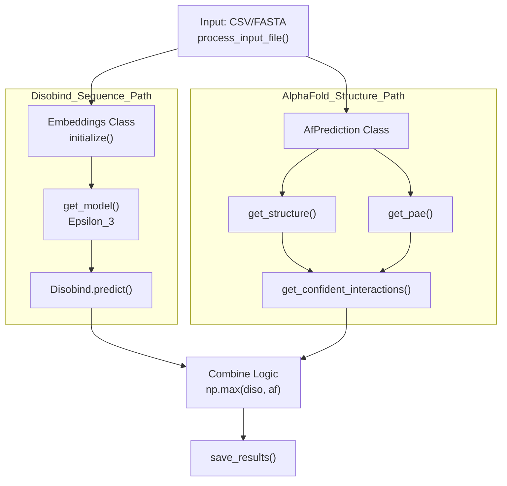
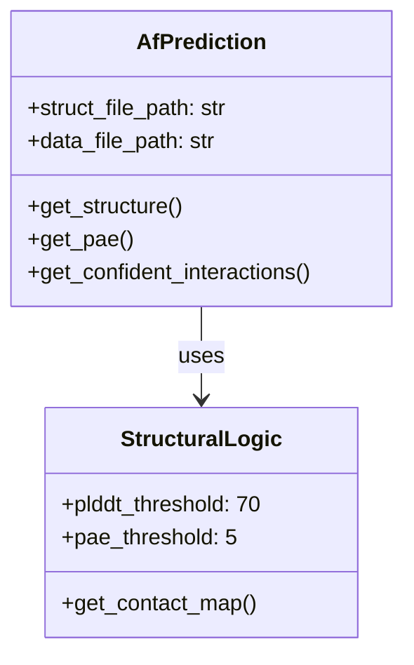

# Example: AlphaFold\-Enhanced Predictions

> **Relevant source files**
> - [example/output\.tar\.gz](https://github.com/isblab/disobind/blob/5fffcf84/example/output.tar.gz)
> - [example/pae\_model\_4\_multimer\_v3\_pred\_4\.json](https://github.com/isblab/disobind/blob/5fffcf84/example/pae_model_4_multimer_v3_pred_4.json)
> - [example/test\.fasta](https://github.com/isblab/disobind/blob/5fffcf84/example/test.fasta)
> - [example/unrelaxed\_model\_4\_multimer\_v3\_pred\_4\.pdb](https://github.com/isblab/disobind/blob/5fffcf84/example/unrelaxed_model_4_multimer_v3_pred_4.pdb)
> - [run\_disobind\.py](https://github.com/isblab/disobind/blob/5fffcf84/run_disobind.py)

## Purpose and Scope

 This tutorial demonstrates how to enhance Disobind predictions by combining them with AlphaFold2 or AlphaFold3 structural predictions\. The combination leverages sequence\-based predictions \(Disobind\) and structure\-based confidence scores \(AlphaFold\) to improve prediction accuracy\.

 The enhancement approach uses a **max operation**: for each residue pair, the final prediction takes the maximum value between Disobind's probability and AlphaFold's confidence\-filtered contact map [run\_disobind\.py L629-L633](https://github.com/isblab/disobind/blob/5fffcf84/run_disobind.py#L629-L633)

---

## Overview of Enhancement Approach

 The pipeline integrates structural data by parsing PDB/CIF files and applying filters based on pLDDT and PAE confidence scores\.

### System Architecture and Code Entities

 The following diagram bridges the conceptual workflow with the specific code entities in `run_disobind.py`\.

 **Title: Disobind \+ AlphaFold Integration Data Flow**



 Sources: [run\_disobind\.py L44-L106](https://github.com/isblab/disobind/blob/5fffcf84/run_disobind.py#L44-L106) [run\_disobind\.py L168-L207](https://github.com/isblab/disobind/blob/5fffcf84/run_disobind.py#L168-L207) [run\_disobind\.py L831-L854](https://github.com/isblab/disobind/blob/5fffcf84/run_disobind.py#L831-L854)

---

## Input Requirements

### CSV Format for Combined Predictions

 To enable AlphaFold enhancement, the input CSV must contain structural metadata [run\_disobind\.py L9-L10](https://github.com/isblab/disobind/blob/5fffcf84/run_disobind.py#L9-L10)

| Field | Description | Code Reference |
| --- | --- | --- |
| Uni\_ID1 | First protein UniProt ID | run\_disobind\.py246 |
| start\_res1 | Start residue position | run\_disobind\.py247 |
| end\_res1 | End residue position | run\_disobind\.py248 |
| af2\_struct\_file | Path to PDB/CIF file | run\_disobind\.py252 |
| af2\_json\_file | Path to PAE JSON file | run\_disobind\.py253 |
| chain1 / chain2 | Chain IDs in the structure | run\_disobind\.py254\-255 |
| offset1 / offset2 | Residue numbering offsets | run\_disobind\.py256\-257 |

 **Example Row:** `P04273,95,193,P04273,95,193,./example/unrelaxed_model_4_multimer_v3_pred_4.pdb,./example/pae_model_4_multimer_v3_pred_4.json,B,C,0,0`

 Sources: [run\_disobind\.py L224-L273](https://github.com/isblab/disobind/blob/5fffcf84/run_disobind.py#L224-L273) [test\.fasta L1-L6](https://github.com/isblab/disobind/blob/5fffcf84/example/test.fasta#L1-L6)

---

## Step\-by\-Step Workflow

### 1\. Running the Prediction

 Execute the script using the `-f` flag for your prepared CSV and specify the coarse\-graining level with `-cg` [run\_disobind\.py L58-L61](https://github.com/isblab/disobind/blob/5fffcf84/run_disobind.py#L58-L61)

```
python run_disobind.py -f example/test.csv -o results -cg 1
```

### 2\. Structural Parsing and Filtering

 The `AfPrediction` class manages the structural data extraction [run\_disobind\.py L831-L854](https://github.com/isblab/disobind/blob/5fffcf84/run_disobind.py#L831-L854)

 **Title: AfPrediction Internal Logic**



 Sources: [run\_disobind\.py L831-L854](https://github.com/isblab/disobind/blob/5fffcf84/run_disobind.py#L831-L854) [run\_disobind\.py L73-L76](https://github.com/isblab/disobind/blob/5fffcf84/run_disobind.py#L73-L76)

### 3\. Confidence Filtering Details

 The system applies strict thresholds to AlphaFold outputs before merging with Disobind:

 1. **Distance Cutoff**: 8Å between Cα atoms is considered a contact [run\_disobind\.py L71-L72](https://github.com/isblab/disobind/blob/5fffcf84/run_disobind.py#L71-L72)
2. **pLDDT Filtering**: Residues with pLDDT < 70 are masked out [run\_disobind\.py L73-L74](https://github.com/isblab/disobind/blob/5fffcf84/run_disobind.py#L73-L74)
3. **PAE Filtering**: Residue pairs with Predicted Aligned Error \> 5Å are masked out [run\_disobind\.py L75-L76](https://github.com/isblab/disobind/blob/5fffcf84/run_disobind.py#L75-L76)

 The final AlphaFold contribution is a binary mask: `(Distance <= 8) AND (pLDDT >= 70) AND (PAE <= 5)` [run\_disobind\.py L1145-L1157](https://github.com/isblab/disobind/blob/5fffcf84/run_disobind.py#L1145-L1157)

 Sources: [run\_disobind\.py L68-L76](https://github.com/isblab/disobind/blob/5fffcf84/run_disobind.py#L68-L76) [run\_disobind\.py L1063-L1157](https://github.com/isblab/disobind/blob/5fffcf84/run_disobind.py#L1063-L1157)

---

## Combination Logic

 The integration happens within the `Disobind.predict()` method [run\_disobind\.py L532-L534](https://github.com/isblab/disobind/blob/5fffcf84/run_disobind.py#L532-L534)

### Max Operation Implementation

 For every predicted task \(interaction or interface\), the results are combined as follows:

```
# run_disobind.py:629-633m, n = output.shapediso_af2 = np.stack([output.reshape(-1), af2_pred.reshape(-1)], axis=1)diso_af2 = np.max(diso_af2, axis=1).reshape(m, n)
```

### Coarse\-Graining AF Predictions

 If the user requests coarse\-grained predictions \(CG 5 or 10\), the AlphaFold binary map is downsampled using `MaxPool2d` to match Disobind's output dimensions [run\_disobind\.py L664-L678](https://github.com/isblab/disobind/blob/5fffcf84/run_disobind.py#L664-L678)

```
# run_disobind.py:674-678if objective[1] > 1:    m = nn.MaxPool2d( kernel_size = objective[1], stride = objective[1] )    af2_pred = m( af2_pred.unsqueeze(0).unsqueeze(0) )    af2_pred = af2_pred.squeeze().squeeze()
```

 Sources: [run\_disobind\.py L625-L633](https://github.com/isblab/disobind/blob/5fffcf84/run_disobind.py#L625-L633) [run\_disobind\.py L664-L693](https://github.com/isblab/disobind/blob/5fffcf84/run_disobind.py#L664-L693)

---

## Output Interpretation

 The output is saved as a nested dictionary in a `.npy` file [run\_disobind\.py L126](https://github.com/isblab/disobind/blob/5fffcf84/run_disobind.py#L126-L126)

 **Structure of the `predictions` dictionary:**

 - **Key 1**: Protein pair IDs [run\_disobind\.py L539](https://github.com/isblab/disobind/blob/5fffcf84/run_disobind.py#L539-L539)
- **Key 2**: Specific fragment identifiers [run\_disobind\.py L545](https://github.com/isblab/disobind/blob/5fffcf84/run_disobind.py#L545-L545)
- **Key 3**: Task name \(e\.g\., `interface_1`, `interaction_5`\) [run\_disobind\.py L554](https://github.com/isblab/disobind/blob/5fffcf84/run_disobind.py#L554-L554) - `Disobind`: Raw Disobind probability matrix [run\_disobind\.py L651](https://github.com/isblab/disobind/blob/5fffcf84/run_disobind.py#L651-L651) - `AF2`: Filtered AlphaFold binary matrix [run\_disobind\.py L652](https://github.com/isblab/disobind/blob/5fffcf84/run_disobind.py#L652-L652) - `Diso+AF2`: The combined enhanced prediction [run\_disobind\.py L653](https://github.com/isblab/disobind/blob/5fffcf84/run_disobind.py#L653-L653)

 Sources: [run\_disobind\.py L126-L128](https://github.com/isblab/disobind/blob/5fffcf84/run_disobind.py#L126-L128) [run\_disobind\.py L648-L661](https://github.com/isblab/disobind/blob/5fffcf84/run_disobind.py#L648-L661)

