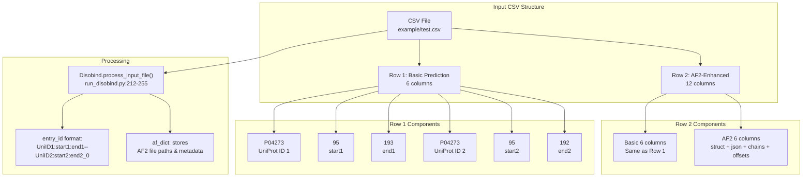
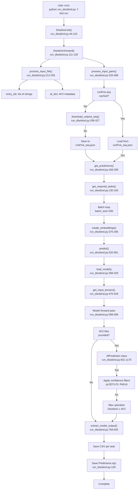
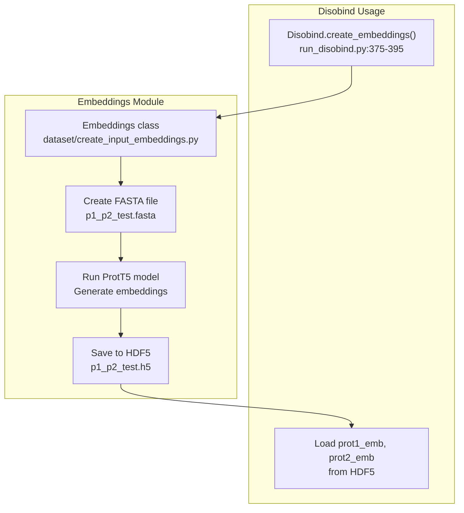
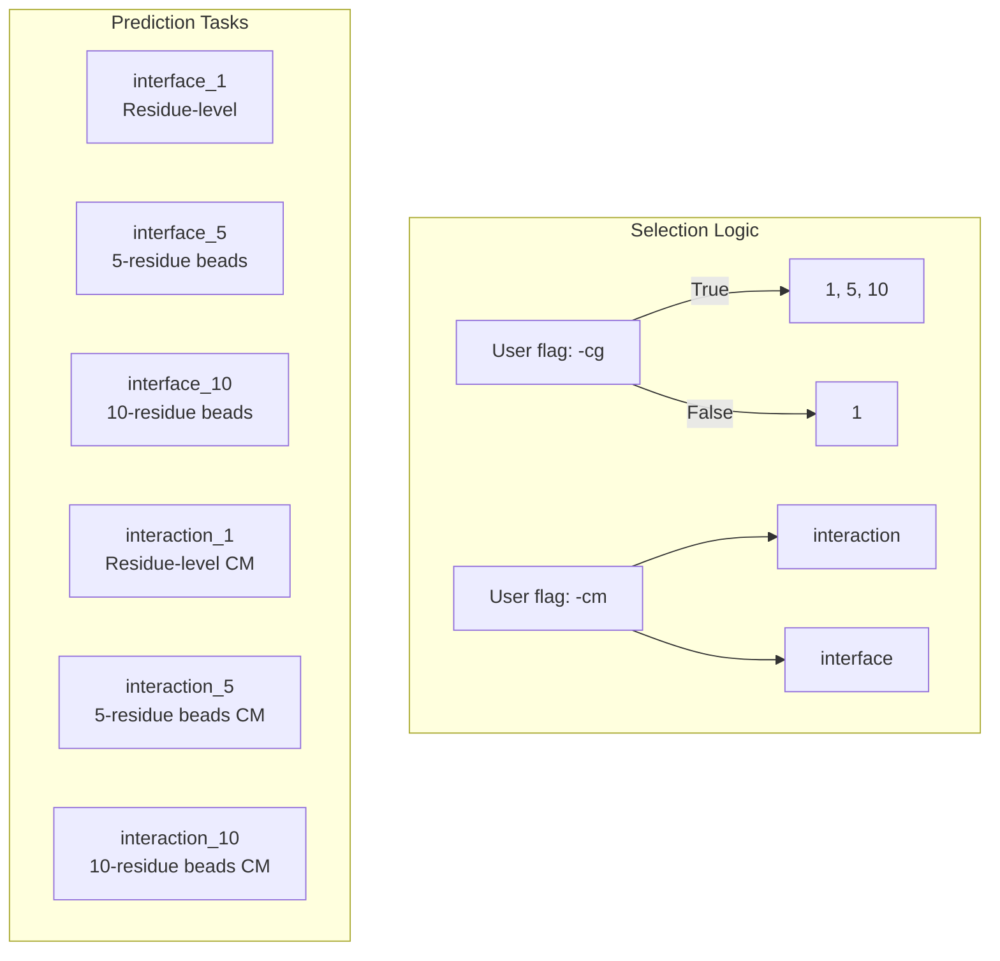

# Example: Basic Prediction

> **Relevant source files**
> - [README\.md](https://github.com/isblab/disobind/blob/5fffcf84/README.md?plain=1)
> - [example/output\.tar\.gz](https://github.com/isblab/disobind/blob/5fffcf84/example/output.tar.gz)
> - [example/pae\_model\_4\_multimer\_v3\_pred\_4\.json](https://github.com/isblab/disobind/blob/5fffcf84/example/pae_model_4_multimer_v3_pred_4.json)
> - [example/test\.csv](https://github.com/isblab/disobind/blob/5fffcf84/example/test.csv)
> - [example/test\.fasta](https://github.com/isblab/disobind/blob/5fffcf84/example/test.fasta)
> - [example/unrelaxed\_model\_4\_multimer\_v3\_pred\_4\.pdb](https://github.com/isblab/disobind/blob/5fffcf84/example/unrelaxed_model_4_multimer_v3_pred_4.pdb)
> - [run\_disobind\.py](https://github.com/isblab/disobind/blob/5fffcf84/run_disobind.py)

 This page provides a complete walkthrough of running Disobind predictions on a simple protein pair, from input preparation to output interpretation\. For advanced usage with custom AlphaFold files and performance analysis, see [ExampleNaN\-NaN](https://github.com/isblab/disobind/blob/5fffcf84/Example#LNaN-LNaN) and [ExampleNaN\-NaN](https://github.com/isblab/disobind/blob/5fffcf84/Example#LNaN-LNaN)

---

## Purpose and Scope

 This tutorial demonstrates the most common Disobind workflow: predicting interface residues for a protein\-protein interaction using only sequence information\. We will:

 1. Prepare a CSV input file with UniProt IDs\.
2. Run the `run_disobind.py` script\.
3. Interpret the output predictions\.

 The example uses residues 95\-193 of UniProt entry P04273 \(human prion protein\), both as a sequence\-only interaction and with AlphaFold2 structural predictions\.

---

## Prerequisites

 Before running this example, ensure:

 - Disobind is installed via `install.sh` \[README\.md:19\-36\]\.
- You have internet access \(to download UniProt sequences via the `get_uniprot_seq` utility \[run\_disobind\.py:36\]\)\.
- GPU is available for faster predictions, though CPU is the default \[run\_disobind\.py:68\]\.

 **Sources:** \[README\.md:14\-38\], \[run\_disobind\.py:36\-68\]

---

## Input File Format

 Disobind accepts predictions via a CSV file where each row represents a protein\-protein interaction pair\.

### Basic Format \(Disobind Only\)

```
UniProt_ID1,start1,end1,UniProt_ID2,start2,end2
```

 - `UniProt_ID1`, `UniProt_ID2`: UniProt accession numbers\.
- `start1`, `end1`: Residue range for protein 1 \(1\-indexed, inclusive\)\.
- `start2`, `end2`: Residue range for protein 2 \(1\-indexed, inclusive\)\.

### Extended Format \(Disobind \+ AlphaFold2\)

```
UniProt_ID1,start1,end1,UniProt_ID2,start2,end2,af2_struct_file,af2_json_file,chain1,chain2,offset1,offset2
```

 Additional fields:

 - `af2_struct_file`: Path to AF2 structure \(\.pdb or \.cif\)\.
- `af2_json_file`: Path to AF2 confidence data \(\.json with PAE matrix\)\.
- `chain1`, `chain2`: Chain IDs in the AF2 structure\.
- `offset1`, `offset2`: Residue numbering offset between AF2 structure and UniProt\.

### Example Input File

 **File: `example/test.csv`**

```
P04273,95,193,P04273,95,192P04273,95,193,P04273,95,193,./example/unrelaxed_model_4_multimer_v3_pred_4.pdb,./example/pae_model_4_multimer_v3_pred_4.json,B,C,0,0
```

 **Sources:** \[README\.md:42\-63\], \[example/test\.csv:1\-2\]

---

## Input Format Diagram



 **Sources:** \[run\_disobind\.py:212\-255\], \[example/test\.csv:1\-2\]

---

## Running the Prediction

### Basic Command

```
python run_disobind.py -i csv -f ./example/test.csv
```

 This runs Disobind with default settings:

 - Interface residue prediction \(not contact maps\) \[run\_disobind\.py:57\]\.
- Coarse\-graining level: 1 \(residue\-level\) \[run\_disobind\.py:59\]\.
- Output directory: `output/` \[run\_disobind\.py:61\]\.
- Device: CPU \[run\_disobind\.py:68\]\.

### Common Options

| Flag | Description | Default |
| --- | --- | --- |
| \-i | Input file type \(csv or fasta\) | csv |
| \-f | Path to the input file | Required |
| \-o | Output directory name | output |
| \-d | Device \(cpu or cuda\) | cpu |
| \-c | Number of cores for UniProt download | 2 |
| \-cg | Coarse\-graining level \(0, 1, 5, 10\) | 1 |
| \-cm | Predict contact maps \(boolean\) | False |

 **Sources:** \[README\.md:85\-93\], \[run\_disobind\.py:44\-82\]

---

## Prediction Workflow



 **Sources:** \[run\_disobind\.py:111\-208\], \[run\_disobind\.py:532\-661\]

---

## Key Code Components

### Main Classes and Methods

| Workflow Step | Code Entity | Location |
| --- | --- | --- |
| Initialize parameters | Disobind\.\_\_init\_\_\(\) | \[run\_disobind\.py:44\-110\] |
| Main entry point | Disobind\.forward\(\) | \[run\_disobind\.py:111\-128\] |
| Parse CSV input | Disobind\.process\_input\_file\(\) | \[run\_disobind\.py:212\-255\] |
| Download sequences | Disobind\.download\_uniprot\_seq\(\) | \[run\_disobind\.py:299\-327\] |
| Generate embeddings | Disobind\.create\_embeddings\(\) | \[run\_disobind\.py:375\-395\] |
| Load trained model | Disobind\.load\_model\(\) | \[run\_disobind\.py:399\-429\] |
| Run predictions | Disobind\.predict\(\) | \[run\_disobind\.py:532\-661\] |
| Process AF2 data | AfPrediction class | \[run\_disobind\.py:831\-1175\] |
| Format output | Disobind\.extract\_model\_output\(\) | \[run\_disobind\.py:758\-825\] |

### Embedding Generation

 The `create_embeddings` method utilizes the `Embeddings` class from `dataset.create_input_embeddings` to generate T5 embeddings for the input sequences \[run\_disobind\.py:38\-395\]\.



 **Sources:** \[run\_disobind\.py:375\-395\], \[dataset/create\_input\_embeddings\.py\]

---

## Understanding the Output

### Output Directory Structure

 The output directory \(default: `output/`\) contains:

```
output/
├── UniProt_seq.json              # Downloaded UniProt sequences [[run_disobind.py:108]]()
├── p1_p2_test.fasta             # FASTA file for embedding generation [[run_disobind.py:104]]()
├── p1_p2_test.h5                # T5 embeddings in HDF5 format [[run_disobind.py:106]]()
├── Predictions.npy              # All predictions (nested dict) [[run_disobind.py:126]]()
├── diso_<entry_id>_<task>.csv   # Disobind predictions per task [[run_disobind.py:808]]()
└── diso_af2_<entry_id>_<task>.csv  # Combined predictions [[run_disobind.py:821]]()
```

### CSV Output Format

 Each CSV file has four columns: `Protein1`, `Residue1`, `Protein2`, `Residue2` \[README\.md:103\-106\]\.

 - **For interface residue prediction:** Residues in Protein1 and Protein2 that are likely part of the interface \[README\.md:113\]\.
- **For contact map prediction:** Specific pairs of residues \(Residue1, Residue2\) that are predicted to interact \[README\.md:111\]\.

 **Sources:** \[README\.md:95\-114\], \[run\_disobind\.py:758\-825\]

---

## Predictions\.npy Structure

 The `Predictions.npy` file stores results in a nested dictionary format \[run\_disobind\.py:99\]\.

```
{    "P04273::--P04273::": {  # Pair ID        "P04273:95:193--P04273:95:192_0": {  # Entry ID            "interface_1": {  # Task                "Disobind": array(...),  # Raw probability scores                "AF2": array(...),       # AF2-derived binary contacts                "Diso+AF2": array(...),  # Combined prediction                "Final_diso_preds": DataFrame(...), # Data for CSV                ...            }        }    }}
```

 **Sources:** \[run\_disobind\.py:536\-659\], \[run\_disobind\.py:84\]

---

## Prediction Tasks and Output Shapes

 Disobind supports 6 prediction tasks based on the objective and coarse\-graining level \[run\_disobind\.py:130\-165\]\.

| Task Type | Description | Model Example |
| --- | --- | --- |
| interface | Predict interface residues | Epsilon\_3\_16\.2 \(CG1\) |
| interaction | Predict contact map | Epsilon\_3\_6\.2 \(CG1\) |

 Coarse\-graining levels \(1, 5, 10\) reduce the resolution of the output by pooling residues into beads \[run\_disobind\.py:148\-151\]\.



 **Sources:** \[run\_disobind\.py:130\-165\], \[analysis/params\.py:41\]

---

## Combining with AlphaFold2

 When AF2 structure and PAE files are provided, the `AfPrediction` class processes them to create structural contacts \[run\_disobind\.py:831\-1175\]\.

 - **pLDDT Filter:** Residues with pLDDT < 70 are considered low confidence \[run\_disobind\.py:74\]\.
- **PAE Filter:** Residue pairs with PAE \> 5 Å are considered low confidence \[run\_disobind\.py:76\]\.
- **Distance Filter:** Contacts are defined by a distance threshold \(default 8 Å\) \[run\_disobind\.py:72\]\.

 The final prediction is the maximum of the Disobind sequence prediction and the AF2 structural prediction \[run\_disobind\.py:616\-661\]\.

 **Sources:** \[run\_disobind\.py:70\-76\], \[run\_disobind\.py:616\-661\], \[run\_disobind\.py:831\-1175\]
