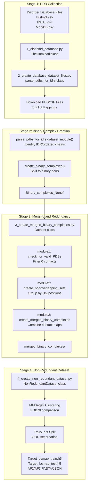

# Example: Custom Dataset Creation

> **Relevant source files**
> - [dataset/1\_disobind\_databases\.py](https://github.com/isblab/disobind/blob/5fffcf84/dataset/1_disobind_databases.py)
> - [dataset/2\_create\_database\_dataset\_files\.py](https://github.com/isblab/disobind/blob/5fffcf84/dataset/2_create_database_dataset_files.py)
> - [dataset/3\_create\_merged\_binary\_complexes\.py](https://github.com/isblab/disobind/blob/5fffcf84/dataset/3_create_merged_binary_complexes.py)
> - [dataset/4\_create\_non\_redundant\_dataset\.py](https://github.com/isblab/disobind/blob/5fffcf84/dataset/4_create_non_redundant_dataset.py)

 This page provides a step\-by\-step walkthrough for creating a custom Disobind dataset from PDB structures and disorder databases\. This tutorial demonstrates the complete pipeline from collecting PDB IDs to generating training\-ready input files with embeddings\.

 For information about the dataset creation classes and utilities, see [Dataset Creation Classes](https://deepwiki.com/isblab/disobind/6.3-dataset-creation-classes)\. For details on preparing special datasets like PEDS or IDPPI, see [Special Dataset Preparation](https://deepwiki.com/isblab/disobind/3.5-special-dataset-preparation)\.

## Overview and Prerequisites

 The dataset creation pipeline transforms raw structural data from PDB and disorder annotations into training\-ready binary complexes with contact maps\. The process involves four major stages executed sequentially:

 **Stage 1:** Collect and filter PDB structures containing disordered proteins
 **Stage 2:** Create and validate binary protein complexes
 **Stage 3:** Merge overlapping complexes and create non\-redundant splits
 **Stage 4:** Generate T5 embeddings for training

 **Prerequisites:**

 - Disorder database files: DisProt, IDEAL, MobiDB CSV files in `input_files/` [2\_create\_database\_dataset\_files\.py L68-L70](https://github.com/isblab/disobind/blob/5fffcf84/dataset/2_create_database_dataset_files.py#L68-L70)
- PDB download access and ~500GB storage for structures
- MMSeqs2 installed for redundancy reduction [4\_create\_non\_redundant\_dataset\.py L124-L125](https://github.com/isblab/disobind/blob/5fffcf84/dataset/4_create_non_redundant_dataset.py#L124-L125)
- T5 model access for embedding generation
- 100\+ cores recommended for parallel processing [2\_create\_database\_dataset\_files\.py L53](https://github.com/isblab/disobind/blob/5fffcf84/dataset/2_create_database_dataset_files.py#L53-L53)

 Sources: [2\_create\_database\_dataset\_files\.py L1-L147](https://github.com/isblab/disobind/blob/5fffcf84/dataset/2_create_database_dataset_files.py#L1-L147) [4\_create\_non\_redundant\_dataset\.py L1-L143](https://github.com/isblab/disobind/blob/5fffcf84/dataset/4_create_non_redundant_dataset.py#L1-L143)

---

## Pipeline Architecture



 Sources: [1\_disobind\_databases\.py L31-L56](https://github.com/isblab/disobind/blob/5fffcf84/dataset/1_disobind_databases.py#L31-L56) [2\_create\_database\_dataset\_files\.py L44-L147](https://github.com/isblab/disobind/blob/5fffcf84/dataset/2_create_database_dataset_files.py#L44-L147) [3\_create\_merged\_binary\_complexes\.py L39-L100](https://github.com/isblab/disobind/blob/5fffcf84/dataset/3_create_merged_binary_complexes.py#L39-L100) [4\_create\_non\_redundant\_dataset\.py L31-L143](https://github.com/isblab/disobind/blob/5fffcf84/dataset/4_create_non_redundant_dataset.py#L31-L143)

---

## Stage 1: Collecting PDB Structures

### Step 1\.1: Configure Input Files

 Place disorder database CSV files in the `input_files/` directory\. The pipeline expects files for DisProt, IDEAL, and MobiDB [2\_create\_database\_dataset\_files\.py L68-L70](https://github.com/isblab/disobind/blob/5fffcf84/dataset/2_create_database_dataset_files.py#L68-L70)

### Step 1\.2: Initialize the Parser

 The `parse_pdbs_for_idrs` class handles the Stage 1 process\.

 **Key Configuration Parameters** \(set in constructor\):

| Parameter | Default | Purpose |
| --- | --- | --- |
| max\_len | 200 | Maximum protein fragment length dataset/2\_create\_database\_dataset\_files\.py75 |
| min\_len | 20 | Minimum protein fragment length dataset/2\_create\_database\_dataset\_files\.py76 |
| min\_disorder\_percent | 0\.2 | Minimum fraction of disordered residues dataset/2\_create\_database\_dataset\_files\.py78 |
| uni\_max\_len | 10000 | Maximum UniProt sequence length dataset/2\_create\_database\_dataset\_files\.py74 |

 Sources: [2\_create\_database\_dataset\_files\.py L44-L137](https://github.com/isblab/disobind/blob/5fffcf84/dataset/2_create_database_dataset_files.py#L44-L137)

### Step 1\.3: Understanding the Workflow

```mermaid
flowchart TD

CheckSupersede["get_superseding_pdb_id()"]
FetchAPI["from_pdb_rest_api_with_love()"]
DownloadSIFTS["download_SIFTS_Uni_PDB_mapping()"]
DownloadPDBFile["download_pdb()"]
LoadDB["load_disorder_dbs()"]
DownloadPDB["parallelize_PDB_download()"]
GetUniSeq["parallelize_uniprot_seq_download()"]
CreateDataset["dataset_module()"]

subgraph subGraph1 ["API Operations"]
    CheckSupersede
    FetchAPI
    DownloadSIFTS
    DownloadPDBFile
    CheckSupersede --> FetchAPI
    FetchAPI --> DownloadSIFTS
    DownloadSIFTS --> DownloadPDBFile
end

subgraph parse_pdbs_for_idrs.forward() ["parse_pdbs_for_idrs.forward()"]
    LoadDB
    DownloadPDB
    GetUniSeq
    CreateDataset
    LoadDB --> DownloadPDB
    DownloadPDB --> GetUniSeq
    GetUniSeq --> CreateDataset
end
```

 **Critical Validation Steps:**

 - **PDB Validation:** Checks if PDB IDs are valid and handles superseding IDs [2\_create\_database\_dataset\_files\.py L29-L30](https://github.com/isblab/disobind/blob/5fffcf84/dataset/2_create_database_dataset_files.py#L29-L30)
- **UniProt Sequence Retrieval:** Fetches sequences and entry names via `get_uniprot_seq` and `get_uniprot_entry_name` [2\_create\_database\_dataset\_files\.py L31](https://github.com/isblab/disobind/blob/5fffcf84/dataset/2_create_database_dataset_files.py#L31-L31)
- **Mapping:** Downloads and parses SIFTS mappings to associate PDB residues with UniProt positions [2\_create\_database\_dataset\_files\.py L26-L28](https://github.com/isblab/disobind/blob/5fffcf84/dataset/2_create_database_dataset_files.py#L26-L28)

 Sources: [2\_create\_database\_dataset\_files\.py L147-L285](https://github.com/isblab/disobind/blob/5fffcf84/dataset/2_create_database_dataset_files.py#L147-L285) [2\_create\_database\_dataset\_files\.py L26-L31](https://github.com/isblab/disobind/blob/5fffcf84/dataset/2_create_database_dataset_files.py#L26-L31)

---

## Stage 2: Creating Binary Complexes

### Step 2\.1: Identify Disordered and Ordered Chains

 The `dataset_module()` method processes PDB structures to identify chains with disorder\.

 **Validation Criteria:**

 - **Disorder Requirements:** At least `min_disorder_percent` \(20%\) of residues must be disordered [2\_create\_database\_dataset\_files\.py L78](https://github.com/isblab/disobind/blob/5fffcf84/dataset/2_create_database_dataset_files.py#L78-L78)
- **Length Constraints:** Fragments must be between `min_len` and `max_len` [2\_create\_database\_dataset\_files\.py L75-L76](https://github.com/isblab/disobind/blob/5fffcf84/dataset/2_create_database_dataset_files.py#L75-L76)

### Step 2\.2: Split to Binary Complexes

 **Function:** `create_binary_complexes()` splits PDB structures into \(IDR chain, partner chain\) pairs\.

 **Output Structure:** JSON files are saved in `Binary_complexes_{limit}/` [2\_create\_database\_dataset\_files\.py L94](https://github.com/isblab/disobind/blob/5fffcf84/dataset/2_create_database_dataset_files.py#L94-L94) Each file contains:

 - PDB ID, Asym IDs, and Auth Asym IDs\.
- Mapped UniProt positions\.
- PDB residue positions\.

 Sources: [2\_create\_database\_dataset\_files\.py L72-L105](https://github.com/isblab/disobind/blob/5fffcf84/dataset/2_create_database_dataset_files.py#L72-L105) [2\_create\_database\_dataset\_files\.py L1294-L1507](https://github.com/isblab/disobind/blob/5fffcf84/dataset/2_create_database_dataset_files.py#L1294-L1507)

---

## Stage 3: Merging and Validation

 This stage uses the `Dataset` class from `3_create_merged_binary_complexes.py`\.

### Step 3\.1: Module 1 \- Validate Binary Complexes

 **Function:** `module1()` iterates through complexes and performs quality checks [3\_create\_merged\_binary\_complexes\.py L139](https://github.com/isblab/disobind/blob/5fffcf84/dataset/3_create_merged_binary_complexes.py#L139-L139)

 - **Coordinate Extraction:** Uses `get_coordinates` to retrieve CA atom positions [3\_create\_merged\_binary\_complexes\.py L29](https://github.com/isblab/disobind/blob/5fffcf84/dataset/3_create_merged_binary_complexes.py#L29-L29)
- **Contact Map Generation:** Uses `get_contact_map` with a default `contact_threshold` of 8 Å [3\_create\_merged\_binary\_complexes\.py L29-L90](https://github.com/isblab/disobind/blob/5fffcf84/dataset/3_create_merged_binary_complexes.py#L29-L90)
- **Filtering:** Removes entries with 0 contacts or missing chains in the specified model [3\_create\_merged\_binary\_complexes\.py L136-L137](https://github.com/isblab/disobind/blob/5fffcf84/dataset/3_create_merged_binary_complexes.py#L136-L137)

### Step 3\.2: Module 2 \- Create Overlapping Sets

 **Function:** `module2()` groups binary complexes that cover overlapping regions of the same UniProt ID pair [3\_create\_merged\_binary\_complexes\.py L172](https://github.com/isblab/disobind/blob/5fffcf84/dataset/3_create_merged_binary_complexes.py#L172-L172)

 - Uses `check_for_overlap` to find intersecting residue ranges [3\_create\_merged\_binary\_complexes\.py L31](https://github.com/isblab/disobind/blob/5fffcf84/dataset/3_create_merged_binary_complexes.py#L31-L31)
- Ensures merged sequences do not exceed `max_len` using `merged_seq_exceeds_maxlen` [3\_create\_merged\_binary\_complexes\.py L32](https://github.com/isblab/disobind/blob/5fffcf84/dataset/3_create_merged_binary_complexes.py#L32-L32)

### Step 3\.3: Module 3 \- Merge Overlapping Complexes

 **Function:** `module3()` performs the physical merging of contact maps and sequences [3\_create\_merged\_binary\_complexes\.py L186](https://github.com/isblab/disobind/blob/5fffcf84/dataset/3_create_merged_binary_complexes.py#L186-L186)

 - Combines residue positions via `merge_residue_positions` [3\_create\_merged\_binary\_complexes\.py L31](https://github.com/isblab/disobind/blob/5fffcf84/dataset/3_create_merged_binary_complexes.py#L31-L31)
- Aggregates contact maps, allowing for ensemble representation if `all_models` is True [3\_create\_merged\_binary\_complexes\.py L94](https://github.com/isblab/disobind/blob/5fffcf84/dataset/3_create_merged_binary_complexes.py#L94-L94)

 Sources: [3\_create\_merged\_binary\_complexes\.py L39-L100](https://github.com/isblab/disobind/blob/5fffcf84/dataset/3_create_merged_binary_complexes.py#L39-L100) [3\_create\_merged\_binary\_complexes\.py L133-L195](https://github.com/isblab/disobind/blob/5fffcf84/dataset/3_create_merged_binary_complexes.py#L133-L195)

---

## Stage 4: Non\-Redundant Dataset Creation

 This stage uses `NonRedundantDataset` class from `4_create_non_redundant_dataset.py`\.

### Step 4\.1: Module 1 \- Load and Filter

 Loads merged complexes and filters by contact density using `contact_range` \[0\.005, 0\.05\] [4\_create\_non\_redundant\_dataset\.py L113-L165](https://github.com/isblab/disobind/blob/5fffcf84/dataset/4_create_non_redundant_dataset.py#L113-L165)

### Step 4\.2: Module 2 \- Create OOD Test Set

 Creates an Out\-of\-Distribution \(OOD\) test set that is non\-redundant with respect to:

 1. The training set\.
2. The AlphaFold2 PDB70 dataset [4\_create\_non\_redundant\_dataset\.py L173-L176](https://github.com/isblab/disobind/blob/5fffcf84/dataset/4_create_non_redundant_dataset.py#L173-L176)

 **Clustering Workflow:**

 - **PDB70 Filter:** Uses `pdb70_clu.tsv` to exclude PDBs already seen by AlphaFold [4\_create\_non\_redundant\_dataset\.py L66](https://github.com/isblab/disobind/blob/5fffcf84/dataset/4_create_non_redundant_dataset.py#L66-L66)
- **MMSeqs2 Clustering:** Runs `mmseqs_cluster` with `ood_ID_cutoff` \(default 0\.2\) [4\_create\_non\_redundant\_dataset\.py L119-L124](https://github.com/isblab/disobind/blob/5fffcf84/dataset/4_create_non_redundant_dataset.py#L119-L124)

### Step 4\.3: Module 3 \- Create Training Set

 Generates the training set keys, optionally performing redundancy reduction at `train_ID_cutoff` \(default 0\.4\) [4\_create\_non\_redundant\_dataset\.py L121-L123](https://github.com/isblab/disobind/blob/5fffcf84/dataset/4_create_non_redundant_dataset.py#L121-L123)

### Step 4\.4: Module 4 \- Generate AF2/AF3 Inputs

 Prepares inputs for external structural predictors:

 - **AF2:** Generates FASTA files in `af2_fasta_dir` [4\_create\_non\_redundant\_dataset\.py L58](https://github.com/isblab/disobind/blob/5fffcf84/dataset/4_create_non_redundant_dataset.py#L58-L58)
- **AF3:** Generates JSON configurations in `af3_json_dir` [4\_create\_non\_redundant\_dataset\.py L63](https://github.com/isblab/disobind/blob/5fffcf84/dataset/4_create_non_redundant_dataset.py#L63-L63)

 Sources: [4\_create\_non\_redundant\_dataset\.py L31-L143](https://github.com/isblab/disobind/blob/5fffcf84/dataset/4_create_non_redundant_dataset.py#L31-L143) [4\_create\_non\_redundant\_dataset\.py L172-L181](https://github.com/isblab/disobind/blob/5fffcf84/dataset/4_create_non_redundant_dataset.py#L172-L181)

---

## Stage 5: Generating Embeddings

 The final step involves creating protein embeddings for the model\.

 **Embedding Generation:**

 - Uses the `Embeddings` class \(typically in `create_input_embeddings.py`\)\.
- Loads sequences from the generated CSV files\.
- Generates T5 embeddings \(ProtT5\-XL\-U50\)\.
- Saves results to HDF5 format \(`Input_train.h5`, `Input_test.h5`\)\.

 **Final Output Summary:**

| File Type | Path | Purpose |
| --- | --- | --- |
| Target Maps | Target\_bcmap\_train\.h5 | Ground truth contact maps for training |
| Input Embeddings | Input\_train\.h5 | T5 feature vectors for training |
| Metadata | Accessory\.json | Mapping between keys and original PDB info |

 Sources: [4\_create\_non\_redundant\_dataset\.py L102-L108](https://github.com/isblab/disobind/blob/5fffcf84/dataset/4_create_non_redundant_dataset.py#L102-L108) [4\_create\_non\_redundant\_dataset\.py L908-L1012](https://github.com/isblab/disobind/blob/5fffcf84/dataset/4_create_non_redundant_dataset.py#L908-L1012)
