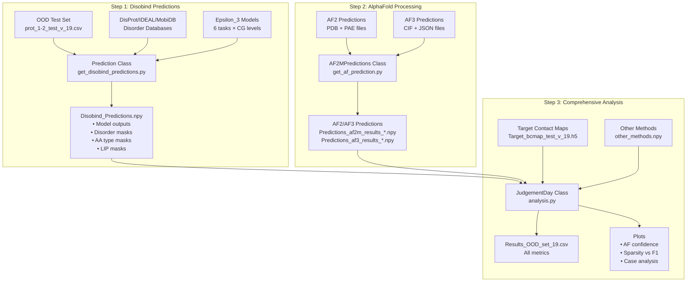
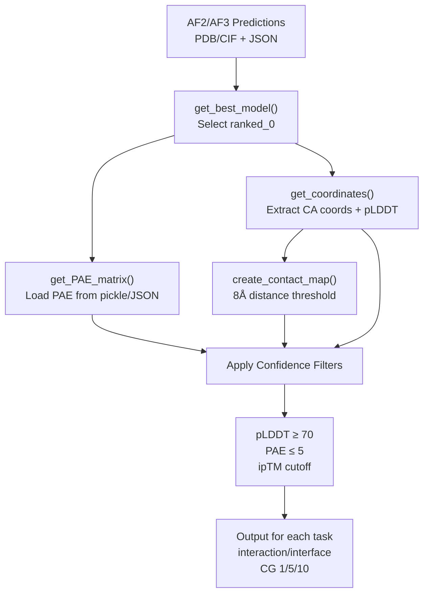
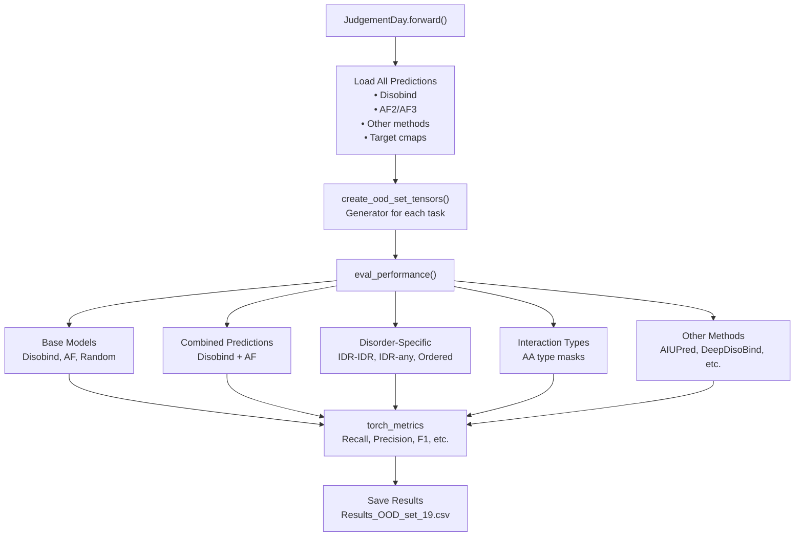

# Example: Performance Analysis

> **Relevant source files**
> - [analysis/README\.md](https://github.com/isblab/disobind/blob/5fffcf84/analysis/README.md?plain=1)
> - [analysis/analysis\.py](https://github.com/isblab/disobind/blob/5fffcf84/analysis/analysis.py)
> - [analysis/get\_af\_prediction\.py](https://github.com/isblab/disobind/blob/5fffcf84/analysis/get_af_prediction.py)
> - [analysis/get\_disobind\_predictions\.py](https://github.com/isblab/disobind/blob/5fffcf84/analysis/get_disobind_predictions.py)
> - [analysis/get\_other\_method\_preds\.py](https://github.com/isblab/disobind/blob/5fffcf84/analysis/get_other_method_preds.py)
> - [analysis/params\.py](https://github.com/isblab/disobind/blob/5fffcf84/analysis/params.py)
> - [dataset/README\.md](https://github.com/isblab/disobind/blob/5fffcf84/dataset/README.md?plain=1)

 This page provides a complete walkthrough of running comprehensive performance analysis on Disobind predictions using the `JudgementDay` analysis pipeline\. This tutorial demonstrates how to evaluate predictions across multiple models \(Disobind, AlphaFold2, AlphaFold3\), compute metrics for different interaction categories \(disorder\-specific, amino acid type\-specific\), and generate comparison plots\.

 For information about the analysis system architecture and classes, see [Analysis and Evaluation](https://deepwiki.com/isblab/disobind/5-analysis-and-evaluation)\. For details on specific evaluation metrics, see [Performance Metrics and Evaluation](https://deepwiki.com/isblab/disobind/5.4-performance-metrics-and-evaluation)\. For disorder\-specific analysis techniques, see [Disorder\-Specific Analysis](https://deepwiki.com/isblab/disobind/5.5-disorder-specific-analysis)\.

## Overview

 The performance analysis workflow consists of three sequential steps:

 1. **Generate Disobind Predictions** \- Run Disobind on the test set with specialized masks for disorder regions and amino acid types\.
2. **Process AlphaFold Predictions** \- Extract contact maps from AF2/AF3 structures with confidence filtering\.
3. **Run Comprehensive Analysis** \- Calculate metrics across all tasks and generate comparison plots\.

 This example uses the out\-of\-distribution \(OOD\) test set, but the same workflow applies to other datasets like the Misc dataset\.

## Analysis Workflow

 **Diagram: Complete Performance Analysis Pipeline**



 Sources: [README\.md?plain=1 L1-L68](https://github.com/isblab/disobind/blob/5fffcf84/analysis/README.md?plain=1#L1-L68) [analysis\.py L25-L98](https://github.com/isblab/disobind/blob/5fffcf84/analysis/analysis.py#L25-L98) [get\_disobind\_predictions\.py L38-L132](https://github.com/isblab/disobind/blob/5fffcf84/analysis/get_disobind_predictions.py#L38-L132) [get\_af\_prediction\.py L28-L77](https://github.com/isblab/disobind/blob/5fffcf84/analysis/get_af_prediction.py#L28-L77)

## Prerequisites

 Before running the analysis, ensure you have:

 1. **Trained Disobind models** \- Model checkpoint files in `../models/` referenced by `parameter_files` [params\.py L6-L11](https://github.com/isblab/disobind/blob/5fffcf84/analysis/params.py#L6-L11)
2. **Test dataset** \- OOD test set with input CSV and target contact maps [get\_disobind\_predictions\.py L85-L94](https://github.com/isblab/disobind/blob/5fffcf84/analysis/get_disobind_predictions.py#L85-L94)
3. **AlphaFold predictions** \- AF2/AF3 structure predictions for the test set\.
4. **Disorder databases** \- DisProt, IDEAL, and MobiDB CSV files [get\_disobind\_predictions\.py L79-L81](https://github.com/isblab/disobind/blob/5fffcf84/analysis/get_disobind_predictions.py#L79-L81)
5. **Python environment** \- With all dependencies installed\.

## Step 1: Generate Disobind Predictions

 Navigate to the `analysis` directory and run the Disobind prediction script:

```
cd analysispython get_disobind_predictions.py
```

 **Key Configuration Parameters**

 The `Prediction` class constructor contains critical configuration settings:

| Parameter | Description | Default Value |
| --- | --- | --- |
| data\_version | Dataset version number | 19 |
| model\_version | Model version to use | 19 |
| embedding\_type | Type of embeddings | "T5" |
| mode | Dataset mode | "ood" \(or "misc"\) |
| max\_len | Maximum protein length | 100 |
| threshold | Contact probability threshold | 0\.5 |

 Sources: [get\_disobind\_predictions\.py L39-L65](https://github.com/isblab/disobind/blob/5fffcf84/analysis/get_disobind_predictions.py#L39-L65)

 **What This Step Does**

 The `Prediction.forward()` method [get\_disobind\_predictions\.py L134-L179](https://github.com/isblab/disobind/blob/5fffcf84/analysis/get_disobind_predictions.py#L134-L179) performs the following operations:

 1. **Load Models** \- Loads trained Disobind models for interaction and interface tasks at CG 1, 5, 10 [params\.py L14-L60](https://github.com/isblab/disobind/blob/5fffcf84/analysis/params.py#L14-L60)
2. **Create Embeddings** \- Generates T5 embeddings for protein sequences via `create_embeddings` [get\_disobind\_predictions\.py L168](https://github.com/isblab/disobind/blob/5fffcf84/analysis/get_disobind_predictions.py#L168-L168)
3. **Extract Disorder Information** \- Queries disorder databases to identify disordered regions [get\_disobind\_predictions\.py L142-L144](https://github.com/isblab/disobind/blob/5fffcf84/analysis/get_disobind_predictions.py#L142-L144)
4. **Generate Specialized Masks** \- Creates binary masks for: - IDR\-IDR interactions vs ordered interactions\. - Disorder\-promoting amino acids \(R, P, Q, E, G, S, A, K\) [get\_disobind\_predictions\.py L814-L817](https://github.com/isblab/disobind/blob/5fffcf84/analysis/get_disobind_predictions.py#L814-L817) - Aromatic amino acids \(F, Y, W\) [get\_disobind\_predictions\.py L819-L821](https://github.com/isblab/disobind/blob/5fffcf84/analysis/get_disobind_predictions.py#L819-L821) - Hydrophobic amino acids \(A, V, L, I, P, M, F, W\) [get\_disobind\_predictions\.py L823-L826](https://github.com/isblab/disobind/blob/5fffcf84/analysis/get_disobind_predictions.py#L823-L826) - Polar amino acids \(S, T, C, N, Q, Y, D, E, K, R, H\) [get\_disobind\_predictions\.py L828-L832](https://github.com/isblab/disobind/blob/5fffcf84/analysis/get_disobind_predictions.py#L828-L832) - Linear Interacting Peptides \(LIPs\) from MobiDB [get\_disobind\_predictions\.py L760-L779](https://github.com/isblab/disobind/blob/5fffcf84/analysis/get_disobind_predictions.py#L760-L779)
5. **Run Predictions** \- Executes models on the test set [get\_disobind\_predictions\.py L173](https://github.com/isblab/disobind/blob/5fffcf84/analysis/get_disobind_predictions.py#L173-L173)
6. **Save Results** \- Outputs `Disobind_Predictions.npy` [get\_disobind\_predictions\.py L175](https://github.com/isblab/disobind/blob/5fffcf84/analysis/get_disobind_predictions.py#L175-L175)

 Sources: [get\_disobind\_predictions\.py L134-L179](https://github.com/isblab/disobind/blob/5fffcf84/analysis/get_disobind_predictions.py#L134-L179) [get\_disobind\_predictions\.py L810-L896](https://github.com/isblab/disobind/blob/5fffcf84/analysis/get_disobind_predictions.py#L810-L896)

## Step 2: Process AlphaFold Predictions

 Run the AlphaFold prediction processing script separately for AF2 and AF3 by modifying `self.af_model` [get\_af\_prediction\.py L54](https://github.com/isblab/disobind/blob/5fffcf84/analysis/get_af_prediction.py#L54-L54):

```
# Process AlphaFold2 predictionspython get_af_prediction.py  # Ensure self.af_model = "AF2" # Process AlphaFold3 predictionspython get_af_prediction.py  # Ensure self.af_model = "AF3"
```

 **Key Configuration Parameters**

| Parameter | Description | Default Value |
| --- | --- | --- |
| af\_model | AlphaFold version | "AF2" or "AF3" |
| dist\_threshold | Contact distance cutoff \(Å\) | 8 |
| plddt\_threshold | pLDDT confidence cutoff | 70 |
| pae\_threshold | PAE confidence cutoff | 5 |
| iptm\_cutoff | ipTM confidence cutoff | 0\.0 |

 Sources: [get\_af\_prediction\.py L30-L54](https://github.com/isblab/disobind/blob/5fffcf84/analysis/get_af_prediction.py#L30-L54)

 **Processing Pipeline**

 **Diagram: AlphaFold Prediction Processing**



 Sources: [get\_af\_prediction\.py L96-L132](https://github.com/isblab/disobind/blob/5fffcf84/analysis/get_af_prediction.py#L96-L132) [get\_af\_prediction\.py L135-L160](https://github.com/isblab/disobind/blob/5fffcf84/analysis/get_af_prediction.py#L135-L160) [get\_af\_prediction\.py L163-L195](https://github.com/isblab/disobind/blob/5fffcf84/analysis/get_af_prediction.py#L163-L195) [get\_af\_prediction\.py L198-L214](https://github.com/isblab/disobind/blob/5fffcf84/analysis/get_af_prediction.py#L198-L214)

 **Confidence Filtering Details**

 The `AF2MPredictions` class applies multi\-level confidence filtering:

 1. **pLDDT Filtering** \- Creates binary mask where pLDDT ≥ 70 for both chains [get\_af\_prediction\.py L38](https://github.com/isblab/disobind/blob/5fffcf84/analysis/get_af_prediction.py#L38-L38)
2. **PAE Filtering** \- Creates binary mask where PAE ≤ 5 \(high inter\-domain confidence\) [get\_af\_prediction\.py L40](https://github.com/isblab/disobind/blob/5fffcf84/analysis/get_af_prediction.py#L40-L40)
3. **ipTM Filtering** \- Used to select best models and optionally filter results [get\_af\_prediction\.py L113-L132](https://github.com/isblab/disobind/blob/5fffcf84/analysis/get_af_prediction.py#L113-L132)

 The contact map is derived from CA coordinates [get\_af\_prediction\.py L191](https://github.com/isblab/disobind/blob/5fffcf84/analysis/get_af_prediction.py#L191-L191) using `get_contact_map` [get\_af\_prediction\.py L212](https://github.com/isblab/disobind/blob/5fffcf84/analysis/get_af_prediction.py#L212-L212)

 Sources: [get\_af\_prediction\.py L28-L54](https://github.com/isblab/disobind/blob/5fffcf84/analysis/get_af_prediction.py#L28-L54) [get\_af\_prediction\.py L163-L214](https://github.com/isblab/disobind/blob/5fffcf84/analysis/get_af_prediction.py#L163-L214)

## Step 3: Run Comprehensive Analysis

 Execute the main analysis script:

```
python analysis.py
```

 **Analysis Pipeline Overview**

 **Diagram: JudgementDay Analysis Categories**



 Sources: [analysis\.py L107-L123](https://github.com/isblab/disobind/blob/5fffcf84/analysis/analysis.py#L107-L123) [analysis\.py L192-L215](https://github.com/isblab/disobind/blob/5fffcf84/analysis/analysis.py#L192-L215)

 **Evaluation Categories**

 The analysis evaluates predictions across multiple categories:

| Category | Models Evaluated | Description |
| --- | --- | --- |
| Base Models | Disobind, AF2, AF3, Random | Standard evaluation on full maps\. |
| Combined | Disobind\+AF2, Disobind\+AF3 | Max operation between Disobind and AF\. |
| Disorder\-Specific | All models | Filtered by IDR\-IDR, IDR\-any, or Ordered regions\. |
| Amino Acid Types | All models | Filtered by residue types \(e\.g\., Aromatic, Polar\)\. |
| Other Methods | AIUPred, DeepDisoBind, MORFchibi | Comparison with external interface predictors\. |

 Sources: [analysis\.py L2-L8](https://github.com/isblab/disobind/blob/5fffcf84/analysis/analysis.py#L2-L8) [get\_other\_method\_preds\.py L14-L19](https://github.com/isblab/disobind/blob/5fffcf84/analysis/get_other_method_preds.py#L14-L19)

 **Metrics Calculated**

 The system utilizes `torch_metrics` [analysis\.py L20](https://github.com/isblab/disobind/blob/5fffcf84/analysis/analysis.py#L20-L20) to compute:

 - Recall
- Precision
- F1\-score
- Average Precision
- Matthews Correlation Coefficient \(MCC\)
- AUROC
- Accuracy

 Sources: [analysis\.py L20](https://github.com/isblab/disobind/blob/5fffcf84/analysis/analysis.py#L20-L20) [get\_disobind\_predictions\.py L31](https://github.com/isblab/disobind/blob/5fffcf84/analysis/get_disobind_predictions.py#L31-L31)

## Understanding the Outputs

 **Output Files Generated**

| File | Description |
| --- | --- |
| Results\_OOD\_set\_19\.csv | Complete results table with all metrics analysis/analysis\.py84 |
| AF\_confidence\_plot\_19\.png | Scatter plot of AF2 vs AF3 confidence analysis/analysis\.py90 |
| Confident\_AF\_preds\_19\.txt | Count statistics for confident predictions analysis/analysis\.py89 |
| Sparsity\_F1\_plot\_19\.png | Sparsity vs F1\-score relationship analysis/analysis\.py92 |
| Case\_sp\_analysis\_19\.csv | Per\-entry analysis \(Misc dataset only\) analysis/analysis\.py93 |

 Sources: [analysis\.py L81-L98](https://github.com/isblab/disobind/blob/5fffcf84/analysis/analysis.py#L81-L98)

 **Combined Prediction Strategy**

 Disobind and AlphaFold predictions can be combined to leverage both sequence and structure\-based insights\. This is typically done by taking the element\-wise maximum of the two prediction matrices after appropriate padding or cropping\.

 Sources: [analysis\.py L4-L7](https://github.com/isblab/disobind/blob/5fffcf84/analysis/analysis.py#L4-L7)

## Comparing with Other Methods

 The `Othermethods` class [get\_other\_method\_preds\.py L14](https://github.com/isblab/disobind/blob/5fffcf84/analysis/get_other_method_preds.py#L14-L14) handles external tools:

 1. **AIUPred**: Uses `aiupred_lib` to predict binding propensities [get\_other\_method\_preds\.py L83-L97](https://github.com/isblab/disobind/blob/5fffcf84/analysis/get_other_method_preds.py#L83-L97)
2. **DeepDisoBind**: Parses results from FASTA files [get\_other\_method\_preds\.py L100-L122](https://github.com/isblab/disobind/blob/5fffcf84/analysis/get_other_method_preds.py#L100-L122)
3. **MORFchibi**: Parses `.txt` output and applies a specific MoRF identification heuristic \(propensity ≥ 0\.775 for ≥ 4 consecutive residues\) [get\_other\_method\_preds\.py L160-L181](https://github.com/isblab/disobind/blob/5fffcf84/analysis/get_other_method_preds.py#L160-L181)

 Sources: [get\_other\_method\_preds\.py L14-L192](https://github.com/isblab/disobind/blob/5fffcf84/analysis/get_other_method_preds.py#L14-L192)

## Troubleshooting

 **Common Issues**

| Issue | Cause | Solution |
| --- | --- | --- |
| Missing disorder data | DisProt/IDEAL/MobiDB files missing | Ensure files exist in \.\./database/input\_files/ analysis/get\_disobind\_predictions\.py79\-81 |
| Mode Error | Unsupported mode string | Use "ood" or "misc" analysis/analysis\.py66 |
| AF Model Mismatch | self\.af\_model not set correctly | Verify if set to "AF2" or "AF3" analysis/get\_af\_prediction\.py92 |

 Sources: [analysis\.py L66](https://github.com/isblab/disobind/blob/5fffcf84/analysis/analysis.py#L66-L66) [get\_af\_prediction\.py L92](https://github.com/isblab/disobind/blob/5fffcf84/analysis/get_af_prediction.py#L92-L92) [get\_disobind\_predictions\.py L107](https://github.com/isblab/disobind/blob/5fffcf84/analysis/get_disobind_predictions.py#L107-L107)
