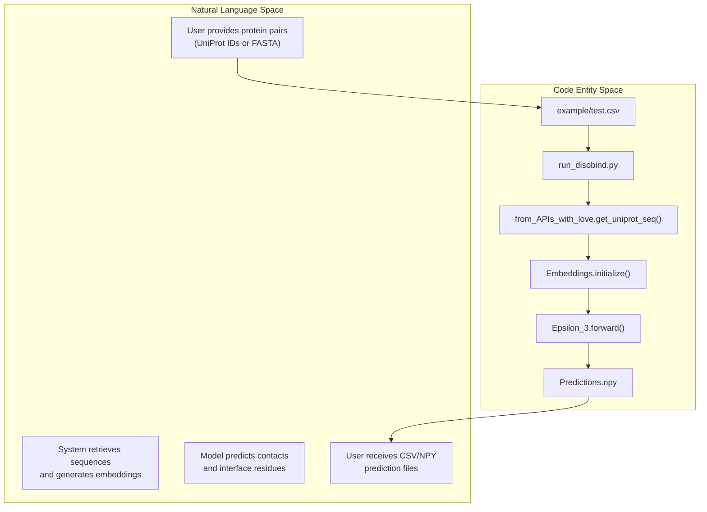
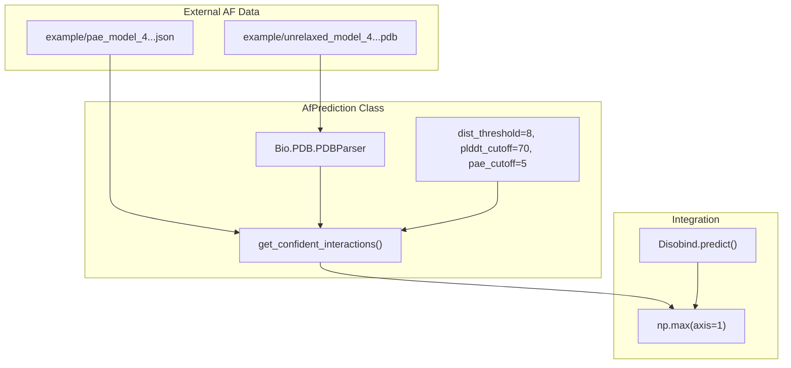

# Examples and Tutorials

> **Relevant source files**
> * [README.md](https://github.com/isblab/disobind/blob/5fffcf84/README.md?plain=1)
> * [example/output.tar.gz](https://github.com/isblab/disobind/blob/5fffcf84/example/output.tar.gz)
> * [example/pae_model_4_multimer_v3_pred_4.json](https://github.com/isblab/disobind/blob/5fffcf84/example/pae_model_4_multimer_v3_pred_4.json)
> * [example/test.csv](https://github.com/isblab/disobind/blob/5fffcf84/example/test.csv)
> * [example/unrelaxed_model_4_multimer_v3_pred_4.pdb](https://github.com/isblab/disobind/blob/5fffcf84/example/unrelaxed_model_4_multimer_v3_pred_4.pdb)

This page provides practical examples and tutorials demonstrating common Disobind workflows. Each example includes concrete input formats, command-line invocations, and expected outputs with references to actual code paths and data files.

**Scope**: This page covers high-level summaries and quick-start examples. For detailed step-by-step tutorials, see the following child pages:

* [Example: Basic Prediction](/isblab/disobind/7.1-example:-basic-prediction) — Complete walkthrough of running predictions on a simple protein pair from input to output using the `example/test.csv` and `example/test.fasta` files.
* [Example: AlphaFold-Enhanced Predictions](/isblab/disobind/7.2-example:-alphafold-enhanced-predictions) — Tutorial showing how to combine Disobind with AlphaFold predictions for improved accuracy using the example PDB and PAE JSON files.
* [Example: Custom Dataset Creation](/isblab/disobind/7.3-example:-custom-dataset-creation) — Step-by-step guide for creating a custom dataset from PDB structures for training, walking through the numbered pipeline scripts 1-4.
* [Example: Performance Analysis](/isblab/disobind/7.4-example:-performance-analysis) — Walkthrough of running comprehensive performance analysis on predictions using `JudgementDay`, from generating OOD predictions to interpreting results CSV.

For installation and initial setup, see [Installation and Setup](/isblab/disobind/1.1-installation-and-setup). For detailed API documentation, see [API Reference](/isblab/disobind/6-api-reference).

---

## Overview of Example Workflows

The Disobind repository includes complete example data in the `example/` directory demonstrating two primary use cases: standalone sequence-based prediction and structure-enhanced prediction.

### Natural Language to Code Entity Space: Prediction Pipeline

The following diagram maps the logical steps of the prediction workflow to the specific code entities responsible for them.



**Sources**: [example/test.csv L1-L2](https://github.com/isblab/disobind/blob/5fffcf84/example/test.csv#L1-L2)

 [run_disobind.py L43-L122](https://github.com/isblab/disobind/blob/5fffcf84/run_disobind.py#L43-L122)

 [run_disobind.py L831-L1177](https://github.com/isblab/disobind/blob/5fffcf84/run_disobind.py#L831-L1177)

 [dataset/from_APIs_with_love.py](https://github.com/isblab/disobind/blob/5fffcf84/dataset/from_APIs_with_love.py)

---

## Quick Start: Basic Disobind Prediction

The simplest prediction requires only UniProt IDs and residue ranges in CSV format. Each row represents a protein pair where Protein 1 must be an IDR and Protein 2 can be ordered or disordered.

### Command Execution

```
python run_disobind.py -i csv -f ./example/test.csv
```

This command triggers the `Disobind` class in `run_disobind.py`, which orchestrates sequence retrieval, embedding generation via the `Embeddings` class, and inference using the `Epsilon_3` model architecture. For a full walkthrough of this scenario, see [Example: Basic Prediction](/isblab/disobind/7.1-example:-basic-prediction).

**Sources**: [README.md L79-L80](https://github.com/isblab/disobind/blob/5fffcf84/README.md?plain=1#L79-L80)

 [run_disobind.py L108-L122](https://github.com/isblab/disobind/blob/5fffcf84/run_disobind.py#L108-L122)

 [run_disobind.py L299-L327](https://github.com/isblab/disobind/blob/5fffcf84/run_disobind.py#L299-L327)

---

## AlphaFold-Enhanced Prediction

Disobind can combine its sequence-based predictions with structural confidence from AlphaFold2 or AlphaFold3. This process uses the `AfPrediction` class to parse PDB files and PAE (Predicted Aligned Error) JSON files to filter for high-confidence structural interactions.

### Code Entity Mapping: AF2 Integration

This diagram illustrates how external AlphaFold data is ingested by the `AfPrediction` system.



For details on configuring offsets and chain IDs for this workflow, see [Example: AlphaFold-Enhanced Predictions](/isblab/disobind/7.2-example:-alphafold-enhanced-predictions).

**Sources**: [example/test.csv L2](https://github.com/isblab/disobind/blob/5fffcf84/example/test.csv#L2-L2)

 [run_disobind.py L831-L845](https://github.com/isblab/disobind/blob/5fffcf84/run_disobind.py#L831-L845)

 [run_disobind.py L1118-L1128](https://github.com/isblab/disobind/blob/5fffcf84/run_disobind.py#L1118-L1128)

 [README.md L57-L62](https://github.com/isblab/disobind/blob/5fffcf84/README.md?plain=1#L57-L62)

---

## Dataset Creation and Analysis

Beyond running predictions, Disobind provides a pipeline for users to create their own datasets and evaluate model performance.

### Custom Dataset Creation

Users can build training datasets from PDB structures using a four-step pipeline located in the `dataset/` directory. This involves:

1. Collecting PDB IDs from disorder databases.
2. Generating binary complexes and mapping sequences using SIFTS.
3. Reducing redundancy using `MMSeqs2`.
4. Generating T5 embeddings.

For details, see [Example: Custom Dataset Creation](/isblab/disobind/7.3-example:-custom-dataset-creation).

**Sources**: [README.md L117-L118](https://github.com/isblab/disobind/blob/5fffcf84/README.md?plain=1#L117-L118)

 [dataset/README.md](https://github.com/isblab/disobind/blob/5fffcf84/dataset/README.md?plain=1)

### Performance Analysis

The `JudgementDay` class in the `analysis/` directory allows for comprehensive evaluation of predictions against ground truth, including the calculation of AUROC, MCC, and F1 scores. It also supports comparing Disobind against other methods like `AIUPred` or `DeepDisoBind`.

For details, see [Example: Performance Analysis](/isblab/disobind/7.4-example:-performance-analysis).

**Sources**: [README.md L123-L124](https://github.com/isblab/disobind/blob/5fffcf84/README.md?plain=1#L123-L124)

 [analysis/README.md](https://github.com/isblab/disobind/blob/5fffcf84/analysis/README.md?plain=1)

---

## Command-Line Options Summary

The `run_disobind.py` script is the primary entry point for examples.

| Flag | Description | Default |
| --- | --- | --- |
| `-i` | Input file type (`csv` or `fasta`) | `csv` |
| `-f` | Path to the input file | Required |
| `-cm` | Predict inter-protein contact maps | `False` |
| `-cg` | Coarse-grained resolution (0, 1, 5, 10) | `1` |
| `-d` | Device (`cpu` or `cuda`) | `cpu` |

**Sources**: [README.md L85-L94](https://github.com/isblab/disobind/blob/5fffcf84/README.md?plain=1#L85-L94)

 [run_disobind.py L44-L82](https://github.com/isblab/disobind/blob/5fffcf84/run_disobind.py#L44-L82)