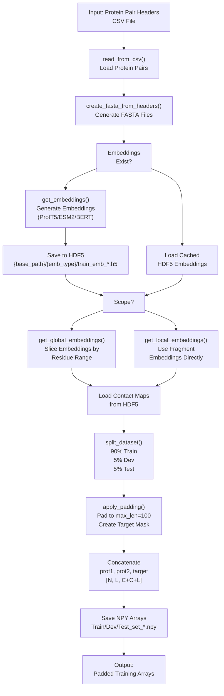
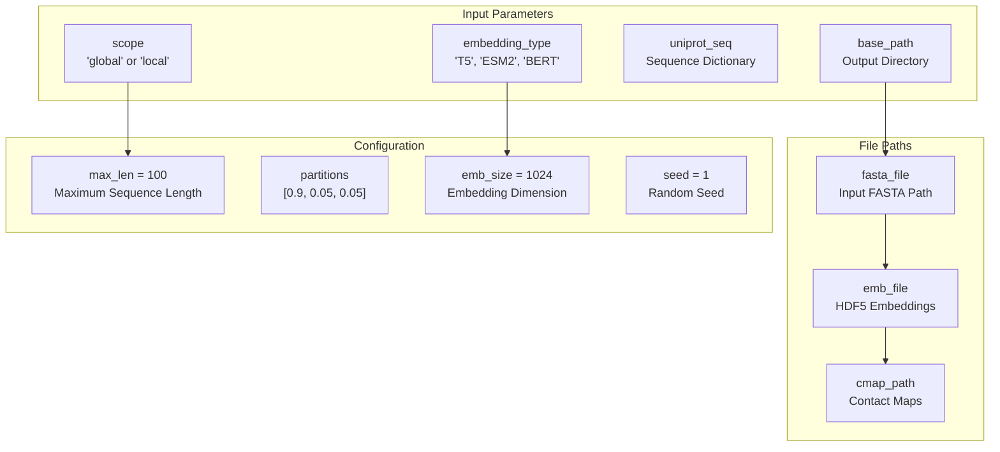
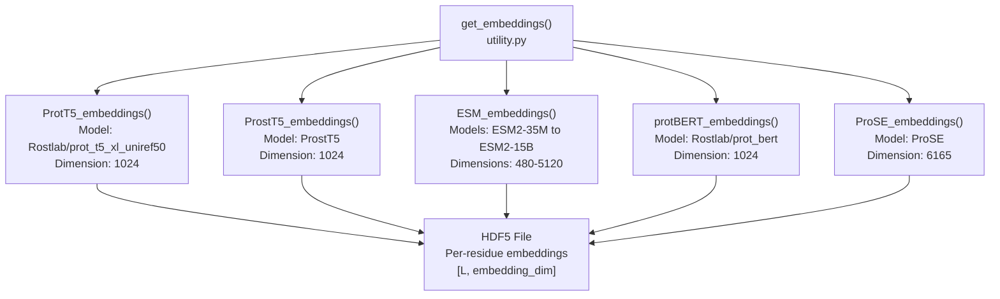
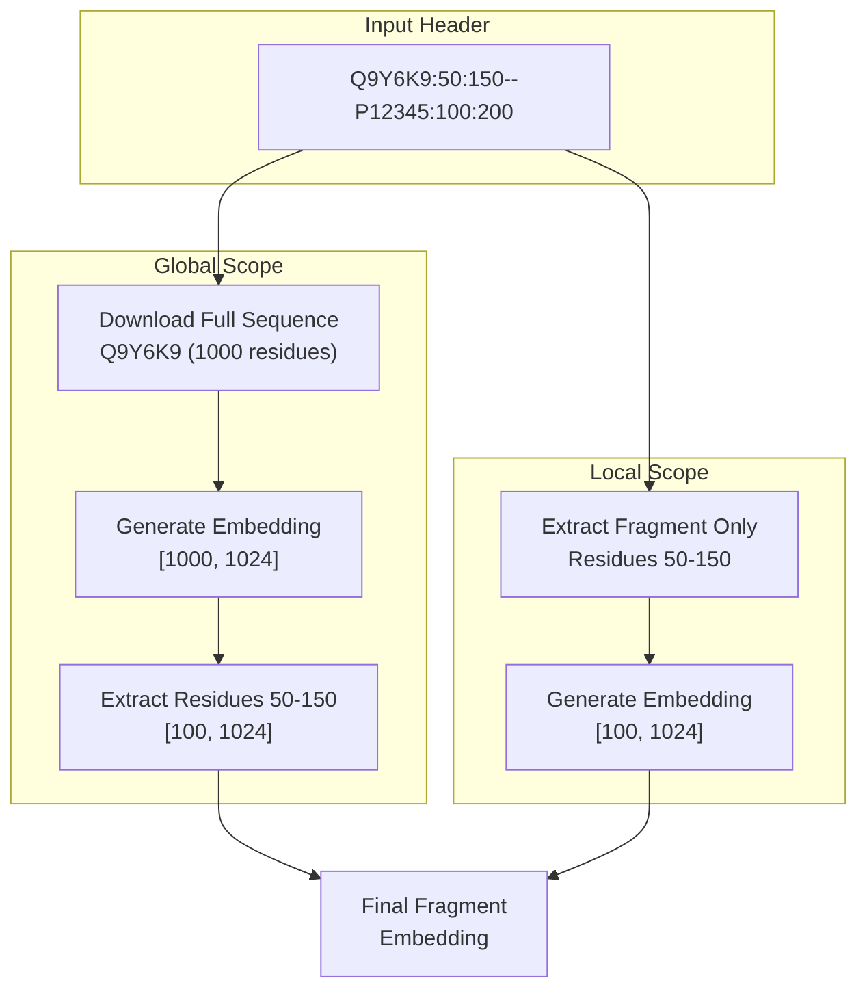
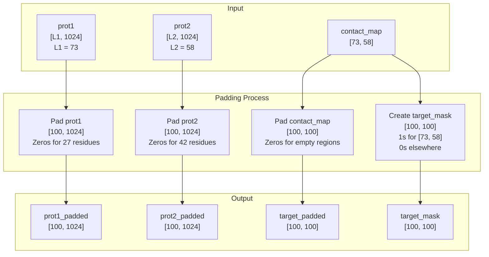
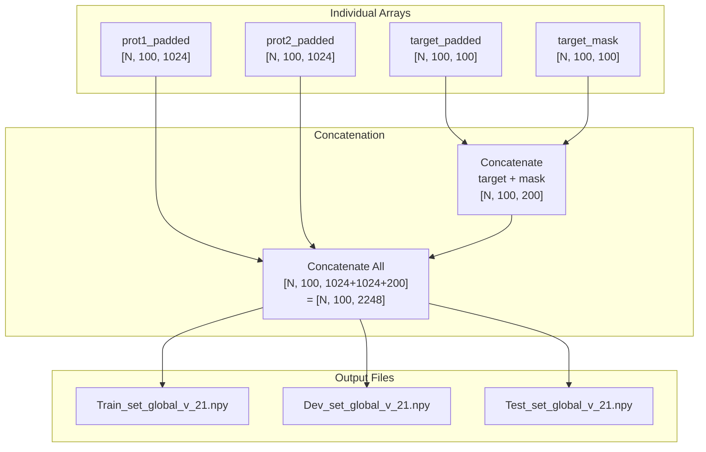

# Generating Embeddings

> **Relevant source files**
> * [ProtTrans.tar.gz](https://github.com/isblab/disobind/blob/5fffcf84/ProtTrans.tar.gz)
> * [dataset/create_input_embeddings.py](https://github.com/isblab/disobind/blob/5fffcf84/dataset/create_input_embeddings.py)
> * [dataset/utility.py](https://github.com/isblab/disobind/blob/5fffcf84/dataset/utility.py)

## Purpose and Scope

This page describes the process of generating protein embeddings and preparing input files for model training in the Disobind dataset creation pipeline. After creating merged binary complexes and establishing a non-redundant dataset (see [3.3](https://github.com/isblab/disobind/blob/5fffcf84/3.3)

), this step converts protein sequences into numerical representations suitable for neural network training.

For information about the overall dataset creation workflow, see [3](https://github.com/isblab/disobind/blob/5fffcf84/3)

 For model training using these embeddings, see [4.3](https://github.com/isblab/disobind/blob/5fffcf84/4.3)

---

## Overview

The embedding generation process transforms protein sequences into fixed-dimensional vector representations using pre-trained language models. The `Embeddings` class in `dataset/create_input_embeddings.py` orchestrates the complete workflow from sequence extraction to padded training arrays.

**Key Capabilities:**

* Supports multiple embedding types: ProtT5, ESM2, protBERT, ProSE, ProstT5 [dataset/utility.py L170-L181](https://github.com/isblab/disobind/blob/5fffcf84/dataset/utility.py#L170-L181)
* Global embeddings (full sequence) or local embeddings (fragment only) [dataset/create_input_embeddings.py L34-L36](https://github.com/isblab/disobind/blob/5fffcf84/dataset/create_input_embeddings.py#L34-L36)
* Automatic train/dev/test splitting (90%/5%/5%) [dataset/create_input_embeddings.py L40](https://github.com/isblab/disobind/blob/5fffcf84/dataset/create_input_embeddings.py#L40-L40)
* Padding and batching for efficient training [dataset/create_input_embeddings.py L371-L408](https://github.com/isblab/disobind/blob/5fffcf84/dataset/create_input_embeddings.py#L371-L408)
* Caching to avoid redundant computation [dataset/create_input_embeddings.py L255-L263](https://github.com/isblab/disobind/blob/5fffcf84/dataset/create_input_embeddings.py#L255-L263)

**Input:** CSV file with protein pair headers `{UniID1}:{start1}:{end1}--{UniID2}:{start2}:{end2}_{num}` [dataset/create_input_embeddings.py L163-L177](https://github.com/isblab/disobind/blob/5fffcf84/dataset/create_input_embeddings.py#L163-L177)

**Output:** NPY arrays containing embeddings and contact maps padded to `[N, L, C]` format [dataset/create_input_embeddings.py L536-L600](https://github.com/isblab/disobind/blob/5fffcf84/dataset/create_input_embeddings.py#L536-L600)

Sources: [dataset/create_input_embeddings.py L1-L712](https://github.com/isblab/disobind/blob/5fffcf84/dataset/create_input_embeddings.py#L1-L712)

 [dataset/utility.py L155-L183](https://github.com/isblab/disobind/blob/5fffcf84/dataset/utility.py#L155-L183)

---

## Embedding Generation Workflow



**Diagram: Complete Embedding Generation Pipeline**

The workflow proceeds through four main stages:

1. **Sequence Extraction:** Load protein pair headers and create FASTA files [dataset/create_input_embeddings.py L186-L235](https://github.com/isblab/disobind/blob/5fffcf84/dataset/create_input_embeddings.py#L186-L235)
2. **Embedding Generation:** Generate or load cached embeddings using pre-trained models [dataset/create_input_embeddings.py L239-L273](https://github.com/isblab/disobind/blob/5fffcf84/dataset/create_input_embeddings.py#L239-L273)
3. **Dataset Splitting:** Partition data into train/dev/test sets [dataset/create_input_embeddings.py L350-L367](https://github.com/isblab/disobind/blob/5fffcf84/dataset/create_input_embeddings.py#L350-L367)
4. **Padding and Formatting:** Create fixed-size arrays suitable for batch training [dataset/create_input_embeddings.py L371-L408](https://github.com/isblab/disobind/blob/5fffcf84/dataset/create_input_embeddings.py#L371-L408)

Sources: [dataset/create_input_embeddings.py L126-L160](https://github.com/isblab/disobind/blob/5fffcf84/dataset/create_input_embeddings.py#L126-L160)

 [dataset/create_input_embeddings.py L239-L273](https://github.com/isblab/disobind/blob/5fffcf84/dataset/create_input_embeddings.py#L239-L273)

---

## The Embeddings Class

The `Embeddings` class manages all aspects of embedding generation and dataset preparation.

### Constructor Parameters



**Diagram: Embeddings Class Configuration Structure**

| Parameter | Type | Default | Description |
| --- | --- | --- | --- |
| `scope` | str | "global" | "global" for full sequence, "local" for fragment only [dataset/create_input_embeddings.py L34](https://github.com/isblab/disobind/blob/5fffcf84/dataset/create_input_embeddings.py#L34-L34) |
| `embedding_type` | str | "T5" | Embedding model: "T5", "ESM2", "BERT", "ProSE", "ProstT5" [dataset/create_input_embeddings.py L36](https://github.com/isblab/disobind/blob/5fffcf84/dataset/create_input_embeddings.py#L36-L36) |
| `max_len` | int | 100 | Maximum protein sequence length [dataset/create_input_embeddings.py L42](https://github.com/isblab/disobind/blob/5fffcf84/dataset/create_input_embeddings.py#L42-L42) |
| `emb_size` | int | 1024 | Embedding dimension (1024 for T5, varies by model) [dataset/create_input_embeddings.py L38](https://github.com/isblab/disobind/blob/5fffcf84/dataset/create_input_embeddings.py#L38-L38) |
| `partitions` | list | [0.9, 0.05, 0.05] | Train/dev/test split ratios [dataset/create_input_embeddings.py L40](https://github.com/isblab/disobind/blob/5fffcf84/dataset/create_input_embeddings.py#L40-L40) |
| `seed` | int | 1 | Random seed for reproducibility [dataset/create_input_embeddings.py L27](https://github.com/isblab/disobind/blob/5fffcf84/dataset/create_input_embeddings.py#L27-L27) |

Sources: [dataset/create_input_embeddings.py L18-L104](https://github.com/isblab/disobind/blob/5fffcf84/dataset/create_input_embeddings.py#L18-L104)

### Key Methods

| Method | Purpose | Returns |
| --- | --- | --- |
| `forward()` | Execute complete pipeline [dataset/create_input_embeddings.py L126-L160](https://github.com/isblab/disobind/blob/5fffcf84/dataset/create_input_embeddings.py#L126-L160) | None |
| `read_from_csv()` | Load protein pair headers [dataset/create_input_embeddings.py L162-L184](https://github.com/isblab/disobind/blob/5fffcf84/dataset/create_input_embeddings.py#L162-L184) | None |
| `create_fasta_from_headers()` | Generate FASTA files [dataset/create_input_embeddings.py L186-L236](https://github.com/isblab/disobind/blob/5fffcf84/dataset/create_input_embeddings.py#L186-L236) | None |
| `initialize()` | Generate or load embeddings [dataset/create_input_embeddings.py L239-L273](https://github.com/isblab/disobind/blob/5fffcf84/dataset/create_input_embeddings.py#L239-L273) | Optional: embedding dicts |
| `get_global_embeddings()` | Extract embeddings for residue ranges [dataset/create_input_embeddings.py L276-L315](https://github.com/isblab/disobind/blob/5fffcf84/dataset/create_input_embeddings.py#L276-L315) | None |
| `get_local_embeddings()` | Load fragment embeddings [dataset/create_input_embeddings.py L318-L348](https://github.com/isblab/disobind/blob/5fffcf84/dataset/create_input_embeddings.py#L318-L348) | None |
| `split_dataset()` | Create train/dev/test splits [dataset/create_input_embeddings.py L350-L367](https://github.com/isblab/disobind/blob/5fffcf84/dataset/create_input_embeddings.py#L350-L367) | train_keys, dev_keys, test_keys |
| `apply_padding()` | Pad sequences to max_len [dataset/create_input_embeddings.py L371-L408](https://github.com/isblab/disobind/blob/5fffcf84/dataset/create_input_embeddings.py#L371-L408) | padded arrays |
| `create_input()` | Generate final training arrays [dataset/create_input_embeddings.py L412-L490](https://github.com/isblab/disobind/blob/5fffcf84/dataset/create_input_embeddings.py#L412-L490) | None |

Sources: [dataset/create_input_embeddings.py L126-L600](https://github.com/isblab/disobind/blob/5fffcf84/dataset/create_input_embeddings.py#L126-L600)

---

## Supported Embedding Types

The system supports multiple pre-trained protein language models through the `get_embeddings()` function in `dataset/utility.py`.



**Diagram: Supported Embedding Models**

### ProtT5 (Default)

**Implementation:** [dataset/utility.py L342-L372](https://github.com/isblab/disobind/blob/5fffcf84/dataset/utility.py#L342-L372)

ProtT5 is the default embedding type, trained on UniRef50. The system uses an external script for generation [dataset/utility.py L366-L370](https://github.com/isblab/disobind/blob/5fffcf84/dataset/utility.py#L366-L370)

:

```markdown
# Calls ProtTrans/Embedding/prott5_embedder.pyT5_dir = "../ProtTrans/Embedding/"subprocess.call(["python", "prott5_embedder.py",                  "--input", input_file,                  "--output", output_file])
```

**Output:** HDF5 file with keys as FASTA headers and values as `[L, 1024]` arrays stored in `float16` format [dataset/utility.py L366-L370](https://github.com/isblab/disobind/blob/5fffcf84/dataset/utility.py#L366-L370)

### ESM2 Models

**Implementation:** [dataset/utility.py L250-L304](https://github.com/isblab/disobind/blob/5fffcf84/dataset/utility.py#L250-L304)

ESM2 provides multiple model sizes with different embedding dimensions [dataset/utility.py L234-L243](https://github.com/isblab/disobind/blob/5fffcf84/dataset/utility.py#L234-L243)

:

| Model | Parameters | Embedding Dim | Layers |
| --- | --- | --- | --- |
| ESM2-35M | 35M | 480 | 12 |
| ESM2-150M | 150M | 640 | 30 |
| ESM2-650M | 650M | 1280 | 33 |
| ESM2-3B | 3B | 2560 | 36 |
| ESM2-15B | 15B | 5120 | 48 |

ESM2 embeddings are generated directly using the `esm` library [dataset/utility.py L280-L285](https://github.com/isblab/disobind/blob/5fffcf84/dataset/utility.py#L280-L285)

### protBERT

**Implementation:** [dataset/utility.py L184-L227](https://github.com/isblab/disobind/blob/5fffcf84/dataset/utility.py#L184-L227)

Uses the Rostlab protBERT model via Hugging Face transformers [dataset/utility.py L201-L202](https://github.com/isblab/disobind/blob/5fffcf84/dataset/utility.py#L201-L202)

:

```
tokenizer = BertTokenizer.from_pretrained("Rostlab/prot_bert", do_lower_case=False)model = BertModel.from_pretrained("Rostlab/prot_bert")output = model(**encoded_input)token_representations = np.array(output["last_hidden_state"][:,1:-1,:].squeeze(0).detach(), dtype=np.float16)
```

Sources: [dataset/utility.py L155-L403](https://github.com/isblab/disobind/blob/5fffcf84/dataset/utility.py#L155-L403)

---

## Global vs Local Embeddings

The system supports two embedding scopes that affect how sequences are processed [dataset/create_input_embeddings.py L34](https://github.com/isblab/disobind/blob/5fffcf84/dataset/create_input_embeddings.py#L34-L34)



**Diagram: Global vs Local Embedding Scope**

### Global Embeddings (Default)

**Implementation:** [dataset/create_input_embeddings.py L276-L315](https://github.com/isblab/disobind/blob/5fffcf84/dataset/create_input_embeddings.py#L276-L315)

* Generates embeddings for **complete UniProt sequences** [dataset/create_input_embeddings.py L217-L224](https://github.com/isblab/disobind/blob/5fffcf84/dataset/create_input_embeddings.py#L217-L224)
* Slices out embeddings for specified residue ranges [dataset/create_input_embeddings.py L302-L306](https://github.com/isblab/disobind/blob/5fffcf84/dataset/create_input_embeddings.py#L302-L306)
* More context-aware but requires more computation
* FASTA headers use UniProt IDs: `>Q9Y6K9` [dataset/create_input_embeddings.py L219](https://github.com/isblab/disobind/blob/5fffcf84/dataset/create_input_embeddings.py#L219-L219)

**Extraction Process:**

```
emb1 = np.array(hf[uni_id1], dtype=np.float16)self.p1_frag_emb[head] = emb1[int(start1)-1:int(end1)]
```

### Local Embeddings

**Implementation:** [dataset/create_input_embeddings.py L318-L348](https://github.com/isblab/disobind/blob/5fffcf84/dataset/create_input_embeddings.py#L318-L348)

* Generates embeddings only for **specified fragments** [dataset/create_input_embeddings.py L228-L233](https://github.com/isblab/disobind/blob/5fffcf84/dataset/create_input_embeddings.py#L228-L233)
* Faster and more memory-efficient
* Less sequence context
* FASTA headers include ranges: `>Q9Y6K9:50:150` [dataset/create_input_embeddings.py L229](https://github.com/isblab/disobind/blob/5fffcf84/dataset/create_input_embeddings.py#L229-L229)

**Direct Loading:**

```
self.p1_frag_emb[head] = np.array(hf1[head1], dtype=np.float16)
```

Sources: [dataset/create_input_embeddings.py L186-L348](https://github.com/isblab/disobind/blob/5fffcf84/dataset/create_input_embeddings.py#L186-L348)

---

## FASTA File Creation

FASTA files serve as input to embedding generation models. The format differs based on scope [dataset/create_input_embeddings.py L186-L236](https://github.com/isblab/disobind/blob/5fffcf84/dataset/create_input_embeddings.py#L186-L236)

### Global Scope FASTA

```
>Q9Y6K9
MAEGEITTFTALTEKFNLPPGNYKKPKLLYCSNGGHFLRILPDGTVDGTRDRSDQHIQLQLSAESVGEVYIKSTETGQYLAMDTSGLLYGSQTPSEECLFLERLEENHYNTYTSKKHAEKNWFVGLKKNGSCKRGPRTHYGQKAILFLPLPV...
```

Each entry contains only the UniProt ID and full sequence. The system tracks which ranges to extract internally.

### Local Scope FASTA

```
>Q9Y6K9:50:150
NYKKPKLLYCSNGGHFLRILPDGTVDGTRDRSDQHIQLQLSAESVGEVYIKSTETGQYLAMDTSGLLYGSQTPNEECLFLERLEENHYNTYTSKK
```

Each entry includes the residue range in the header and only the fragment sequence.

Sources: [dataset/create_input_embeddings.py L186-L236](https://github.com/isblab/disobind/blob/5fffcf84/dataset/create_input_embeddings.py#L186-L236)

---

## Dataset Splitting and Padding

### Train/Dev/Test Split

The dataset is randomly partitioned into three sets with fixed ratios [dataset/create_input_embeddings.py L40](https://github.com/isblab/disobind/blob/5fffcf84/dataset/create_input_embeddings.py#L40-L40)

:

| Set | Percentage | Purpose |
| --- | --- | --- |
| Train | 90% | Model training |
| Dev | 5% | Hyperparameter tuning |
| Test | 5% | Final evaluation |

The split is performed using `split_dataset()` from `src/dataset_loaders.py` [dataset/create_input_embeddings.py L359](https://github.com/isblab/disobind/blob/5fffcf84/dataset/create_input_embeddings.py#L359-L359)

### Padding to Fixed Length

All sequences are padded to `max_len=100` to enable batch processing [dataset/create_input_embeddings.py L42](https://github.com/isblab/disobind/blob/5fffcf84/dataset/create_input_embeddings.py#L42-L42)



**Diagram: Padding Process for Fixed-Size Arrays**

**Implementation:** [dataset/create_input_embeddings.py L371-L408](https://github.com/isblab/disobind/blob/5fffcf84/dataset/create_input_embeddings.py#L371-L408)

The `target_mask` is critical for training as it indicates which positions contain actual data versus padding [dataset/create_input_embeddings.py L397-L400](https://github.com/isblab/disobind/blob/5fffcf84/dataset/create_input_embeddings.py#L397-L400)

Sources: [dataset/create_input_embeddings.py L371-L408](https://github.com/isblab/disobind/blob/5fffcf84/dataset/create_input_embeddings.py#L371-L408)

---

## Final Array Creation

The final step concatenates all components into a single array for efficient loading during training [dataset/create_input_embeddings.py L536-L600](https://github.com/isblab/disobind/blob/5fffcf84/dataset/create_input_embeddings.py#L536-L600)

### Array Structure



**Diagram: Final Array Structure and Output Files**

**Dimensions Breakdown:**

* `N`: Number of protein pairs in the set
* `100`: Padded sequence length (`max_len`)
* `1024`: Embedding dimension for prot1
* `1024`: Embedding dimension for prot2
* `100`: Contact map dimension (padded)
* `100`: Target mask dimension (padded)
* **Total:** `[N, 100, 2248]` [dataset/create_input_embeddings.py L590-L591](https://github.com/isblab/disobind/blob/5fffcf84/dataset/create_input_embeddings.py#L590-L591)

Sources: [dataset/create_input_embeddings.py L412-L600](https://github.com/isblab/disobind/blob/5fffcf84/dataset/create_input_embeddings.py#L412-L600)

---

## Logging and Monitoring

### Summary Statistics

The system tracks comprehensive statistics during embedding generation [dataset/create_input_embeddings.py L660-L706](https://github.com/isblab/disobind/blob/5fffcf84/dataset/create_input_embeddings.py#L660-L706)

**Output File:** `Summary_res_emb_{scope}_{version}.txt` [dataset/create_input_embeddings.py L666](https://github.com/isblab/disobind/blob/5fffcf84/dataset/create_input_embeddings.py#L666-L666)

### Distribution Plots

The system automatically generates histograms for data analysis [dataset/create_input_embeddings.py L492-L533](https://github.com/isblab/disobind/blob/5fffcf84/dataset/create_input_embeddings.py#L492-L533)

 Three plots are created for each dataset: Contacts Distribution, Prot1 Lengths, and Prot2 Lengths.

### Fraction of Positives

For random baseline predictions, the system calculates the fraction of positive contacts across training data [dataset/create_input_embeddings.py L602-L658](https://github.com/isblab/disobind/blob/5fffcf84/dataset/create_input_embeddings.py#L602-L658)

**Output File:** `fraction_positives.json` [dataset/create_input_embeddings.py L656](https://github.com/isblab/disobind/blob/5fffcf84/dataset/create_input_embeddings.py#L656-L656)

Sources: [dataset/create_input_embeddings.py L492-L706](https://github.com/isblab/disobind/blob/5fffcf84/dataset/create_input_embeddings.py#L492-L706)

---

## Memory and Performance Considerations

### Caching Strategy

The system implements intelligent caching to avoid redundant computation [dataset/create_input_embeddings.py L255-L263](https://github.com/isblab/disobind/blob/5fffcf84/dataset/create_input_embeddings.py#L255-L263)

 If embeddings already exist, the system loads them directly from HDF5 files, saving significant computation time.

### Memory Management

The pipeline uses several strategies to minimize memory usage:

1. **Float16 Precision:** Embeddings stored as `np.float16` [dataset/utility.py L216](https://github.com/isblab/disobind/blob/5fffcf84/dataset/utility.py#L216-L216)
2. **Progressive Deletion:** Arrays deleted after use to free RAM [dataset/create_input_embeddings.py L482-L485](https://github.com/isblab/disobind/blob/5fffcf84/dataset/create_input_embeddings.py#L482-L485)
3. **HDF5 Streaming:** Contact maps loaded on-demand [dataset/create_input_embeddings.py L440-L441](https://github.com/isblab/disobind/blob/5fffcf84/dataset/create_input_embeddings.py#L440-L441)

Sources: [dataset/create_input_embeddings.py L239-L273](https://github.com/isblab/disobind/blob/5fffcf84/dataset/create_input_embeddings.py#L239-L273)

 [dataset/utility.py L155-L403](https://github.com/isblab/disobind/blob/5fffcf84/dataset/utility.py#L155-L403)