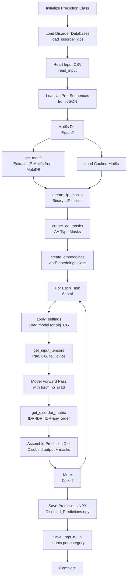
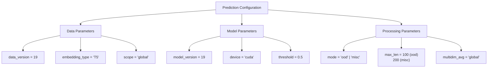
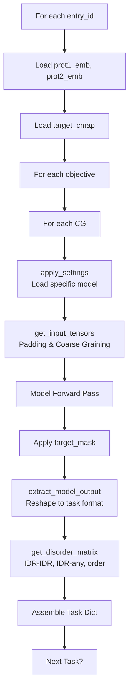
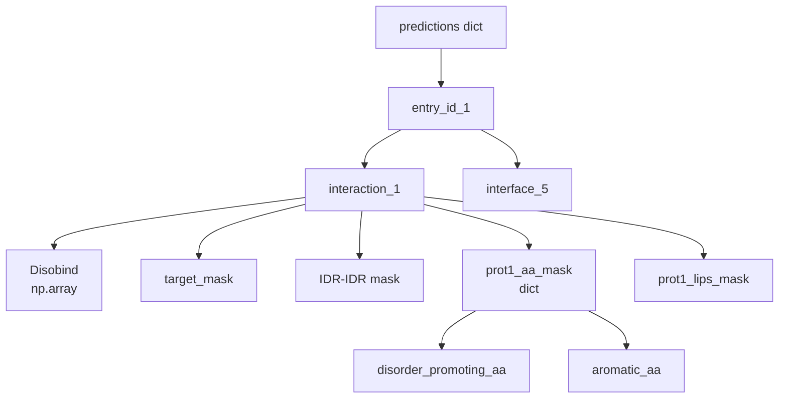

# Generating OOD Predictions

> **Relevant source files**
> * [analysis/get_af_prediction.py](https://github.com/isblab/disobind/blob/5fffcf84/analysis/get_af_prediction.py)
> * [analysis/get_disobind_predictions.py](https://github.com/isblab/disobind/blob/5fffcf84/analysis/get_disobind_predictions.py)
> * [analysis/params.py](https://github.com/isblab/disobind/blob/5fffcf84/analysis/params.py)

## Purpose and Scope

This page describes how to use the `Prediction` class to generate Disobind predictions on out-of-distribution (OOD) datasets. The `Prediction` class generates predictions across all tasks (interaction and interface) and coarse-graining levels (1, 5, 10), while simultaneously creating binary masks for disorder-specific, amino acid type-specific, and LIP-specific analysis.

For information about analyzing these predictions after generation, see [JudgementDay Analysis Pipeline](/isblab/disobind/5.1-judgementday-analysis-pipeline). For processing AlphaFold predictions to compare with Disobind, see [Processing AlphaFold Predictions](/isblab/disobind/5.3-processing-alphafold-predictions).

**Sources:** [analysis/get_disobind_predictions.py L1-L9](https://github.com/isblab/disobind/blob/5fffcf84/analysis/get_disobind_predictions.py#L1-L9)

## Overview

The `Prediction` class in [analysis/get_disobind_predictions.py L38-L132](https://github.com/isblab/disobind/blob/5fffcf84/analysis/get_disobind_predictions.py#L38-L132)

 serves as the prediction engine for evaluating Disobind models on OOD test sets. It performs three main functions:

1. **Model Inference**: Runs trained Disobind models across all 6 task configurations (Interaction/Interface at CG 1, 5, 10).
2. **Mask Generation**: Creates binary masks for specialized analysis including disorder regions, amino acid types, and Linear Interacting Peptides (LIPs).
3. **Output Packaging**: Assembles predictions and masks into a structured dictionary format saved as a `.npy` file.

The class supports two operational modes:

* **`ood` mode**: For the standard OOD test set evaluation [analysis/get_disobind_predictions.py L85-L94](https://github.com/isblab/disobind/blob/5fffcf84/analysis/get_disobind_predictions.py#L85-L94)
* **`misc` mode**: For case-specific datasets with specialized padding requirements (e.g., max length 200) [analysis/get_disobind_predictions.py L96-L105](https://github.com/isblab/disobind/blob/5fffcf84/analysis/get_disobind_predictions.py#L96-L105)

**Sources:** [analysis/get_disobind_predictions.py L38-L132](https://github.com/isblab/disobind/blob/5fffcf84/analysis/get_disobind_predictions.py#L38-L132)

## Workflow Diagram



**Sources:** [analysis/get_disobind_predictions.py L134-L179](https://github.com/isblab/disobind/blob/5fffcf84/analysis/get_disobind_predictions.py#L134-L179)

 [analysis/get_disobind_predictions.py L810-L896](https://github.com/isblab/disobind/blob/5fffcf84/analysis/get_disobind_predictions.py#L810-L896)

## Input Preparation

### Input File Format

The `Prediction` class accepts input in two formats specified by `self.input_type` [analysis/get_disobind_predictions.py L181-L209](https://github.com/isblab/disobind/blob/5fffcf84/analysis/get_disobind_predictions.py#L181-L209)

:

| Format | Description | Use Case |
| --- | --- | --- |
| **CSV** | Comma-separated entry IDs | Multiple binary complexes (recommended) |
| **FASTA** | FASTA format with headers | Single binary complex |

**CSV Format [analysis/get_disobind_predictions.py L211-L231](https://github.com/isblab/disobind/blob/5fffcf84/analysis/get_disobind_predictions.py#L211-L231)

:**
`UniID1:start1:end1--UniID2:start2:end2_num,UniID1:start1:end1--UniID2:start2:end2_num,...`

**Sources:** [analysis/get_disobind_predictions.py L181-L250](https://github.com/isblab/disobind/blob/5fffcf84/analysis/get_disobind_predictions.py#L181-L250)

### Required Input Files

The class requires several pre-existing files depending on the mode:

**For `ood` mode [analysis/get_disobind_predictions.py L85-L94](https://github.com/isblab/disobind/blob/5fffcf84/analysis/get_disobind_predictions.py#L85-L94)

:**

* `prot_1-2_test_v_19.csv`: Input file containing prot1/2 headers.
* `Uniprot_seq.json`: UniProt sequences for all IDs.
* `Target_bcmap_test_v_19.h5`: Target contact maps.

**For `misc` mode [analysis/get_disobind_predictions.py L96-L105](https://github.com/isblab/disobind/blob/5fffcf84/analysis/get_disobind_predictions.py#L96-L105)

:**

* `misc_test_input.csv`: Input file for misc headers.
* `Uniprot_seq_misc.json`: Sequences for misc entries.
* `misc_test_target.h5`: Target maps for misc entries.

**Sources:** [analysis/get_disobind_predictions.py L85-L107](https://github.com/isblab/disobind/blob/5fffcf84/analysis/get_disobind_predictions.py#L85-L107)

## Prediction Configuration

### Key Parameters

The `Prediction` class constructor defines critical configuration parameters:



**Sources:** [analysis/get_disobind_predictions.py L39-L65](https://github.com/isblab/disobind/blob/5fffcf84/analysis/get_disobind_predictions.py#L39-L65)

### Model Parameter Files

Model parameters are loaded via the `parameter_files()` function from [analysis/params.py L6-L11](https://github.com/isblab/disobind/blob/5fffcf84/analysis/params.py#L6-L11)

 The function returns specific checkpoints and hyperparameter strings for each task and coarse-graining (CG) level.

| Task | CG Level | Model Version | File Prefix |
| --- | --- | --- | --- |
| Interaction | 1 | 19 | `Epsilon_3_6.2` |
| Interaction | 5 | 19 | `Epsilon_3_6.1` |
| Interaction | 10 | 19 | `Epsilon_3_6` |
| Interface | 1 | 19 | `Epsilon_3_16` |
| Interface | 5 | 19 | `Epsilon_3_16.1` |
| Interface | 10 | 19 | `Epsilon_3_16.2` |

**Sources:** [analysis/params.py L14-L59](https://github.com/isblab/disobind/blob/5fffcf84/analysis/params.py#L14-L59)

## Running Predictions

### Execution

To generate OOD predictions, run the script from the `analysis` directory:

```
python get_disobind_predictions.py
```

The script initializes the `Prediction` class and calls the `forward()` method [analysis/get_disobind_predictions.py L134-L179](https://github.com/isblab/disobind/blob/5fffcf84/analysis/get_disobind_predictions.py#L134-L179)

### Per-Entry Processing

For each entry in the OOD set, the `predict()` method [analysis/get_disobind_predictions.py L810-L896](https://github.com/isblab/disobind/blob/5fffcf84/analysis/get_disobind_predictions.py#L810-L896)

 executes a nested loop over objectives (Interaction, Interface) and CG levels (1, 5, 10).



**Sources:** [analysis/get_disobind_predictions.py L810-L895](https://github.com/isblab/disobind/blob/5fffcf84/analysis/get_disobind_predictions.py#L810-L895)

## Output Structure

### Prediction Dictionary Format

The `Prediction` class generates a nested dictionary saved as `Disobind_Predictions.npy` [analysis/get_disobind_predictions.py L175](https://github.com/isblab/disobind/blob/5fffcf84/analysis/get_disobind_predictions.py#L175-L175)

:



**Sources:** [analysis/get_disobind_predictions.py L875-L886](https://github.com/isblab/disobind/blob/5fffcf84/analysis/get_disobind_predictions.py#L875-L886)

## Binary Mask Generation

### Disorder Masks

The `get_disorder_matrix()` method [analysis/get_disobind_predictions.py L454-L591](https://github.com/isblab/disobind/blob/5fffcf84/analysis/get_disobind_predictions.py#L454-L591)

 creates three types of disorder masks:

1. **IDR-IDR**: Residue pairs where both residues are disordered.
2. **IDR-any**: Residue pairs where at least one residue is disordered.
3. **order**: Residue pairs where both residues are ordered.

These are generated by querying `find_disorder_regions` [analysis/get_disobind_predictions.py L437-L444](https://github.com/isblab/disobind/blob/5fffcf84/analysis/get_disobind_predictions.py#L437-L444)

 and then applying `MaxPool` if the CG level is greater than 1 [analysis/get_disobind_predictions.py L532-L555](https://github.com/isblab/disobind/blob/5fffcf84/analysis/get_disobind_predictions.py#L532-L555)

**Sources:** [analysis/get_disobind_predictions.py L454-L591](https://github.com/isblab/disobind/blob/5fffcf84/analysis/get_disobind_predictions.py#L454-L591)

### LIP and Amino Acid Masks

* **LIP Masks**: Extracted from MobiDB annotations using `get_motifs()` [analysis/get_disobind_predictions.py L594-L651](https://github.com/isblab/disobind/blob/5fffcf84/analysis/get_disobind_predictions.py#L594-L651)  and `create_lip_masks()` [analysis/get_disobind_predictions.py L653-L685](https://github.com/isblab/disobind/blob/5fffcf84/analysis/get_disobind_predictions.py#L653-L685)
* **AA Type Masks**: Categorized in `create_aa_masks()` [analysis/get_disobind_predictions.py L687-L807](https://github.com/isblab/disobind/blob/5fffcf84/analysis/get_disobind_predictions.py#L687-L807)  into: * **Disorder-promoting**: R, P, Q, E, G, S, A, K [analysis/get_disobind_predictions.py L722-L723](https://github.com/isblab/disobind/blob/5fffcf84/analysis/get_disobind_predictions.py#L722-L723) * **Aromatic**: F, Y, W [analysis/get_disobind_predictions.py L724-L725](https://github.com/isblab/disobind/blob/5fffcf84/analysis/get_disobind_predictions.py#L724-L725) * **Hydrophobic**: A, V, L, I, P, M, F, W [analysis/get_disobind_predictions.py L726-L727](https://github.com/isblab/disobind/blob/5fffcf84/analysis/get_disobind_predictions.py#L726-L727) * **Polar**: S, T, C, N, Q, Y, D, E, K, R, H [analysis/get_disobind_predictions.py L728-L729](https://github.com/isblab/disobind/blob/5fffcf84/analysis/get_disobind_predictions.py#L728-L729)

**Sources:** [analysis/get_disobind_predictions.py L594-L807](https://github.com/isblab/disobind/blob/5fffcf84/analysis/get_disobind_predictions.py#L594-L807)

## Model Loading and Settings

### apply_settings()

The `apply_settings()` method [analysis/get_disobind_predictions.py L306-L344](https://github.com/isblab/disobind/blob/5fffcf84/analysis/get_disobind_predictions.py#L306-L344)

 configures the model based on the prediction task:

* Sets `objective0` to `"interaction"` or `"interface"`.
* Sets `objective1` to the CG level (1, 5, or 10).
* Sets `objective2` (binning) to `True` if CG > 1.
* Loads the model weights using `get_model` and `load_state_dict` [analysis/get_disobind_predictions.py L284-L304](https://github.com/isblab/disobind/blob/5fffcf84/analysis/get_disobind_predictions.py#L284-L304)

**Sources:** [analysis/get_disobind_predictions.py L284-L344](https://github.com/isblab/disobind/blob/5fffcf84/analysis/get_disobind_predictions.py#L284-L344)

### extract_model_output()

After inference, `extract_model_output()` [analysis/get_disobind_predictions.py L898-L924](https://github.com/isblab/disobind/blob/5fffcf84/analysis/get_disobind_predictions.py#L898-L924)

 reshapes the raw model output:

* For **interaction** tasks: Reshapes to `(max_len/CG, max_len/CG)`.
* For **interface** tasks: Reshapes to `(2 * max_len/CG, 1)`.

**Sources:** [analysis/get_disobind_predictions.py L898-L924](https://github.com/isblab/disobind/blob/5fffcf84/analysis/get_disobind_predictions.py#L898-L924)