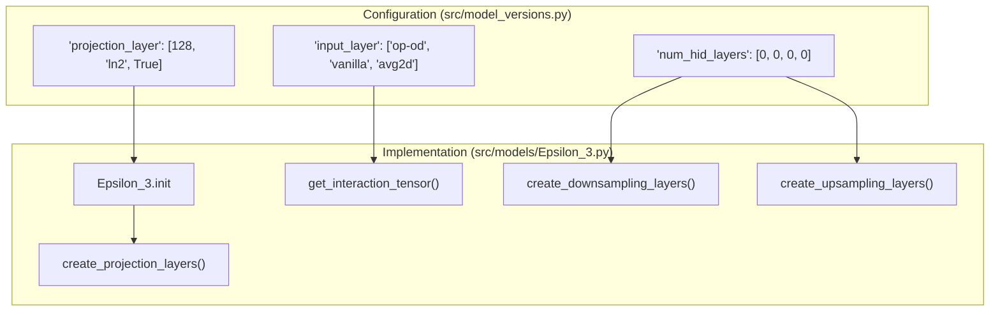

# Glossary

> **Relevant source files**
> * [README.md](https://github.com/isblab/disobind/blob/5fffcf84/README.md?plain=1)
> * [analysis/analysis.py](https://github.com/isblab/disobind/blob/5fffcf84/analysis/analysis.py)
> * [analysis/get_af_prediction.py](https://github.com/isblab/disobind/blob/5fffcf84/analysis/get_af_prediction.py)
> * [analysis/get_disobind_predictions.py](https://github.com/isblab/disobind/blob/5fffcf84/analysis/get_disobind_predictions.py)
> * [analysis/get_other_method_preds.py](https://github.com/isblab/disobind/blob/5fffcf84/analysis/get_other_method_preds.py)
> * [analysis/params.py](https://github.com/isblab/disobind/blob/5fffcf84/analysis/params.py)
> * [dataset/utility.py](https://github.com/isblab/disobind/blob/5fffcf84/dataset/utility.py)
> * [example/test.csv](https://github.com/isblab/disobind/blob/5fffcf84/example/test.csv)
> * [example/test.fasta](https://github.com/isblab/disobind/blob/5fffcf84/example/test.fasta)
> * [run_disobind.py](https://github.com/isblab/disobind/blob/5fffcf84/run_disobind.py)
> * [src/model_versions.py](https://github.com/isblab/disobind/blob/5fffcf84/src/model_versions.py)
> * [src/models/Epsilon_3.py](https://github.com/isblab/disobind/blob/5fffcf84/src/models/Epsilon_3.py)
> * [src/models/get_model.py](https://github.com/isblab/disobind/blob/5fffcf84/src/models/get_model.py)

This page provides definitions for domain-specific terminology, technical jargon, and architectural concepts used within the Disobind codebase. It serves as a reference for understanding the relationship between biological concepts (like IDRs and contact maps) and their implementation in the code.

## Core Concepts

### 1. Intrinsically Disordered Region (IDR)

A protein region that lacks a stable three-dimensional structure under physiological conditions. In Disobind, Protein 1 in a binary complex is required to be an IDR [run_disobind.py L5](https://github.com/isblab/disobind/blob/5fffcf84/run_disobind.py#L5-L5)

 The system uses specialized masks to analyze these regions specifically during evaluation [analysis/analysis.py L5-L8](https://github.com/isblab/disobind/blob/5fffcf84/analysis/analysis.py#L5-L8)

### 2. Contact Map (Cmap)

A 2D matrix representing interactions between two proteins. For a pair of proteins with lengths $L_1$ and $L_2$, the contact map is an $L_1 \times L_2$ binary matrix where an entry is 1 if the distance between $C\alpha$ atoms is below a threshold (default 8Å) and 0 otherwise [dataset/utility.py L108-L124](https://github.com/isblab/disobind/blob/5fffcf84/dataset/utility.py#L108-L124)

* **Code Entity:** `get_contact_map` function in `dataset/utility.py`.
* **Implementation:** Calculated using the Euclidean norm of coordinate tensors [dataset/utility.py L121-L122](https://github.com/isblab/disobind/blob/5fffcf84/dataset/utility.py#L121-L122)

### 3. Coarse-Graining (CG)

A dimensionality reduction technique where residues are grouped into "beads." Disobind supports CG resolutions of 1 (residue-level), 5, and 10 [run_disobind.py L93](https://github.com/isblab/disobind/blob/5fffcf84/run_disobind.py#L93-L93)

* **Mechanism:** During training and evaluation, target contact maps are downsampled using `MaxPool2d` [analysis/analysis.py L150-L160](https://github.com/isblab/disobind/blob/5fffcf84/analysis/analysis.py#L150-L160)
* **Interface Aggregation:** For interface tasks, 2D maps are reduced to 1D vectors representing whether a residue (or bead) interacts with *any* residue in the partner protein [analysis/analysis.py L164-L176](https://github.com/isblab/disobind/blob/5fffcf84/analysis/analysis.py#L164-L176)

### 4. Interaction Tensor

The intermediate 3D representation generated by the model before the final prediction. It is created by combining the projected embeddings of two proteins.

* **Code Entity:** `get_interaction_tensor` method in `src/models/Epsilon_3.py` [src/models/Epsilon_3.py L136](https://github.com/isblab/disobind/blob/5fffcf84/src/models/Epsilon_3.py#L136-L136)
* **Operations:** Supports operations like "op-od" (outer product/outer difference) to capture spatial relationships [src/model_versions.py L61-L67](https://github.com/isblab/disobind/blob/5fffcf84/src/model_versions.py#L61-L67)

---

## Architectural Mapping

The following diagram bridges the biological problem space to the specific Python classes and methods that handle the data flow.

### Data Flow: From Sequence to Prediction

This diagram maps the natural language steps of "Predicting Interactions" to the internal class structures.

**Sources:** [run_disobind.py L44-L93](https://github.com/isblab/disobind/blob/5fffcf84/run_disobind.py#L44-L93)

 [src/models/Epsilon_3.py L15-L131](https://github.com/isblab/disobind/blob/5fffcf84/src/models/Epsilon_3.py#L15-L131)

 [analysis/get_disobind_predictions.py L38-L76](https://github.com/isblab/disobind/blob/5fffcf84/analysis/get_disobind_predictions.py#L38-L76)

---

## Evaluation Terminology

### 5. Out-of-Distribution (OOD)

Refers to the test set containing protein complexes with low sequence identity to the training set, used to evaluate the model's generalization capability [analysis/analysis.py L48-L54](https://github.com/isblab/disobind/blob/5fffcf84/analysis/analysis.py#L48-L54)

* **Code Entity:** `JudgementDay` class in `analysis/analysis.py` [analysis/analysis.py L25-L28](https://github.com/isblab/disobind/blob/5fffcf84/analysis/analysis.py#L25-L28)

### 6. PAE & pLDDT (AlphaFold Integration)

Confidence metrics from AlphaFold2/3 used to filter or enhance Disobind predictions.

* **pLDDT:** Per-residue confidence score. Disobind uses a default threshold of 70 [run_disobind.py L73-L74](https://github.com/isblab/disobind/blob/5fffcf84/run_disobind.py#L73-L74)
* **PAE (Predicted Aligned Error):** Inter-residue distance error. A default threshold of 5Å is used [run_disobind.py L75-L76](https://github.com/isblab/disobind/blob/5fffcf84/run_disobind.py#L75-L76)
* **Code Entity:** `AF2MPredictions` class in `analysis/get_af_prediction.py` [analysis/get_af_prediction.py L28-L76](https://github.com/isblab/disobind/blob/5fffcf84/analysis/get_af_prediction.py#L28-L76)

---

## Technical Glossary Table

| Term | Definition | Code Reference |
| --- | --- | --- |
| **Objective** | The specific task: `interaction` (contact map) or `interface` (residue list). | `self.objective` in [src/model_versions.py L26-L41](https://github.com/isblab/disobind/blob/5fffcf84/src/model_versions.py#L26-L41) |
| **Projection Block** | The initial layers that project high-dim embeddings (1024) to a lower latent space (e.g., 128). | `projection_block` in [src/models/Epsilon_3.py L133](https://github.com/isblab/disobind/blob/5fffcf84/src/models/Epsilon_3.py#L133-L133) |
| **Bead** | A single unit in a coarse-grained representation (e.g., 5 residues = 1 bead). | `self.required_cg` in [run_disobind.py L58-L59](https://github.com/isblab/disobind/blob/5fffcf84/run_disobind.py#L58-L59) |
| **LIPs** | Linear Interaction Peptides; short segments within IDRs that mediate binding. | `self.lips_masks` in [analysis/get_disobind_predictions.py L70](https://github.com/isblab/disobind/blob/5fffcf84/analysis/get_disobind_predictions.py#L70-L70) |
| **Misc Dataset** | Specialized test sets like PEDS ensembles or IDPPI datasets. | `self.mode == "misc"` in [analysis/analysis.py L56-L63](https://github.com/isblab/disobind/blob/5fffcf84/analysis/analysis.py#L56-L63) |

---

## Implementation Diagram: Model Internal Logic

This diagram associates specific model parameters defined in YAML/OmegaConf with the PyTorch layers in the `Epsilon_3` architecture.

**Sources:** [src/model_versions.py L51-L88](https://github.com/isblab/disobind/blob/5fffcf84/src/model_versions.py#L51-L88)

 [src/models/Epsilon_3.py L15-L129](https://github.com/isblab/disobind/blob/5fffcf84/src/models/Epsilon_3.py#L15-L129)

 [analysis/params.py L6-L60](https://github.com/isblab/disobind/blob/5fffcf84/analysis/params.py#L6-L60)