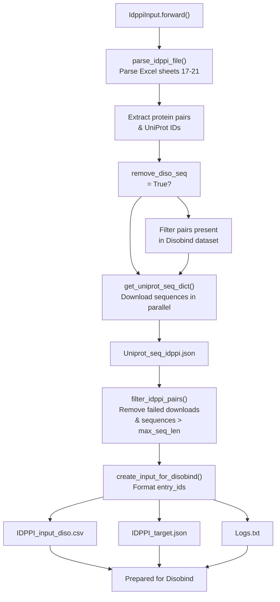
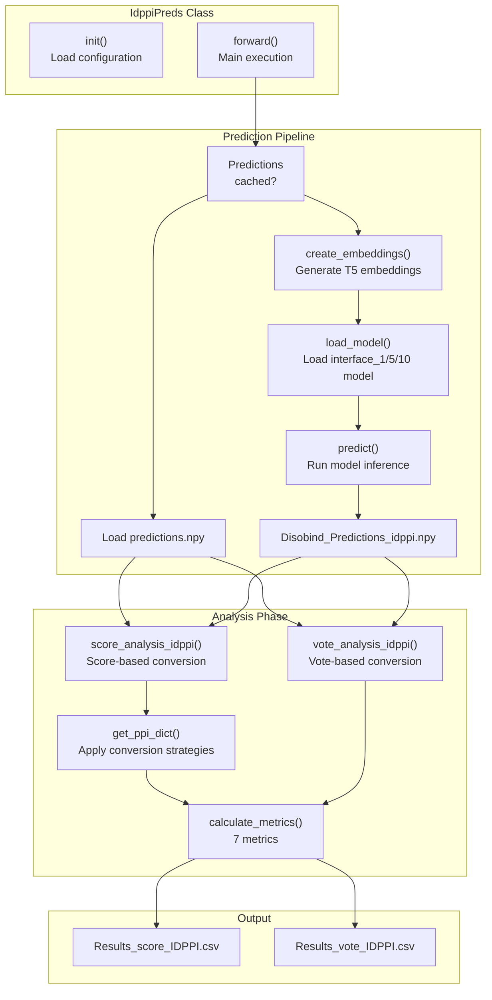
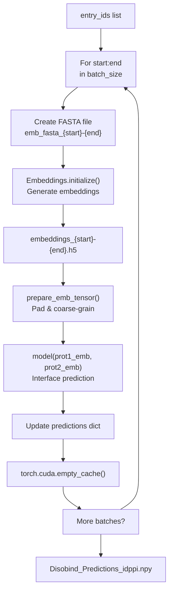
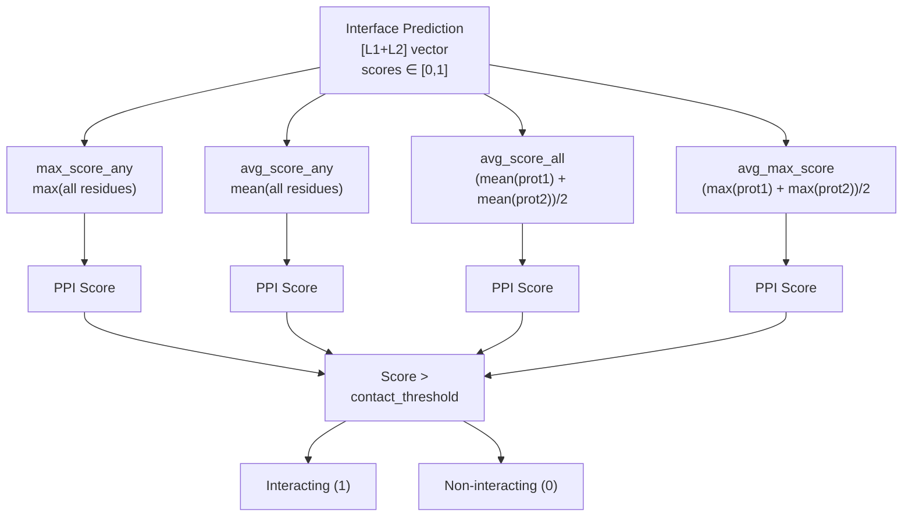
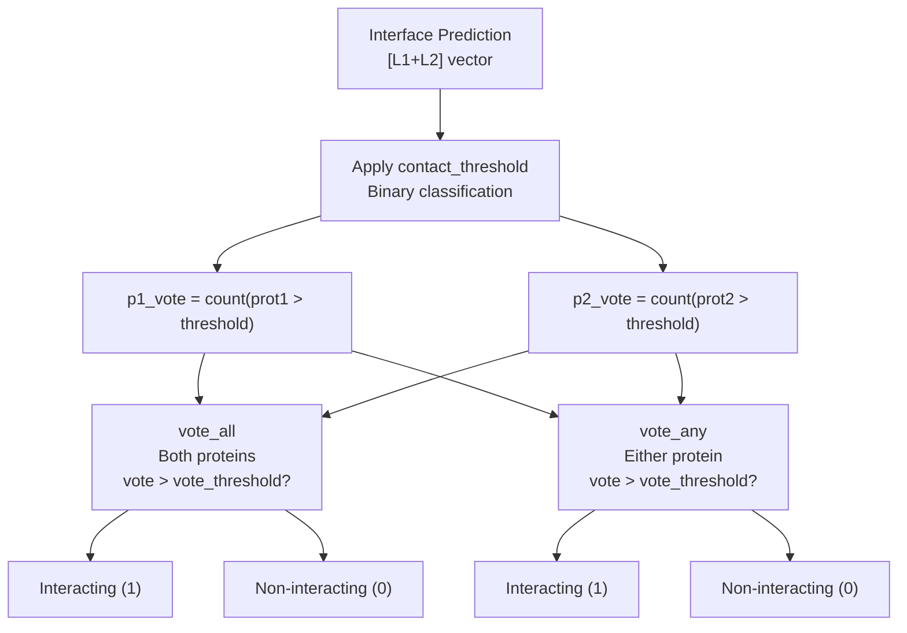
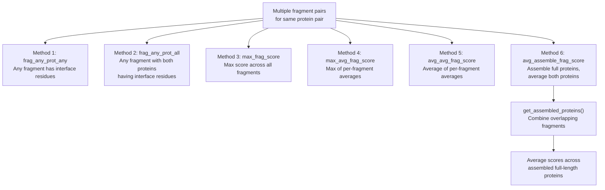
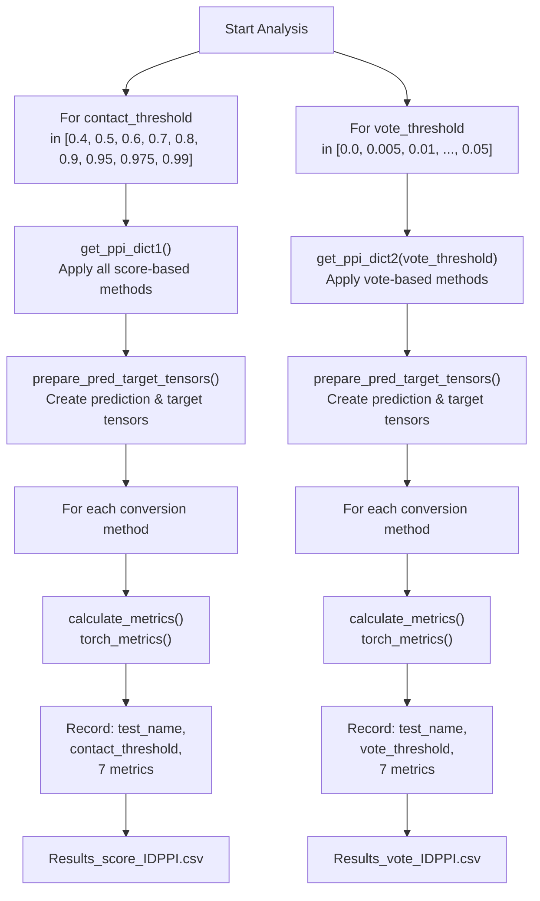

# IDPPI Dataset Evaluation

> **Relevant source files**
> * [analysis/idppi_preds.py](https://github.com/isblab/disobind/blob/5fffcf84/analysis/idppi_preds.py)
> * [analysis/idppi_preds2.py](https://github.com/isblab/disobind/blob/5fffcf84/analysis/idppi_preds2.py)
> * [dataset/prep_idppi_input2.py](https://github.com/isblab/disobind/blob/5fffcf84/dataset/prep_idppi_input2.py)

## Purpose and Scope

This page describes the evaluation of Disobind on the IDPPI (Intrinsically Disordered Protein-Protein Interaction) dataset, a benchmark dataset for binary protein-protein interaction (PPI) classification. The IDPPI dataset tests whether protein pairs interact or not, which differs from Disobind's native interface residue prediction task. This evaluation demonstrates Disobind's capability for PPI classification by converting interface predictions to binary interaction predictions.

For general evaluation workflows and OOD testing, see [JudgementDay Analysis Pipeline](https://github.com/isblab/disobind/blob/5fffcf84/JudgementDay Analysis Pipeline)

 For disorder-specific analysis methods, see [Disorder-Specific Analysis](https://github.com/isblab/disobind/blob/5fffcf84/Disorder-Specific Analysis)

## IDPPI Dataset Overview

The IDPPI dataset (DOI: [10.1038/s41598-018-28815-x](https://doi.org/10.1038/s41598-018-28815-x)) contains protein pairs with binary labels indicating whether they interact. The dataset consists of 5 test sets stored in an Excel file with sheets "Table S17-TestSet1" through "Table S21-TestSet5".

**Key Characteristics:**

* Binary classification task: interacting (1) vs non-interacting (0) [dataset/prep_idppi_input2.py L182-L184](https://github.com/isblab/disobind/blob/5fffcf84/dataset/prep_idppi_input2.py#L182-L184)
* Focuses on intrinsically disordered proteins [dataset/prep_idppi_input2.py L1-L4](https://github.com/isblab/disobind/blob/5fffcf84/dataset/prep_idppi_input2.py#L1-L4)
* Can be filtered to exclude overlap with Disobind training data [dataset/prep_idppi_input2.py L28-L29](https://github.com/isblab/disobind/blob/5fffcf84/dataset/prep_idppi_input2.py#L28-L29)
* Maximum sequence length filter applied (default: 10,000 residues) [dataset/prep_idppi_input2.py L27](https://github.com/isblab/disobind/blob/5fffcf84/dataset/prep_idppi_input2.py#L27-L27)

Sources: [dataset/prep_idppi_input2.py L1-L41](https://github.com/isblab/disobind/blob/5fffcf84/dataset/prep_idppi_input2.py#L1-L41)

## Dataset Preparation Pipeline

### IdppiInput Class Workflow

The `IdppiInput` class prepares the IDPPI dataset for Disobind evaluation:



**Dataset Preparation: IdppiInput Class**

Sources: [dataset/prep_idppi_input2.py L15-L64](https://github.com/isblab/disobind/blob/5fffcf84/dataset/prep_idppi_input2.py#L15-L64)

### Configuration Parameters

| Parameter | Default | Description |
| --- | --- | --- |
| `base_dir` | `"../database/"` | Base directory for data files [dataset/prep_idppi_input2.py L20](https://github.com/isblab/disobind/blob/5fffcf84/dataset/prep_idppi_input2.py#L20-L20) |
| `idppi_file` | Excel file path | IDPPI dataset file (41598_2018_28815_MOESM2_ESM.xlsx) [dataset/prep_idppi_input2.py L23](https://github.com/isblab/disobind/blob/5fffcf84/dataset/prep_idppi_input2.py#L23-L23) |
| `cores` | `100` | Parallel workers for sequence download [dataset/prep_idppi_input2.py L26](https://github.com/isblab/disobind/blob/5fffcf84/dataset/prep_idppi_input2.py#L26-L26) |
| `max_seq_len` | `10000` | Maximum protein sequence length [dataset/prep_idppi_input2.py L27](https://github.com/isblab/disobind/blob/5fffcf84/dataset/prep_idppi_input2.py#L27-L27) |
| `remove_diso_seq` | `True` | Filter pairs overlapping with Disobind training [dataset/prep_idppi_input2.py L29](https://github.com/isblab/disobind/blob/5fffcf84/dataset/prep_idppi_input2.py#L29-L29) |

Sources: [dataset/prep_idppi_input2.py L19-L29](https://github.com/isblab/disobind/blob/5fffcf84/dataset/prep_idppi_input2.py#L19-L29)

### Key Methods

**`parse_idppi_file()`** - Extracts protein pairs from Excel sheets 17-21, optionally filters against Disobind dataset:

```css
# Returns: (idppi_pairs dict, unique_uni_ids list)idppi_pairs = {"{UniProt1}--{UniProt2}": "0/1", ...}
```

Sources: [dataset/prep_idppi_input2.py L73-L98](https://github.com/isblab/disobind/blob/5fffcf84/dataset/prep_idppi_input2.py#L73-L98)

**`get_uniprot_seq_dict()`** - Downloads sequences in parallel using `multiprocessing.Pool`, caches results to `Uniprot_seq_idppi.json`:
Sources: [dataset/prep_idppi_input2.py L113-L134](https://github.com/isblab/disobind/blob/5fffcf84/dataset/prep_idppi_input2.py#L113-L134)

**`filter_idppi_pairs()`** - Removes pairs with missing sequences or sequences exceeding `max_seq_len`:
Sources: [dataset/prep_idppi_input2.py L137-L155](https://github.com/isblab/disobind/blob/5fffcf84/dataset/prep_idppi_input2.py#L137-L155)

**`create_input_for_disobind()`** - Formats `entry_id` strings compatible with Disobind:

```css
# Format: {UniProt1}:{start1}:{end1}--{UniProt2}:{start2}:{end2}_{copy_num}entry_id = "Q13011:1:156--Q9BXR5:1:234_0"
```

Sources: [dataset/prep_idppi_input2.py L158-L186](https://github.com/isblab/disobind/blob/5fffcf84/dataset/prep_idppi_input2.py#L158-L186)

## Prediction Generation

### IdppiPreds Class Architecture

The `IdppiPreds` class generates Disobind predictions for all IDPPI protein pairs:



**IdppiPreds Prediction and Analysis Pipeline**

Sources: [analysis/idppi_preds2.py L19-L76](https://github.com/isblab/disobind/blob/5fffcf84/analysis/idppi_preds2.py#L19-L76)

### Configuration Parameters

| Parameter | Default | Description |
| --- | --- | --- |
| `model_version` | `19` or `21` | Disobind model version to use [analysis/idppi_preds2.py L33](https://github.com/isblab/disobind/blob/5fffcf84/analysis/idppi_preds2.py#L33-L33) |
| `batch_size` | `250` or `1000` | Batch size for processing [analysis/idppi_preds2.py L34](https://github.com/isblab/disobind/blob/5fffcf84/analysis/idppi_preds2.py#L34-L34) |
| `max_len` | `200` | Maximum padded sequence length [analysis/idppi_preds2.py L35](https://github.com/isblab/disobind/blob/5fffcf84/analysis/idppi_preds2.py#L35-L35) |
| `cg_model` | `"interface_1"` | Task and coarse-graining level [analysis/idppi_preds2.py L36](https://github.com/isblab/disobind/blob/5fffcf84/analysis/idppi_preds2.py#L36-L36) |
| `contact_threshold` | `0.5` | Threshold for interface residue classification [analysis/idppi_preds2.py L38](https://github.com/isblab/disobind/blob/5fffcf84/analysis/idppi_preds2.py#L38-L38) |
| `device` | `"cuda"` | Device for inference [analysis/idppi_preds2.py L39](https://github.com/isblab/disobind/blob/5fffcf84/analysis/idppi_preds2.py#L39-L39) |
| `embedding_type` | `"T5"` | Protein language model [analysis/idppi_preds2.py L41](https://github.com/isblab/disobind/blob/5fffcf84/analysis/idppi_preds2.py#L41-L41) |
| `scope` | `"global"` | Embedding scope (global/local) [analysis/idppi_preds2.py L40](https://github.com/isblab/disobind/blob/5fffcf84/analysis/idppi_preds2.py#L40-L40) |

Sources: [analysis/idppi_preds2.py L33-L41](https://github.com/isblab/disobind/blob/5fffcf84/analysis/idppi_preds2.py#L33-L41)

### Batch Processing Workflow

The prediction pipeline processes protein pairs in batches to manage memory:



**Batch Processing for IDPPI Predictions**

Sources: [analysis/idppi_preds2.py L138-L190](https://github.com/isblab/disobind/blob/5fffcf84/analysis/idppi_preds2.py#L138-L190)

### Model Loading

The model loading process selects the appropriate checkpoint based on the task and coarse-graining level using `parameter_files`:

```css
# Task: "interface" or "interaction"# CG level: "1", "5", or "10"task, cg = self.cg_model.split("_")  # e.g., "interface_1"mod_ver = self.parameters[task][f"cg_{cg}"][0]  # e.g., "Epsilon_3_16.2"params_file = self.parameters[task][f"cg_{cg}"][1]  # e.g., "Epoch_30"
```

Sources: [analysis/idppi_preds2.py L194-L220](https://github.com/isblab/disobind/blob/5fffcf84/analysis/idppi_preds2.py#L194-L220)

## Interface-to-PPI Conversion Strategies

Disobind predicts interface residues (per-residue scores), while IDPPI requires binary PPI classification. Multiple conversion strategies are implemented:

### Score-Based Methods

These methods use the continuous prediction scores directly:



**Score-Based Interface-to-PPI Conversion Methods**

Sources: [analysis/idppi_preds2.py L421-L483](https://github.com/isblab/disobind/blob/5fffcf84/analysis/idppi_preds2.py#L421-L483)

#### Method Descriptions

| Method Name | Formula | Description |
| --- | --- | --- |
| `max_score_any` | `max(pred_interface)` | Maximum score across all residues in both proteins [analysis/idppi_preds2.py L426](https://github.com/isblab/disobind/blob/5fffcf84/analysis/idppi_preds2.py#L426-L426) |
| `avg_score_any` | `mean(pred_interface)` | Average score across all residues in both proteins [analysis/idppi_preds2.py L433](https://github.com/isblab/disobind/blob/5fffcf84/analysis/idppi_preds2.py#L433-L433) |
| `avg_score_all` | `(mean(prot1) + mean(prot2))/2` | Average of per-protein average scores [analysis/idppi_preds2.py L440](https://github.com/isblab/disobind/blob/5fffcf84/analysis/idppi_preds2.py#L440-L440) |
| `avg_max_score` | `(max(prot1) + max(prot2))/2` | Average of per-protein maximum scores [analysis/idppi_preds2.py L448](https://github.com/isblab/disobind/blob/5fffcf84/analysis/idppi_preds2.py#L448-L448) |

Sources: [analysis/idppi_preds2.py L421-L483](https://github.com/isblab/disobind/blob/5fffcf84/analysis/idppi_preds2.py#L421-L483)

### Vote-Based Methods

These methods count the number of interface residues above a threshold:



**Vote-Based Interface-to-PPI Conversion Methods**

Sources: [analysis/idppi_preds2.py L486-L535](https://github.com/isblab/disobind/blob/5fffcf84/analysis/idppi_preds2.py#L486-L535)

#### Vote Calculation

```markdown
# For each protein, calculate vote as fraction of interface residuesp1_vote = count(p1_interface > contact_threshold)p2_vote = count(p2_interface > contact_threshold) # vote_all: Both proteins must exceed thresholdif p1_vote > vote_threshold * p1_len and p2_vote > vote_threshold * p2_len:    ppi_pred = 1 # vote_any: Either protein exceeds thresholdif p1_vote > vote_threshold * p1_len or p2_vote > vote_threshold * p2_len:    ppi_pred = 1
```

Sources: [analysis/idppi_preds2.py L486-L535](https://github.com/isblab/disobind/blob/5fffcf84/analysis/idppi_preds2.py#L486-L535)

### Fragment Assembly Method (idppi_preds.py)

The original `idppi_preds.py` includes additional methods for handling fragmented proteins by assembling them:



**Fragment Assembly Methods for Multi-Fragment Protein Pairs**

Sources: [analysis/idppi_preds.py L369-L597](https://github.com/isblab/disobind/blob/5fffcf84/analysis/idppi_preds.py#L369-L597)

## Evaluation Workflow

### Threshold Sweep Analysis

The evaluation tests multiple thresholds to find optimal operating points:



**Threshold Sweep Evaluation Workflow**

Sources: [analysis/idppi_preds2.py L292-L359](https://github.com/isblab/disobind/blob/5fffcf84/analysis/idppi_preds2.py#L292-L359)

### Evaluation Metrics

Seven metrics are calculated for each method and threshold using `torch_metrics`:

| Metric | Description | Function |
| --- | --- | --- |
| **Recall** | True positive rate | TP / (TP + FN) |
| **Precision** | Positive predictive value | TP / (TP + FP) |
| **F1 Score** | Harmonic mean of precision & recall | 2 × (Precision × Recall) / (Precision + Recall) |
| **Avg Precision** | Area under precision-recall curve | Average precision across all thresholds |
| **MCC** | Matthews correlation coefficient | Balanced measure for imbalanced datasets |
| **AUROC** | Area under ROC curve | True positive rate vs false positive rate |
| **Accuracy** | Overall correctness | (TP + TN) / (TP + TN + FP + FN) |

Sources: [analysis/idppi_preds2.py L539-L557](https://github.com/isblab/disobind/blob/5fffcf84/analysis/idppi_preds2.py#L539-L557)

 [src/metrics.py](https://github.com/isblab/disobind/blob/5fffcf84/src/metrics.py)

### Results Format

The output CSV files contain rows for each combination of:

* Conversion method (`test_name`)
* Threshold value (`contact_threshold` or `vote_threshold`)
* All 7 metric values

Sources: [analysis/idppi_preds2.py L562-L571](https://github.com/isblab/disobind/blob/5fffcf84/analysis/idppi_preds2.py#L562-L571)

## Code Organization

### Key Classes and Files

```mermaid
flowchart TD

PrepInput["IdppiInput<br>dataset/prep_idppi_input2.py"]
ParseFile["parse_idppi_file()"]
GetSeq["get_uniprot_seq_dict()"]
FilterPairs["filter_idppi_pairs()"]
CreateInput["create_input_for_disobind()"]
IdppiPreds1["IdppiPreds<br>analysis/idppi_preds.py"]
CreateEmb1["create_embeddings()"]
LoadModel1["load_model()"]
Predict1["predict()"]
GetPPIDict1["get_ppi_dict()"]
Analysis1["analysis_idppi()"]
IdppiPreds2["IdppiPreds<br>analysis/idppi_preds2.py"]
CreateEmb2["create_embeddings()"]
LoadModel2["load_model()"]
CoarseGrain["coarse_grain_embedding()"]
Predict2["predict()"]
ScoreAnalysis["score_analysis_idppi()"]
VoteAnalysis["vote_analysis_idppi()"]
Embeddings["Embeddings<br>dataset/create_input_embeddings.py"]
GetModel["get_model()<br>src/models/get_model.py"]
TorchMetrics["torch_metrics()<br>src/metrics.py"]
ParamFiles["parameter_files()<br>params/init.py"]

IdppiPreds1 --> Embeddings
IdppiPreds2 --> Embeddings
IdppiPreds1 --> GetModel
IdppiPreds2 --> GetModel
IdppiPreds1 --> TorchMetrics
IdppiPreds2 --> TorchMetrics
IdppiPreds1 --> ParamFiles
IdppiPreds2 --> ParamFiles

subgraph subGraph3 ["Shared Dependencies"]
    Embeddings
    GetModel
    TorchMetrics
    ParamFiles
end

subgraph subGraph2 ["Prediction Generation (Version 2)"]
    IdppiPreds2
    CreateEmb2
    LoadModel2
    CoarseGrain
    Predict2
    ScoreAnalysis
    VoteAnalysis
    IdppiPreds2 --> CreateEmb2
    IdppiPreds2 --> LoadModel2
    IdppiPreds2 --> CoarseGrain
    IdppiPreds2 --> Predict2
    IdppiPreds2 --> ScoreAnalysis
    IdppiPreds2 --> VoteAnalysis
end

subgraph subGraph1 ["Prediction Generation (Version 1)"]
    IdppiPreds1
    CreateEmb1
    LoadModel1
    Predict1
    GetPPIDict1
    Analysis1
    IdppiPreds1 --> CreateEmb1
    IdppiPreds1 --> LoadModel1
    IdppiPreds1 --> Predict1
    IdppiPreds1 --> GetPPIDict1
    IdppiPreds1 --> Analysis1
end

subgraph subGraph0 ["Dataset Preparation"]
    PrepInput
    ParseFile
    GetSeq
    FilterPairs
    CreateInput
    PrepInput --> ParseFile
    PrepInput --> GetSeq
    PrepInput --> FilterPairs
    PrepInput --> CreateInput
end
```



**Code Organization: IDPPI Evaluation Modules**

Sources: [dataset/prep_idppi_input2.py](https://github.com/isblab/disobind/blob/5fffcf84/dataset/prep_idppi_input2.py)

 [analysis/idppi_preds.py](https://github.com/isblab/disobind/blob/5fffcf84/analysis/idppi_preds.py)

 [analysis/idppi_preds2.py](https://github.com/isblab/disobind/blob/5fffcf84/analysis/idppi_preds2.py)

### Differences Between Versions

| Aspect | `idppi_preds.py` | `idppi_preds2.py` |
| --- | --- | --- |
| **Batch Size** | 1000 [analysis/idppi_preds.py L32](https://github.com/isblab/disobind/blob/5fffcf84/analysis/idppi_preds.py#L32-L32) | 250 [analysis/idppi_preds2.py L34](https://github.com/isblab/disobind/blob/5fffcf84/analysis/idppi_preds2.py#L34-L34) |
| **Model Version** | 21 (fixed) [analysis/idppi_preds.py L31](https://github.com/isblab/disobind/blob/5fffcf84/analysis/idppi_preds.py#L31-L31) | 19 (configurable) [analysis/idppi_preds2.py L33](https://github.com/isblab/disobind/blob/5fffcf84/analysis/idppi_preds2.py#L33-L33) |
| **CG Support** | interface_1 only [analysis/idppi_preds.py L204](https://github.com/isblab/disobind/blob/5fffcf84/analysis/idppi_preds.py#L204-L204) | interface_1/5/10 selectable [analysis/idppi_preds2.py L36](https://github.com/isblab/disobind/blob/5fffcf84/analysis/idppi_preds2.py#L36-L36) |
| **Predictions Storage** | Nested dict (pair_id -> entry_id) [analysis/idppi_preds.py L192-L196](https://github.com/isblab/disobind/blob/5fffcf84/analysis/idppi_preds.py#L192-L196) | Flat dict (entry_id) [analysis/idppi_preds2.py L161](https://github.com/isblab/disobind/blob/5fffcf84/analysis/idppi_preds2.py#L161-L161) |
| **Fragment Handling** | 6 fragment assembly methods [analysis/idppi_preds.py L369-L597](https://github.com/isblab/disobind/blob/5fffcf84/analysis/idppi_preds.py#L369-L597) | Single entry_id methods [analysis/idppi_preds2.py L369-L418](https://github.com/isblab/disobind/blob/5fffcf84/analysis/idppi_preds2.py#L369-L418) |
| **Analysis Types** | Score-based only [analysis/idppi_preds.py L236-L366](https://github.com/isblab/disobind/blob/5fffcf84/analysis/idppi_preds.py#L236-L366) | Score-based + vote-based [analysis/idppi_preds2.py L292-L359](https://github.com/isblab/disobind/blob/5fffcf84/analysis/idppi_preds2.py#L292-L359) |

Sources: [analysis/idppi_preds.py](https://github.com/isblab/disobind/blob/5fffcf84/analysis/idppi_preds.py)

 [analysis/idppi_preds2.py](https://github.com/isblab/disobind/blob/5fffcf84/analysis/idppi_preds2.py)

## Usage Examples

### Example 1: Prepare IDPPI Dataset

```markdown
# Navigate to dataset directorycd dataset # Run preparation scriptpython prep_idppi_input2.py
```

This will:

1. Parse the IDPPI Excel file [dataset/prep_idppi_input2.py L49](https://github.com/isblab/disobind/blob/5fffcf84/dataset/prep_idppi_input2.py#L49-L49)
2. Download UniProt sequences (cached after first run) [dataset/prep_idppi_input2.py L56](https://github.com/isblab/disobind/blob/5fffcf84/dataset/prep_idppi_input2.py#L56-L56)
3. Filter sequences by length and availability [dataset/prep_idppi_input2.py L57](https://github.com/isblab/disobind/blob/5fffcf84/dataset/prep_idppi_input2.py#L57-L57)
4. Create `IDPPI_input_diso.csv` and `IDPPI_target.json` [dataset/prep_idppi_input2.py L62](https://github.com/isblab/disobind/blob/5fffcf84/dataset/prep_idppi_input2.py#L62-L62)

Sources: [dataset/prep_idppi_input2.py L42-L63](https://github.com/isblab/disobind/blob/5fffcf84/dataset/prep_idppi_input2.py#L42-L63)

### Example 2: Generate Predictions (Version 2)

```markdown
# Navigate to analysis directorycd analysis # Run predictions with interface_1 modelpython idppi_preds2.py
```

**Configuration Options (modify in `__init__`):**

```markdown
self.model_version = 19  # Model version to useself.cg_model = "interface_1"  # or "interface_5", "interface_10"self.batch_size = 250  # Reduce if memory issues
```

Sources: [analysis/idppi_preds2.py L33-L53](https://github.com/isblab/disobind/blob/5fffcf84/analysis/idppi_preds2.py#L33-L53)

### Example 3: Analyze Existing Predictions

If predictions are already cached, the script will skip prediction and run analysis:

```python
# In idppi_preds2.pyif os.path.exists(self.predictions_file):    print("Disobind predictions for IDPPI already exist...")    self.predictions = np.load(self.predictions_file, allow_pickle=True).item()
```

Sources: [analysis/idppi_preds2.py L57-L74](https://github.com/isblab/disobind/blob/5fffcf84/analysis/idppi_preds2.py#L57-L74)

## Performance Considerations

### Memory Management

The prediction pipeline uses several strategies to manage memory:

1. **Batch Processing**: Processes entry_ids in configurable batches [analysis/idppi_preds2.py L143-L153](https://github.com/isblab/disobind/blob/5fffcf84/analysis/idppi_preds2.py#L143-L153)
2. **Cache Clearing**: `torch.cuda.empty_cache()` after each batch [analysis/idppi_preds2.py L186](https://github.com/isblab/disobind/blob/5fffcf84/analysis/idppi_preds2.py#L186-L186)
3. **Wait time**: `time.sleep(5)` after cache clearing [analysis/idppi_preds2.py L187](https://github.com/isblab/disobind/blob/5fffcf84/analysis/idppi_preds2.py#L187-L187)
4. **Embedding Caching**: Reuses `Uniprot_seq_idppi.json` across runs [dataset/prep_idppi_input2.py L117-L120](https://github.com/isblab/disobind/blob/5fffcf84/dataset/prep_idppi_input2.py#L117-L120)

Sources: [analysis/idppi_preds2.py L143-L190](https://github.com/isblab/disobind/blob/5fffcf84/analysis/idppi_preds2.py#L143-L190)

### Parallelization

Sequence downloading uses `multiprocessing.Pool`:

```markdown
# In IdppiInput.get_uniprot_seq_dict()self.cores = 100  # Number of parallel workerswith Pool(self.cores) as p:    for result in tqdm.tqdm(p.imap_unordered(self.download_uniprot_seq, unique_uni_ids),                            total=len(unique_uni_ids)):        # Process results
```

Sources: [dataset/prep_idppi_input2.py L26](https://github.com/isblab/disobind/blob/5fffcf84/dataset/prep_idppi_input2.py#L26-L26)

 [dataset/prep_idppi_input2.py L122-L128](https://github.com/isblab/disobind/blob/5fffcf84/dataset/prep_idppi_input2.py#L122-L128)

### Time Estimates

Example timing from logs:

```python
print(f"Total time taken for Disobind prediction = {(toc-tic)/60} minutes")print(f"Time taken for batch {start}-{end} = {(t_end - t_start)/60} minutes")
```

Sources: [analysis/idppi_preds2.py L69](https://github.com/isblab/disobind/blob/5fffcf84/analysis/idppi_preds2.py#L69-L69)

 [analysis/idppi_preds2.py L165](https://github.com/isblab/disobind/blob/5fffcf84/analysis/idppi_preds2.py#L165-L165)