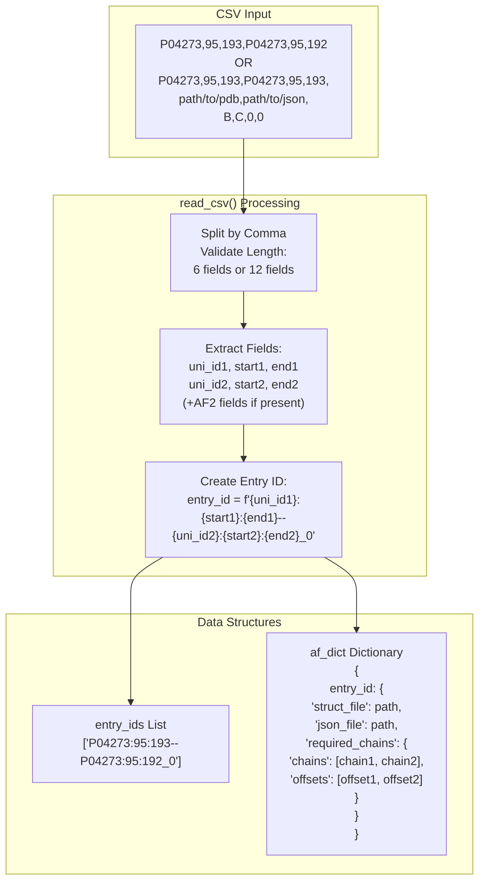
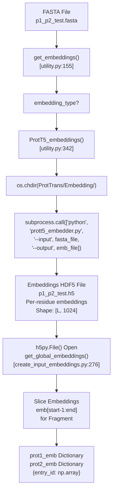
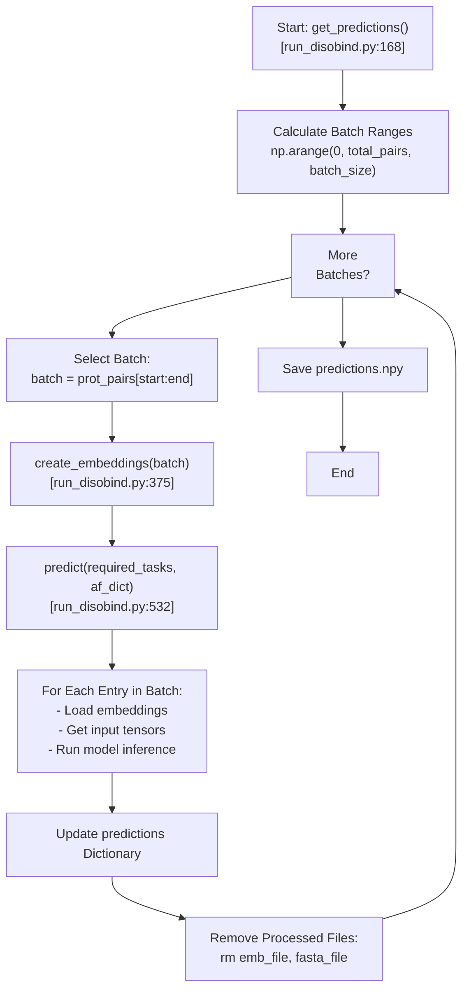

# Input Format and Preparation

> **Relevant source files**
> * [README.md](https://github.com/isblab/disobind/blob/5fffcf84/README.md?plain=1)
> * [example/output.tar.gz](https://github.com/isblab/disobind/blob/5fffcf84/example/output.tar.gz)
> * [example/pae_model_4_multimer_v3_pred_4.json](https://github.com/isblab/disobind/blob/5fffcf84/example/pae_model_4_multimer_v3_pred_4.json)
> * [example/test.csv](https://github.com/isblab/disobind/blob/5fffcf84/example/test.csv)
> * [example/test.fasta](https://github.com/isblab/disobind/blob/5fffcf84/example/test.fasta)
> * [example/unrelaxed_model_4_multimer_v3_pred_4.pdb](https://github.com/isblab/disobind/blob/5fffcf84/example/unrelaxed_model_4_multimer_v3_pred_4.pdb)
> * [run_disobind.py](https://github.com/isblab/disobind/blob/5fffcf84/run_disobind.py)

This page describes how to prepare input data for Disobind predictions, including the CSV input format, UniProt ID requirements, sequence download procedures, and embedding generation. For information about running predictions and model configuration, see [Running Predictions](https://github.com/isblab/disobind/blob/5fffcf84/Running Predictions)

 For details on AlphaFold integration with predictions, see [AlphaFold Integration](https://github.com/isblab/disobind/blob/5fffcf84/AlphaFold Integration)

## Overview

Disobind accepts protein pairs as input via a CSV file. Each row specifies one protein fragment pair for prediction. The system automatically downloads UniProt sequences, generates T5 embeddings, and prepares input tensors for the neural network. Input preparation is handled by the `Disobind` class in `run_disobind.py` [run_disobind.py L44-L106](https://github.com/isblab/disobind/blob/5fffcf84/run_disobind.py#L44-L106)

 and the `Embeddings` class in `dataset/create_input_embeddings.py` [dataset/create_input_embeddings.py L38-L40](https://github.com/isblab/disobind/blob/5fffcf84/dataset/create_input_embeddings.py#L38-L40)

**Sources:** [README.md L42-L64](https://github.com/isblab/disobind/blob/5fffcf84/README.md?plain=1#L42-L64)

 [run_disobind.py L44-L106](https://github.com/isblab/disobind/blob/5fffcf84/run_disobind.py#L44-L106)

## Input CSV Format

### Basic Format: Disobind Only

For standard Disobind predictions without AlphaFold integration, each CSV row contains 6 comma-separated fields [run_disobind.py L7-L8](https://github.com/isblab/disobind/blob/5fffcf84/run_disobind.py#L7-L8)

:

```
UniProt_ID1,start1,end1,UniProt_ID2,start2,end2
```

**Field Descriptions:**

| Field | Type | Description |
| --- | --- | --- |
| `UniProt_ID1` | String | UniProt accession for protein 1 (must be an IDR) |
| `start1` | Integer | Starting residue position in UniProt sequence for protein 1 |
| `end1` | Integer | Ending residue position in UniProt sequence for protein 1 |
| `UniProt_ID2` | String | UniProt accession for protein 2 (may or may not be an IDR) |
| `start2` | Integer | Starting residue position in UniProt sequence for protein 2 |
| `end2` | Integer | Ending residue position in UniProt sequence for protein 2 |

**Example:**

```
P04273,95,193,P04273,95,192
```

**Sources:** [README.md L48-L58](https://github.com/isblab/disobind/blob/5fffcf84/README.md?plain=1#L48-L58)

 [run_disobind.py L208-L255](https://github.com/isblab/disobind/blob/5fffcf84/run_disobind.py#L208-L255)

 [example/test.csv L1](https://github.com/isblab/disobind/blob/5fffcf84/example/test.csv#L1-L1)

### Extended Format: Disobind + AlphaFold2/3

For combining Disobind predictions with AlphaFold structural predictions, each CSV row contains 12 comma-separated fields [run_disobind.py L9-L10](https://github.com/isblab/disobind/blob/5fffcf84/run_disobind.py#L9-L10)

:

```
UniProt_ID1,start1,end1,UniProt_ID2,start2,end2,AF2_struct_file_path,AF2_pae_file_path,chain1,chain2,offset1,offset2
```

**Additional Field Descriptions:**

| Field | Type | Description |
| --- | --- | --- |
| `AF2_struct_file_path` | String | Path to AlphaFold structure file (.pdb or .cif) |
| `AF2_pae_file_path` | String | Path to AlphaFold PAE JSON file |
| `chain1` | String | Chain ID in AF2 structure corresponding to protein 1 fragment |
| `chain2` | String | Chain ID in AF2 structure corresponding to protein 2 fragment |
| `offset1` | Integer | Residue position offset between AF2 structure and UniProt numbering for protein 1 |
| `offset2` | Integer | Residue position offset between AF2 structure and UniProt numbering for protein 2 |

**Offset Calculation:** The offset is the difference between the AF2 structure residue numbering and the UniProt residue numbering [README.md L63-L65](https://github.com/isblab/disobind/blob/5fffcf84/README.md?plain=1#L63-L65)

 Set to 0 if the AF2 structure corresponds to the full UniProt sequence or the exact fragment specified.

**Example:**

```
P04273,95,193,P04273,95,193,./example/unrelaxed_model_4_multimer_v3_pred_4.pdb,./example/pae_model_4_multimer_v3_pred_4.json,B,C,0,0
```

**Sources:** [README.md L57-L65](https://github.com/isblab/disobind/blob/5fffcf84/README.md?plain=1#L57-L65)

 [run_disobind.py L232-L253](https://github.com/isblab/disobind/blob/5fffcf84/run_disobind.py#L232-L253)

 [example/test.csv L2](https://github.com/isblab/disobind/blob/5fffcf84/example/test.csv#L2-L2)

## Input Requirements and Constraints

The following requirements and constraints apply to all input:

1. **Binary Complexes Only:** Disobind only processes binary (two-protein) complexes. For non-binary complexes ABC, create binary pairs: AB, BC, AC [README.md L43-L44](https://github.com/isblab/disobind/blob/5fffcf84/README.md?plain=1#L43-L44)
2. **Protein 1 Must Be an IDR:** The first protein in each pair must be an intrinsically disordered region. Protein 2 may be ordered or disordered [README.md L45](https://github.com/isblab/disobind/blob/5fffcf84/README.md?plain=1#L45-L45)
3. **Interacting Pairs:** The input protein pair is assumed to be interacting. Disobind predicts *where* they interact, not *whether* they interact [README.md L44](https://github.com/isblab/disobind/blob/5fffcf84/README.md?plain=1#L44-L44)
4. **Valid UniProt IDs:** By default, CSV input expects proteins with UniProt accessions for sequence retrieval [README.md L49](https://github.com/isblab/disobind/blob/5fffcf84/README.md?plain=1#L49-L49)
5. **Alternative FASTA Input:** For proteins without UniProt accessions, the FASTA format can be used to provide sequences directly [README.md L50-L51](https://github.com/isblab/disobind/blob/5fffcf84/README.md?plain=1#L50-L51)

**Sources:** [README.md L42-L51](https://github.com/isblab/disobind/blob/5fffcf84/README.md?plain=1#L42-L51)

 [run_disobind.py L4-L10](https://github.com/isblab/disobind/blob/5fffcf84/run_disobind.py#L4-L10)

## Input Processing Pipeline

The following diagram shows the complete input processing workflow from CSV file to model-ready tensors:

**Diagram: Input Processing Workflow**

```mermaid
flowchart TD

CSVInput["CSV Input File"]
ReadCSV["process_input_file()<br>[run_disobind.py:212]"]
ParseRows["Parse CSV Rows<br>Extract UniProt IDs<br>and Residue Ranges"]
EntryDict["entry_ids List<br>af_dict Dictionary"]
CheckUniSeq["UniProt Sequences<br>Cached?"]
UniSeqFile["UniProt_seq.json<br>[output_dir/]"]
DownloadSeq["download_uniprot_seq()<br>[run_disobind.py:299]"]
GetUniqueIDs["get_unique_uni_ids()<br>[run_disobind.py:280]"]
ParallelDownload["parallelize_uni_seq_download()<br>[run_disobind.py:261]<br>Uses multiprocessing.Pool"]
APICall["get_uniprot_seq()<br>[from_APIs_with_love.py:10]"]
ProcessPairs["process_input_pairs()<br>[run_disobind.py:333]"]
ValidatePairs["Validate UniProt IDs<br>in Downloaded Sequences"]
ProtPairs["prot_pairs List<br>Valid Entry IDs"]
CreateFasta["create_fasta_from_headers()<br>[create_input_embeddings.py:186]"]
FastaFile["FASTA File<br>p1_p2_test.fasta"]
CheckEmb["Embeddings<br>Exist?"]
EmbFile["Embeddings HDF5<br>p1_p2_test.h5"]
GenEmb["get_embeddings()<br>[utility.py:155]"]
T5Script["ProtT5_embeddings()<br>[utility.py:342]"]
LoadEmb["Load Embeddings<br>get_global_embeddings()<br>[create_input_embeddings.py:276]"]
EmbDict["prot1_emb, prot2_emb<br>Dictionaries"]
BatchProcess["get_predictions()<br>[run_disobind.py:168]<br>Process in Batches"]
PrepTensors["get_input_tensors()<br>[run_disobind.py:475]"]
Padding["apply_padding()<br>Pad to 100x100"]
CoarseGrain["prepare_input()<br>[src/utils.py:10]<br>Apply Coarse-Graining"]
ModelInput["Model-Ready Tensors<br>prot1, prot2, target_mask"]

CSVInput --> ReadCSV
ReadCSV --> ParseRows
ParseRows --> EntryDict
EntryDict --> CheckUniSeq
CheckUniSeq --> DownloadSeq
CheckUniSeq --> ProcessPairs
DownloadSeq --> GetUniqueIDs
GetUniqueIDs --> ParallelDownload
ParallelDownload --> APICall
APICall --> UniSeqFile
UniSeqFile --> ProcessPairs
ProcessPairs --> ValidatePairs
ValidatePairs --> ProtPairs
ProtPairs --> CreateFasta
CreateFasta --> FastaFile
FastaFile --> CheckEmb
CheckEmb --> GenEmb
CheckEmb --> LoadEmb
GenEmb --> T5Script
T5Script --> EmbFile
EmbFile --> LoadEmb
LoadEmb --> EmbDict
EmbDict --> BatchProcess
BatchProcess --> PrepTensors
PrepTensors --> Padding
Padding --> CoarseGrain
CoarseGrain --> ModelInput
```



**Sources:** [run_disobind.py L111-L207](https://github.com/isblab/disobind/blob/5fffcf84/run_disobind.py#L111-L207)

 [run_disobind.py L212-L368](https://github.com/isblab/disobind/blob/5fffcf84/run_disobind.py#L212-L368)

 [run_disobind.py L475-L529](https://github.com/isblab/disobind/blob/5fffcf84/run_disobind.py#L475-L529)

 [dataset/create_input_embeddings.py L186-L273](https://github.com/isblab/disobind/blob/5fffcf84/dataset/create_input_embeddings.py#L186-L273)

## CSV Parsing and Entry ID Format

The `process_input_file()` method (specifically for CSV type) parses the file and creates internal entry identifiers [run_disobind.py L212-L255](https://github.com/isblab/disobind/blob/5fffcf84/run_disobind.py#L212-L255)

:

```yaml
UniID1:start1:end1--UniID2:start2:end2_0
```

The `_0` suffix indicates this is the first fragment pair for this combination. The method also constructs an `af_dict` dictionary to store AlphaFold-related information.

**Diagram: CSV Parsing and Data Structures**



**Sources:** [run_disobind.py L212-L255](https://github.com/isblab/disobind/blob/5fffcf84/run_disobind.py#L212-L255)

## UniProt Sequence Download

The system downloads UniProt sequences for all unique protein IDs in the input CSV. This process is parallelized using Python's `multiprocessing.Pool` for efficiency [run_disobind.py L261-L278](https://github.com/isblab/disobind/blob/5fffcf84/run_disobind.py#L261-L278)

### Sequence Download Process

1. **Extract Unique IDs:** The `get_unique_uni_ids()` method extracts all unique UniProt IDs from the entry list [run_disobind.py L280-L295](https://github.com/isblab/disobind/blob/5fffcf84/run_disobind.py#L280-L295)
2. **Parallel Download:** The `download_uniprot_seq()` method uses a multiprocessing pool to download sequences in parallel [run_disobind.py L299-L327](https://github.com/isblab/disobind/blob/5fffcf84/run_disobind.py#L299-L327)
3. **API Logic:** The `get_uniprot_seq()` function in `dataset/from_APIs_with_love.py` handles the HTTP requests to UniProt [dataset/from_APIs_with_love.py L10](https://github.com/isblab/disobind/blob/5fffcf84/dataset/from_APIs_with_love.py#L10-L10)
4. **Caching:** Downloaded sequences are saved to `UniProt_seq.json` in the output directory to avoid re-downloading [run_disobind.py L108](https://github.com/isblab/disobind/blob/5fffcf84/run_disobind.py#L108-L108)

**Sources:** [run_disobind.py L261-L327](https://github.com/isblab/disobind/blob/5fffcf84/run_disobind.py#L261-L327)

 [dataset/from_APIs_with_love.py L10-L40](https://github.com/isblab/disobind/blob/5fffcf84/dataset/from_APIs_with_love.py#L10-L40)

## FASTA File Generation

The `create_fasta_from_headers()` method generates FASTA files containing sequences for embedding generation [dataset/create_input_embeddings.py L186-L235](https://github.com/isblab/disobind/blob/5fffcf84/dataset/create_input_embeddings.py#L186-L235)

### Global Scope (Default)

For global embeddings, the complete UniProt sequence is written to the FASTA file:

```
>P04273
MDSKGSSQKGSRLLLLLVVSNLLLCQGVVSTPVCPNGPGNCQVSLRDLFDRAVMVSHYIHDLSSEMFNEFDKRYAQGK...
```

**Sources:** [dataset/create_input_embeddings.py L207-L210](https://github.com/isblab/disobind/blob/5fffcf84/dataset/create_input_embeddings.py#L207-L210)

 [run_disobind.py L66](https://github.com/isblab/disobind/blob/5fffcf84/run_disobind.py#L66-L66)

## Embedding Generation

Disobind uses ProtT5 embeddings by default [run_disobind.py L64](https://github.com/isblab/disobind/blob/5fffcf84/run_disobind.py#L64-L64)

 The embedding generation process involves calling external scripts from the ProtTrans library.

### Embedding Pipeline



### Embedding Properties

| Property | Value | Description |
| --- | --- | --- |
| Embedding Type | ProtT5 | Default, set in `Disobind` class [run_disobind.py L64](https://github.com/isblab/disobind/blob/5fffcf84/run_disobind.py#L64-L64) |
| Dimensions | [L, 1024] | Per-residue embeddings, L = sequence length |
| Storage Format | HDF5 | Key = entry ID or UniProt ID, Value = embedding array |
| Scope | Global | Uses full sequence for context [run_disobind.py L66](https://github.com/isblab/disobind/blob/5fffcf84/run_disobind.py#L66-L66) |

**Sources:** [dataset/create_input_embeddings.py L239-L273](https://github.com/isblab/disobind/blob/5fffcf84/dataset/create_input_embeddings.py#L239-L273)

 [dataset/utility.py L342-L372](https://github.com/isblab/disobind/blob/5fffcf84/dataset/utility.py#L342-L372)

 [run_disobind.py L64-L66](https://github.com/isblab/disobind/blob/5fffcf84/run_disobind.py#L64-L66)

## Input Tensor Preparation

After embeddings are loaded, they must be converted to model-ready tensors. This involves padding, coarse-graining, and creating masks.

### Tensor Preparation Steps

The `get_input_tensors()` method [run_disobind.py L475-L529](https://github.com/isblab/disobind/blob/5fffcf84/run_disobind.py#L475-L529)

 performs the following operations:

1. **Calculate Effective Length:** Compute post-coarse-graining dimensions [run_disobind.py L488-L490](https://github.com/isblab/disobind/blob/5fffcf84/run_disobind.py#L488-L490)
2. **Create Target Mask:** Initialize a binary mask of ones with shape `[1, num_res1, num_res2]` [run_disobind.py L492](https://github.com/isblab/disobind/blob/5fffcf84/run_disobind.py#L492-L492)
3. **Convert to Tensors:** Convert numpy arrays to PyTorch tensors and add batch dimension [run_disobind.py L504-L507](https://github.com/isblab/disobind/blob/5fffcf84/run_disobind.py#L504-L507)
4. **Apply Padding and Coarse-Graining:** Call `prepare_input()` from `src/utils.py` to pad sequences to 100 residues and apply coarse-graining [run_disobind.py L510-L525](https://github.com/isblab/disobind/blob/5fffcf84/run_disobind.py#L510-L525)
5. **Move to Device:** Transfer tensors to specified device (CPU or CUDA) [run_disobind.py L527](https://github.com/isblab/disobind/blob/5fffcf84/run_disobind.py#L527-L527)

**Sources:** [run_disobind.py L475-L529](https://github.com/isblab/disobind/blob/5fffcf84/run_disobind.py#L475-L529)

 [src/utils.py L10-L40](https://github.com/isblab/disobind/blob/5fffcf84/src/utils.py#L10-L40)

## Batch Processing

Predictions are processed in batches to manage memory efficiently. The default batch size is 200 protein pairs [run_disobind.py L78](https://github.com/isblab/disobind/blob/5fffcf84/run_disobind.py#L78-L78)

**Diagram: Batch Processing Loop**



**Sources:** [run_disobind.py L168-L207](https://github.com/isblab/disobind/blob/5fffcf84/run_disobind.py#L168-L207)

 [run_disobind.py L532-L661](https://github.com/isblab/disobind/blob/5fffcf84/run_disobind.py#L532-L661)

## Error Handling and Validation

The input processing pipeline includes several validation steps:

1. **CSV Format Validation** [run_disobind.py L228-L242](https://github.com/isblab/disobind/blob/5fffcf84/run_disobind.py#L228-L242) : Verifies each row has exactly 6 or 12 fields.
2. **UniProt Download Validation** [run_disobind.py L320-L324](https://github.com/isblab/disobind/blob/5fffcf84/run_disobind.py#L320-L324) : Checks if sequence length is non-zero.
3. **Sequence Availability** [run_disobind.py L362-L366](https://github.com/isblab/disobind/blob/5fffcf84/run_disobind.py#L362-L366) : Skips pairs with missing UniProt sequences and logs a warning.
4. **Coarse-Graining Validation** [run_disobind.py L144-L151](https://github.com/isblab/disobind/blob/5fffcf84/run_disobind.py#L144-L151) : Verifies CG value is in [0, 1, 5, 10] and warns about potential terminal residue loss.

**Sources:** [run_disobind.py L144-L151](https://github.com/isblab/disobind/blob/5fffcf84/run_disobind.py#L144-L151)

 [run_disobind.py L228-L242](https://github.com/isblab/disobind/blob/5fffcf84/run_disobind.py#L228-L242)

 [run_disobind.py L320-L324](https://github.com/isblab/disobind/blob/5fffcf84/run_disobind.py#L320-L324)

 [run_disobind.py L362-L366](https://github.com/isblab/disobind/blob/5fffcf84/run_disobind.py#L362-L366)