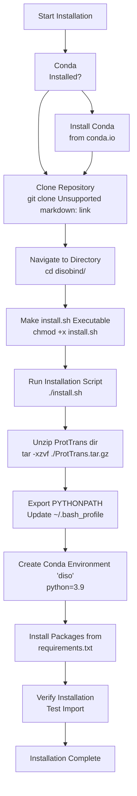
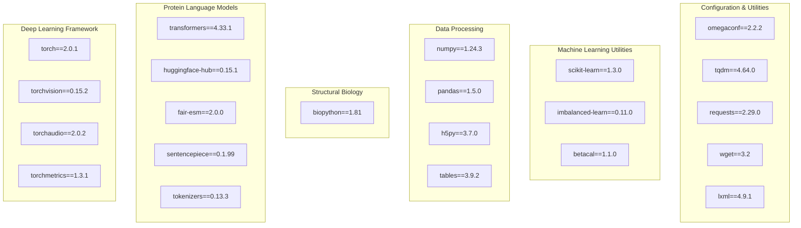

# Installation and Setup

> **Relevant source files**
> * [ProtTrans.tar.gz](https://github.com/isblab/disobind/blob/5fffcf84/ProtTrans.tar.gz)
> * [install.sh](https://github.com/isblab/disobind/blob/5fffcf84/install.sh)
> * [requirements.txt](https://github.com/isblab/disobind/blob/5fffcf84/requirements.txt)

## Purpose and Scope

This page provides comprehensive instructions for installing Disobind and setting up the required environment. It covers system requirements, dependency installation, environment configuration, and verification procedures. For guidance on running predictions after installation, see **1.2 Quick Start Guide**. For information about training custom models, see **4.5 Training Your Own Models**.

---

## System Requirements

### Operating System

Disobind is compatible with Linux and macOS systems. Windows users should use WSL (Windows Subsystem for Linux).

### Hardware Requirements

| Component | Minimum | Recommended |
| --- | --- | --- |
| RAM | 8 GB | 16 GB or more |
| Storage | 10 GB free | 50 GB or more (for datasets) |
| CPU Cores | 2 | 4 or more |
| GPU | None (CPU mode) | NVIDIA GPU with CUDA 11.8 support |

### Software Prerequisites

* **Python**: Version 3.9 (specified in the installation script [install.sh L15](https://github.com/isblab/disobind/blob/5fffcf84/install.sh#L15-L15) )
* **Conda**: For environment management
* **CUDA Toolkit**: Version 11.8 (for GPU acceleration)
* **NVIDIA Drivers**: Latest compatible version (for GPU support)

Sources: [install.sh L15](https://github.com/isblab/disobind/blob/5fffcf84/install.sh#L15-L15)

 [requirements.txt L1-L33](https://github.com/isblab/disobind/blob/5fffcf84/requirements.txt#L1-L33)

---

## Installation Workflow



**Installation Workflow Diagram**: This flowchart illustrates the complete installation process defined in `install.sh`. The script automates the unzipping of language model assets, environment variable configuration, and dependency installation via `pip`.

Sources: [install.sh L1-L27](https://github.com/isblab/disobind/blob/5fffcf84/install.sh#L1-L27)

 [ProtTrans.tar.gz L1-L35](https://github.com/isblab/disobind/blob/5fffcf84/ProtTrans.tar.gz#L1-L35)

---

## Step-by-Step Installation

### Step 1: Clone the Repository

```
git clone https://github.com/isblab/disobind.gitcd disobind/
```

### Step 2: Run the Automated Installation Script

The repository includes a bash script `install.sh` that handles the entire setup process.

```
chmod +x install.sh./install.sh
```

The `install.sh` script performs the following operations:

1. **Asset Extraction**: Unzips `ProtTrans.tar.gz`, which contains essential components for the protein language model [install.sh L4](https://github.com/isblab/disobind/blob/5fffcf84/install.sh#L4-L4)
2. **Path Configuration**: Appends the current directory to `PYTHONPATH` in `~/.bash_profile` to ensure modules are importable [install.sh L7-L12](https://github.com/isblab/disobind/blob/5fffcf84/install.sh#L7-L12)
3. **Environment Creation**: Creates a Conda environment named `diso` using Python 3.9 [install.sh L15](https://github.com/isblab/disobind/blob/5fffcf84/install.sh#L15-L15)
4. **Dependency Installation**: Activates the environment and installs all packages listed in `requirements.txt` [install.sh L18-L21](https://github.com/isblab/disobind/blob/5fffcf84/install.sh#L18-L21)

Sources: [install.sh L1-L27](https://github.com/isblab/disobind/blob/5fffcf84/install.sh#L1-L27)

---

## Core Dependencies

### Python Package Dependencies

The following diagram maps the major dependency categories to their specific packages:



**Dependency Categories**: Disobind relies on a specific stack of libraries. The `fair-esm` and `transformers` packages are critical for generating the sequence-based embeddings used as input to the `Epsilon_3` model.

Sources: [requirements.txt L1-L33](https://github.com/isblab/disobind/blob/5fffcf84/requirements.txt#L1-L33)

---

## Post-Installation Verification

### Verify Python Environment

Activate the newly created Conda environment:

```
conda activate diso
```

Check that Python and key packages are correctly installed:

```javascript
python --version  # Should show Python 3.9python -c "import torch; print(f'PyTorch: {torch.__version__}')"python -c "import transformers; print(f'Transformers: {transformers.__version__}')"
```

Sources: [install.sh L15](https://github.com/isblab/disobind/blob/5fffcf84/install.sh#L15-L15)

 [requirements.txt L15-L23](https://github.com/isblab/disobind/blob/5fffcf84/requirements.txt#L15-L23)

### Verify Directory Structure

Ensure that `ProtTrans.tar.gz` was successfully extracted by the script:

```
ls -d ProtTrans/
```

The root directory should now also contain the `models/` and `params/` directories necessary for running `run_disobind.py`.

Sources: [install.sh L4](https://github.com/isblab/disobind/blob/5fffcf84/install.sh#L4-L4)

---

## Troubleshooting Common Installation Issues

### Issue: ProtTrans Extraction Failed

**Problem**: The `ProtTrans` directory is missing after running `install.sh`.

**Solution**: Manually extract the archive:

```
tar -xzvf ./ProtTrans.tar.gz
```

Ensure you have sufficient disk space, as language model assets can be large.

Sources: [install.sh L4](https://github.com/isblab/disobind/blob/5fffcf84/install.sh#L4-L4)

### Issue: PYTHONPATH Not Updated

**Problem**: Importing Disobind modules results in `ModuleNotFoundError`.

**Solution**: The `install.sh` script attempts to update `~/.bash_profile` [install.sh L7-L12](https://github.com/isblab/disobind/blob/5fffcf84/install.sh#L7-L12)

 If you are using `zsh`, you may need to manually add the path to `~/.zshrc`:

```javascript
export PYTHONPATH=$PYTHONPATH:$(pwd)
```

### Issue: Dependency Conflicts

**Problem**: `pip install` fails due to version conflicts.

**Solution**: Disobind requires specific versions like `numpy==1.24.3` and `pandas==1.5.0`. Ensure you are installing into a clean `diso` environment as created by the script.

Sources: [requirements.txt L11-L13](https://github.com/isblab/disobind/blob/5fffcf84/requirements.txt#L11-L13)

 [install.sh L15](https://github.com/isblab/disobind/blob/5fffcf84/install.sh#L15-L15)

---

## Next Steps

After successful installation:

1. **Quick Start**: Run a test prediction using the instructions in **1.2 Quick Start Guide**.
2. **GPU Setup**: If you have an NVIDIA GPU, verify that `torch.cuda.is_available()` returns `True` within the `diso` environment.
3. **Explore Data**: Review the `example/` folder to understand the input formats required by the system.

Sources: [install.sh L26-L27](https://github.com/isblab/disobind/blob/5fffcf84/install.sh#L26-L27)