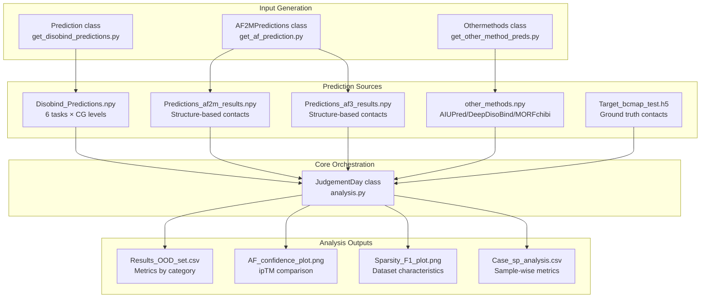
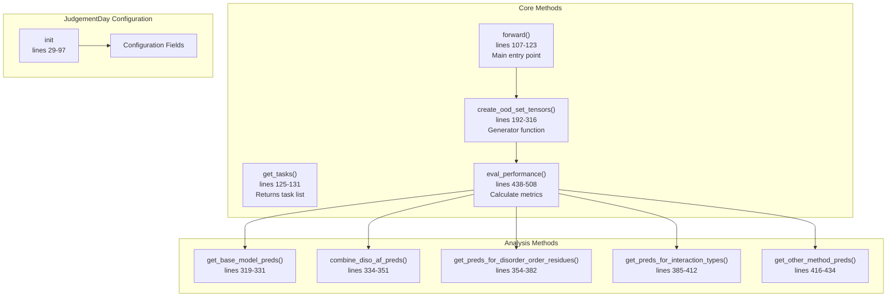
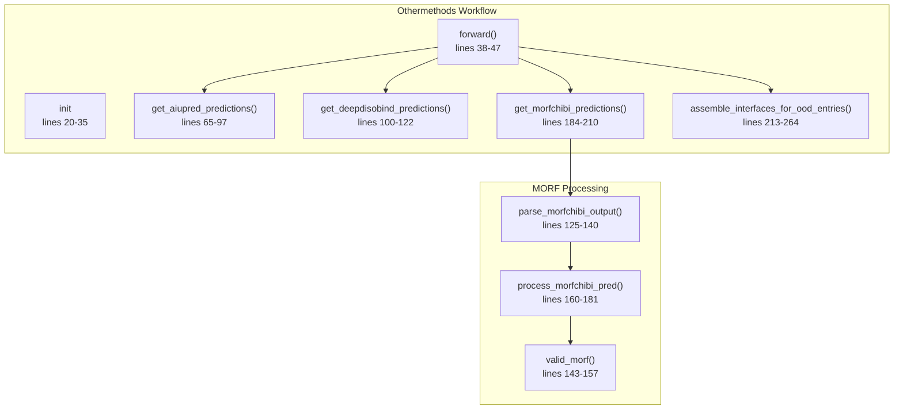
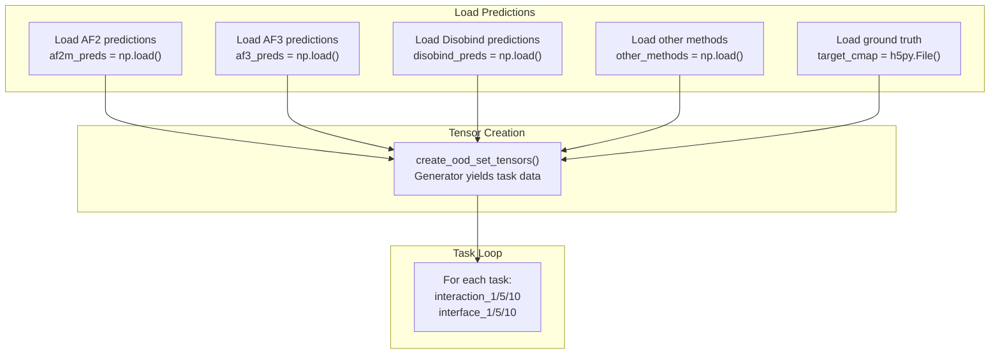

# JudgementDay Analysis Pipeline

> **Relevant source files**
> * [analysis/analysis.py](https://github.com/isblab/disobind/blob/5fffcf84/analysis/analysis.py)
> * [analysis/fig_4_s5_chimera.py](https://github.com/isblab/disobind/blob/5fffcf84/analysis/fig_4_s5_chimera.py)
> * [analysis/get_other_method_preds.py](https://github.com/isblab/disobind/blob/5fffcf84/analysis/get_other_method_preds.py)
> * [analysis/side_analysis.py](https://github.com/isblab/disobind/blob/5fffcf84/analysis/side_analysis.py)

## Purpose and Scope

The JudgementDay Analysis Pipeline is a comprehensive evaluation framework for assessing the performance of Disobind predictions against AlphaFold2, AlphaFold3, and other methods on out-of-distribution (OOD) test sets. This pipeline orchestrates the comparison of multiple prediction methods, generates specialized binary masks for disorder and amino acid analysis, calculates performance metrics across various categories, and produces visualization outputs.

For information about generating Disobind predictions for analysis, see [Generating OOD Predictions](/isblab/disobind/5.2-generating-ood-predictions). For details on processing AlphaFold predictions, see [Processing AlphaFold Predictions](/isblab/disobind/5.3-processing-alphafold-predictions). For information about specific evaluation metrics, see [Performance Metrics and Evaluation](/isblab/disobind/5.4-performance-metrics-and-evaluation).

## System Overview

The JudgementDay pipeline comprises four major components that work together to perform comprehensive model evaluation:



**Sources:** [analysis/analysis.py L1-L87](https://github.com/isblab/disobind/blob/5fffcf84/analysis/analysis.py#L1-L87)

 [analysis/get_disobind_predictions.py L1-L50](https://github.com/isblab/disobind/blob/5fffcf84/analysis/get_disobind_predictions.py#L1-L50)

 [analysis/get_af_prediction.py L1-L77](https://github.com/isblab/disobind/blob/5fffcf84/analysis/get_af_prediction.py#L1-L77)

 [analysis/get_other_method_preds.py L1-L35](https://github.com/isblab/disobind/blob/5fffcf84/analysis/get_other_method_preds.py#L1-L35)

## Core Classes and Components

### JudgementDay Class

The `JudgementDay` class is the primary orchestrator for the analysis pipeline. It manages configuration, loads predictions from all sources, and coordinates evaluation across multiple categories.



**Key Configuration Parameters:**

| Parameter | Default | Purpose |
| --- | --- | --- |
| `data_version` | 19 | Dataset version identifier |
| `mode` | "ood" | Dataset type (ood/misc) |
| `max_len` | 100 (ood) / 200 (misc) | Maximum protein length |
| `contact_threshold` | 0.5 | Cutoff for binary contact prediction |
| `iptm_cutoff` | 0.0 | Minimum ipTM score for confident AF predictions |
| `device` | "cuda" | Computation device |

**Sources:** [analysis/analysis.py L29-L97](https://github.com/isblab/disobind/blob/5fffcf84/analysis/analysis.py#L29-L97)

### Othermethods Class

The `Othermethods` class is responsible for parsing and standardizing predictions from external interface predictors: AIUPred, DeepDisoBind, and MORFchibi. It ensures these predictions are aligned with the Disobind output format for direct comparison.



**External Method Specifications:**

| Method | Implementation / Parsing Logic | Cutoff / Processing |
| --- | --- | --- |
| **AIUPred** | Uses `aiupred_lib.predict_binding` [analysis/get_other_method_preds.py L86-L89](https://github.com/isblab/disobind/blob/5fffcf84/analysis/get_other_method_preds.py#L86-L89) | Threshold: 0.5 [analysis/get_other_method_preds.py L91](https://github.com/isblab/disobind/blob/5fffcf84/analysis/get_other_method_preds.py#L91-L91) |
| **DeepDisoBind** | Parses FASTA result files [analysis/get_other_method_preds.py L110-L118](https://github.com/isblab/disobind/blob/5fffcf84/analysis/get_other_method_preds.py#L110-L118) | Binary string extraction |
| **MORFchibi** | Suggests 0.775 cutoff [analysis/get_other_method_preds.py L168](https://github.com/isblab/disobind/blob/5fffcf84/analysis/get_other_method_preds.py#L168-L168) | Sections < 4 residues filtered [analysis/get_other_method_preds.py L172-L178](https://github.com/isblab/disobind/blob/5fffcf84/analysis/get_other_method_preds.py#L172-L178) |

**Sources:** [analysis/get_other_method_preds.py L14-L264](https://github.com/isblab/disobind/blob/5fffcf84/analysis/get_other_method_preds.py#L14-L264)

### AF2MPredictions Class

The `AF2MPredictions` class processes AlphaFold2 and AlphaFold3 predictions, extracting contact maps from structures with confidence filtering based on pLDDT and PAE scores.

**Key Processing Steps:**

1. **Model Selection:** Ranks AF models by ipTM+pTM scores, selects best model [analysis/get_af_prediction.py L96-L132](https://github.com/isblab/disobind/blob/5fffcf84/analysis/get_af_prediction.py#L96-L132)
2. **Structure Parsing:** Extracts C-alpha coordinates and pLDDT values [analysis/get_af_prediction.py L163-L195](https://github.com/isblab/disobind/blob/5fffcf84/analysis/get_af_prediction.py#L163-L195)
3. **Contact Map Creation:** Computes inter-residue distances, applies 8Å threshold [analysis/get_af_prediction.py L198-L214](https://github.com/isblab/disobind/blob/5fffcf84/analysis/get_af_prediction.py#L198-L214)
4. **Confidence Filtering:** Creates binary masks for pLDDT≥70 and PAE≤5 [analysis/get_af_prediction.py L315-L361](https://github.com/isblab/disobind/blob/5fffcf84/analysis/get_af_prediction.py#L315-L361)
5. **Coarse-Graining:** Applies MaxPool2d for CG levels 5 and 10 [analysis/get_af_prediction.py L267-L312](https://github.com/isblab/disobind/blob/5fffcf84/analysis/get_af_prediction.py#L267-L312)

**Sources:** [analysis/get_af_prediction.py L28-L498](https://github.com/isblab/disobind/blob/5fffcf84/analysis/get_af_prediction.py#L28-L498)

## Analysis Workflow

### Data Loading and Preparation

The pipeline begins by loading predictions from all sources and preparing them for evaluation:



The `create_ood_set_tensors()` method is a generator that yields data for each task, assembling all predictions, masks, and targets into a unified dictionary structure.

**Sources:** [analysis/analysis.py L107-L123](https://github.com/isblab/disobind/blob/5fffcf84/analysis/analysis.py#L107-L123)

 [analysis/analysis.py L192-L316](https://github.com/isblab/disobind/blob/5fffcf84/analysis/analysis.py#L192-L316)

### Side Analysis Utilities

The `side_analysis.py` module provides utility functions for segregating the dataset into specific biological categories for targeted evaluation.

| Function | Logic | File Reference |
| --- | --- | --- |
| `get_dor_ddr_complexes` | Segregates Dynamic (DDR) vs. Static (DOR) complexes based on contact map variance across conformers. | [analysis/side_analysis.py L55-L107](https://github.com/isblab/disobind/blob/5fffcf84/analysis/side_analysis.py#L55-L107) |
| `get_frac_disordered` | Calculates the fraction of residues in a sequence fragment that are annotated as disordered. | [analysis/side_analysis.py L125-L138](https://github.com/isblab/disobind/blob/5fffcf84/analysis/side_analysis.py#L125-L138) |
| `get_full_idr_complexes` | Identifies complexes where Protein 1 is 100% disordered. | [analysis/side_analysis.py L141-L183](https://github.com/isblab/disobind/blob/5fffcf84/analysis/side_analysis.py#L141-L183) |

**Sources:** [analysis/side_analysis.py L55-L183](https://github.com/isblab/disobind/blob/5fffcf84/analysis/side_analysis.py#L55-L183)

### Evaluation Categories

The pipeline evaluates predictions across five main categories:

1. **Base Model Evaluation** [analysis/analysis.py L319-L331](https://github.com/isblab/disobind/blob/5fffcf84/analysis/analysis.py#L319-L331)
2. **Combined Predictions** [analysis/analysis.py L334-L351](https://github.com/isblab/disobind/blob/5fffcf84/analysis/analysis.py#L334-L351) * Formula: `combined = max(disobind, af_pred)`
3. **Disorder-Specific Analysis** [analysis/analysis.py L354-L382](https://github.com/isblab/disobind/blob/5fffcf84/analysis/analysis.py#L354-L382) * Evaluates performance on IDR-IDR vs ordered interactions.
4. **Interaction Type Analysis** [analysis/analysis.py L385-L412](https://github.com/isblab/disobind/blob/5fffcf84/analysis/analysis.py#L385-L412) * Applies amino acid property masks (aromatic, hydrophobic, etc.).
5. **Other Methods Comparison** [analysis/analysis.py L416-L434](https://github.com/isblab/disobind/blob/5fffcf84/analysis/analysis.py#L416-L434) * Comparison with AIUPred, DeepDisoBind, and MORFchibi.

**Sources:** [analysis/analysis.py L438-L508](https://github.com/isblab/disobind/blob/5fffcf84/analysis/analysis.py#L438-L508)

## Visualization and Visualization Utilities

### Structural Visualization (ChimeraX)

The `fig_4_s5_chimera.py` script provides automation for ChimeraX to visualize predicted vs. target interfaces, specifically for NMR ensembles.

```python
def ensemble_in_background(pdb_file, chain1, chain2, predicted_interface1, predicted_interface2, out_path, name):    # Opens mmCIF, sets preset 1, and handles transparency for NMR models    # Colors predicted interface residues (Blue for Chain 1, Red for Chain 2)
```

**Key Visualization Features:**

* **Transparency:** Sets 95% transparency for non-representative NMR models to show structural ensembles [analysis/fig_4_s5_chimera.py L37-L38](https://github.com/isblab/disobind/blob/5fffcf84/analysis/fig_4_s5_chimera.py#L37-L38)
* **Interface Mapping:** Maps binary interface predictions back to PDB residue positions for 3D visualization [analysis/fig_4_s5_chimera.py L69-L80](https://github.com/isblab/disobind/blob/5fffcf84/analysis/fig_4_s5_chimera.py#L69-L80)

**Sources:** [analysis/fig_4_s5_chimera.py L9-L130](https://github.com/isblab/disobind/blob/5fffcf84/analysis/fig_4_s5_chimera.py#L9-L130)

### Sparsity vs F1 Plot

Visualizes the relationship between dataset sparsity and Disobind F1-score performance. The pipeline loads contact density from `fraction_positives.json` and correlates it with performance metrics.

**Sources:** [analysis/analysis.py L670-L705](https://github.com/isblab/disobind/blob/5fffcf84/analysis/analysis.py#L670-L705)

## Configuration and Customization

### Mode Selection

The pipeline supports two operational modes:

**OOD Mode (Out-of-Distribution):**

* Dataset: `v_{version}/Target_bcmap_test_v_{version}.h5`
* Max length: 100 residues
* Includes comparisons with external methods.

**Misc Mode (Miscellaneous Dataset):**

* Dataset: `Misc/misc_test_target.h5`
* Max length: 200 residues
* Focuses on sample-wise analysis and top prediction extraction.

**Sources:** [analysis/analysis.py L42-L67](https://github.com/isblab/disobind/blob/5fffcf84/analysis/analysis.py#L42-L67)

### Exclusion of Redundant Entries

The pipeline automatically excludes entries with sequence redundancy to PDB70 at 20% identity to ensure the integrity of the OOD test set.

```markdown
# Excluded entries (sequence redundant with PDB70)excluded = ["P0DTC9--P0DTD1_2", "Q96PU5--Q96PU5_0", "P0AG11--P0AG11_4",            "Q9IK92--Q9IK91_0", "Q16236--O15525_0", "P12023--P12023_0",            "O85041--O85043_0", "P25024--P10145_0"]
```

**Sources:** [analysis/analysis.py L223-L239](https://github.com/isblab/disobind/blob/5fffcf84/analysis/analysis.py#L223-L239)

 [analysis/side_analysis.py L75-L79](https://github.com/isblab/disobind/blob/5fffcf84/analysis/side_analysis.py#L75-L79)