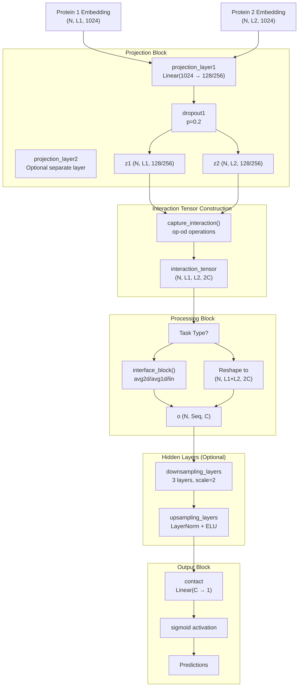
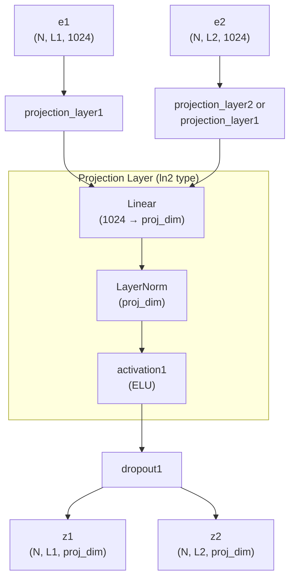
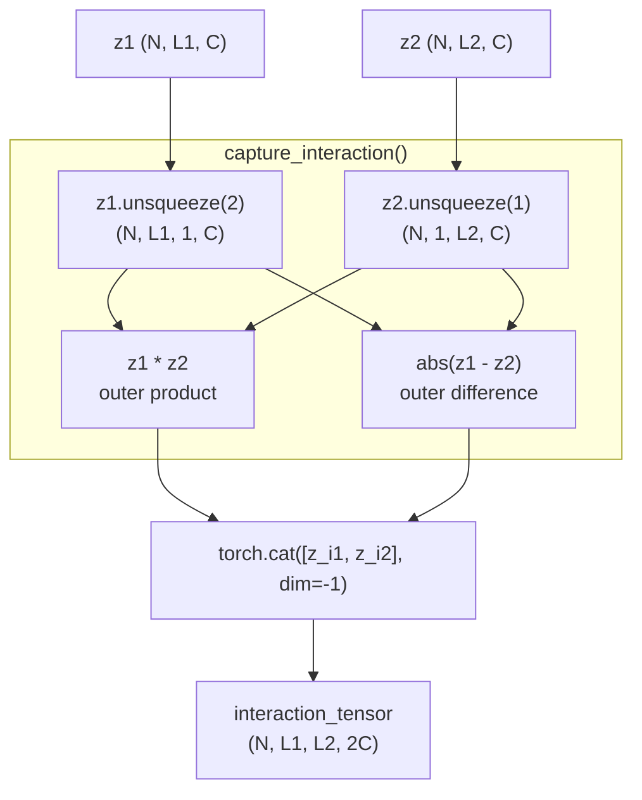
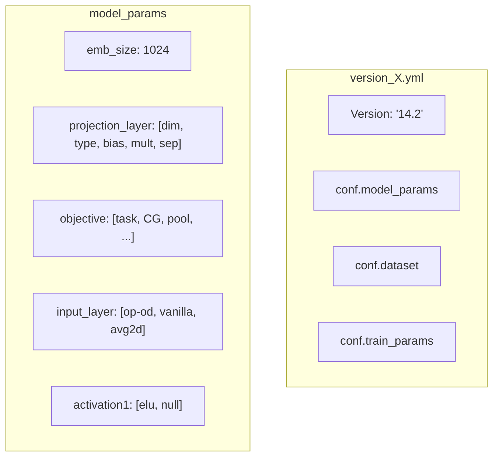
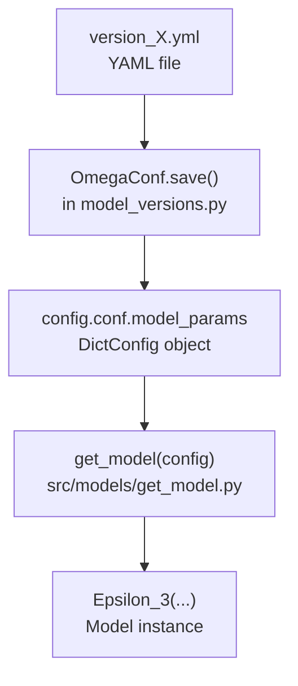

# Model Architecture

> **Relevant source files**
> * [src/README.md](https://github.com/isblab/disobind/blob/5fffcf84/src/README.md?plain=1)
> * [src/model_versions.py](https://github.com/isblab/disobind/blob/5fffcf84/src/model_versions.py)
> * [src/models/Epsilon_3.py](https://github.com/isblab/disobind/blob/5fffcf84/src/models/Epsilon_3.py)
> * [src/models/get_model.py](https://github.com/isblab/disobind/blob/5fffcf84/src/models/get_model.py)

This document provides a comprehensive description of the **Epsilon_3** neural network architecture used in Disobind for predicting protein-protein interactions and interface residues. It covers the model's design, configuration system, and integration with the training pipeline.

**Scope**: This page focuses on the architecture design, configuration files, and model instantiation. For details on training procedures, see [Training Pipeline](/isblab/disobind/4.3-training-pipeline). For information on running predictions with trained models, see [Running Predictions](/isblab/disobind/2-running-predictions).

---

## Architecture Overview

Disobind uses a neural network called **Epsilon_3** that processes protein embeddings to predict either contact maps (interaction task) or interface residues (interface task) at three coarse-graining levels (CG 1, 5, 10). The same base architecture is used for all six prediction tasks, with configuration parameters specifying task-specific behavior.

### Core Design Philosophy

The Epsilon_3 architecture follows a three-stage processing pipeline:

1. **Projection Block**: Projects high-dimensional protein embeddings (1024-dim T5 embeddings) to lower-dimensional representations.
2. **Interaction Tensor Construction**: Combines projected embeddings from two proteins to capture pairwise residue relationships.
3. **Output Block**: Processes the interaction tensor through optional hidden layers and produces predictions.

**Sources**: [src/models/Epsilon_3.py L15-L131](https://github.com/isblab/disobind/blob/5fffcf84/src/models/Epsilon_3.py#L15-L131)

 [src/models/Epsilon_3.py L132-L354](https://github.com/isblab/disobind/blob/5fffcf84/src/models/Epsilon_3.py#L132-L354)

---

## Model Components

### Input Processing and Projection

The model begins by projecting T5 embeddings from 1024 dimensions to a lower-dimensional space (typically 128 or 256 dimensions). The projection layer is created dynamically based on configuration.

| Component | Purpose | Configuration Key | Code Location |
| --- | --- | --- | --- |
| `projection_layer1` | Projects protein 1 embeddings | `projection_layer` | [src/models/Epsilon_3.py L64-L70](https://github.com/isblab/disobind/blob/5fffcf84/src/models/Epsilon_3.py#L64-L70) |
| `projection_layer2` | Optional separate projection for protein 2 | `projection_layer[4]` | [src/models/Epsilon_3.py L71-L80](https://github.com/isblab/disobind/blob/5fffcf84/src/models/Epsilon_3.py#L71-L80) |
| `dropout1` | Regularization after projection | `dropouts[0]` | [src/models/Epsilon_3.py L34](https://github.com/isblab/disobind/blob/5fffcf84/src/models/Epsilon_3.py#L34-L34) |

The projection layer type is often specified as `"ln2"`, which creates a Linear → LayerNorm → Activation sequence.

**Sources**: [src/models/Epsilon_3.py L64-L81](https://github.com/isblab/disobind/blob/5fffcf84/src/models/Epsilon_3.py#L64-L81)

 [src/model_versions.py L59](https://github.com/isblab/disobind/blob/5fffcf84/src/model_versions.py#L59-L59)

---

### Interaction Tensor Construction

The core innovation of Epsilon_3 is how it combines embeddings from two proteins to create an interaction tensor. The model supports multiple aggregation operations specified via the `input_layer` configuration parameter.

#### Aggregation Operations

The `input_layer` parameter format is `["op1-op2", "mode", "interface_method"]`:

| Operation | Mathematical Definition | Shape Transformation |
| --- | --- | --- |
| `op` (outer product) | $z_1 \otimes z_2$ | (N,L1,C) × (N,L2,C) → (N,L1,L2,C) |
| `od` (outer difference) | $ | z_1 - z_2 |
| `os` (outer sum) | $z_1 + z_2$ | (N,L1,C) × (N,L2,C) → (N,L1,L2,C) |

The standard configuration `"op-od"` concatenates outer product and outer difference operations.

**Sources**: [src/models/Epsilon_3.py L228-L296](https://github.com/isblab/disobind/blob/5fffcf84/src/models/Epsilon_3.py#L228-L296)

---

### Task-Specific Processing

After constructing the interaction tensor, processing diverges based on the prediction objective:

#### Interaction (Contact Map) Task

For contact map prediction, the interaction tensor (N, L1, L2, 2C) is reshaped to (N, L1×L2, 2C) to treat each residue pair independently.

#### Interface (Residue Label) Task

For interface prediction, the model aggregates over one dimension to identify which residues are involved in interactions. The `interface_block()` method supports three aggregation strategies:

| Strategy | Configuration Value | Operation | Output Shape |
| --- | --- | --- | --- |
| Average 2D | `"avg2d"` | `avg2d()` with mask handling | (N, L1+L2, 2C) |
| Average 1D | `"avg1d"` | `torch.mean(axis=2)` | (N, L1+L2, 2C) |
| Linear projection | `"lin"` | Learnable linear layer | (N, L1+L2, 2C) |

The `avg2d()` method (default for interface tasks) computes masked averages to ignore padding residues.

**Sources**: [src/models/Epsilon_3.py L181-L225](https://github.com/isblab/disobind/blob/5fffcf84/src/models/Epsilon_3.py#L181-L225)

---

### Hidden Layers

The model optionally processes the intermediate tensor through downsampling and upsampling layers. These are configured via `num_hid_layers = [#US, #DS, #blocks, scale_factor, block_type, residual_type]`.

Standard configurations use:

* 0 upsampling layers
* 3 downsampling layers
* Scale factor of 2
* Vanilla block (no residual connections)

**Sources**: [src/models/Epsilon_3.py L92-L108](https://github.com/isblab/disobind/blob/5fffcf84/src/models/Epsilon_3.py#L92-L108)

 [src/model_versions.py L73](https://github.com/isblab/disobind/blob/5fffcf84/src/model_versions.py#L73-L73)

---

## Configuration System

### YAML Configuration Files

Model configurations are defined in `src/model_versions.py` and saved as YAML files. These files define all architectural and training parameters.

**Sources**: [src/model_versions.py L43-L151](https://github.com/isblab/disobind/blob/5fffcf84/src/model_versions.py#L43-L151)

### Model Version Mapping

Each configuration file corresponds to a specific task. For details, see [Model Configuration Files](/isblab/disobind/4.2-model-configuration-files).

### Configuration to Model Instantiation

The configuration flow from YAML to model instance:

The `get_model()` function in [src/models/get_model.py L4-L26](https://github.com/isblab/disobind/blob/5fffcf84/src/models/get_model.py#L4-L26)

 reads the configuration and instantiates `Epsilon_3` with the specified parameters.

---

## Training Pipeline Integration

### Trainer Class Architecture

The `Trainer` class (detailed in [Training Pipeline](/isblab/disobind/4.3-training-pipeline)) orchestrates the complete training loop, integrating the Epsilon_3 model with optimization and loss computation.

### Input Preparation

The training pipeline prepares input tensors by:

1. Extracting embeddings and targets from the batch.
2. Applying coarse-graining (CG) if specified in the `objective`.
3. Reformatting based on task objective.

For details on the training loop and loss functions, see [Training Pipeline](/isblab/disobind/4.3-training-pipeline).

**Sources**: [src/model_versions.py L102-L147](https://github.com/isblab/disobind/blob/5fffcf84/src/model_versions.py#L102-L147)

---

## Model Activation and Normalization

### Activation Functions

The architecture uses two activation functions specified in configuration:

* `activation1`: Hidden layers, typically `["elu", null]`.
* `activation2`: Output layer, typically `["sigmoid", true]`.

**Sources**: [src/models/Epsilon_3.py L39-L43](https://github.com/isblab/disobind/blob/5fffcf84/src/models/Epsilon_3.py#L39-L43)

 [src/model_versions.py L83-L84](https://github.com/isblab/disobind/blob/5fffcf84/src/model_versions.py#L83-L84)

### Normalization Strategy

Layer Normalization (LN) is applied in the projection layers and downsampling layers when `norm` is set to `[True, "LN"]`.

**Sources**: [src/models/Epsilon_3.py L57-L63](https://github.com/isblab/disobind/blob/5fffcf84/src/models/Epsilon_3.py#L57-L63)

 [src/model_versions.py L78](https://github.com/isblab/disobind/blob/5fffcf84/src/model_versions.py#L78-L78)

---

## Summary of Key Code Entities

| Component | Class/Function | File | Purpose |
| --- | --- | --- | --- |
| Neural Network | `Epsilon_3` | [src/models/Epsilon_3.py L15](https://github.com/isblab/disobind/blob/5fffcf84/src/models/Epsilon_3.py#L15-L15) | Main model architecture |
| Model Factory | `get_model()` | [src/models/get_model.py L4](https://github.com/isblab/disobind/blob/5fffcf84/src/models/get_model.py#L4-L4) | Instantiate model from config |
| Interaction Ops | `capture_interaction()` | [src/models/Epsilon_3.py L228](https://github.com/isblab/disobind/blob/5fffcf84/src/models/Epsilon_3.py#L228-L228) | Combine protein embeddings |
| Interface Aggregation | `avg2d()` | [src/models/Epsilon_3.py L181](https://github.com/isblab/disobind/blob/5fffcf84/src/models/Epsilon_3.py#L181-L181) | Masked averaging for interface |
| Layer Creation | `create_projection_layers` | [src/models/Epsilon_3.py L10](https://github.com/isblab/disobind/blob/5fffcf84/src/models/Epsilon_3.py#L10-L10) | Utility for projection blocks |

**Sources**: [src/models/Epsilon_3.py L1-L25](https://github.com/isblab/disobind/blob/5fffcf84/src/models/Epsilon_3.py#L1-L25)

 [src/models/get_model.py L1-L27](https://github.com/isblab/disobind/blob/5fffcf84/src/models/get_model.py#L1-L27)