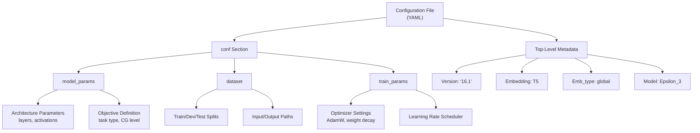
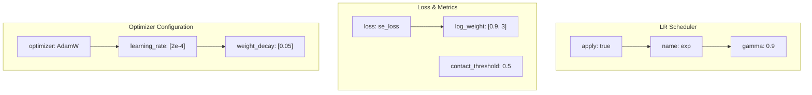
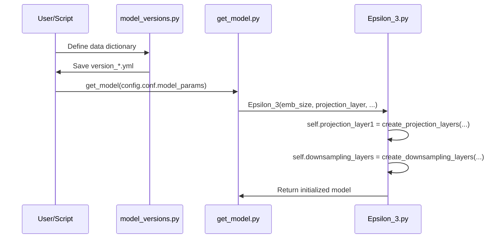

# Model Configuration Files

> **Relevant source files**
> * [params/Model_config_Epsilon_3_16.1.yml](https://github.com/isblab/disobind/blob/5fffcf84/params/Model_config_Epsilon_3_16.1.yml)
> * [params/Model_config_Epsilon_3_16.2.yml](https://github.com/isblab/disobind/blob/5fffcf84/params/Model_config_Epsilon_3_16.2.yml)
> * [params/Model_config_Epsilon_3_16.yml](https://github.com/isblab/disobind/blob/5fffcf84/params/Model_config_Epsilon_3_16.yml)
> * [params/Model_config_Epsilon_3_6.1.yml](https://github.com/isblab/disobind/blob/5fffcf84/params/Model_config_Epsilon_3_6.1.yml)
> * [params/Model_config_Epsilon_3_6.2.yml](https://github.com/isblab/disobind/blob/5fffcf84/params/Model_config_Epsilon_3_6.2.yml)
> * [params/Model_config_Epsilon_3_6.yml](https://github.com/isblab/disobind/blob/5fffcf84/params/Model_config_Epsilon_3_6.yml)
> * [src/model_versions.py](https://github.com/isblab/disobind/blob/5fffcf84/src/model_versions.py)
> * [src/models/Epsilon_3.py](https://github.com/isblab/disobind/blob/5fffcf84/src/models/Epsilon_3.py)
> * [src/models/get_model.py](https://github.com/isblab/disobind/blob/5fffcf84/src/models/get_model.py)

## Purpose and Scope

This document describes the YAML configuration files used to define Disobind model architectures, training parameters, and dataset settings. These configuration files are located in the `params/` directory and control all aspects of model training and behavior for the `Epsilon_3` neural network [src/models/Epsilon_3.py L15-L20](https://github.com/isblab/disobind/blob/5fffcf84/src/models/Epsilon_3.py#L15-L20)

The system utilizes these files to bridge high-level task definitions (like interaction vs. interface prediction) with specific architectural hyperparameters (like projection dimensions, hidden layers, and activation functions).

## Configuration File Overview

Disobind uses YAML files to define model configurations. The repository includes primary configuration files corresponding to the prediction tasks (2 objectives × 3 coarse-graining levels). These files are typically generated or managed via `src/model_versions.py` [src/model_versions.py L14-L16](https://github.com/isblab/disobind/blob/5fffcf84/src/model_versions.py#L14-L16)

| Configuration File | Task | Objective | Coarse-Graining | Model Version |
| --- | --- | --- | --- | --- |
| `Model_config_Epsilon_3_6.2.yml` | interaction_1 | interaction | 1 | 6.2 |
| `Model_config_Epsilon_3_6.1.yml` | interaction_5 | interaction_bin | 5 | 6.1 |
| `Model_config_Epsilon_3_6.yml` | interaction_10 | interaction_bin | 10 | 6 |
| `Model_config_Epsilon_3_16.yml` | interface_1 | interface | 1 | 16 |
| `Model_config_Epsilon_3_16.1.yml` | interface_5 | interface_bin | 5 | 16.1 |
| `Model_config_Epsilon_3_16.2.yml` | interface_10 | interface_bin | 10 | 16.2 |

**Sources:** [params/Model_config_Epsilon_3_6.yml L1-L126](https://github.com/isblab/disobind/blob/5fffcf84/params/Model_config_Epsilon_3_6.yml#L1-L126)

 [params/Model_config_Epsilon_3_6.1.yml L1-L126](https://github.com/isblab/disobind/blob/5fffcf84/params/Model_config_Epsilon_3_6.1.yml#L1-L126)

 [params/Model_config_Epsilon_3_6.2.yml L1-L126](https://github.com/isblab/disobind/blob/5fffcf84/params/Model_config_Epsilon_3_6.2.yml#L1-L126)

 [params/Model_config_Epsilon_3_16.yml L1-L121](https://github.com/isblab/disobind/blob/5fffcf84/params/Model_config_Epsilon_3_16.yml#L1-L121)

 [params/Model_config_Epsilon_3_16.1.yml L1-L121](https://github.com/isblab/disobind/blob/5fffcf84/params/Model_config_Epsilon_3_16.1.yml#L1-L121)

 [params/Model_config_Epsilon_3_16.2.yml L1-L121](https://github.com/isblab/disobind/blob/5fffcf84/params/Model_config_Epsilon_3_16.2.yml#L1-L121)

## Configuration File Structure

Each YAML configuration file follows a hierarchical structure that maps directly to the `Epsilon_3` class initialization in `src/models/get_model.py` [src/models/get_model.py L4-L24](https://github.com/isblab/disobind/blob/5fffcf84/src/models/get_model.py#L4-L24)



**Sources:** [params/Model_config_Epsilon_3_16.1.yml L1-L121](https://github.com/isblab/disobind/blob/5fffcf84/params/Model_config_Epsilon_3_16.1.yml#L1-L121)

 [src/model_versions.py L43-L149](https://github.com/isblab/disobind/blob/5fffcf84/src/model_versions.py#L43-L149)

## Model Parameters Section

The `conf.model_params` section defines the `Epsilon_3` neural network architecture.

### Key Hyperparameters

#### Projection Layer Configuration

The `projection_layer` parameter is a list defining the initial transformation of protein embeddings [src/models/Epsilon_3.py L64-L80](https://github.com/isblab/disobind/blob/5fffcf84/src/models/Epsilon_3.py#L64-L80)

```yaml
projection_layer:  - 128      # [0] Projection dimension (projection_dim)  - ln2      # [1] Normalization type (passed to create_projection_layers)  - true     # [2] Use bias in projection  - 1        # [3] Multiplier for scaling  - ''       # [4] Separate projection flag ('separate' or '')
```

* **Source Code Mapping:** This list is unpacked in `Epsilon_3.__init__` to set `self.projection_dim` [src/models/Epsilon_3.py L23](https://github.com/isblab/disobind/blob/5fffcf84/src/models/Epsilon_3.py#L23-L23)  and call `create_projection_layers` [src/models/Epsilon_3.py L64](https://github.com/isblab/disobind/blob/5fffcf84/src/models/Epsilon_3.py#L64-L64)

#### Hidden Layers (num_hid_layers)

Defines the depth and structure of the downsampling and upsampling blocks [src/models/Epsilon_3.py L92-L108](https://github.com/isblab/disobind/blob/5fffcf84/src/models/Epsilon_3.py#L92-L108)

```yaml
num_hid_layers:  - 0         # [0] num_upsample_layers  - 3         # [1] num_downsample_layers  - 0         # [2] num_blocks  - 2         # [3] scale_factor  - vanilla   # [4] hidden_block_type (vanilla/residual)  - ''        # [5] residual_connection type
```

* **Interaction models** (6.x): Use deeper stacks like `[0, 3, 0, 2, vanilla, '']` [params/Model_config_Epsilon_3_6.yml L24-L30](https://github.com/isblab/disobind/blob/5fffcf84/params/Model_config_Epsilon_3_6.yml#L24-L30)
* **Interface models** (16.x): Often use no hidden layers `[0, 0, 0, 0, vanilla, '']` [params/Model_config_Epsilon_3_16.yml L23-L29](https://github.com/isblab/disobind/blob/5fffcf84/params/Model_config_Epsilon_3_16.yml#L23-L29)

#### Activation and Normalization

* `activation1`: Primary activation (e.g., `elu`) [src/models/Epsilon_3.py L39-L40](https://github.com/isblab/disobind/blob/5fffcf84/src/models/Epsilon_3.py#L39-L40)
* `activation2`: Final activation (e.g., `sigmoid`) [src/models/Epsilon_3.py L41-L43](https://github.com/isblab/disobind/blob/5fffcf84/src/models/Epsilon_3.py#L41-L43)
* `norm`: Normalization strategy, usually `[true, 'LN']` for LayerNorm [src/models/Epsilon_3.py L57-L62](https://github.com/isblab/disobind/blob/5fffcf84/src/models/Epsilon_3.py#L57-L62)

**Sources:** [src/models/Epsilon_3.py L23-L128](https://github.com/isblab/disobind/blob/5fffcf84/src/models/Epsilon_3.py#L23-L128)

 [params/Model_config_Epsilon_3_16.1.yml L8-L56](https://github.com/isblab/disobind/blob/5fffcf84/params/Model_config_Epsilon_3_16.1.yml#L8-L56)

 [src/model_versions.py L51-L88](https://github.com/isblab/disobind/blob/5fffcf84/src/model_versions.py#L51-L88)

## Training Parameters Section

The `conf.train_params` section controls the optimization loop managed by the `Trainer` class.



### Optimizer and Scheduler

Disobind defaults to `AdamW` with an exponential learning rate scheduler [src/model_versions.py L115-L139](https://github.com/isblab/disobind/blob/5fffcf84/src/model_versions.py#L115-L139)

* `amsgrad`: Set to `true` for the AMSGrad variant [params/Model_config_Epsilon_3_16.1.yml L93](https://github.com/isblab/disobind/blob/5fffcf84/params/Model_config_Epsilon_3_16.1.yml#L93-L93)
* `scheduler.name`: Supports `linear`, `exp`, `multistep`, `cycliclr`, and `swa` [src/model_versions.py L127-L128](https://github.com/isblab/disobind/blob/5fffcf84/src/model_versions.py#L127-L128)

**Sources:** [params/Model_config_Epsilon_3_16.1.yml L71-L120](https://github.com/isblab/disobind/blob/5fffcf84/params/Model_config_Epsilon_3_16.1.yml#L71-L120)

 [src/model_versions.py L102-L147](https://github.com/isblab/disobind/blob/5fffcf84/src/model_versions.py#L102-L147)

## Implementation: Mapping Config to Code

The `get_model` function in `src/models/get_model.py` acts as the factory that translates the YAML dictionary into a live `torch.nn.Module`.



**Sources:** [src/models/get_model.py L4-L27](https://github.com/isblab/disobind/blob/5fffcf84/src/models/get_model.py#L4-L27)

 [src/models/Epsilon_3.py L15-L128](https://github.com/isblab/disobind/blob/5fffcf84/src/models/Epsilon_3.py#L15-L128)

 [src/model_versions.py L151](https://github.com/isblab/disobind/blob/5fffcf84/src/model_versions.py#L151-L151)

## Creating Custom Model Configurations

To create a custom model configuration, users should modify `src/model_versions.py` and run it to generate a new YAML file.

1. **Set Objective:** Choose between `interaction` (contact map) or `interface` (residue list) and set the Coarse-Graining (CG) level [src/model_versions.py L25-L26](https://github.com/isblab/disobind/blob/5fffcf84/src/model_versions.py#L25-L26) ```markdown # Example: Interface prediction with CG=10objective = ["interface_bin", 10, "avg", False, True, False] ```
2. **Adjust Projection:** Modify `projection_layer` to change the bottleneck size [src/model_versions.py L59](https://github.com/isblab/disobind/blob/5fffcf84/src/model_versions.py#L59-L59)
3. **Define Depth:** Adjust `num_hid_layers` to add or remove downsampling stages [src/model_versions.py L73](https://github.com/isblab/disobind/blob/5fffcf84/src/model_versions.py#L73-L73)
4. **Set Paths:** Update `input_files` and `output_path` in the `dataset` dictionary [src/model_versions.py L94-L98](https://github.com/isblab/disobind/blob/5fffcf84/src/model_versions.py#L94-L98)
5. **Run Script:** Execute `python src/model_versions.py` to produce the `version_*.yml` file [src/model_versions.py L151](https://github.com/isblab/disobind/blob/5fffcf84/src/model_versions.py#L151-L151)

**Sources:** [src/model_versions.py L17-L151](https://github.com/isblab/disobind/blob/5fffcf84/src/model_versions.py#L17-L151)