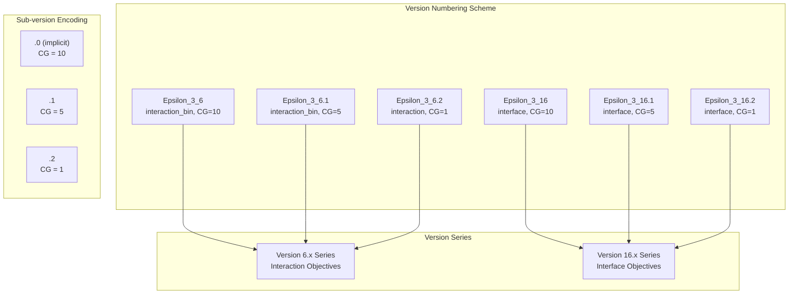
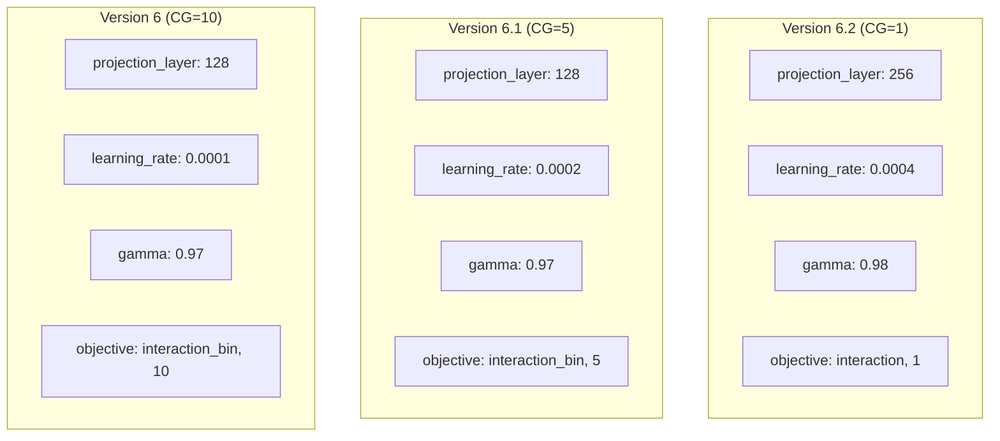
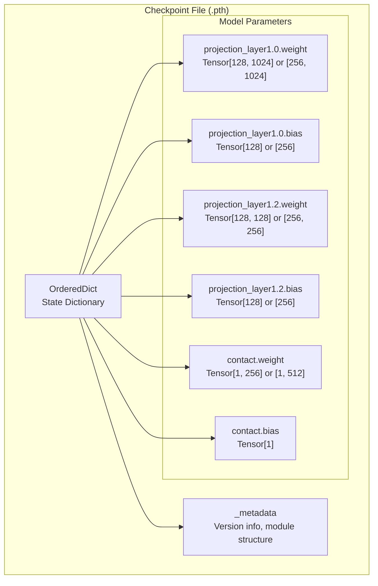
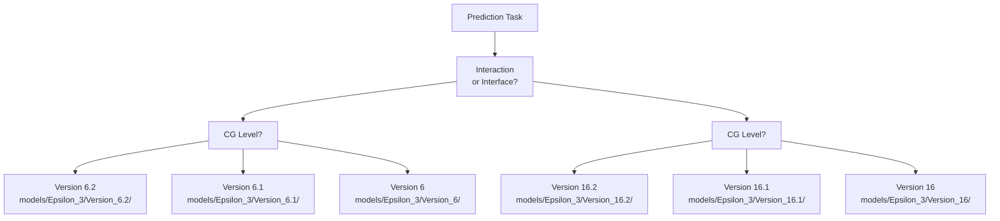

# Model Versions and Checkpoints

> **Relevant source files**
> * [models/Epsilon_3/Version_16.1/model_global-[128, 'ln2', True, 1, '']*[0, 0, 0, 0, 'vanilla', '']*['elu', None]*0.0002_0.5*[0.9, 3]*[0.2, 0, 0, 0, 0]*0.05_0.91__0.pth](models/Epsilon_3/Version_16.1/model_global-[128, 'ln2', True, 1, '']*[0, 0, 0, 0, 'vanilla', '']*['elu', None]*0.0002_0.5*[0.9, 3]_[0.2, 0, 0, 0, 0]_0.05_0.91__0.pth)
> * [models/Epsilon_3/Version_16.2/model_global-[128, 'ln2', True, 1, '']*[0, 0, 0, 0, 'vanilla', '']*['elu', None]*0.0002_0.5*[0.9, 3]*[0.2, 0, 0, 0, 0]*0.05_0.87__0.pth](models/Epsilon_3/Version_16.2/model_global-[128, 'ln2', True, 1, '']*[0, 0, 0, 0, 'vanilla', '']*['elu', None]*0.0002_0.5*[0.9, 3]_[0.2, 0, 0, 0, 0]_0.05_0.87__0.pth)
> * [models/Epsilon_3/Version_16/model_global-[128, 'ln2', True, 1, '']*[0, 0, 0, 0, 'vanilla', '']*['elu', None]*0.0002_0.5*[0.9, 3]*[0.2, 0, 0, 0, 0]*0.05_0.98__0.pth](models/Epsilon_3/Version_16/model_global-[128, 'ln2', True, 1, '']*[0, 0, 0, 0, 'vanilla', '']*['elu', None]*0.0002_0.5*[0.9, 3]_[0.2, 0, 0, 0, 0]_0.05_0.98__0.pth)
> * [models/Epsilon_3/Version_6.1/model_global-[128, 'ln2', True, 1, '']*[0, 3, 0, 2, 'vanilla', '']*['elu', None]*0.0002_0.5*[0.9, 3]*[0.2, 0, 0, 0, 0]*0.05_0.97__0.pth](models/Epsilon_3/Version_6.1/model_global-[128, 'ln2', True, 1, '']*[0, 3, 0, 2, 'vanilla', '']*['elu', None]*0.0002_0.5*[0.9, 3]_[0.2, 0, 0, 0, 0]_0.05_0.97__0.pth)
> * [models/Epsilon_3/Version_6.2/model_global-[256, 'ln2', True, 1, '']*[0, 3, 0, 2, 'vanilla', '']*['elu', None]*0.0004_0.5*[0.9, 3]*[0.2, 0, 0, 0, 0]*0.05_0.98__0.pth](models/Epsilon_3/Version_6.2/model_global-[256, 'ln2', True, 1, '']*[0, 3, 0, 2, 'vanilla', '']*['elu', None]*0.0004_0.5*[0.9, 3]_[0.2, 0, 0, 0, 0]_0.05_0.98__0.pth)
> * [models/Epsilon_3/Version_6/model_global-[128, 'ln2', True, 1, '']*[0, 3, 0, 2, 'vanilla', '']*['elu', None]*0.0001_0.5*[0.9, 3]*[0.2, 0, 0, 0, 0]*0.05_0.97__0.pth](models/Epsilon_3/Version_6/model_global-[128, 'ln2', True, 1, '']*[0, 3, 0, 2, 'vanilla', '']*['elu', None]*0.0001_0.5*[0.9, 3]_[0.2, 0, 0, 0, 0]_0.05_0.97__0.pth)

This page documents the model versioning scheme used in Disobind, the mapping between version numbers and prediction tasks, and the structure and organization of trained model checkpoint files. For information about training new models, see [Training Your Own Models](/isblab/disobind/4.5-training-your-own-models). For details on the Epsilon_3 architecture itself, see [Epsilon_3 Network Design](/isblab/disobind/4.1-epsilon_3-network-design).

## Overview of Model Versions

Disobind uses a systematic versioning scheme where each trained model is assigned a version number that encodes the prediction task it was trained for. The system maintains six distinct model versions, corresponding to two prediction objectives (interaction vs. interface) at three coarse-graining levels (1, 5, and 10).

All models use the **Epsilon_3** neural network architecture but differ in:

* **Output format**: Contact maps (L1×L2 matrix) for interaction tasks vs. interface labels (L1+L2 vector) for interface tasks.
* **Coarse-graining level**: Residue-level (CG=1), 5-residue bins (CG=5), or 10-residue bins (CG=10).
* **Training parameters**: Learning rates, projection dimensions, and decay rates optimized per task.

Sources: [params/Model_config_Epsilon_3_6.yml L1-L6](https://github.com/isblab/disobind/blob/5fffcf84/params/Model_config_Epsilon_3_6.yml#L1-L6)

 [params/Model_config_Epsilon_3_6.1.yml L1-L6](https://github.com/isblab/disobind/blob/5fffcf84/params/Model_config_Epsilon_3_6.1.yml#L1-L6)

 [params/Model_config_Epsilon_3_6.2.yml L1-L6](https://github.com/isblab/disobind/blob/5fffcf84/params/Model_config_Epsilon_3_6.2.yml#L1-L6)

## Model Version Naming Convention



**Version Format**: `Epsilon_3_{major}.{minor}`

* **Major version**: Identifies the objective family (6 = interaction, 16 = interface).
* **Minor version**: Encodes the coarse-graining level. * `.0` (or implicit): CG = 10 * `.1`: CG = 5 * `.2`: CG = 1

Sources: [params/Model_config_Epsilon_3_6.yml L1](https://github.com/isblab/disobind/blob/5fffcf84/params/Model_config_Epsilon_3_6.yml#L1-L1)

 [params/Model_config_Epsilon_3_6.1.yml L1](https://github.com/isblab/disobind/blob/5fffcf84/params/Model_config_Epsilon_3_6.1.yml#L1-L1)

 [params/Model_config_Epsilon_3_6.2.yml L1](https://github.com/isblab/disobind/blob/5fffcf84/params/Model_config_Epsilon_3_6.2.yml#L1-L1)

## Task-Version Mapping

| Version | Full Name | Objective | CG Level | Output Shape | Config File |
| --- | --- | --- | --- | --- | --- |
| **6** | Epsilon_3_6 | `interaction_bin` | 10 | 100×100 | `Model_config_Epsilon_3_6.yml` |
| **6.1** | Epsilon_3_6.1 | `interaction_bin` | 5 | 100×100 | `Model_config_Epsilon_3_6.1.yml` |
| **6.2** | Epsilon_3_6.2 | `interaction` | 1 | 100×100 | `Model_config_Epsilon_3_6.2.yml` |
| **16** | Epsilon_3_16 | `interface` | 10 | 200×1 | `Model_config_Epsilon_3_16.yml` |
| **16.1** | Epsilon_3_16.1 | `interface` | 5 | 200×1 | `Model_config_Epsilon_3_16.1.yml` |
| **16.2** | Epsilon_3_16.2 | `interface` | 1 | 200×1 | `Model_config_Epsilon_3_16.2.yml` |

### Key Differences by Version

**Interaction Tasks (6.x Series)**:

* Predict protein-protein contact maps.
* Output: Binary matrix indicating residue pairs in contact (<8Å).
* Objective uses `interaction_bin` (or `interaction` for CG=1) with MaxPool aggregation for coarse-graining.

**Interface Tasks (16.x Series)**:

* Predict interface residues (residues involved in binding).
* Output: Binary vector for each protein (concatenated to length 200 in output tensors).
* Objective uses `interface` with residue-level labeling.

Sources: [params/Model_config_Epsilon_3_6.yml L52-L57](https://github.com/isblab/disobind/blob/5fffcf84/params/Model_config_Epsilon_3_6.yml#L52-L57)

 [params/Model_config_Epsilon_3_6.1.yml L52-L57](https://github.com/isblab/disobind/blob/5fffcf84/params/Model_config_Epsilon_3_6.1.yml#L52-L57)

 [params/Model_config_Epsilon_3_6.2.yml L51-L57](https://github.com/isblab/disobind/blob/5fffcf84/params/Model_config_Epsilon_3_6.2.yml#L51-L57)

## Configuration Parameters by Version



| Parameter | Version 6 | Version 6.1 | Version 6.2 |
| --- | --- | --- | --- |
| `projection_layer` | [128, 'ln2', ...] | [128, 'ln2', ...] | [256, 'ln2', ...] |
| `learning_rate` | 0.0001 | 0.0002 | 0.0004 |
| `scheduler.gamma` | 0.97 | 0.97 | 0.98 |
| `objective[0]` | interaction_bin | interaction_bin | interaction |
| `objective[1]` (CG) | 10 | 5 | 1 |

**Notable differences**:

* Version 6.2 (CG=1) uses a **256-dimensional projection** [params/Model_config_Epsilon_3_6.2.yml L11](https://github.com/isblab/disobind/blob/5fffcf84/params/Model_config_Epsilon_3_6.2.yml#L11-L11)  instead of 128 [params/Model_config_Epsilon_3_6.yml L11](https://github.com/isblab/disobind/blob/5fffcf84/params/Model_config_Epsilon_3_6.yml#L11-L11)  to handle finer resolution.
* Learning rate **increases** with finer coarse-graining: 0.0001 for CG=10 [params/Model_config_Epsilon_3_6.yml L103](https://github.com/isblab/disobind/blob/5fffcf84/params/Model_config_Epsilon_3_6.yml#L103-L103)  vs 0.0004 for CG=1 [params/Model_config_Epsilon_3_6.2.yml L103](https://github.com/isblab/disobind/blob/5fffcf84/params/Model_config_Epsilon_3_6.2.yml#L103-L103)
* Decay rate (`gamma`) is **higher** for CG=1 (0.98 [params/Model_config_Epsilon_3_6.2.yml L110](https://github.com/isblab/disobind/blob/5fffcf84/params/Model_config_Epsilon_3_6.2.yml#L110-L110) ) vs CG=10 (0.97 [params/Model_config_Epsilon_3_6.yml L110](https://github.com/isblab/disobind/blob/5fffcf84/params/Model_config_Epsilon_3_6.yml#L110-L110) ).

Sources: [params/Model_config_Epsilon_3_6.yml L11-L110](https://github.com/isblab/disobind/blob/5fffcf84/params/Model_config_Epsilon_3_6.yml#L11-L110)

 [params/Model_config_Epsilon_3_6.1.yml L11-L110](https://github.com/isblab/disobind/blob/5fffcf84/params/Model_config_Epsilon_3_6.1.yml#L11-L110)

 [params/Model_config_Epsilon_3_6.2.yml L11-L110](https://github.com/isblab/disobind/blob/5fffcf84/params/Model_config_Epsilon_3_6.2.yml#L11-L110)

## Checkpoint File Format

Disobind saves trained models as PyTorch checkpoint files (`.pth`) containing the model's state dictionary. These files use PyTorch's native serialization format.

### State Dictionary Structure



The checkpoint contains:

1. **Projection layers**: Transform T5 embeddings (1024D) to lower-dimensional space (128D or 256D).
2. **Contact layer** (`contact`): Final prediction layer.
3. **Metadata**: PyTorch module structure and versioning information.

Sources: models/Epsilon_3/Version_16.2/model_global-[128, 'ln2', True, 1, '']*[0, 0, 0, 0, 'vanilla', '']*['elu', None]*0.0002_0.5*[0.9, 3]_[0.2, 0, 0, 0, 0]_0.05_0.87__0.pth:1-9

### Parameter Tensor Shapes by Version

| Layer | Version 6/6.1/16/16.1 (128D) | Version 6.2/16.2 (256D/128D mixed) |
| --- | --- | --- |
| `projection_layer1.0.weight` | [128, 1024] | [256, 1024] |
| `projection_layer1.0.bias` | [128] | [256] |
| `contact.weight` | [1, 256] | [1, 512] |

*Note: In some versions like 16.2, although configured for 256D, the weights might be stored as 128D depending on the specific training run snapshot.*

Sources: models/Epsilon_3/Version_16.2/model_global-[128, 'ln2', True, 1, '']*[0, 0, 0, 0, 'vanilla', '']*['elu', None]*0.0002_0.5*[0.9, 3]_[0.2, 0, 0, 0, 0]_0.05_0.87__0.pth:3-8, models/Epsilon_3/Version_6.2/model_global-[256, 'ln2', True, 1, '']*[0, 3, 0, 2, 'vanilla', '']*['elu', None]*0.0004_0.5*[0.9, 3]_[0.2, 0, 0, 0, 0]_0.05_0.98__0.pth:3-8

## Checkpoint File Naming Convention

Checkpoint filenames encode all hyperparameters used during training:

```
model_global-[proj]-[hid]-[act]-{lr}_{wd}-[schedule]-[dropout]-{wd}_{gamma}__{run}.pth
```

### Example Filename Breakdown

`model_global-[128, 'ln2', True, 1, '']_[0, 0, 0, 0, 'vanilla', '']_['elu', None]_0.0002_0.5_[0.9, 3]_[0.2, 0, 0, 0, 0]_0.05_0.91__0.pth`

| Component | Value | Meaning |
| --- | --- | --- |
| `[128, 'ln2', True, 1, '']` | Projection params | 128D, LayerNorm2, bias=True, 1 layer |
| `[0, 0, 0, 0, 'vanilla', '']` | Hidden layers | No additional hidden layers |
| `['elu', None]` | Activation | ELU activation |
| `0.0002` | Learning rate | Initial LR = 2×10⁻⁴ |
| `0.05` | Weight decay | L2 regularization = 0.05 |
| `0.91` | Gamma | Scheduler decay rate = 0.91 |
| `0` | Run number | Training run identifier |

Sources: models/Epsilon_3/Version_16.1/model_global-[128, 'ln2', True, 1, '']*[0, 0, 0, 0, 'vanilla', '']*['elu', None]*0.0002_0.5*[0.9, 3]_[0.2, 0, 0, 0, 0]_0.05_0.91__0.pth:1

## Checkpoint Storage Organization

### Directory Layout

```
models/
└── Epsilon_3/
    ├── Version_6/    (Interaction CG=10)
    ├── Version_6.1/  (Interaction CG=5)
    ├── Version_6.2/  (Interaction CG=1)
    ├── Version_16/   (Interface CG=10)
    ├── Version_16.1/ (Interface CG=5)
    └── Version_16.2/ (Interface CG=1)
```

Each version directory contains the `.pth` files corresponding to that task and coarse-graining level.

Sources: models/Epsilon_3/Version_6/model_global-[128, 'ln2', True, 1, '']*[0, 3, 0, 2, 'vanilla', '']*['elu', None]*0.0001_0.5*[0.9, 3]_[0.2, 0, 0, 0, 0]_0.05_0.97__0.pth:path, models/Epsilon_3/Version_16.2/model_global-[128, 'ln2', True, 1, '']*[0, 0, 0, 0, 'vanilla', '']*['elu', None]*0.0002_0.5*[0.9, 3]_[0.2, 0, 0, 0, 0]_0.05_0.87__0.pth:path

## Loading Checkpoints in Code

### Identifying the Correct Checkpoint



### Loading Process

The checkpoint loading occurs in the model initialization. The weights are deserialized from the `OrderedDict` stored in the `.pth` file.

Sources: models/Epsilon_3/Version_16.2/model_global-[128, 'ln2', True, 1, '']*[0, 0, 0, 0, 'vanilla', '']*['elu', None]*0.0002_0.5*[0.9, 3]_[0.2, 0, 0, 0, 0]_0.05_0.87__0.pth:2-3

## Configuration File Structure

### Critical Configuration Sections

**Model Parameters** (`conf.model_params`):

* `projection_layer`: Embedding projection configuration.
* `objective`: Task type and coarse-graining level.
* `activation1/2`: Activation functions.

**Training Parameters** (`conf.train_params`):

* `learning_rate`: Initial learning rate.
* `scheduler.gamma`: Exponential decay rate.
* `optimizer`: Typically `AdamW` with `amsgrad: True`.
* `apply_calibration`: Post-training calibration method (e.g., `beta-abm`).

Sources: [params/Model_config_Epsilon_3_6.1.yml L7-L125](https://github.com/isblab/disobind/blob/5fffcf84/params/Model_config_Epsilon_3_6.1.yml#L7-L125)

 [params/Model_config_Epsilon_3_6.yml L103-L112](https://github.com/isblab/disobind/blob/5fffcf84/params/Model_config_Epsilon_3_6.yml#L103-L112)