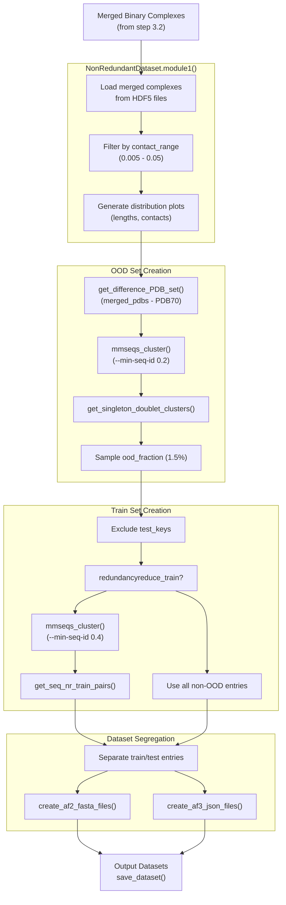
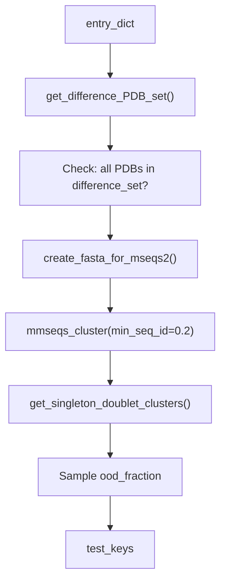

# Non-Redundant Dataset Creation

> **Relevant source files**
> * [database/input_files/Merged_DIBS_MFIB_Fdb_PDBtot-cdr.csv](https://github.com/isblab/disobind/blob/5fffcf84/database/input_files/Merged_DIBS_MFIB_Fdb_PDBtot-cdr.csv)
> * [database/input_files/pdb70_clu.tsv](https://github.com/isblab/disobind/blob/5fffcf84/database/input_files/pdb70_clu.tsv)
> * [dataset/4_create_non_redundant_dataset.py](https://github.com/isblab/disobind/blob/5fffcf84/dataset/4_create_non_redundant_dataset.py)

## Purpose and Scope

This document describes the process of creating non-redundant training and out-of-distribution (OOD) test datasets from merged binary complexes. The redundancy reduction ensures that:

1. The OOD test set is non-redundant with respect to itself, the training set, and the AlphaFold2 PDB70 dataset.
2. The training set optionally undergoes redundancy reduction at a specified sequence identity threshold.
3. Datasets are properly split and formatted for downstream model training and evaluation.

For information about creating merged binary complexes (the input to this process), see [Creating Binary Complexes](/isblab/disobind/3.2-creating-binary-complexes). For generating embeddings from the non-redundant datasets, see [Generating Embeddings](/isblab/disobind/3.4-generating-embeddings).

**Sources:** [dataset/4_create_non_redundant_dataset.py L1-L249](https://github.com/isblab/disobind/blob/5fffcf84/dataset/4_create_non_redundant_dataset.py#L1-L249)

 [dataset/README.md L19-L22](https://github.com/isblab/disobind/blob/5fffcf84/dataset/README.md?plain=1#L19-L22)

---

## Overview

The non-redundant dataset creation process is implemented in the `NonRedundantDataset` class [dataset/4_create_non_redundant_dataset.py L31-L143](https://github.com/isblab/disobind/blob/5fffcf84/dataset/4_create_non_redundant_dataset.py#L31-L143)

 and performs four main operations:

1. **Filtering by contact density**: Select merged binary complexes with appropriate contact fractions.
2. **OOD set creation**: Generate a test set non-redundant at both PDB and sequence levels.
3. **Train set creation**: Create a training set excluding OOD entries, with optional redundancy reduction.
4. **Dataset segregation**: Split data and prepare input files for AlphaFold predictions.

**Sources:** [dataset/4_create_non_redundant_dataset.py L31-L143](https://github.com/isblab/disobind/blob/5fffcf84/dataset/4_create_non_redundant_dataset.py#L31-L143)

---

## Workflow Overview

### System Data Flow Diagram

The diagram below bridges the natural language process steps to the specific code entities in `4_create_non_redundant_dataset.py`.



**Sources:** [dataset/4_create_non_redundant_dataset.py L145-L249](https://github.com/isblab/disobind/blob/5fffcf84/dataset/4_create_non_redundant_dataset.py#L145-L249)

 [dataset/4_create_non_redundant_dataset.py L312-L375](https://github.com/isblab/disobind/blob/5fffcf84/dataset/4_create_non_redundant_dataset.py#L312-L375)

 [dataset/4_create_non_redundant_dataset.py L861-L903](https://github.com/isblab/disobind/blob/5fffcf84/dataset/4_create_non_redundant_dataset.py#L861-L903)

---

## Input Requirements

The script expects merged binary complexes created by the previous pipeline stage (see [Creating Binary Complexes](/isblab/disobind/3.2-creating-binary-complexes)).

### Required Input Files

| File/Directory | Description | Source Reference |
| --- | --- | --- |
| `merged_binary_complexes_dir` | Directory containing merged complex HDF5 files | [dataset/4_create_non_redundant_dataset.py L47](https://github.com/isblab/disobind/blob/5fffcf84/dataset/4_create_non_redundant_dataset.py#L47-L47) |
| `merged_binary_complexes_file` | Comma-separated list of complex keys | [dataset/4_create_non_redundant_dataset.py L49](https://github.com/isblab/disobind/blob/5fffcf84/dataset/4_create_non_redundant_dataset.py#L49-L49) |
| `uni_seq_path` | Uniprot sequences dictionary | [dataset/4_create_non_redundant_dataset.py L45](https://github.com/isblab/disobind/blob/5fffcf84/dataset/4_create_non_redundant_dataset.py#L45-L45) |
| `pdb70_tsv_file` | PDB70 cluster assignments | [dataset/4_create_non_redundant_dataset.py L66](https://github.com/isblab/disobind/blob/5fffcf84/dataset/4_create_non_redundant_dataset.py#L66-L66) |
| `pdb70_rep_fasta_file` | PDB70 representative sequences | [dataset/4_create_non_redundant_dataset.py L74](https://github.com/isblab/disobind/blob/5fffcf84/dataset/4_create_non_redundant_dataset.py#L74-L74) |

### HDF5 File Structure

Each merged binary complex HDF5 file contains metadata and the binary contact map:

```css
{    "prot1_seq": str[],           # Protein 1 sequence    "prot2_seq": str[],           # Protein 2 sequence    "prot1_length": int,          # Length of protein 1    "prot2_length": int,          # Length of protein 2    "prot1_uni_boundary": str,    # "start-end" boundary    "prot2_uni_boundary": str,    # "start-end" boundary    "binary_cmap": np.array,      # Binary contact map    "contacts_count": int,        # Number of contacts    "merged_entries": str[]       # List of merged PDB entries}
```

**Sources:** [dataset/4_create_non_redundant_dataset.py L312-L375](https://github.com/isblab/disobind/blob/5fffcf84/dataset/4_create_non_redundant_dataset.py#L312-L375)

---

## Module 1: Loading and Filtering by Contact Density

### Purpose

Load merged binary complexes and filter based on contact density to reduce dataset sparsity while maintaining sufficient positive examples.

### Implementation

The `module1()` method [dataset/4_create_non_redundant_dataset.py L312-L375](https://github.com/isblab/disobind/blob/5fffcf84/dataset/4_create_non_redundant_dataset.py#L312-L375)

 filters complexes where the fraction of contacts falls within the specified range:

```markdown
self.contact_range = [0.005, 0.05]  # 0.5% to 5%
```

### Output

* `entry_dict`: Dictionary containing all filtered complexes in memory [dataset/4_create_non_redundant_dataset.py L134](https://github.com/isblab/disobind/blob/5fffcf84/dataset/4_create_non_redundant_dataset.py#L134-L134)
* `unique_merged_pdbs`: Set of all PDB IDs from merged complexes [dataset/4_create_non_redundant_dataset.py L128](https://github.com/isblab/disobind/blob/5fffcf84/dataset/4_create_non_redundant_dataset.py#L128-L128)
* Distribution plots: `Summary_plots_pre_filter.png` and `Summary_plots_post_filter.png` [dataset/4_create_non_redundant_dataset.py L276-L309](https://github.com/isblab/disobind/blob/5fffcf84/dataset/4_create_non_redundant_dataset.py#L276-L309)

**Sources:** [dataset/4_create_non_redundant_dataset.py L312-L375](https://github.com/isblab/disobind/blob/5fffcf84/dataset/4_create_non_redundant_dataset.py#L312-L375)

 [dataset/4_create_non_redundant_dataset.py L113](https://github.com/isblab/disobind/blob/5fffcf84/dataset/4_create_non_redundant_dataset.py#L113-L113)

---

## Module 2: OOD Test Set Creation

### Purpose

Create an out-of-distribution test set that is non-redundant with the AlphaFold2 PDB70 training dataset, non-redundant with itself (<20% sequence identity), and representative of novel interactions.

### Redundancy Reduction Implementation

The OOD creation logic involves structural comparison against PDB70 and sequence clustering via MMSeqs2.



### Sequence-Level Filtering

**Key method:** `create_fasta_for_mseqs2()` [dataset/4_create_non_redundant_dataset.py L437-L473](https://github.com/isblab/disobind/blob/5fffcf84/dataset/4_create_non_redundant_dataset.py#L437-L473)

 `get_singleton_doublet_clusters()` [dataset/4_create_non_redundant_dataset.py L506-L544](https://github.com/isblab/disobind/blob/5fffcf84/dataset/4_create_non_redundant_dataset.py#L506-L544)

The process creates unique headers for each protein sequence to enable post-clustering identification:
**Header format:** `{entry_id}:{uni_id}-{boundary}` [dataset/4_create_non_redundant_dataset.py L421-L424](https://github.com/isblab/disobind/blob/5fffcf84/dataset/4_create_non_redundant_dataset.py#L421-L424)

**MMSeqs2 clustering parameters:**

* Algorithm: `easy-cluster` [dataset/4_create_non_redundant_dataset.py L124](https://github.com/isblab/disobind/blob/5fffcf84/dataset/4_create_non_redundant_dataset.py#L124-L124)
* Sequence identity cutoff: `0.2` (20%) [dataset/4_create_non_redundant_dataset.py L119](https://github.com/isblab/disobind/blob/5fffcf84/dataset/4_create_non_redundant_dataset.py#L119-L119)
* Cluster mode: `1` [dataset/4_create_non_redundant_dataset.py L125](https://github.com/isblab/disobind/blob/5fffcf84/dataset/4_create_non_redundant_dataset.py#L125-L125)

**Cluster selection criteria:**
A Uniprot ID pair is included in the OOD set if:

1. **Singleton clusters**: Both prot1 and prot2 are in singleton clusters.
2. **Doublet clusters**: Both prot1 and prot2 are in the same doublet cluster.

**Sources:** [dataset/4_create_non_redundant_dataset.py L380-L640](https://github.com/isblab/disobind/blob/5fffcf84/dataset/4_create_non_redundant_dataset.py#L380-L640)

---

## Module 3: Train Set Creation

### Implementation

The training set is created by excluding entries selected for the OOD set [dataset/4_create_non_redundant_dataset.py L671-L700](https://github.com/isblab/disobind/blob/5fffcf84/dataset/4_create_non_redundant_dataset.py#L671-L700)

If `redundancyreduce_train` is set to `True`, the script applies sequence clustering at 40% identity (`train_ID_cutoff = 0.4`) [dataset/4_create_non_redundant_dataset.py L123](https://github.com/isblab/disobind/blob/5fffcf84/dataset/4_create_non_redundant_dataset.py#L123-L123)

**Selection criteria (get_seq_nr_train_pairs):**
A Uniprot ID pair is included in training if:

1. Both prot1 and prot2 headers are cluster representatives, **OR**
2. Both prot1 and prot2 belong to the same cluster [dataset/4_create_non_redundant_dataset.py L726-L754](https://github.com/isblab/disobind/blob/5fffcf84/dataset/4_create_non_redundant_dataset.py#L726-L754)

**Sources:** [dataset/4_create_non_redundant_dataset.py L703-L754](https://github.com/isblab/disobind/blob/5fffcf84/dataset/4_create_non_redundant_dataset.py#L703-L754)

---

## Module 4: Dataset Segregation and Output

### AlphaFold Prediction Inputs

For each test entry, the script generates specific input formats for structural validation:

1. **AlphaFold2 (AF2)**: FASTA files containing both protein sequences with boundary headers [dataset/4_create_non_redundant_dataset.py L760-L804](https://github.com/isblab/disobind/blob/5fffcf84/dataset/4_create_non_redundant_dataset.py#L760-L804)
2. **AlphaFold3 (AF3)**: JSON files formatted for the AF3 server, created in batches of 20 [dataset/4_create_non_redundant_dataset.py L807-L858](https://github.com/isblab/disobind/blob/5fffcf84/dataset/4_create_non_redundant_dataset.py#L807-L858)

### Final Dataset Output

The `save_dataset()` function [dataset/4_create_non_redundant_dataset.py L908-L955](https://github.com/isblab/disobind/blob/5fffcf84/dataset/4_create_non_redundant_dataset.py#L908-L955)

 writes the final data to disk:

* **CSV Files**: `prot_1-2_train_{version}.csv` and `prot_1-2_test_{version}.csv`.
* **HDF5 Files**: `Target_bcmap_train_{version}.h5` and `Target_bcmap_test_{version}.h5`.

The HDF5 files store binary contact maps indexed by a modified entry ID that includes sequence boundaries: `{UniID1}:{start1}:{end1}--{UniID2}:{start2}:{end2}_{copy_num}` [dataset/4_create_non_redundant_dataset.py L939-L940](https://github.com/isblab/disobind/blob/5fffcf84/dataset/4_create_non_redundant_dataset.py#L939-L940)

**Sources:** [dataset/4_create_non_redundant_dataset.py L861-L955](https://github.com/isblab/disobind/blob/5fffcf84/dataset/4_create_non_redundant_dataset.py#L861-L955)

---

## Configuration Parameters

| Parameter | Default | Description |
| --- | --- | --- |
| `contact_range` | `[0.005, 0.05]` | Fraction of contacts allowed [dataset/4_create_non_redundant_dataset.py L113](https://github.com/isblab/disobind/blob/5fffcf84/dataset/4_create_non_redundant_dataset.py#L113-L113) |
| `ood_fraction` | `0.015` | Fraction of total dataset for OOD set [dataset/4_create_non_redundant_dataset.py L117](https://github.com/isblab/disobind/blob/5fffcf84/dataset/4_create_non_redundant_dataset.py#L117-L117) |
| `ood_ID_cutoff` | `0.2` | Identity cutoff for OOD MMSeqs2 [dataset/4_create_non_redundant_dataset.py L119](https://github.com/isblab/disobind/blob/5fffcf84/dataset/4_create_non_redundant_dataset.py#L119-L119) |
| `train_ID_cutoff` | `0.4` | Identity cutoff for Train MMSeqs2 [dataset/4_create_non_redundant_dataset.py L123](https://github.com/isblab/disobind/blob/5fffcf84/dataset/4_create_non_redundant_dataset.py#L123-L123) |
| `redundancyreduce_train` | `False` | Toggle for training set reduction [dataset/4_create_non_redundant_dataset.py L121](https://github.com/isblab/disobind/blob/5fffcf84/dataset/4_create_non_redundant_dataset.py#L121-L121) |

**Sources:** [dataset/4_create_non_redundant_dataset.py L110-L126](https://github.com/isblab/disobind/blob/5fffcf84/dataset/4_create_non_redundant_dataset.py#L110-L126)