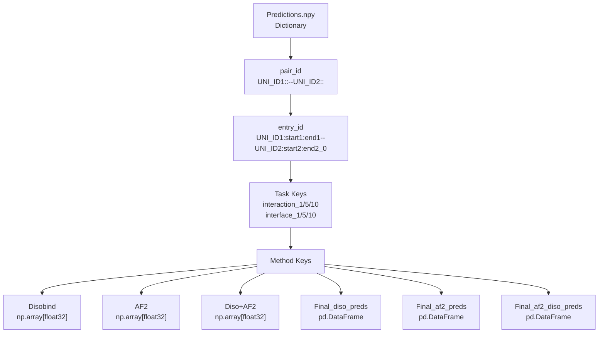
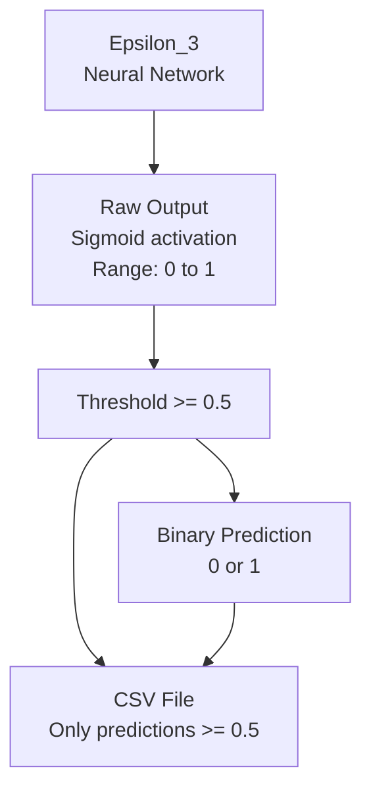
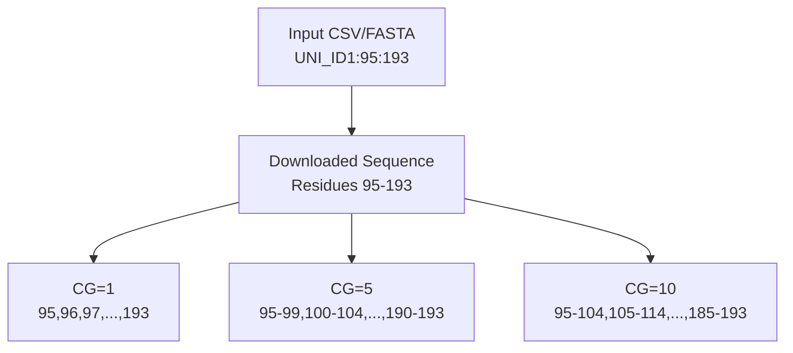

# Output Files and Interpretation

> **Relevant source files**
> * [README.md](https://github.com/isblab/disobind/blob/5fffcf84/README.md?plain=1)
> * [example/test.csv](https://github.com/isblab/disobind/blob/5fffcf84/example/test.csv)
> * [example/test.fasta](https://github.com/isblab/disobind/blob/5fffcf84/example/test.fasta)
> * [run_disobind.py](https://github.com/isblab/disobind/blob/5fffcf84/run_disobind.py)

This page describes the output files generated by Disobind predictions and how to interpret them. For information about preparing inputs, see [Input Format and Preparation](https://github.com/isblab/disobind/blob/5fffcf84/Input Format and Preparation)

 For details on AlphaFold integration during prediction, see [AlphaFold Integration](https://github.com/isblab/disobind/blob/5fffcf84/AlphaFold Integration)

---

## Overview of Output Files

The `run_disobind.py` script generates two primary output types: CSV files for human-readable predictions and an NPY file containing the complete prediction data structure.

**Output File Types**

| File Type | Purpose | Location |
| --- | --- | --- |
| `Predictions.npy` | Complete nested dictionary of all predictions | `{output_dir}/Predictions.npy` |
| CSV files | Human-readable predictions per task/method | `{output_dir}/{method}_{entry_id}_{task}_cg{cg}.csv` |
| `UniProt_seq.json` | Cached UniProt sequences | `{output_dir}/UniProt_seq.json` |

Sources: [run_disobind.py L84-L102](https://github.com/isblab/disobind/blob/5fffcf84/run_disobind.py#L84-L102)

 [run_disobind.py L126](https://github.com/isblab/disobind/blob/5fffcf84/run_disobind.py#L126-L126)

 [README.md L95-L100](https://github.com/isblab/disobind/blob/5fffcf84/README.md?plain=1#L95-L100)

---

## NPY Dictionary Structure

The `Predictions.npy` file contains a nested dictionary with predictions from all methods (Disobind, AF2, Disobind+AF2) for all tasks and coarse-graining levels.

### Dictionary Hierarchy



### Loading and Accessing Predictions

```javascript
import numpy as np # Load the predictions dictionarypredictions = np.load('output/Predictions.npy', allow_pickle=True).item() # Access structure:# predictions[pair_id][entry_id][task][method] # Example access patternpair_id = "P04273::--P04273::"entry_id = "P04273:95:193--P04273:95:192_0"task = "interface_1" # Get Disobind predictions (raw numpy array)disobind_pred = predictions[pair_id][entry_id][task]["Disobind"] # Get thresholded predictions (pandas DataFrame)disobind_df = predictions[pair_id][entry_id][task]["Final_diso_preds"] # Get combined Disobind+AF2 predictionscombined_pred = predictions[pair_id][entry_id][task]["Diso+AF2"]
```

### Array Shapes by Task Type

The `Disobind` class processes predictions for both `interaction` (contact maps) and `interface` residue objectives.

| Task Type | Array Shape | Description |
| --- | --- | --- |
| `interaction_1` | `[L1, L2]` | Contact map at residue resolution |
| `interaction_5` | `[L1//5, L2//5]` | Contact map with 5-residue bins |
| `interaction_10` | `[L1//10, L2//10]` | Contact map with 10-residue bins |
| `interface_1` | `[L1+L2, 1]` | Interface vector at residue resolution |
| `interface_5` | `[L1//5 + L2//5, 1]` | Interface vector with 5-residue bins |
| `interface_10` | `[L1//10 + L2//10, 1]` | Interface vector with 10-residue bins |

Sources: [run_disobind.py L532-L550](https://github.com/isblab/disobind/blob/5fffcf84/run_disobind.py#L532-L550)

 [run_disobind.py L606-L611](https://github.com/isblab/disobind/blob/5fffcf84/run_disobind.py#L606-L611)

 [run_disobind.py L652-L661](https://github.com/isblab/disobind/blob/5fffcf84/run_disobind.py#L652-L661)

---

## CSV File Format and Naming

Each prediction method and task generates a separate CSV file containing thresholded predictions in human-readable format.

### File Naming Convention

The output filenames are constructed in the `predict` method of the `Disobind` class.

```
{method}_{entry_id}_{objective}_cg{cg}.csv
```

**Components:**

* `{method}`: `diso`, `af2`, or `diso_af2`
* `{entry_id}`: Full entry identifier (e.g., `P04273:95:193--P04273:95:192_0`)
* `{objective}`: `interaction` or `interface`
* `{cg}`: Coarse-graining level (`1`, `5`, or `10`)

Sources: [run_disobind.py L823](https://github.com/isblab/disobind/blob/5fffcf84/run_disobind.py#L823-L823)

---

## CSV Column Formats

The CSV format differs between interaction (contact map) and interface tasks.

### Interaction Task CSV Format

For contact map prediction, the CSV contains four columns listing predicted contacts.

| Protein1 | Residue1 | Protein2 | Residue2 |
| --- | --- | --- | --- |
| P04273:95:193 | 100 | P04273:95:192 | 120 |
| P04273:95:193 | 100 | P04273:95:192 | 121 |
| P04273:95:193 | 105 | P04273:95:192 | 125 |

**Interpretation:** Each row represents a predicted inter-protein contact. Residue 100 of Protein1 contacts residues 120 and 121 of Protein2.

**Coarse-grained residue notation:**

* CG=1: Single residue number (e.g., `100`)
* CG=5: Residue range (e.g., `100-104`)
* CG=10: Residue range (e.g., `100-109`)

Sources: [run_disobind.py L784-L800](https://github.com/isblab/disobind/blob/5fffcf84/run_disobind.py#L784-L800)

 [README.md L105-L113](https://github.com/isblab/disobind/blob/5fffcf84/README.md?plain=1#L105-L113)

### Interface Task CSV Format

For interface residue prediction, the CSV lists interface residues from both proteins.

| Protein1 | Protein2 |
| --- | --- |
| 100 | 120 |
| 105 | 125 |
| 110 | 130 |
| 115 |  |

**Interpretation:** Residues listed in Protein1 column may interact with one or more residues in Protein2 column. Empty cells indicate unequal numbers of interface residues.

Sources: [run_disobind.py L801-L823](https://github.com/isblab/disobind/blob/5fffcf84/run_disobind.py#L801-L823)

 [README.md L113](https://github.com/isblab/disobind/blob/5fffcf84/README.md?plain=1#L113-L113)

---

## Understanding Prediction Values

### Probability Threshold

Disobind outputs continuous probability values between 0 and 1 from the sigmoid activation. CSV files apply a threshold to convert to binary predictions.



**Key Parameters:**

| Parameter | Value | Definition | Code Reference |
| --- | --- | --- | --- |
| `threshold` | 0.5 | Probability cutoff for predictions | [run_disobind.py L70](https://github.com/isblab/disobind/blob/5fffcf84/run_disobind.py#L70-L70) |
| `dist_threshold` | 8 Å | Distance for defining AF2 contacts | [run_disobind.py L72](https://github.com/isblab/disobind/blob/5fffcf84/run_disobind.py#L72-L72) |
| `plddt_threshold` | 70 | pLDDT cutoff for AF2 confidence | [run_disobind.py L74](https://github.com/isblab/disobind/blob/5fffcf84/run_disobind.py#L74-L74) |
| `pae_threshold` | 5 | PAE cutoff for AF2 confidence | [run_disobind.py L76](https://github.com/isblab/disobind/blob/5fffcf84/run_disobind.py#L76-L76) |

Sources: [run_disobind.py L69-L78](https://github.com/isblab/disobind/blob/5fffcf84/run_disobind.py#L69-L78)

 [run_disobind.py L786](https://github.com/isblab/disobind/blob/5fffcf84/run_disobind.py#L786-L786)

 [run_disobind.py L806](https://github.com/isblab/disobind/blob/5fffcf84/run_disobind.py#L806-L806)

### Combined Predictions (Disobind+AF2)

When AlphaFold structure files are provided, the system creates combined predictions using a `np.max` operation.

```markdown
# Combining Disobind and AF2 predictionsdiso_af2 = np.max( [output, af2_pred], axis = 0 )
```

Sources: [run_disobind.py L629-L633](https://github.com/isblab/disobind/blob/5fffcf84/run_disobind.py#L629-L633)

---

## Residue Numbering and Coarse-Graining

### Residue Index System

All residue numbers in CSV files use **UniProt numbering**. Residues are indexed according to the start/end positions provided in the input.



### Coarse-Graining Bin Calculation

The coarse-graining process uses kernel-based aggregation to map residue indices to bins.

**Bin assignment logic:**
For a protein fragment with `start` position:

* A residue at position `r` is mapped to a bin index `(r - start) // cg`.
* The corresponding bin label in the CSV is `f"{start + bin_idx*cg}-{start + bin_idx*cg + cg - 1}"`.

Sources: [run_disobind.py L696-L755](https://github.com/isblab/disobind/blob/5fffcf84/run_disobind.py#L696-L755)

 [run_disobind.py L148-L151](https://github.com/isblab/disobind/blob/5fffcf84/run_disobind.py#L148-L151)

### Effective Length After Coarse-Graining

The effective length of the sequence fragments changes based on the coarse-graining resolution.

```markdown
# Calculation of effective lengthif cg == 1:    eff_len = [len_p1, len_p2]else:    eff_len = [len_p1 // cg, len_p2 // cg]
```

Sources: [run_disobind.py L504-L508](https://github.com/isblab/disobind/blob/5fffcf84/run_disobind.py#L504-L508)

---

## Output Directory Structure

The output directory created by `run_disobind.py` contains the following files:

```markdown
output/
├── Predictions.npy                          # Main output dictionary
├── UniProt_seq.json                         # Cached sequences
├── diso_{entry_id}_interaction_cg1.csv      # Disobind interaction predictions
├── diso_{entry_id}_interface_cg1.csv        # Disobind interface predictions
├── af2_{entry_id}_interaction_cg1.csv       # AF2 interaction predictions (if available)
├── af2_{entry_id}_interface_cg1.csv         # AF2 interface predictions (if available)
└── diso_af2_{entry_id}_interaction_cg1.csv  # Combined predictions (if available)
```

**Intermediate files (cleaned after each batch):**

* `p1_p2_test.fasta` - FASTA file for embedding generation
* `p1_p2_test.h5` - HDF5 file containing T5 embeddings

Sources: [run_disobind.py L91-L108](https://github.com/isblab/disobind/blob/5fffcf84/run_disobind.py#L91-L108)

 [run_disobind.py L206](https://github.com/isblab/disobind/blob/5fffcf84/run_disobind.py#L206-L206)

---

## Error Handling and Missing Data

### Empty Predictions

If no residues exceed the threshold, CSV files will contain header rows only.

### Missing AlphaFold Data

If AlphaFold structure files are not provided in the input:

* AF2 and Diso+AF2 arrays will be empty: `np.array([])`.
* Only Disobind predictions will be available in the NPY dictionary and CSV outputs.

Sources: [run_disobind.py L644-L648](https://github.com/isblab/disobind/blob/5fffcf84/run_disobind.py#L644-L648)