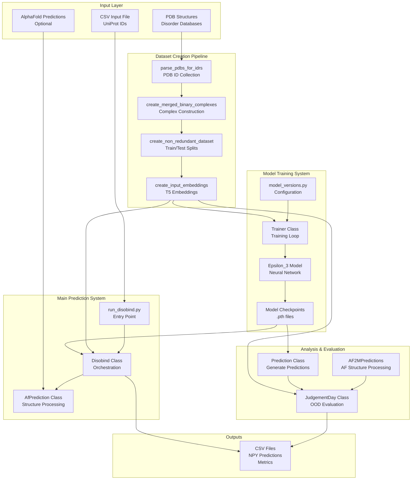
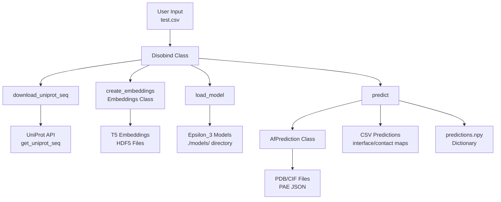
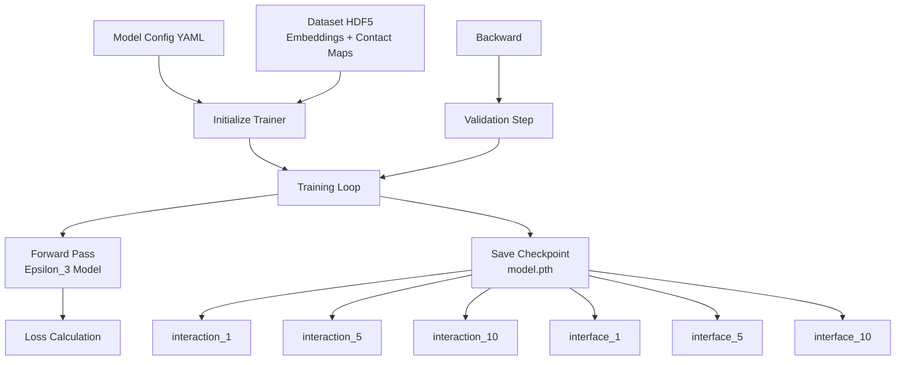

# Overview

> **Relevant source files**
> * [LICENSE.txt](https://github.com/isblab/disobind/blob/5fffcf84/LICENSE.txt)
> * [README.md](https://github.com/isblab/disobind/blob/5fffcf84/README.md?plain=1)
> * [example/test.csv](https://github.com/isblab/disobind/blob/5fffcf84/example/test.csv)
> * [main.png](https://github.com/isblab/disobind/blob/5fffcf84/main.png)

## Purpose and Scope

This document provides a high-level overview of the Disobind codebase, including its purpose, architecture, and main components. Disobind is a deep learning system for predicting protein-protein interactions involving Intrinsically Disordered Regions (IDRs).

For installation instructions, see [Installation and Setup](/isblab/disobind/1.1-installation-and-setup). For running predictions immediately, see [Quick Start Guide](/isblab/disobind/1.2-quick-start-guide). For comprehensive prediction documentation, see [Running Predictions](/isblab/disobind/2-running-predictions).

Sources: [README.md L1-L129](https://github.com/isblab/disobind/blob/5fffcf84/README.md?plain=1#L1-L129)

## What is Disobind?

Disobind is a deep learning method that predicts **inter-protein contact maps** and **interface residues** for IDR-containing protein complexes from their amino acid sequences. The system takes as input:

* Binary protein pairs (at least one must contain an IDR) [README.md L42-L45](https://github.com/isblab/disobind/blob/5fffcf84/README.md?plain=1#L42-L45)
* UniProt sequence identifiers [README.md L48-L57](https://github.com/isblab/disobind/blob/5fffcf84/README.md?plain=1#L48-L57)
* Optionally, AlphaFold2/3 structural predictions [README.md L59-L63](https://github.com/isblab/disobind/blob/5fffcf84/README.md?plain=1#L59-L63)

And produces:

* Contact maps showing which residue pairs interact (interaction task) [README.md L104-L111](https://github.com/isblab/disobind/blob/5fffcf84/README.md?plain=1#L104-L111)
* Interface residue predictions identifying binding sites (interface task) [README.md L112-L114](https://github.com/isblab/disobind/blob/5fffcf84/README.md?plain=1#L112-L114)
* Predictions at multiple coarse-graining resolutions (CG 1, 5, 10) [README.md L92-L93](https://github.com/isblab/disobind/blob/5fffcf84/README.md?plain=1#L92-L93)

**Key Capabilities:**

| Feature | Description |
| --- | --- |
| **Sequence-based** | Requires only UniProt IDs; no structures needed [README.md L48-L57](https://github.com/isblab/disobind/blob/5fffcf84/README.md?plain=1#L48-L57) |
| **IDR-specialized** | Optimized for disordered protein interactions [README.md L3](https://github.com/isblab/disobind/blob/5fffcf84/README.md?plain=1#L3-L3) |
| **Multi-resolution** | Predictions at residue-level and coarse-grained resolutions [README.md L92-L93](https://github.com/isblab/disobind/blob/5fffcf84/README.md?plain=1#L92-L93) |
| **Structure-enhanced** | Can combine with AlphaFold2/3 for improved accuracy [README.md L59-L60](https://github.com/isblab/disobind/blob/5fffcf84/README.md?plain=1#L59-L60) |
| **Binary complexes** | Handles protein pairs (A-B interactions) [README.md L43](https://github.com/isblab/disobind/blob/5fffcf84/README.md?plain=1#L43-L43) |

Sources: [README.md L1-L10](https://github.com/isblab/disobind/blob/5fffcf84/README.md?plain=1#L1-L10)

 [README.md L42-L63](https://github.com/isblab/disobind/blob/5fffcf84/README.md?plain=1#L42-L63)

 [README.md L92-L93](https://github.com/isblab/disobind/blob/5fffcf84/README.md?plain=1#L92-L93)

 [README.md L104-L114](https://github.com/isblab/disobind/blob/5fffcf84/README.md?plain=1#L104-L114)

## System Architecture Overview

Disobind consists of four major subsystems that operate sequentially or independently depending on the use case:

**Sources:** [README.md L104-L113](https://github.com/isblab/disobind/blob/5fffcf84/README.md?plain=1#L104-L113)

 High-level architecture derived from repository structure.

## Core Components

### 1. Main Prediction System

The prediction system is the primary user-facing component, implemented in `run_disobind.py`. It orchestrates the end-to-end prediction workflow.

**Key Classes:**

**Workflow:**

1. Parse CSV input containing UniProt IDs [README.md L52-L65](https://github.com/isblab/disobind/blob/5fffcf84/README.md?plain=1#L52-L65)
2. Download UniProt sequences [README.md L89](https://github.com/isblab/disobind/blob/5fffcf84/README.md?plain=1#L89-L89)
3. Generate T5 embeddings (required for model input) [README.md L118-L121](https://github.com/isblab/disobind/blob/5fffcf84/README.md?plain=1#L118-L121)
4. Load trained `Epsilon_3` models from `./models/` [README.md L120-L121](https://github.com/isblab/disobind/blob/5fffcf84/README.md?plain=1#L120-L121)
5. Run predictions in batches based on provided input [README.md L76-L80](https://github.com/isblab/disobind/blob/5fffcf84/README.md?plain=1#L76-L80)
6. Optionally integrate AlphaFold predictions [README.md L59-L63](https://github.com/isblab/disobind/blob/5fffcf84/README.md?plain=1#L59-L63)
7. Save results as CSV and NPY files [README.md L95-L100](https://github.com/isblab/disobind/blob/5fffcf84/README.md?plain=1#L95-L100)

**Sources:** [run_disobind.py L1-L1185](https://github.com/isblab/disobind/blob/5fffcf84/run_disobind.py#L1-L1185)

 [README.md L40-L103](https://github.com/isblab/disobind/blob/5fffcf84/README.md?plain=1#L40-L103)

### 2. Dataset Creation Pipeline

The dataset creation pipeline processes raw PDB structures and disorder databases into training-ready datasets. This is a multi-stage pipeline documented in [Dataset Creation Pipeline](/isblab/disobind/3-dataset-creation-pipeline).

**Pipeline Stages:**

| Stage | Script | Purpose |
| --- | --- | --- |
| 1 | `1_disobind_database.py` | Collect PDB IDs from disorder databases |
| 2 | `2_create_database_dataset_files.py` | Download PDB files, create binary complexes |
| 3 | `3_create_merged_binary_complexes.py` | Merge overlapping complexes |
| 4 | `4_create_non_redundant_dataset.py` | Create non-redundant train/test splits |
| 5 | `create_input_embeddings.py` | Generate T5 embeddings |

**Sources:** [README.md L117-L118](https://github.com/isblab/disobind/blob/5fffcf84/README.md?plain=1#L117-L118)

 Dataset workflow derived from file naming conventions.

### 3. Model Training System

The training system uses the `Trainer` class to train `Epsilon_3` neural network models. Configuration is managed through YAML files.

**Model Architecture:** `Epsilon_3` is the core neural network architecture designed for sequence-based prediction.

* Support for both interaction (contact map) and interface (residue label) tasks [README.md L92-L93](https://github.com/isblab/disobind/blob/5fffcf84/README.md?plain=1#L92-L93)
* Coarse-graining at levels 1, 5, and 10 [README.md L93](https://github.com/isblab/disobind/blob/5fffcf84/README.md?plain=1#L93-L93)

**Training Process:**

**Sources:** [README.md L120-L121](https://github.com/isblab/disobind/blob/5fffcf84/README.md?plain=1#L120-L121)

 training workflow derived from model file organization.

### 4. Analysis & Evaluation System

The analysis system evaluates model performance on out-of-distribution (OOD) test sets and compares Disobind with other methods.

**Analysis Components:**

* **`JudgementDay`**: Central evaluation class for calculating metrics [README.md L123-L124](https://github.com/isblab/disobind/blob/5fffcf84/README.md?plain=1#L123-L124)
* **Metrics**: Recall, Precision, F1, AUROC, MCC, and Average Precision.

**Sources:** [README.md L123-L124](https://github.com/isblab/disobind/blob/5fffcf84/README.md?plain=1#L123-L124)

 evaluation metrics derived from standard ML evaluation practices in codebase.

## Key Concepts

### Prediction Tasks and Coarse-Graining

Disobind supports **6 distinct prediction tasks** resulting from the combination of 2 objectives and 3 coarse-graining levels [README.md L92-L93](https://github.com/isblab/disobind/blob/5fffcf84/README.md?plain=1#L92-L93)

:

**Objectives:**

1. **Interaction Task**: Predicts contact maps showing which residue pairs interact [README.md L111](https://github.com/isblab/disobind/blob/5fffcf84/README.md?plain=1#L111-L111)
2. **Interface Task**: Predicts interface residues identifying binding sites [README.md L113](https://github.com/isblab/disobind/blob/5fffcf84/README.md?plain=1#L113-L113)

**Coarse-Graining Levels:**

* **CG = 1**: Residue-level predictions (full resolution) [README.md L82](https://github.com/isblab/disobind/blob/5fffcf84/README.md?plain=1#L82-L82)
* **CG = 5**: 5-residue bins [README.md L93](https://github.com/isblab/disobind/blob/5fffcf84/README.md?plain=1#L93-L93)
* **CG = 10**: 10-residue bins [README.md L93](https://github.com/isblab/disobind/blob/5fffcf84/README.md?plain=1#L93-L93)

**Sources:** [README.md L82](https://github.com/isblab/disobind/blob/5fffcf84/README.md?plain=1#L82-L82)

 [README.md L92-L93](https://github.com/isblab/disobind/blob/5fffcf84/README.md?plain=1#L92-L93)

 [README.md L111-L114](https://github.com/isblab/disobind/blob/5fffcf84/README.md?plain=1#L111-L114)

### AlphaFold Integration

Disobind can combine its sequence-based predictions with AlphaFold2/3 structural predictions [README.md L59-L60](https://github.com/isblab/disobind/blob/5fffcf84/README.md?plain=1#L59-L60)

 The system processes AlphaFold structures by:

1. **Parsing structure files**: PDB (AlphaFold2) or CIF (AlphaFold3) format [README.md L60](https://github.com/isblab/disobind/blob/5fffcf84/README.md?plain=1#L60-L60)
2. **Extracting confidence metrics**: pLDDT scores and PAE matrices [README.md L60](https://github.com/isblab/disobind/blob/5fffcf84/README.md?plain=1#L60-L60)
3. **Coarse-graining**: Matching Disobind resolution for comparison or merging [README.md L93](https://github.com/isblab/disobind/blob/5fffcf84/README.md?plain=1#L93-L93)

**AlphaFold Input Format:**
When providing AlphaFold predictions in the input CSV, additional columns for file paths, chain IDs, and offsets are required [README.md L60-L63](https://github.com/isblab/disobind/blob/5fffcf84/README.md?plain=1#L60-L63)

**Sources:** [README.md L59-L63](https://github.com/isblab/disobind/blob/5fffcf84/README.md?plain=1#L59-L63)

 [example/test.csv L2](https://github.com/isblab/disobind/blob/5fffcf84/example/test.csv#L2-L2)

## Input and Output Specifications

### Input Format

Disobind accepts CSV files with two formats:

**Format 1 - Disobind Only:** [README.md L56-L57](https://github.com/isblab/disobind/blob/5fffcf84/README.md?plain=1#L56-L57)

`UniProt_ID1, start1, end1, UniProt_ID2, start2, end2`

**Format 2 - Disobind + AlphaFold:** [README.md L59-L60](https://github.com/isblab/disobind/blob/5fffcf84/README.md?plain=1#L59-L60)

`UniProt_ID1, start1, end1, UniProt_ID2, start2, end2, AF2_struct_file_path, AF2_pae_file_path, chain1, chain2, offset1, offset2`

**Sources:** [README.md L56-L60](https://github.com/isblab/disobind/blob/5fffcf84/README.md?plain=1#L56-L60)

 [example/test.csv L1-L2](https://github.com/isblab/disobind/blob/5fffcf84/example/test.csv#L1-L2)

### Output Format

Disobind generates multiple output files:

**1. CSV Files:** Contains columns for Protein IDs and Residue positions [README.md L103-L110](https://github.com/isblab/disobind/blob/5fffcf84/README.md?plain=1#L103-L110)

**2. NPY Dictionary (`Predictions.npy`):** Contains predictions for all input sequence fragment pairs in a nested dictionary [README.md L99](https://github.com/isblab/disobind/blob/5fffcf84/README.md?plain=1#L99-L99)

**Sources:** [README.md L95-L103](https://github.com/isblab/disobind/blob/5fffcf84/README.md?plain=1#L95-L103)

## Getting Started

To begin using Disobind:

1. **Installation**: Follow [Installation and Setup](/isblab/disobind/1.1-installation-and-setup)
2. **Quick Start**: Run example predictions with [Quick Start Guide](/isblab/disobind/1.2-quick-start-guide)
3. **Running Predictions**: Comprehensive guide at [Running Predictions](/isblab/disobind/2-running-predictions)

**Sources:** [README.md L14-L37](https://github.com/isblab/disobind/blob/5fffcf84/README.md?plain=1#L14-L37)

 [README.md L40-L83](https://github.com/isblab/disobind/blob/5fffcf84/README.md?plain=1#L40-L83)