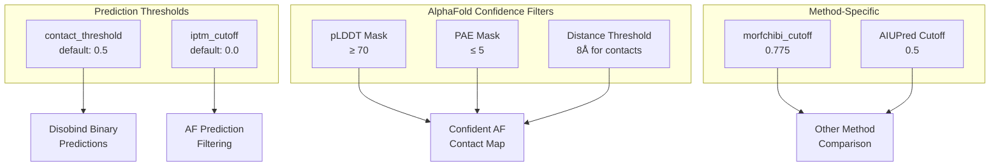
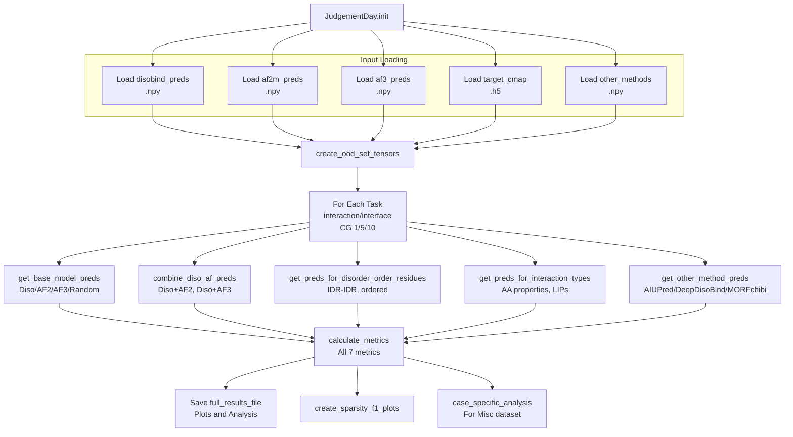
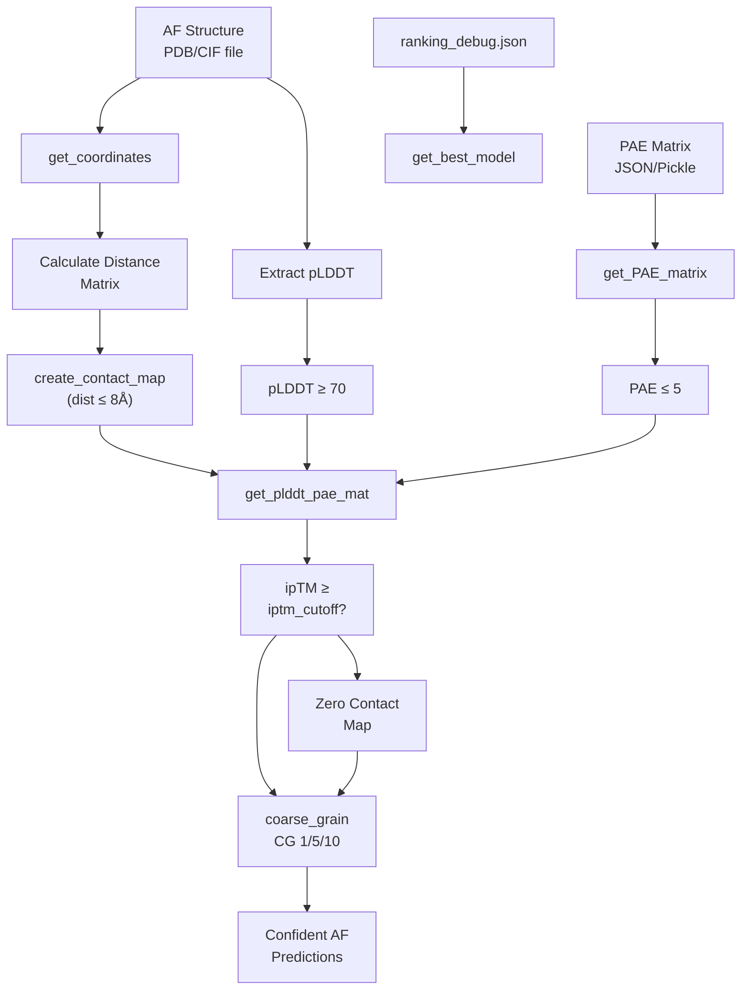

# Performance Metrics and Evaluation

> **Relevant source files**
> * [analysis/analysis.py](https://github.com/isblab/disobind/blob/5fffcf84/analysis/analysis.py)
> * [analysis/get_other_method_preds.py](https://github.com/isblab/disobind/blob/5fffcf84/analysis/get_other_method_preds.py)
> * [src/metrics.py](https://github.com/isblab/disobind/blob/5fffcf84/src/metrics.py)

This page describes the performance metrics used to evaluate Disobind predictions and the comprehensive evaluation pipeline implemented in the `JudgementDay` class. It covers the seven-metric suite used for all evaluations, confidence filtering for AlphaFold predictions, disorder-specific analysis, and comparison with competing methods.

For information about generating predictions to be evaluated, see [5.2 Generating OOD Predictions](https://github.com/isblab/disobind/blob/5fffcf84/5.2 Generating OOD Predictions)

 For AlphaFold prediction processing details, see [5.3 Processing AlphaFold Predictions](https://github.com/isblab/disobind/blob/5fffcf84/5.3 Processing AlphaFold Predictions)

 For disorder-specific filtering approaches, see [5.5 Disorder-Specific Analysis](https://github.com/isblab/disobind/blob/5fffcf84/5.5 Disorder-Specific Analysis)

## Core Metrics Suite

Disobind evaluates all predictions using a standardized suite of seven binary classification metrics. These metrics are calculated using the `torch_metrics` function from `src.metrics` and provide comprehensive assessment across multiple performance dimensions.

### Metric Definitions

| Metric | Description | Purpose |
| --- | --- | --- |
| **Recall** | True Positives / (True Positives + False Negatives) | Measures ability to identify all actual interactions |
| **Precision** | True Positives / (True Positives + False Positives) | Measures accuracy of positive predictions |
| **F1-score** | 2 × (Precision × Recall) / (Precision + Recall) | Harmonic mean balancing precision and recall |
| **Average Precision** | Area under Precision-Recall curve | Performance across all thresholds |
| **MCC** | Matthews Correlation Coefficient | Balanced measure for imbalanced datasets |
| **AUROC** | Area Under ROC Curve | Discrimination ability across thresholds |
| **Accuracy** | (TP + TN) / Total | Overall correctness (less informative for sparse data) |

The metrics are calculated globally across all samples by default, but can also be computed per-sample using the `multidim_avg` parameter [src/metrics.py L39-L61](https://github.com/isblab/disobind/blob/5fffcf84/src/metrics.py#L39-L61)

**Sources:** [src/metrics.py L15-L62](https://github.com/isblab/disobind/blob/5fffcf84/src/metrics.py#L15-L62)

 [analysis/analysis.py L709-L737](https://github.com/isblab/disobind/blob/5fffcf84/analysis/analysis.py#L709-L737)

### Threshold Configuration

**Sources:** [analysis/analysis.py L37-L42](https://github.com/isblab/disobind/blob/5fffcf84/analysis/analysis.py#L37-L42)

 [analysis/get_other_method_preds.py L90-L168](https://github.com/isblab/disobind/blob/5fffcf84/analysis/get_other_method_preds.py#L90-L168)

 [analysis/get_af_prediction.py L35-L42](https://github.com/isblab/disobind/blob/5fffcf84/analysis/get_af_prediction.py#L35-L42)

## JudgementDay Evaluation Pipeline

The `JudgementDay` class orchestrates the complete evaluation workflow, processing predictions from multiple methods and computing metrics across various analysis categories [analysis/analysis.py L25-L29](https://github.com/isblab/disobind/blob/5fffcf84/analysis/analysis.py#L25-L29)

### Pipeline Architecture

**Sources:** [analysis/analysis.py L25-L123](https://github.com/isblab/disobind/blob/5fffcf84/analysis/analysis.py#L25-L123)

 [analysis/analysis.py L438-L509](https://github.com/isblab/disobind/blob/5fffcf84/analysis/analysis.py#L438-L509)

### Key Methods in JudgementDay

| Method | Purpose | Lines |
| --- | --- | --- |
| `forward()` | Main entry point, orchestrates full pipeline | [analysis/analysis.py L107-L123](https://github.com/isblab/disobind/blob/5fffcf84/analysis/analysis.py#L107-L123) |
| `create_ood_set_tensors()` | Generator yielding tensors for each task | [analysis/analysis.py L192-L316](https://github.com/isblab/disobind/blob/5fffcf84/analysis/analysis.py#L192-L316) |
| `get_base_model_preds()` | Extract base model predictions | [analysis/analysis.py L319-L331](https://github.com/isblab/disobind/blob/5fffcf84/analysis/analysis.py#L319-L331) |
| `combine_diso_af_preds()` | Combine Disobind + AF using max operation | [analysis/analysis.py L334-L351](https://github.com/isblab/disobind/blob/5fffcf84/analysis/analysis.py#L334-L351) |
| `get_preds_for_disorder_order_residues()` | Filter by disorder/order | [analysis/analysis.py L354-L382](https://github.com/isblab/disobind/blob/5fffcf84/analysis/analysis.py#L354-L382) |
| `get_preds_for_interaction_types()` | Filter by AA types and LIPs | [analysis/analysis.py L385-L412](https://github.com/isblab/disobind/blob/5fffcf84/analysis/analysis.py#L385-L412) |
| `eval_performance()` | Calculate and save all metrics | [analysis/analysis.py L438-L509](https://github.com/isblab/disobind/blob/5fffcf84/analysis/analysis.py#L438-L509) |
| `calculate_metrics()` | Wrapper for `torch_metrics` call | [analysis/analysis.py L709-L737](https://github.com/isblab/disobind/blob/5fffcf84/analysis/analysis.py#L709-L737) |

**Sources:** [analysis/analysis.py L25-L741](https://github.com/isblab/disobind/blob/5fffcf84/analysis/analysis.py#L25-L741)

## Evaluation Categories

The evaluation pipeline assesses predictions across multiple orthogonal dimensions, providing granular performance analysis.

### Category Hierarchy

```mermaid
flowchart TD

Diso["Disobind"]
AF2["AF2_pLDDT_PAE"]
AF3["AF3_pLDDT_PAE"]
Rand["Random_baseline"]
DisoAF2["Disobind_AF2<br>Max operation"]
DisoAF3["Disobind_AF3<br>Max operation]"]
IDR_IDR["IDR-IDR Interactions"]
IDR_Any["IDR-any Interactions"]
Ordered["Ordered Interactions"]
DPAA["Disorder-promoting AA"]
Aromatic["Aromatic AA"]
Hydrophobic["Hydrophobic AA"]
Polar["Polar AA"]
LIPs["Linear Interacting Peptides"]
AIU["AIUPred"]
Deep["DeepDisoBind"]
MORF["MORFchibi"]
EvalAll["Evaluate All<br>6 Tasks"]
EvalSubset["Evaluate Subset<br>Tasks"]
EvalInterface["Evaluate<br>interface_1"]

Diso --> EvalAll
AF2 --> EvalAll
AF3 --> EvalAll
Rand --> EvalAll
DisoAF2 --> EvalAll
DisoAF3 --> EvalAll
IDR_IDR --> EvalSubset
IDR_Any --> EvalSubset
Ordered --> EvalSubset
DPAA --> EvalSubset
Aromatic --> EvalSubset
Hydrophobic --> EvalSubset
Polar --> EvalSubset
LIPs --> EvalSubset
AIU --> EvalInterface
Deep --> EvalInterface
MORF --> EvalInterface

subgraph subGraph4 ["Other Methods interface_1 Only"]
    AIU
    Deep
    MORF
end

subgraph subGraph3 ["Interaction Types CG=1 Only"]
    DPAA
    Aromatic
    Hydrophobic
    Polar
    LIPs
end

subgraph subGraph2 ["Disorder-Specific CG=1 Only"]
    IDR_IDR
    IDR_Any
    Ordered
end

subgraph subGraph1 ["Combined Models"]
    DisoAF2
    DisoAF3
end

subgraph subGraph0 ["Base Models"]
    Diso
    AF2
    AF3
    Rand
end
```

**Sources:** [analysis/analysis.py L192-L316](https://github.com/isblab/disobind/blob/5fffcf84/analysis/analysis.py#L192-L316)

 [analysis/analysis.py L453-L476](https://github.com/isblab/disobind/blob/5fffcf84/analysis/analysis.py#L453-L476)

### Combining Predictions

The `combine_diso_af_preds` method merges Disobind and AlphaFold predictions using a `torch.maximum` operation [analysis/analysis.py L347-L348](https://github.com/isblab/disobind/blob/5fffcf84/analysis/analysis.py#L347-L348)

 This approach hypothesizes that combining sequence-based and structure-based approaches improves accuracy by taking the maximum confidence from either method for each position in the contact map or interface vector.

**Sources:** [analysis/analysis.py L334-L351](https://github.com/isblab/disobind/blob/5fffcf84/analysis/analysis.py#L334-L351)

## AlphaFold Confidence Filtering

AlphaFold predictions are filtered based on multiple confidence metrics to ensure only high-quality structural predictions are used in evaluation.

### Confidence Filtering Pipeline

**Sources:** [analysis/get_af_prediction.py L95-L133](https://github.com/isblab/disobind/blob/5fffcf84/analysis/get_af_prediction.py#L95-L133)

 [analysis/get_af_prediction.py L315-L361](https://github.com/isblab/disobind/blob/5fffcf84/analysis/get_af_prediction.py#L315-L361)

 [analysis/get_af_prediction.py L364-L425](https://github.com/isblab/disobind/blob/5fffcf84/analysis/get_af_prediction.py#L364-L425)

### AF2MPredictions Class Methods

| Method | Purpose | Key Logic |
| --- | --- | --- |
| `get_best_model()` | Select best model from ranking | Uses `iptm+ptm` scores from `ranking_debug.json` [analysis/get_af_prediction.py L270-L305](https://github.com/isblab/disobind/blob/5fffcf84/analysis/get_af_prediction.py#L270-L305) |
| `get_PAE_matrix()` | Extract PAE from result file | Loads from pickle (AF2) or JSON (AF3) [analysis/get_af_prediction.py L218-L268](https://github.com/isblab/disobind/blob/5fffcf84/analysis/get_af_prediction.py#L218-L268) |
| `get_coordinates()` | Extract CA coordinates | Parses PDB/CIF using BioPython [analysis/get_af_prediction.py L165-L216](https://github.com/isblab/disobind/blob/5fffcf84/analysis/get_af_prediction.py#L165-L216) |
| `create_contact_map()` | Binary map from distances | Threshold at 8Å between CA atoms [analysis/get_af_prediction.py L315-L361](https://github.com/isblab/disobind/blob/5fffcf84/analysis/get_af_prediction.py#L315-L361) |
| `get_plddt_pae_mat()` | Create confidence masks | Binary masks: pLDDT≥70, PAE≤5 [analysis/get_af_prediction.py L364-L425](https://github.com/isblab/disobind/blob/5fffcf84/analysis/get_af_prediction.py#L364-L425) |
| `coarse_grain()` | Apply CG and masks | MaxPool with confidence filtering [analysis/get_af_prediction.py L428-L497](https://github.com/isblab/disobind/blob/5fffcf84/analysis/get_af_prediction.py#L428-L497) |

**Sources:** [analysis/get_af_prediction.py L28-L497](https://github.com/isblab/disobind/blob/5fffcf84/analysis/get_af_prediction.py#L28-L497)

### Confidence Score Analysis

The evaluation tracks and plots AlphaFold confidence scores to understand prediction quality via `count_confident_AF_predictions` [analysis/analysis.py L601-L668](https://github.com/isblab/disobind/blob/5fffcf84/analysis/analysis.py#L601-L668)

* **ipTM vs ipTM Scatter**: Compares AF2 vs AF3 confidence [analysis/analysis.py L615-L635](https://github.com/isblab/disobind/blob/5fffcf84/analysis/analysis.py#L615-L635)
* **Threshold Counting**: Counts entries with `ipTM >= 0.8` or `ipTM <= iptm_cutoff` [analysis/analysis.py L643-L655](https://github.com/isblab/disobind/blob/5fffcf84/analysis/analysis.py#L643-L655)
* **Stats Storage**: Saves counts to `af_conf_pred_counts_file` and raw scores to `af_confidence_scores` [analysis/analysis.py L657-L668](https://github.com/isblab/disobind/blob/5fffcf84/analysis/analysis.py#L657-L668)

**Sources:** [analysis/analysis.py L601-L668](https://github.com/isblab/disobind/blob/5fffcf84/analysis/analysis.py#L601-L668)

## Disorder-Specific Analysis

Predictions are evaluated separately for different disorder contexts: IDR-IDR interactions, IDR-any interactions, and ordered region interactions.

### Disorder Filtering Logic

The `get_preds_for_disorder_order_residues` method creates three types of filtered predictions [analysis/analysis.py L354-L382](https://github.com/isblab/disobind/blob/5fffcf84/analysis/analysis.py#L354-L382)

:

1. **IDR-IDR**: Only predictions where both residues are disordered.
2. **IDR-any**: Predictions where at least one residue is disordered.
3. **Ordered**: Only predictions where both residues are ordered.

For each model, predictions are masked using matrices derived from UniProt disorder annotations and evaluated separately for these contexts.

**Sources:** [analysis/analysis.py L354-L382](https://github.com/isblab/disobind/blob/5fffcf84/analysis/analysis.py#L354-L382)

## Interaction Type Analysis

Predictions are filtered by amino acid properties to assess performance on specific interaction types via `get_preds_for_interaction_types` [analysis/analysis.py L385-L412](https://github.com/isblab/disobind/blob/5fffcf84/analysis/analysis.py#L385-L412)

### Amino Acid Property Masks

| Property | Residues | Purpose |
| --- | --- | --- |
| **Disorder-promoting** | R, P, Q, E, G, S, A, K | High flexibility residues |
| **Aromatic** | F, Y, W | π-π stacking interactions |
| **Hydrophobic** | A, V, L, I, P, M, F, W | Hydrophobic core formation |
| **Polar** | S, T, C, N, Q, Y, D, E, K, R, H | Hydrogen bonding |
| **LIPs** | MobiDB curated/homology | Linear Interacting Peptides |

**Sources:** [analysis/analysis.py L385-L412](https://github.com/isblab/disobind/blob/5fffcf84/analysis/analysis.py#L385-L412)

## Comparison with Other Methods

Disobind is compared against three partner-independent interface prediction methods on the OOD test set using the `Othermethods` class [analysis/get_other_method_preds.py L14-L19](https://github.com/isblab/disobind/blob/5fffcf84/analysis/get_other_method_preds.py#L14-L19)

### Other Methods Integration

* **AIUPred**: Run via `aiupred_lib.predict_binding` using embedding and regression models [analysis/get_other_method_preds.py L83-L97](https://github.com/isblab/disobind/blob/5fffcf84/analysis/get_other_method_preds.py#L83-L97)
* **DeepDisoBind**: Parsed from result FASTA files by extracting the `protein_binary` field [analysis/get_other_method_preds.py L100-L122](https://github.com/isblab/disobind/blob/5fffcf84/analysis/get_other_method_preds.py#L100-L122)
* **MORFchibi**: Parsed from TSV outputs with a 0.775 threshold and a minimum length requirement of 4 residues [analysis/get_other_method_preds.py L160-L181](https://github.com/isblab/disobind/blob/5fffcf84/analysis/get_other_method_preds.py#L160-L181)

**Sources:** [analysis/get_other_method_preds.py L14-L296](https://github.com/isblab/disobind/blob/5fffcf84/analysis/get_other_method_preds.py#L14-L296)

## Sparsity Analysis

The relationship between dataset sparsity and model performance is analyzed via `create_sparsity_f1_plots` [analysis/analysis.py L670-L706](https://github.com/isblab/disobind/blob/5fffcf84/analysis/analysis.py#L670-L706)

1. Loads `fraction_positives` from JSON [analysis/analysis.py L682-L683](https://github.com/isblab/disobind/blob/5fffcf84/analysis/analysis.py#L682-L683)
2. Calculates sparsity as `(1 - fraction_positives) * 100` [analysis/analysis.py L686](https://github.com/isblab/disobind/blob/5fffcf84/analysis/analysis.py#L686-L686)
3. Plots sparsity vs Disobind F1-score to reveal how performance degrades with increasing class imbalance across the 6 tasks [analysis/analysis.py L692-L700](https://github.com/isblab/disobind/blob/5fffcf84/analysis/analysis.py#L692-L700)

**Sources:** [analysis/analysis.py L670-L706](https://github.com/isblab/disobind/blob/5fffcf84/analysis/analysis.py#L670-L706)

## IDPPI Dataset Evaluation

The `IdppiPreds` class evaluates Disobind on the IDPPI protein-protein interaction dataset, converting residue-level interface predictions to binary PPI predictions [analysis/idppi_preds.py L22-L26](https://github.com/isblab/disobind/blob/5fffcf84/analysis/idppi_preds.py#L22-L26)

### Interface to PPI Conversion Methods

* **frag_any_prot_any**: PPI=1 if any fragment has any interface residues [analysis/idppi_preds.py L414-L418](https://github.com/isblab/disobind/blob/5fffcf84/analysis/idppi_preds.py#L414-L418)
* **frag_any_prot_all**: PPI=1 if any fragment has both proteins interfacing [analysis/idppi_preds.py L421-L426](https://github.com/isblab/disobind/blob/5fffcf84/analysis/idppi_preds.py#L421-L426)
* **max_frag_score**: Max residue score across all fragments [analysis/idppi_preds.py L432-L436](https://github.com/isblab/disobind/blob/5fffcf84/analysis/idppi_preds.py#L432-L436)
* **avg_assemble_frag_score**: Assemble full proteins from fragments using `get_assembled_proteins` before scoring [analysis/idppi_preds.py L520-L563](https://github.com/isblab/disobind/blob/5fffcf84/analysis/idppi_preds.py#L520-L563)

**Sources:** [analysis/idppi_preds.py L369-L597](https://github.com/isblab/disobind/blob/5fffcf84/analysis/idppi_preds.py#L369-L597)

## Output Files and Interpretation

The `JudgementDay` pipeline generates multiple output files in the `output_dir` [analysis/analysis.py L81-L96](https://github.com/isblab/disobind/blob/5fffcf84/analysis/analysis.py#L81-L96)

* **Results_OOD_set_{version}.csv**: Main metrics table for all models/tasks [analysis/analysis.py L84](https://github.com/isblab/disobind/blob/5fffcf84/analysis/analysis.py#L84-L84)
* **Sparsity_F1_plot_{version}**: Visualization of performance vs imbalance [analysis/analysis.py L92](https://github.com/isblab/disobind/blob/5fffcf84/analysis/analysis.py#L92-L92)
* **AF_confidence_plot_{version}**: AF2 vs AF3 ipTM comparison [analysis/analysis.py L90](https://github.com/isblab/disobind/blob/5fffcf84/analysis/analysis.py#L90-L90)
* **Case_sp_analysis_{version}**: Per-sample analysis for the Misc dataset [analysis/analysis.py L93](https://github.com/isblab/disobind/blob/5fffcf84/analysis/analysis.py#L93-L93)

**Sources:** [analysis/analysis.py L81-L96](https://github.com/isblab/disobind/blob/5fffcf84/analysis/analysis.py#L81-L96)