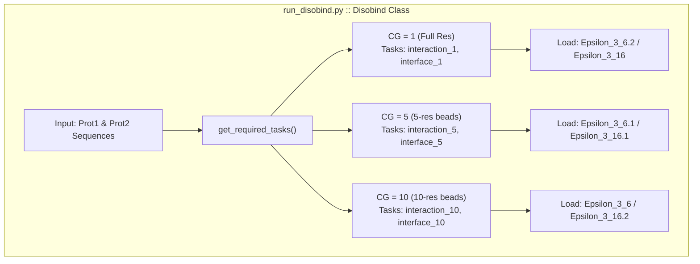
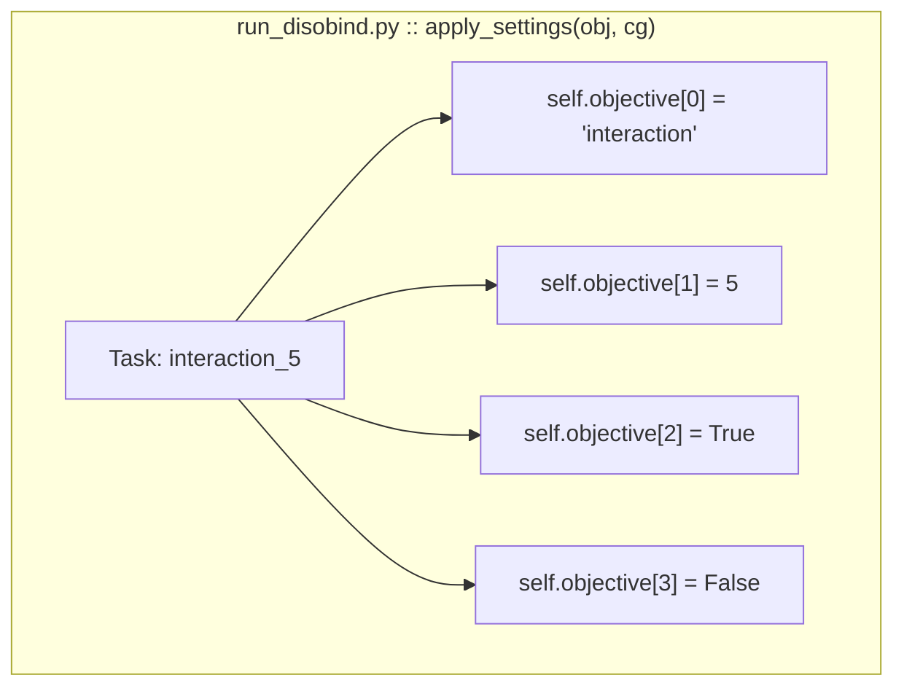

# Prediction Tasks and Coarse-Graining

> **Relevant source files**
> * [analysis/get_af_prediction.py](https://github.com/isblab/disobind/blob/5fffcf84/analysis/get_af_prediction.py)
> * [analysis/get_disobind_predictions.py](https://github.com/isblab/disobind/blob/5fffcf84/analysis/get_disobind_predictions.py)
> * [analysis/params.py](https://github.com/isblab/disobind/blob/5fffcf84/analysis/params.py)
> * [example/test.fasta](https://github.com/isblab/disobind/blob/5fffcf84/example/test.fasta)
> * [run_disobind.py](https://github.com/isblab/disobind/blob/5fffcf84/run_disobind.py)

This page describes the different prediction objectives and coarse-graining resolutions supported by Disobind, explaining how they combine to create six distinct prediction tasks. For information about input formats and data preparation, see [Input Format and Preparation](/isblab/disobind/2.1-input-format-and-preparation). For details on combining predictions with AlphaFold structures, see [AlphaFold Integration](/isblab/disobind/2.3-alphafold-integration).

## Overview

Disobind supports **two prediction objectives** (interaction and interface) at **three coarse-graining levels** (1, 5, 10), resulting in **six total tasks**. Each task uses a dedicated trained model variant. The system allows users to predict at single-residue resolution or at coarser granularities to reduce computational cost and noise for longer sequences.

## Prediction Objectives

### Interaction Prediction (Contact Maps)

The interaction objective predicts **inter-protein contact maps** - binary matrices indicating which residue pairs are in contact between two proteins. The output is a matrix of shape `[L1, L2]` where `L1` and `L2` are the lengths of protein 1 and protein 2 respectively.

**Use case**: When you need to know which specific residue pairs interact between two proteins.

**Output format**: Results are stored in a nested dictionary and saved as a `.npy` file. If `predict_cmap` is enabled, the output includes pairwise contact indices.

Sources: [run_disobind.py L56-L57](https://github.com/isblab/disobind/blob/5fffcf84/run_disobind.py#L56-L57)

 [run_disobind.py L153-L155](https://github.com/isblab/disobind/blob/5fffcf84/run_disobind.py#L153-L155)

 [run_disobind.py L126](https://github.com/isblab/disobind/blob/5fffcf84/run_disobind.py#L126-L126)

### Interface Prediction (Interface Residues)

The interface objective predicts **interface residues** - binary vectors indicating which residues in each protein participate in the interaction. The output is a concatenated vector of shape `[L1+L2, 1]`.

**Use case**: When you only need to identify binding regions without specific pairwise contacts. This is computationally cheaper and often more robust for disorder-related interactions.

**Default behavior**: Disobind runs interface prediction by default. Interaction prediction is only performed if the `-cm` flag is provided to the `Disobind` class.

Sources: [run_disobind.py L56-L57](https://github.com/isblab/disobind/blob/5fffcf84/run_disobind.py#L56-L57)

 [run_disobind.py L153-L163](https://github.com/isblab/disobind/blob/5fffcf84/run_disobind.py#L153-L163)

 [run_disobind.py L801-L823](https://github.com/isblab/disobind/blob/5fffcf84/run_disobind.py#L801-L823)

## Coarse-Graining Levels

Coarse-graining aggregates multiple consecutive residues into single "beads" to reduce dimensionality and computational cost. Disobind supports three levels:

| CG Level | Description | Bead Size | Use Case |
| --- | --- | --- | --- |
| **1** | Full resolution | 1 residue per bead | Maximum detail, single-residue precision |
| **5** | 5-residue bins | 5 residues per bead | Balanced speed and detail |
| **10** | 10-residue bins | 10 residues per bead | Fast predictions for long sequences |

### Technical Implementation

Coarse-graining is implemented by selecting the appropriate model checkpoint and configuring the `objective` list. For evaluation and AlphaFold comparisons, `MaxPool` operations are used to downsample high-resolution data to match the coarse-grained model outputs.

#### Coarse-Graining Logic Diagram



Sources: [run_disobind.py L130-L165](https://github.com/isblab/disobind/blob/5fffcf84/run_disobind.py#L130-L165)

 [analysis/params.py L14-L59](https://github.com/isblab/disobind/blob/5fffcf84/analysis/params.py#L14-L59)

#### MaxPool Operation for Comparison

When comparing Disobind predictions with AlphaFold or ground truth, the `AF2MPredictions` class and `JudgementDay` pipeline use `nn.MaxPool2d` (for interaction) or `nn.MaxPool1d` (for interface) with `kernel_size=cg` and `stride=cg`:

```markdown
# From analysis/get_af_prediction.py:296-303if cg > 1:    with torch.no_grad():        target = torch.Tensor( contact_map ).unsqueeze(0).unsqueeze(0)        m = nn.MaxPool2d( kernel_size = cg, stride = cg )        target = m( target )        target = target.squeeze(0).squeeze(0).numpy()
```

This operation takes the maximum value within each `cg × cg` window, preserving contacts if any residue pair in the window is in contact.

Sources: [analysis/get_af_prediction.py L296-L303](https://github.com/isblab/disobind/blob/5fffcf84/analysis/get_af_prediction.py#L296-L303)

 [analysis/get_af_prediction.py L51](https://github.com/isblab/disobind/blob/5fffcf84/analysis/get_af_prediction.py#L51-L51)

### Residue-to-Bead Mapping

The `get_beads()` method in `run_disobind.py` creates the mapping from residue positions to bead identifiers:

* **CG = 1**: Each residue is its own bead (e.g., `"100"`, `"101"`).
* **CG = 5 or 10**: Multiple residues per bead (e.g., `"100-104"`, `"105-109"`).

The effective length after coarse-graining is calculated as:

```markdown
# From run_disobind.py:743-753p1_cg_len = math.ceil( ( len_p1 - ( cg - 1 ) ) / cg )p2_cg_len = math.ceil( ( len_p2 - ( cg - 1 ) ) / cg )
```

**Important**: Terminal residues may be lost if protein length is not divisible by the kernel size. `run_disobind.py` issues a warning when `cg` is 5 or 10.

Sources: [run_disobind.py L148-L151](https://github.com/isblab/disobind/blob/5fffcf84/run_disobind.py#L148-L151)

 [run_disobind.py L743-L753](https://github.com/isblab/disobind/blob/5fffcf84/run_disobind.py#L743-L753)

 [run_disobind.py L696-L741](https://github.com/isblab/disobind/blob/5fffcf84/run_disobind.py#L696-L741)

## Task Matrix and Model Mapping

The combination of 2 objectives and 3 CG levels creates 6 distinct tasks. Each task uses a specific trained model version defined in `analysis/params.py`.

| Task | Objective | CG | Model Version | Parameter File Key |
| --- | --- | --- | --- | --- |
| `interaction_1` | Interaction | 1 | Epsilon_3_6.2 | `cg_1` |
| `interaction_5` | Interaction | 5 | Epsilon_3_6.1 | `cg_5` |
| `interaction_10` | Interaction | 10 | Epsilon_3_6 | `cg_10` |
| `interface_1` | Interface | 1 | Epsilon_3_16 | `cg_1_intf` |
| `interface_5` | Interface | 5 | Epsilon_3_16.1 | `cg_5_intf` |
| `interface_10` | Interface | 10 | Epsilon_3_16.2 | `cg_10_intf` |

Model checkpoints are selected using the `parameter_files` function which returns a dictionary of model names and their specific hyperparameter strings.

Sources: [analysis/params.py L14-L59](https://github.com/isblab/disobind/blob/5fffcf84/analysis/params.py#L14-L59)

 [run_disobind.py L82](https://github.com/isblab/disobind/blob/5fffcf84/run_disobind.py#L82-L82)

## Objective Settings

The `objective` parameter in the `Disobind` and `Prediction` classes is a 4-element list that controls model behavior:

```markdown
self.objective = ["", "", "", ""]# [0] objective: "interaction" or "interface"# [1] bin_size: coarse-graining level (1, 5, or 10)# [2] bin_input: if True, average input embeddings (used when bin_size > 1)# [3] single_output: if True, use single output prediction task (legacy)
```

### Configuration Logic Diagram



Sources: [run_disobind.py L433-L471](https://github.com/isblab/disobind/blob/5fffcf84/run_disobind.py#L433-L471)

 [analysis/get_disobind_predictions.py L59-L60](https://github.com/isblab/disobind/blob/5fffcf84/analysis/get_disobind_predictions.py#L59-L60)

## Input Processing and Padding

### Padding to Maximum Length

All inputs are padded to a fixed maximum length (`max_len`) to enable batch processing. In `analysis/get_disobind_predictions.py`, this is set based on the dataset mode (e.g., 100 for OOD, 200 for Misc).

```markdown
# From analysis/get_disobind_predictions.py:385-410mask1 = np.zeros( ( self.max_len, 1024 ) )mask1[:num_res1, :] = prot1 # Copy actual embeddingsprot1 = mask1 # Padded to max_len
```

A binary `target_mask` tracks which positions contain real data vs. padding to ensure loss and metrics are only calculated on valid residues.

Sources: [analysis/get_disobind_predictions.py L36](https://github.com/isblab/disobind/blob/5fffcf84/analysis/get_disobind_predictions.py#L36-L36)

 [analysis/get_disobind_predictions.py L371-L418](https://github.com/isblab/disobind/blob/5fffcf84/analysis/get_disobind_predictions.py#L371-L418)

 [analysis/get_af_prediction.py L46-L47](https://github.com/isblab/disobind/blob/5fffcf84/analysis/get_af_prediction.py#L46-L47)

### Effective Length Calculation

After coarse-graining, the effective length is calculated to properly extract predictions from the padded tensors:

```markdown
# From run_disobind.py:501-508if self.objective[1] == 1:    eff_len = [num_res1, num_res2]else:    cg = self.objective[1]    eff_len = [num_res1 // cg, num_res2 // cg]
```

Sources: [run_disobind.py L501-L529](https://github.com/isblab/disobind/blob/5fffcf84/run_disobind.py#L501-L529)

 [analysis/get_af_prediction.py L221-L226](https://github.com/isblab/disobind/blob/5fffcf84/analysis/get_af_prediction.py#L221-L226)

## Output Formatting

### Interaction Task Output

For interaction tasks, the model produces a 2D matrix that is reshaped to `[eff_len[0], eff_len[1]]`. Predicted contacts are extracted by thresholding (default `0.5`):

```markdown
# From run_disobind.py:770-772idx = np.where( output >= self.threshold )# Results in pairs of indices (i, j)
```

Sources: [run_disobind.py L70](https://github.com/isblab/disobind/blob/5fffcf84/run_disobind.py#L70-L70)

 [run_disobind.py L770-L772](https://github.com/isblab/disobind/blob/5fffcf84/run_disobind.py#L770-L772)

### Interface Task Output

For interface tasks, the model produces a 1D vector of length `eff_len[0] + eff_len[1]`. The vector is split into individual protein interface predictions:

```markdown
# From run_disobind.py:803-804interface1 = output[:p1_cg_len]interface2 = output[p1_cg_len:]
```

Sources: [run_disobind.py L803-L810](https://github.com/isblab/disobind/blob/5fffcf84/run_disobind.py#L803-L810)

 [analysis/get_disobind_predictions.py L566-L581](https://github.com/isblab/disobind/blob/5fffcf84/analysis/get_disobind_predictions.py#L566-L581)

---

**Key Takeaways:**

1. **Six tasks**: 2 objectives (interaction/interface) × 3 CG levels (1, 5, 10).
2. **Default behavior**: Interface prediction at CG=1.
3. **Coarse-graining**: Implemented via specific model versions and `MaxPool` operations for evaluation.
4. **Model Mapping**: Task names map to specific `Epsilon_3` versions in `analysis/params.py`.
5. **Padding**: Inputs are padded to `max_len` (100-200) with masks used to identify valid sequence regions.

For complete model architecture details, see [Epsilon_3 Network Design](/isblab/disobind/4.1-epsilon_3-network-design). For evaluation metrics across different tasks, see [Performance Metrics and Evaluation](/isblab/disobind/5.4-performance-metrics-and-evaluation).