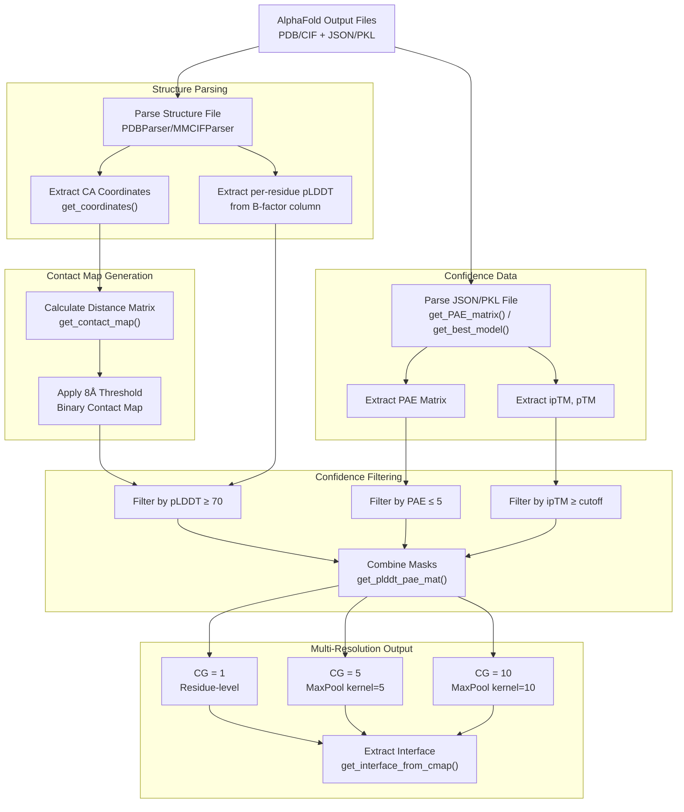
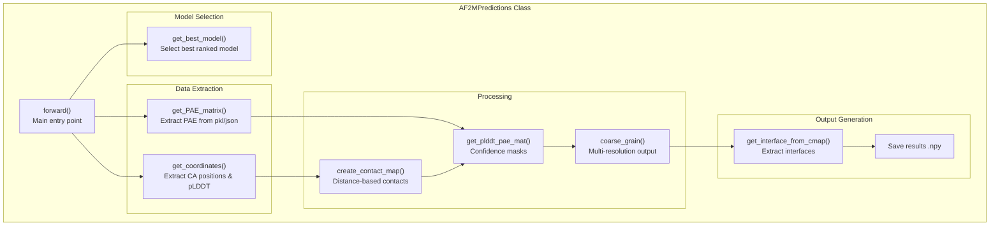
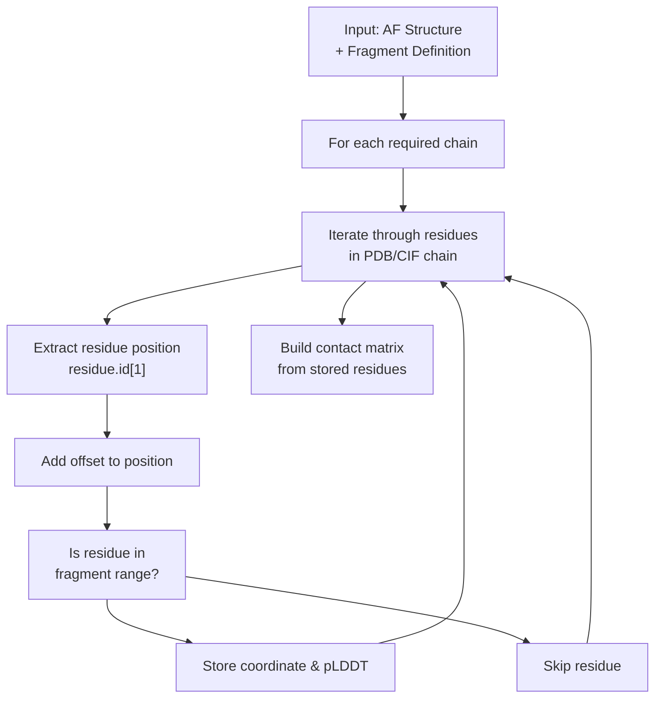
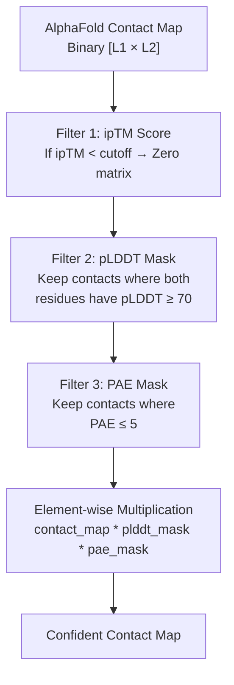

# Processing AlphaFold Predictions

> **Relevant source files**
> * [analysis/get_af_prediction.py](https://github.com/isblab/disobind/blob/5fffcf84/analysis/get_af_prediction.py)
> * [analysis/get_disobind_predictions.py](https://github.com/isblab/disobind/blob/5fffcf84/analysis/get_disobind_predictions.py)
> * [analysis/params.py](https://github.com/isblab/disobind/blob/5fffcf84/analysis/params.py)

## Purpose and Scope

This page describes how Disobind extracts and processes AlphaFold2 and AlphaFold3 structural predictions for integration with sequence-based predictions. The system applies confidence filtering based on pLDDT and PAE metrics to select reliable structural predictions, generates contact maps from predicted structures, and coarse-grains the results to match Disobind's multi-resolution framework.

For information about running combined Disobind+AlphaFold predictions, see [2.3 AlphaFold Integration](https://github.com/isblab/disobind/blob/5fffcf84/2.3 AlphaFold Integration)

 For comprehensive analysis using processed AlphaFold predictions, see [5.1 JudgementDay Analysis Pipeline](https://github.com/isblab/disobind/blob/5fffcf84/5.1 JudgementDay Analysis Pipeline)

---

## Overview

Disobind integrates AlphaFold predictions in two contexts:

1. **Batch Processing for Evaluation** - The `AF2MPredictions` class [analysis/get_af_prediction.py L28-L29](https://github.com/isblab/disobind/blob/5fffcf84/analysis/get_af_prediction.py#L28-L29)  processes entire test sets of AlphaFold predictions for systematic evaluation.
2. **Single-Entry Processing for Prediction** - The `AfPrediction` class [run_disobind.py L831-L832](https://github.com/isblab/disobind/blob/5fffcf84/run_disobind.py#L831-L832)  processes individual AlphaFold structures during user predictions.

Both approaches extract the same core information: predicted structures, confidence metrics (pLDDT, PAE, ipTM), and generate binary contact maps filtered by confidence thresholds.

**High-Level Processing Workflow**



Sources: [analysis/get_af_prediction.py L28-L498](https://github.com/isblab/disobind/blob/5fffcf84/analysis/get_af_prediction.py#L28-L498)

 [run_disobind.py L831-L1134](https://github.com/isblab/disobind/blob/5fffcf84/run_disobind.py#L831-L1134)

---

## The AF2MPredictions Class

The `AF2MPredictions` class processes AlphaFold2 and AlphaFold3 predictions for entire test datasets. It handles both AF2 (PDB format) and AF3 (CIF format) structures with their respective confidence files [analysis/get_af_prediction.py L83-L92](https://github.com/isblab/disobind/blob/5fffcf84/analysis/get_af_prediction.py#L83-L92)

### Class Configuration

| Parameter | Description | Default |
| --- | --- | --- |
| `version` | Dataset version number | 19 [analysis/get_af_prediction.py L31](https://github.com/isblab/disobind/blob/5fffcf84/analysis/get_af_prediction.py#L31-L31) |
| `dist_threshold` | Distance cutoff for contacts (Å) | 8 [analysis/get_af_prediction.py L36](https://github.com/isblab/disobind/blob/5fffcf84/analysis/get_af_prediction.py#L36-L36) |
| `plddt_threshold` | Confidence cutoff for pLDDT | 70 [analysis/get_af_prediction.py L38](https://github.com/isblab/disobind/blob/5fffcf84/analysis/get_af_prediction.py#L38-L38) |
| `pae_threshold` | Confidence cutoff for PAE | 5 [analysis/get_af_prediction.py L40](https://github.com/isblab/disobind/blob/5fffcf84/analysis/get_af_prediction.py#L40-L40) |
| `iptm_cutoff` | Minimum ipTM for confident predictions | 0.0 [analysis/get_af_prediction.py L42](https://github.com/isblab/disobind/blob/5fffcf84/analysis/get_af_prediction.py#L42-L42) |
| `max_len` | Maximum protein length for padding | 100 (OOD), 200 (Misc) [analysis/get_af_prediction.py L46](https://github.com/isblab/disobind/blob/5fffcf84/analysis/get_af_prediction.py#L46-L46) |
| `af_model` | AlphaFold version to process | "AF2" or "AF3" [analysis/get_af_prediction.py L54](https://github.com/isblab/disobind/blob/5fffcf84/analysis/get_af_prediction.py#L54-L54) |

**Key Methods Architecture**



Sources: [analysis/get_af_prediction.py L28-L498](https://github.com/isblab/disobind/blob/5fffcf84/analysis/get_af_prediction.py#L28-L498)

### Selecting the Best Model

The system selects the best-ranked model based on provided metadata [analysis/get_af_prediction.py L96-L133](https://github.com/isblab/disobind/blob/5fffcf84/analysis/get_af_prediction.py#L96-L133)

:

* **For AlphaFold2:** Extracts order from `ranking_debug.json` and loads corresponding `.pkl` result [analysis/get_af_prediction.py L114-L121](https://github.com/isblab/disobind/blob/5fffcf84/analysis/get_af_prediction.py#L114-L121)
* **For AlphaFold3:** Extracts metrics from `fold_{header}_summary_confidences_0.json` [analysis/get_af_prediction.py L124-L127](https://github.com/isblab/disobind/blob/5fffcf84/analysis/get_af_prediction.py#L124-L127)

Sources: [analysis/get_af_prediction.py L96-L133](https://github.com/isblab/disobind/blob/5fffcf84/analysis/get_af_prediction.py#L96-L133)

---

## The AfPrediction Class

The `AfPrediction` class processes individual AlphaFold structures during user predictions, enabling real-time integration with Disobind predictions [run_disobind.py L831-L1134](https://github.com/isblab/disobind/blob/5fffcf84/run_disobind.py#L831-L1134)

### Handling Fragment Structures

AlphaFold predictions may contain fragments of full-length proteins. The class uses `offsets` to map AlphaFold residue positions to UniProt positions [run_disobind.py L836-L842](https://github.com/isblab/disobind/blob/5fffcf84/run_disobind.py#L836-L842)

:

```markdown
# Mapping logic in AfPredictionaf_residue_position + offset = uniprot_residue_position
```

**Fragment Processing Workflow**



Sources: [run_disobind.py L831-L1134](https://github.com/isblab/disobind/blob/5fffcf84/run_disobind.py#L831-L1134)

---

## Structure Parsing and Coordinate Extraction

### File Format Detection

The system automatically detects structure file format and selects the appropriate Bio.PDB parser [analysis/get_af_prediction.py L178-L181](https://github.com/isblab/disobind/blob/5fffcf84/analysis/get_af_prediction.py#L178-L181)

:

* **AF2:** `PDBParser()` for `.pdb` files [analysis/get_af_prediction.py L179](https://github.com/isblab/disobind/blob/5fffcf84/analysis/get_af_prediction.py#L179-L179)
* **AF3:** `MMCIFParser()` for `.cif` files [analysis/get_af_prediction.py L181](https://github.com/isblab/disobind/blob/5fffcf84/analysis/get_af_prediction.py#L181-L181)

Sources: [analysis/get_af_prediction.py L163-L196](https://github.com/isblab/disobind/blob/5fffcf84/analysis/get_af_prediction.py#L163-L196)

 [run_disobind.py L856-L869](https://github.com/isblab/disobind/blob/5fffcf84/run_disobind.py#L856-L869)

### Coordinate Extraction

For each residue, the system extracts CA (alpha-carbon) coordinates and pLDDT values stored in the B-factor column [analysis/get_af_prediction.py L191-L192](https://github.com/isblab/disobind/blob/5fffcf84/analysis/get_af_prediction.py#L191-L192)

:

| Quantity | Access Path |
| --- | --- |
| Residue position | `residue.id[1]` |
| CA coordinates | `residue['CA'].coord` |
| pLDDT confidence | `residue["CA"].get_bfactor()` |

Sources: [analysis/get_af_prediction.py L163-L196](https://github.com/isblab/disobind/blob/5fffcf84/analysis/get_af_prediction.py#L163-L196)

 [run_disobind.py L898-L923](https://github.com/isblab/disobind/blob/5fffcf84/run_disobind.py#L898-L923)

---

## Confidence Metrics Extraction

### PAE Matrix Extraction

The Predicted Aligned Error (PAE) matrix quantifies inter-domain confidence. The system computes a symmetric version for inter-chain quadrants [analysis/get_af_prediction.py L135-L161](https://github.com/isblab/disobind/blob/5fffcf84/analysis/get_af_prediction.py#L135-L161)

:

```markdown
# Symmetrization logic in get_plddt_pae_matpae_ur = pae[:L1, L1:]pae_ll = pae[L1:, :L1]pae_inter = (pae_ur + pae_ll.T) / 2
```

Sources: [analysis/get_af_prediction.py L135-L161](https://github.com/isblab/disobind/blob/5fffcf84/analysis/get_af_prediction.py#L135-L161)

 [analysis/get_af_prediction.py L344-L346](https://github.com/isblab/disobind/blob/5fffcf84/analysis/get_af_prediction.py#L344-L346)

 [run_disobind.py L942-L956](https://github.com/isblab/disobind/blob/5fffcf84/run_disobind.py#L942-L956)

### Confidence Score Extraction

The system extracts three key confidence metrics to select the best model and filter predictions [analysis/get_af_prediction.py L121-L127](https://github.com/isblab/disobind/blob/5fffcf84/analysis/get_af_prediction.py#L121-L127)

:

* **ipTM**: Interface predicted TM-score.
* **pTM**: Predicted TM-score.
* **ranking_confidence / ranking_score**: Overall model quality metric.

Sources: [analysis/get_af_prediction.py L96-L133](https://github.com/isblab/disobind/blob/5fffcf84/analysis/get_af_prediction.py#L96-L133)

---

## Confidence Filtering

### Multi-Layer Filtering Strategy

Disobind applies three levels of confidence filtering to AlphaFold predictions [analysis/get_af_prediction.py L315-L362](https://github.com/isblab/disobind/blob/5fffcf84/analysis/get_af_prediction.py#L315-L362)

:



Sources: [analysis/get_af_prediction.py L315-L362](https://github.com/isblab/disobind/blob/5fffcf84/analysis/get_af_prediction.py#L315-L362)

### Creating Confidence Masks

The `get_plddt_pae_mat()` method creates binary masks [analysis/get_af_prediction.py L315-L362](https://github.com/isblab/disobind/blob/5fffcf84/analysis/get_af_prediction.py#L315-L362)

:

* **pLDDT Mask:** Outer product of per-residue masks where pLDDT ≥ threshold [analysis/get_af_prediction.py L333-L339](https://github.com/isblab/disobind/blob/5fffcf84/analysis/get_af_prediction.py#L333-L339)
* **PAE Mask:** Binary matrix where inter-chain PAE ≤ threshold [analysis/get_af_prediction.py L348](https://github.com/isblab/disobind/blob/5fffcf84/analysis/get_af_prediction.py#L348-L348)
* **Combined Mask:** Element-wise multiplication of contact map, pLDDT mask, and PAE mask [analysis/get_af_prediction.py L355](https://github.com/isblab/disobind/blob/5fffcf84/analysis/get_af_prediction.py#L355-L355)

Sources: [analysis/get_af_prediction.py L315-L362](https://github.com/isblab/disobind/blob/5fffcf84/analysis/get_af_prediction.py#L315-L362)

---

## Contact Map Generation

### Distance-Based Contact Definition

The system generates binary contact maps from 3D coordinates using an 8Å distance threshold [analysis/get_af_prediction.py L212](https://github.com/isblab/disobind/blob/5fffcf84/analysis/get_af_prediction.py#L212-L212)

:

```markdown
# coords_dict contains CA positions for chainA and chainBcontact_map = get_contact_map(coords_dict[chainA], coords_dict[chainB], self.dist_threshold)
```

The `get_contact_map` utility function [dataset/utility.py](https://github.com/isblab/disobind/blob/5fffcf84/dataset/utility.py)

 computes pairwise Euclidean distances and applies the threshold.

Sources: [analysis/get_af_prediction.py L198-L215](https://github.com/isblab/disobind/blob/5fffcf84/analysis/get_af_prediction.py#L198-L215)

 [run_disobind.py L664-L694](https://github.com/isblab/disobind/blob/5fffcf84/run_disobind.py#L664-L694)

### Alternative: AlphaFold3 Contact Probabilities

For AlphaFold3, the system can optionally use predicted contact probabilities directly from the JSON file [analysis/get_af_prediction.py L217-L239](https://github.com/isblab/disobind/blob/5fffcf84/analysis/get_af_prediction.py#L217-L239)

:

```markdown
contact_probs = np.array(data["contact_probs"])# Threshold at 0.5 for binary mapcontact_map = np.where(avg_probs >= 0.5, 1, 0)
```

Sources: [analysis/get_af_prediction.py L217-L239](https://github.com/isblab/disobind/blob/5fffcf84/analysis/get_af_prediction.py#L217-L239)

---

## Coarse-Graining

### Multi-Resolution Processing

To match Disobind's multi-resolution framework, AlphaFold predictions are coarse-grained to resolutions of 1, 5, and 10 residues [analysis/get_af_prediction.py L267-L313](https://github.com/isblab/disobind/blob/5fffcf84/analysis/get_af_prediction.py#L267-L313)

 This uses `MaxPool2d` to aggregate the binary contact maps [analysis/get_af_prediction.py L302-L306](https://github.com/isblab/disobind/blob/5fffcf84/analysis/get_af_prediction.py#L302-L306)

### Interface Extraction from Contact Maps

For interface prediction tasks, the system converts contact maps to interface vectors by finding residues involved in at least one contact [analysis/get_af_prediction.py L242-L265](https://github.com/isblab/disobind/blob/5fffcf84/analysis/get_af_prediction.py#L242-L265)

:

```markdown
# Logic in get_interface_from_cmapidx1, idx2 = np.where(pred == 1.0)idx1 = np.unique(idx1) # Protein 1 interface residuesidx2 = np.unique(idx2) # Protein 2 interface residues
```

Sources: [analysis/get_af_prediction.py L242-L265](https://github.com/isblab/disobind/blob/5fffcf84/analysis/get_af_prediction.py#L242-L265)

 [run_disobind.py L682-L692](https://github.com/isblab/disobind/blob/5fffcf84/run_disobind.py#L682-L692)

---

## Output Format

### Prediction Dictionary Structure

The processed AlphaFold predictions are stored in a nested dictionary keyed by `entry_id` [analysis/get_af_prediction.py L277-L313](https://github.com/isblab/disobind/blob/5fffcf84/analysis/get_af_prediction.py#L277-L313)

:

* `interaction_{CG}`: Binary contact map at resolution CG.
* `interface_{CG}`: Binary interface vector at resolution CG.
* `best_model`: Identifier for the selected model.
* `scores`: List of `[ipTM, pTM, ranking_score]`.

Sources: [analysis/get_af_prediction.py L267-L313](https://github.com/isblab/disobind/blob/5fffcf84/analysis/get_af_prediction.py#L267-L313)

### Saved Files

The `AF2MPredictions` class saves results to `.npy` files [analysis/get_af_prediction.py L85-L89](https://github.com/isblab/disobind/blob/5fffcf84/analysis/get_af_prediction.py#L85-L89)

:

* `Predictions_af2m_results_{iptm_cutoff}.npy`
* `Predictions_af3_results_{iptm_cutoff}.npy`

Sources: [analysis/get_af_prediction.py L79-L93](https://github.com/isblab/disobind/blob/5fffcf84/analysis/get_af_prediction.py#L79-L93)

---

## Integration with Disobind Predictions

### Combining Predictions via Max Operation

AlphaFold predictions are combined with Disobind predictions using an element-wise maximum [run_disobind.py L629-L633](https://github.com/isblab/disobind/blob/5fffcf84/run_disobind.py#L629-L633)

:

```markdown
# Combining Disobind and AF2 predictionscombined = np.stack([diso_flat, af_flat], axis=1)combined = np.max(combined, axis=1)
```

This ensures that high-confidence structural predictions from AlphaFold complement the sequence-based Disobind predictions.

Sources: [run_disobind.py L629-L633](https://github.com/isblab/disobind/blob/5fffcf84/run_disobind.py#L629-L633)

 [analysis/analysis.py L334-L352](https://github.com/isblab/disobind/blob/5fffcf84/analysis/analysis.py#L334-L352)