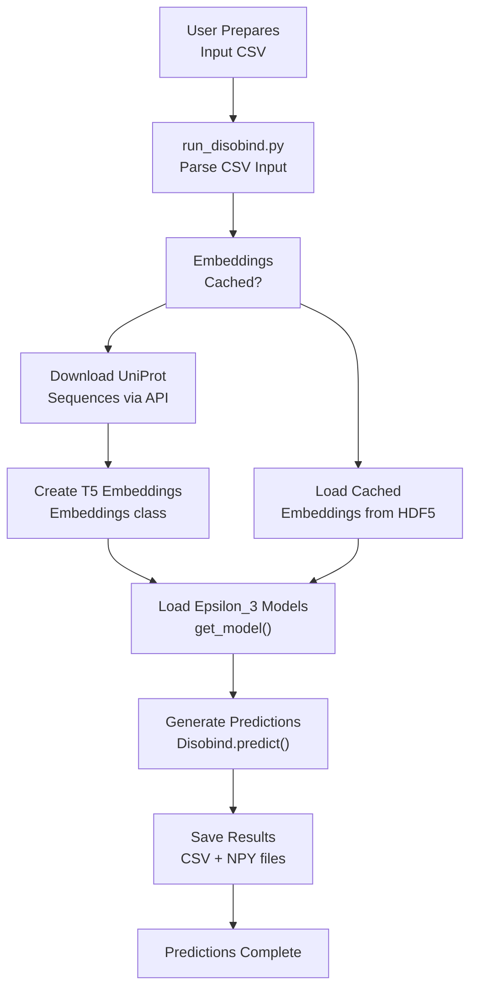
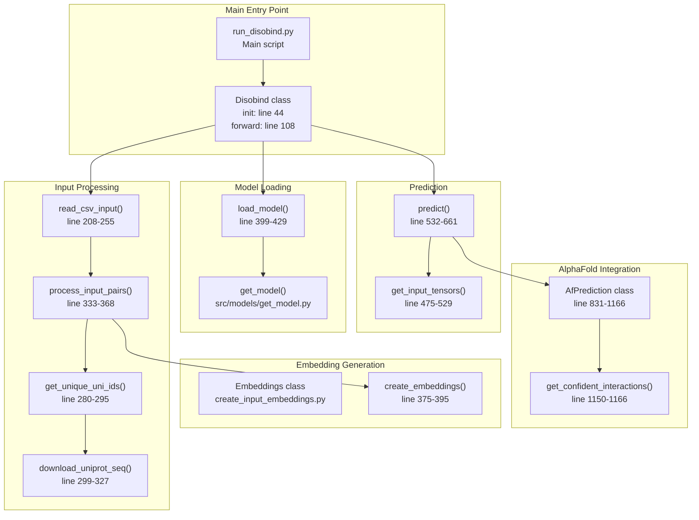

# Quick Start Guide

> **Relevant source files**
> * [README.md](https://github.com/isblab/disobind/blob/5fffcf84/README.md?plain=1)
> * [example/output.tar.gz](https://github.com/isblab/disobind/blob/5fffcf84/example/output.tar.gz)
> * [example/pae_model_4_multimer_v3_pred_4.json](https://github.com/isblab/disobind/blob/5fffcf84/example/pae_model_4_multimer_v3_pred_4.json)
> * [example/test.csv](https://github.com/isblab/disobind/blob/5fffcf84/example/test.csv)
> * [example/unrelaxed_model_4_multimer_v3_pred_4.pdb](https://github.com/isblab/disobind/blob/5fffcf84/example/unrelaxed_model_4_multimer_v3_pred_4.pdb)

## Purpose and Scope

This guide provides a practical walkthrough for running your first Disobind predictions. It covers the essential steps from preparing input files to interpreting output predictions for binary protein complexes containing at least one intrinsically disordered region (IDR).

For detailed information about installation and environment setup, see [Installation and Setup](/isblab/disobind/1.1-installation-and-setup). For comprehensive documentation on prediction options and parameters, see [Running Predictions](/isblab/disobind/2-running-predictions). For output file formats and interpretation details, see [Output Files and Interpretation](/isblab/disobind/2.4-output-files-and-interpretation).

**Sources:** [README.md L1-L129](https://github.com/isblab/disobind/blob/5fffcf84/README.md?plain=1#L1-L129)

---

## Prerequisites Check

Before running Disobind, verify your installation:

```javascript
# Activate the conda environmentconda activate disobind # Verify Python packagespython -c "import torch; import Bio; print('Dependencies OK')" # Check model files existls models/Epsilon_3_6/Version_0/ls models/Epsilon_3_16/Version_2/
```

The Disobind models should be located in the `models/` directory with the following structure:

| Model Type | CG Level | Directory | Purpose |
| --- | --- | --- | --- |
| Epsilon_3_6 | 10 | `models/Epsilon_3_6/Version_0/` | Interaction prediction (contact maps) |
| Epsilon_3_6 | 5 | `models/Epsilon_3_6/Version_1/` | Interaction prediction (contact maps) |
| Epsilon_3_6 | 1 | `models/Epsilon_3_6/Version_2/` | Interaction prediction (contact maps) |
| Epsilon_3_16 | 10 | `models/Epsilon_3_16/Version_0/` | Interface residue prediction |
| Epsilon_3_16 | 5 | `models/Epsilon_3_16/Version_1/` | Interface residue prediction |
| Epsilon_3_16 | 1 | `models/Epsilon_3_16/Version_2/` | Interface residue prediction |

**Sources:** [run_disobind.py L86-L87](https://github.com/isblab/disobind/blob/5fffcf84/run_disobind.py#L86-L87)

 [README.md L14-L38](https://github.com/isblab/disobind/blob/5fffcf84/README.md?plain=1#L14-L38)

---

## Basic Prediction Workflow

The following diagram illustrates the complete workflow from input preparation to final predictions:

**Basic Disobind Prediction Flow**



**Sources:** [run_disobind.py L43-L123](https://github.com/isblab/disobind/blob/5fffcf84/run_disobind.py#L43-L123)

 [run_disobind.py L164-L203](https://github.com/isblab/disobind/blob/5fffcf84/run_disobind.py#L164-L203)

---

## Understanding Input Format

Disobind accepts protein pairs in CSV or FASTA format. Each entry represents one binary complex to predict.

### Input Format for Disobind Only (CSV)

For predictions using only Disobind (sequence-based):

```
UniProt_ID1,start1,end1,UniProt_ID2,start2,end2
```

**Example:**

```
P04273,95,193,P04273,95,192
```

This specifies a homodimer where:

* Protein 1: UniProt P04273, residues 95-193
* Protein 2: UniProt P04273, residues 95-192

### Input Format for Disobind+AF2 (CSV)

To combine Disobind predictions with AlphaFold2 structural information:

```
UniProt_ID1,start1,end1,UniProt_ID2,start2,end2,AF2_struct_file,AF2_json_file,chain1,chain2,offset1,offset2
```

**Example:**

```
P04273,95,193,P04273,95,193,./example/unrelaxed_model_4_multimer_v3_pred_4.pdb,./example/pae_model_4_multimer_v3_pred_4.json,B,C,0,0
```

### FASTA format

If proteins do not have a UniProt accession, use FASTA format:

```
>UniProt_ID1, start1, end1, AF2_struct_file_path, AF2_pae_file_path, chain1, offset1
Protein 1 Sequence
>UniProt_ID2, start2, end2, AF2_struct_file_path, AF2_pae_file_path, chain2, offset2
Protein 2 Sequence
```

**Important Constraints:**

* Protein 1 must be an IDR.
* Protein 2 may or may not be an IDR.
* Only binary complexes (AB) are supported. For non-binary complexes (ABC), convert them into binary pairs (AB, BC, AC).

**Sources:** [run_disobind.py L208-L255](https://github.com/isblab/disobind/blob/5fffcf84/run_disobind.py#L208-L255)

 [README.md L42-L73](https://github.com/isblab/disobind/blob/5fffcf84/README.md?plain=1#L42-L73)

 [example/test.csv L1-L2](https://github.com/isblab/disobind/blob/5fffcf84/example/test.csv#L1-L2)

---

## Running Your First Prediction

### Example 1: Basic Disobind Prediction

Use the provided example file `example/test.csv`. Run Disobind with default settings (interface prediction only, CG=1):

```
python run_disobind.py -i csv -f ./example/test.csv
```

**Key Command-Line Options:**

| Flag | Default | Description |
| --- | --- | --- |
| `-i` | `csv` | Input file type (`csv` or `fasta`) |
| `-f` | Required | Path to the input file |
| `-o` | `output` | Output directory name |
| `-d` | `cpu` | Device: `cpu` or `cuda` |
| `-c` | `2` | Number of cores for downloading UniProt sequences |
| `-cm` | `False` | Predict inter-protein contact maps |
| `-cg` | `1` | Coarse-graining level: `0` (all), `1`, `5`, or `10` |

**Sources:** [run_disobind.py L126-L161](https://github.com/isblab/disobind/blob/5fffcf84/run_disobind.py#L126-L161)

 [README.md L76-L93](https://github.com/isblab/disobind/blob/5fffcf84/README.md?plain=1#L76-L93)

---

## Understanding the Output

### Output Files

After running Disobind, the following files are generated in the output directory:

1. **CSV output file**: Contains residue-level interaction predictions.
2. **`Predictions.npy`**: Contains predictions for all input sequence fragment pairs in a nested dictionary.

### CSV Output Interpretation

| Protein1 | Residue1 | Protein2 | Residue2 |
| --- | --- | --- | --- |
| X1 | 10 | X2 | 40 |

* **Contact Map Prediction (`-cm`)**: Residue 10 in protein X1 interacts with residue 40 in protein X2.
* **Interface Prediction (Default)**: Residues in Protein1 (left) may interact with one or more residues in Protein2 (right).

**Sources:** [README.md L95-L114](https://github.com/isblab/disobind/blob/5fffcf84/README.md?plain=1#L95-L114)

---

## Code Components Reference

The following diagram maps the main code entities involved in the prediction workflow:

**Disobind Class Structure and Workflow**



**Key Classes and Methods:**

| Class/Function | Location | Purpose |
| --- | --- | --- |
| `Disobind` | [run_disobind.py L43-L826](https://github.com/isblab/disobind/blob/5fffcf84/run_disobind.py#L43-L826) | Main orchestrator class |
| `Disobind.forward()` | [run_disobind.py L108-L122](https://github.com/isblab/disobind/blob/5fffcf84/run_disobind.py#L108-L122) | Entry point for prediction pipeline |
| `Disobind.predict()` | [run_disobind.py L532-L661](https://github.com/isblab/disobind/blob/5fffcf84/run_disobind.py#L532-L661) | Runs models and generates predictions |
| `AfPrediction` | [run_disobind.py L831-L1166](https://github.com/isblab/disobind/blob/5fffcf84/run_disobind.py#L831-L1166) | Processes AlphaFold2 structures |

**Sources:** [run_disobind.py L43-L1166](https://github.com/isblab/disobind/blob/5fffcf84/run_disobind.py#L43-L1166)

---

## AlphaFold2 Integration Strategy

Disobind can combine sequence-based predictions with AlphaFold structural contacts to improve accuracy.

**Combination Strategy:**
Disobind and AF2 predictions are combined using an element-wise maximum operation in `Disobind.predict()` [run_disobind.py L619-L643](https://github.com/isblab/disobind/blob/5fffcf84/run_disobind.py#L619-L643)

**Confidence Filtering:**
The `AfPrediction` class filters structural contacts based on:

* **pLDDT**: Per-residue confidence [run_disobind.py L1118-L1128](https://github.com/isblab/disobind/blob/5fffcf84/run_disobind.py#L1118-L1128)
* **PAE**: Predicted Aligned Error [run_disobind.py L1130-L1148](https://github.com/isblab/disobind/blob/5fffcf84/run_disobind.py#L1130-L1148)

**Sources:** [run_disobind.py L831-L1166](https://github.com/isblab/disobind/blob/5fffcf84/run_disobind.py#L831-L1166)

 [run_disobind.py L619-L643](https://github.com/isblab/disobind/blob/5fffcf84/run_disobind.py#L619-L643)