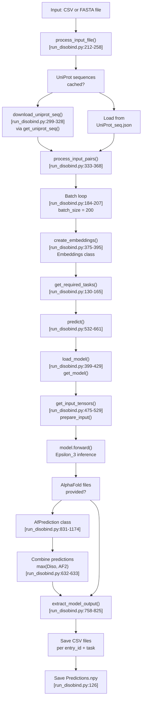
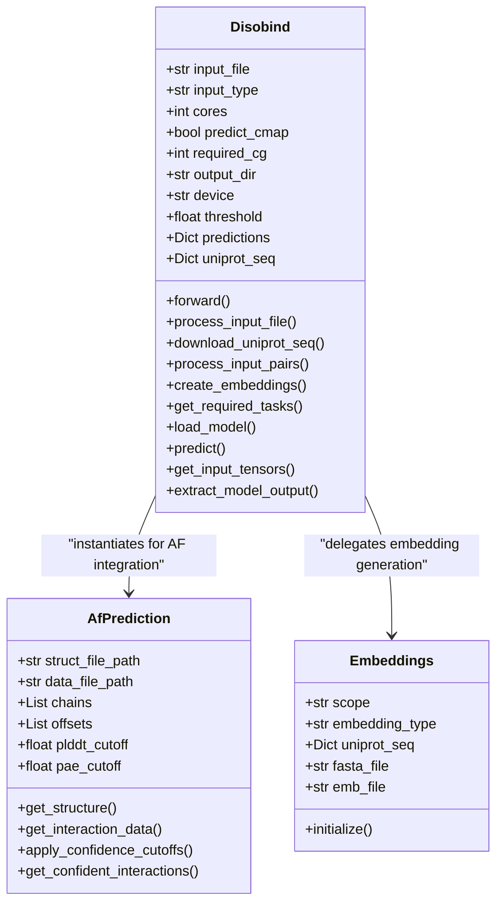

# Running Predictions

> **Relevant source files**
> * [README.md](https://github.com/isblab/disobind/blob/5fffcf84/README.md?plain=1)
> * [example/test.csv](https://github.com/isblab/disobind/blob/5fffcf84/example/test.csv)
> * [example/test.fasta](https://github.com/isblab/disobind/blob/5fffcf84/example/test.fasta)
> * [run_disobind.py](https://github.com/isblab/disobind/blob/5fffcf84/run_disobind.py)

## Purpose and Scope

This page provides a comprehensive guide to the main Disobind prediction system, focusing on the `run_disobind.py` script and its core classes. It covers the overall prediction workflow, key components, command-line usage, and how the system processes protein pairs to generate interaction predictions.

For detailed information about specific aspects of the prediction system:

* Input CSV/FASTA format and data preparation → see [Input Format and Preparation](/isblab/disobind/2.1-input-format-and-preparation)
* Different prediction tasks (interaction vs interface) and coarse-graining levels (1, 5, 10) → see [Prediction Tasks and Coarse-Graining](/isblab/disobind/2.2-prediction-tasks-and-coarse-graining)
* Combining Disobind predictions with AlphaFold2/3 structural predictions → see [AlphaFold Integration](/isblab/disobind/2.3-alphafold-integration)
* Understanding and interpreting output CSV, NPY, and HDF5 files → see [Output Files and Interpretation](/isblab/disobind/2.4-output-files-and-interpretation)

---

## Overview

The Disobind prediction system is implemented in [run_disobind.py L1-L1217](https://github.com/isblab/disobind/blob/5fffcf84/run_disobind.py#L1-L1217)

 It takes protein pairs as input (where Protein 1 must be an IDR [run_disobind.py L5](https://github.com/isblab/disobind/blob/5fffcf84/run_disobind.py#L5-L5)

) and predicts their interaction interfaces and contact maps. The system can operate standalone or integrate with AlphaFold2/3 predictions to enhance accuracy.

**Key capabilities:**

* Predict inter-protein contact maps and interface residues [README.md L111-L113](https://github.com/isblab/disobind/blob/5fffcf84/README.md?plain=1#L111-L113)
* Process binary complexes at multiple coarse-graining resolutions (1, 5, 10) [run_disobind.py L58-L59](https://github.com/isblab/disobind/blob/5fffcf84/run_disobind.py#L58-L59)
* Integrate AlphaFold structural predictions with confidence filtering (pLDDT and PAE) [run_disobind.py L73-L76](https://github.com/isblab/disobind/blob/5fffcf84/run_disobind.py#L73-L76)
* Support for both UniProt-based CSV inputs and raw sequence FASTA inputs [run_disobind.py L214-L223](https://github.com/isblab/disobind/blob/5fffcf84/run_disobind.py#L214-L223)
* Batch processing for multiple protein pairs with automated embedding generation [run_disobind.py L184-L207](https://github.com/isblab/disobind/blob/5fffcf84/run_disobind.py#L184-L207)

**Sources:** [run_disobind.py L1-L82](https://github.com/isblab/disobind/blob/5fffcf84/run_disobind.py#L1-L82)

 [README.md L1-L129](https://github.com/isblab/disobind/blob/5fffcf84/README.md?plain=1#L1-L129)

---

## Main Prediction Workflow

The following diagram shows the complete end-to-end workflow for running Disobind predictions:



**Sources:** [run_disobind.py L111-L128](https://github.com/isblab/disobind/blob/5fffcf84/run_disobind.py#L111-L128)

 [run_disobind.py L168-L207](https://github.com/isblab/disobind/blob/5fffcf84/run_disobind.py#L168-L207)

 [run_disobind.py L532-L661](https://github.com/isblab/disobind/blob/5fffcf84/run_disobind.py#L532-L661)

---

## Key Classes and Components

### Disobind Class

The `Disobind` class [run_disobind.py L44-L826](https://github.com/isblab/disobind/blob/5fffcf84/run_disobind.py#L44-L826)

 is the main orchestrator for the prediction workflow. It manages input parsing, sequence retrieval, embedding generation, and the inference loop.

**Class Structure:**



**Key Attributes:**

| Attribute | Type | Default | Description |
| --- | --- | --- | --- |
| `input_type` | str | - | "csv" or "fasta" [run_disobind.py L53](https://github.com/isblab/disobind/blob/5fffcf84/run_disobind.py#L53-L53) |
| `predict_cmap` | bool | False | Whether to predict contact maps [run_disobind.py L57](https://github.com/isblab/disobind/blob/5fffcf84/run_disobind.py#L57-L57) |
| `required_cg` | int | 1 | Coarse-graining level (0, 1, 5, 10) [run_disobind.py L59](https://github.com/isblab/disobind/blob/5fffcf84/run_disobind.py#L59-L59) |
| `device` | str | "cpu" | Device for inference (cpu/cuda) [run_disobind.py L68](https://github.com/isblab/disobind/blob/5fffcf84/run_disobind.py#L68-L68) |
| `threshold` | float | 0.5 | Probability threshold for binary contact [run_disobind.py L70](https://github.com/isblab/disobind/blob/5fffcf84/run_disobind.py#L70-L70) |
| `plddt_threshold` | float | 70 | AlphaFold pLDDT cutoff [run_disobind.py L74](https://github.com/isblab/disobind/blob/5fffcf84/run_disobind.py#L74-L74) |
| `pae_threshold` | float | 5 | AlphaFold PAE cutoff (Å) [run_disobind.py L76](https://github.com/isblab/disobind/blob/5fffcf84/run_disobind.py#L76-L76) |

**Sources:** [run_disobind.py L44-L108](https://github.com/isblab/disobind/blob/5fffcf84/run_disobind.py#L44-L108)

### AfPrediction Class

The `AfPrediction` class [run_disobind.py L831-L1174](https://github.com/isblab/disobind/blob/5fffcf84/run_disobind.py#L831-L1174)

 handles the extraction and processing of AlphaFold2/3 structural predictions. It parses PDB/CIF structure files and JSON confidence data to generate filtered contact predictions.

**Key Methods:**

| Method | Purpose | Line Reference |
| --- | --- | --- |
| `get_structure()` | Parse PDB/CIF file using BioPython | [run_disobind.py L872-L879](https://github.com/isblab/disobind/blob/5fffcf84/run_disobind.py#L872-L879) |
| `get_interaction_data()` | Compute contact map, pLDDT, and PAE | [run_disobind.py L1099-L1115](https://github.com/isblab/disobind/blob/5fffcf84/run_disobind.py#L1099-L1115) |
| `apply_confidence_cutoffs()` | Filter by pLDDT ≥ 70 and PAE ≤ 5 | [run_disobind.py L1118-L1128](https://github.com/isblab/disobind/blob/5fffcf84/run_disobind.py#L1118-L1128) |
| `get_confident_interactions()` | Generate final confident contact map | [run_disobind.py L1150-L1173](https://github.com/isblab/disobind/blob/5fffcf84/run_disobind.py#L1150-L1173) |

**Sources:** [run_disobind.py L831-L1174](https://github.com/isblab/disobind/blob/5fffcf84/run_disobind.py#L831-L1174)

---

## Command-Line Interface

### Basic Usage

The system is invoked via `run_disobind.py` with specific flags for input type and path.

```
python run_disobind.py -i csv -f ./example/test.csv
```

### Command-Line Arguments

| Flag | Long Form | Default | Description |
| --- | --- | --- | --- |
| `-i` | `--input_type` | - | Input file type: `csv` or `fasta` [run_disobind.py L1181](https://github.com/isblab/disobind/blob/5fffcf84/run_disobind.py#L1181-L1181) |
| `-f` | `--file` | - | Path to the input file [run_disobind.py L1185](https://github.com/isblab/disobind/blob/5fffcf84/run_disobind.py#L1185-L1185) |
| `-c` | `--max_cores` | 2 | CPU cores for sequence downloads [run_disobind.py L1189](https://github.com/isblab/disobind/blob/5fffcf84/run_disobind.py#L1189-L1189) |
| `-o` | `--output_dir` | "output" | Output directory name [run_disobind.py L1193](https://github.com/isblab/disobind/blob/5fffcf84/run_disobind.py#L1193-L1193) |
| `-d` | `--device` | "cpu" | Device: `cpu` or `cuda` [run_disobind.py L1197](https://github.com/isblab/disobind/blob/5fffcf84/run_disobind.py#L1197-L1197) |
| `-cm` | `--cmaps` | False | Predict inter-protein contact maps [run_disobind.py L1202](https://github.com/isblab/disobind/blob/5fffcf84/run_disobind.py#L1202-L1202) |
| `-cg` | `--coarse` | 1 | CG resolution: 0 (all), 1, 5, 10 [run_disobind.py L1207](https://github.com/isblab/disobind/blob/5fffcf84/run_disobind.py#L1207-L1207) |

**Sources:** [run_disobind.py L1177-L1217](https://github.com/isblab/disobind/blob/5fffcf84/run_disobind.py#L1177-L1217)

 [README.md L84-L93](https://github.com/isblab/disobind/blob/5fffcf84/README.md?plain=1#L84-L93)

---

## Prediction Pipeline Stages

### Stage 1: Input Processing

The script supports two input modes [run_disobind.py L214-L223](https://github.com/isblab/disobind/blob/5fffcf84/run_disobind.py#L214-L223)

:

1. **CSV Mode:** Preferred for batch processing multiple UniProt-indexed pairs.
2. **FASTA Mode:** Used for custom sequences without UniProt accessions (limited to one pair at a time).

For details on file structures, see [Input Format and Preparation](/isblab/disobind/2.1-input-format-and-preparation).

### Stage 2: Sequence and Embedding Generation

If UniProt IDs are provided, the system downloads sequences in parallel using `Pool` [run_disobind.py L314-L318](https://github.com/isblab/disobind/blob/5fffcf84/run_disobind.py#L314-L318)

 It then uses the `Embeddings` class to generate ProtT5 embeddings, which are saved to a temporary HDF5 file (`p1_p2_test.h5`) [run_disobind.py L106-L395](https://github.com/isblab/disobind/blob/5fffcf84/run_disobind.py#L106-L395)

### Stage 3: Model Inference

The `predict()` method [run_disobind.py L532-L661](https://github.com/isblab/disobind/blob/5fffcf84/run_disobind.py#L532-L661)

 iterates through requested tasks. For each task, it:

1. Loads the appropriate Epsilon_3 model version [run_disobind.py L399-L429](https://github.com/isblab/disobind/blob/5fffcf84/run_disobind.py#L399-L429)
2. Prepares input tensors (padding and coarse-graining) [run_disobind.py L475-L529](https://github.com/isblab/disobind/blob/5fffcf84/run_disobind.py#L475-L529)
3. Runs the forward pass to obtain probability maps [run_disobind.py L598-L600](https://github.com/isblab/disobind/blob/5fffcf84/run_disobind.py#L598-L600)

### Stage 4: AlphaFold Integration

If structural files are provided in the input, the system computes structural contacts and filters them by confidence scores (pLDDT and PAE). The final prediction is often the maximum of the Disobind sequence-based prediction and the AF2 structure-based prediction [run_disobind.py L632-L633](https://github.com/isblab/disobind/blob/5fffcf84/run_disobind.py#L632-L633)

For details, see [AlphaFold Integration](/isblab/disobind/2.3-alphafold-integration).

---

## Output Files and Interpretation

The system generates several output files in the specified directory:

| File | Format | Description |
| --- | --- | --- |
| `Predictions.npy` | NumPy / Dict | Nested dictionary containing raw probability arrays and DataFrames for all tasks [run_disobind.py L126](https://github.com/isblab/disobind/blob/5fffcf84/run_disobind.py#L126-L126) |
| `diso_{id}_{task}_cg{cg}.csv` | CSV | Residue-level interaction pairs exceeding the threshold [run_disobind.py L795-L802](https://github.com/isblab/disobind/blob/5fffcf84/run_disobind.py#L795-L802) |
| `UniProt_seq.json` | JSON | Cached protein sequences [run_disobind.py L108](https://github.com/isblab/disobind/blob/5fffcf84/run_disobind.py#L108-L108) |

**Interpretation:**

* **Contact Map:** A value at `(i, j)` indicates the probability that residue `i` of Protein 1 interacts with residue `j` of Protein 2.
* **Interface:** The probability that a residue is part of the binding interface, regardless of the specific partner residue.

For detailed output schema, see [Output Files and Interpretation](/isblab/disobind/2.4-output-files-and-interpretation).

**Sources:** [run_disobind.py L758-L825](https://github.com/isblab/disobind/blob/5fffcf84/run_disobind.py#L758-L825)

 [README.md L95-L114](https://github.com/isblab/disobind/blob/5fffcf84/README.md?plain=1#L95-L114)