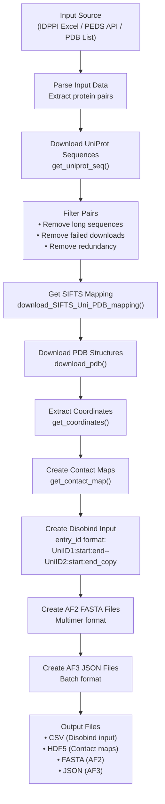
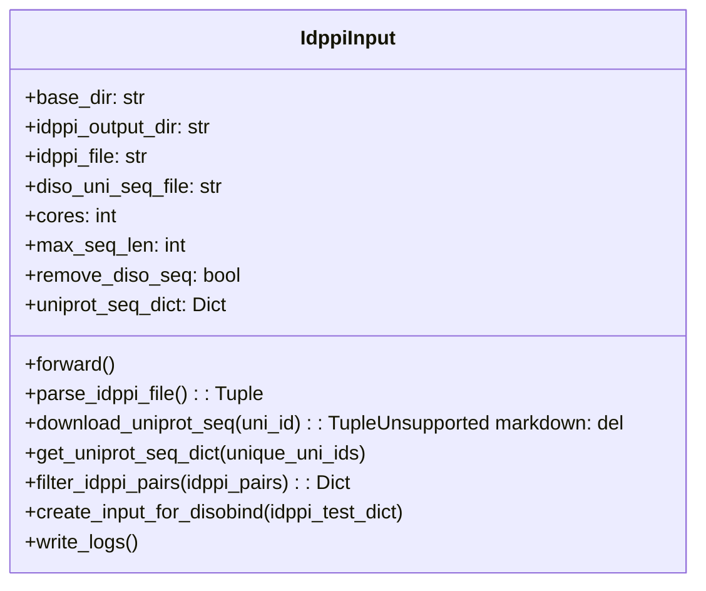
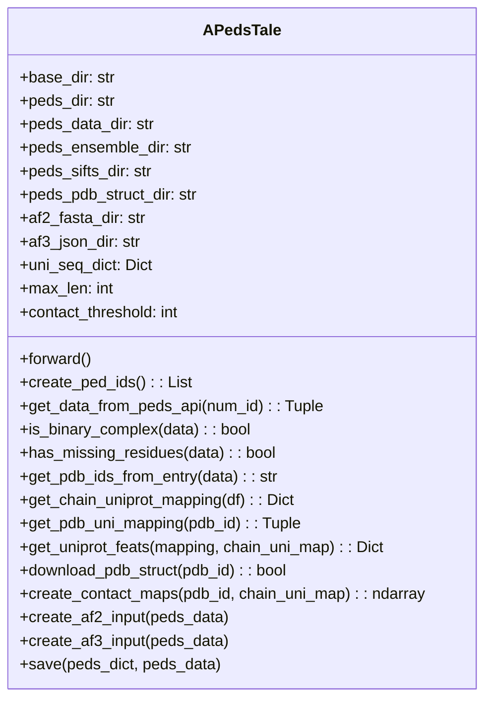
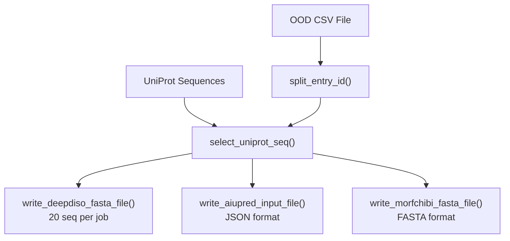

# Special Dataset Preparation

> **Relevant source files**
> * [dataset/get_ped_ensembles.py](https://github.com/isblab/disobind/blob/5fffcf84/dataset/get_ped_ensembles.py)
> * [dataset/prep_idppi_input2.py](https://github.com/isblab/disobind/blob/5fffcf84/dataset/prep_idppi_input2.py)
> * [dataset/prep_other_methods_input.py](https://github.com/isblab/disobind/blob/5fffcf84/dataset/prep_other_methods_input.py)
> * [dataset/prepare_entry_from_pdb.py](https://github.com/isblab/disobind/blob/5fffcf84/dataset/prepare_entry_from_pdb.py)

## Purpose and Scope

This page documents specialized scripts for preparing evaluation and test datasets that are not part of the main training pipeline. These scripts create Disobind-compatible input files and ground truth data for specific benchmark datasets and case studies.

For information about the main dataset creation pipeline used for training, see [Dataset Creation Pipeline](/isblab/disobind/3-dataset-creation-pipeline). For general data processing utilities used across the codebase, see [Data Processing Utilities](/isblab/disobind/3.6-data-processing-utilities).

The special dataset preparation scripts covered here include:

* **IDPPI Dataset**: Preparing the intrinsically disordered protein-protein interaction benchmark.
* **PEDS Ensembles**: Extracting binary complexes from the Protein Ensemble Database.
* **Custom PDB Entries**: Creating test cases from specific PDB structures.
* **Other Methods Input**: Preparing data for external tools like AIUPred, DeepDISOBind, and MORFchibi.

All workflows generate both Disobind input files (CSV format with entry IDs) and ground truth data (contact maps or binary labels), as well as AlphaFold2/3 input files for comparative analysis.

---

## Common Workflow Pattern

All special dataset preparation scripts follow a similar multi-stage workflow:

### Data Preparation Flow



**Sources**: [dataset/prep_idppi_input2.py L42-L63](https://github.com/isblab/disobind/blob/5fffcf84/dataset/prep_idppi_input2.py#L42-L63)

 [dataset/get_ped_ensembles.py L53-L58](https://github.com/isblab/disobind/blob/5fffcf84/dataset/get_ped_ensembles.py#L53-L58)

 [dataset/prepare_entry_from_pdb.py L70-L76](https://github.com/isblab/disobind/blob/5fffcf84/dataset/prepare_entry_from_pdb.py#L70-L76)

---

## IDPPI Dataset Preparation

The `IdppiInput` class prepares the IDPPI (Intrinsically Disordered Protein-Protein Interactions) benchmark dataset for evaluation. This dataset was published in Nature Scientific Reports (DOI: 10.1038/s41598-018-28815-x).

### IdppiInput Class Architecture



**Sources**: [dataset/prep_idppi_input2.py L15-L40](https://github.com/isblab/disobind/blob/5fffcf84/dataset/prep_idppi_input2.py#L15-L40)

### Key Configuration Parameters

| Parameter | Default | Description |
| --- | --- | --- |
| `cores` | 100 | Number of parallel processes for downloading sequences |
| `max_seq_len` | 10000 | Maximum allowed sequence length |
| `remove_diso_seq` | True | Exclude pairs present in Disobind training dataset [dataset/prep_idppi_input2.py L91-L94](https://github.com/isblab/disobind/blob/5fffcf84/dataset/prep_idppi_input2.py#L91-L94) |
| `idppi_file` | `41598_2018_28815_MOESM2_ESM.xlsx` | Source Excel file with 5 test sets |

**Sources**: [dataset/prep_idppi_input2.py L19-L29](https://github.com/isblab/disobind/blob/5fffcf84/dataset/prep_idppi_input2.py#L19-L29)

### Output Files

| File | Format | Content |
| --- | --- | --- |
| `IDPPI_input_diso.csv` | CSV | Comma-separated entry IDs for Disobind input |
| `Uniprot_seq_idppi.json` | JSON | Dictionary mapping UniProt IDs to sequences |
| `IDPPI_target.json` | JSON | Dictionary mapping pair IDs to binary labels (0/1) |
| `Logs.txt` | Text | Statistics: total pairs, filtered pairs, interacting/non-interacting counts |

**Sources**: [dataset/prep_idppi_input2.py L32-L39](https://github.com/isblab/disobind/blob/5fffcf84/dataset/prep_idppi_input2.py#L32-L39)

 [dataset/prep_idppi_input2.py L158-L206](https://github.com/isblab/disobind/blob/5fffcf84/dataset/prep_idppi_input2.py#L158-L206)

---

## PEDS Ensemble Dataset Preparation

The `APedsTale` class extracts binary protein complexes from the Protein Ensemble Database (PEDS) and creates comprehensive input/output files for Disobind and AlphaFold.

### APedsTale Class Architecture



**Sources**: [dataset/get_ped_ensembles.py L20-L621](https://github.com/isblab/disobind/blob/5fffcf84/dataset/get_ped_ensembles.py#L20-L621)

### Entry Selection Criteria

PEDS entries are included only if they satisfy all criteria:

| Criterion | Check Method | Requirement |
| --- | --- | --- |
| Valid Entry | `entry_is_valid()` | API response not "not_found" or "bad_request" [dataset/get_ped_ensembles.py L97-L108](https://github.com/isblab/disobind/blob/5fffcf84/dataset/get_ped_ensembles.py#L97-L108) |
| Binary Complex | `is_binary_complex()` | Exactly 2 chains in `construct_chains` [dataset/get_ped_ensembles.py L111-L121](https://github.com/isblab/disobind/blob/5fffcf84/dataset/get_ped_ensembles.py#L111-L121) |
| Complete Structure | `has_missing_residues()` | No missing residues in any chain [dataset/get_ped_ensembles.py L124-L137](https://github.com/isblab/disobind/blob/5fffcf84/dataset/get_ped_ensembles.py#L124-L137) |
| Length Limit | `get_uniprot_feats()` | All chains ≤ 200 residues (default) [dataset/get_ped_ensembles.py L50](https://github.com/isblab/disobind/blob/5fffcf84/dataset/get_ped_ensembles.py#L50-L50) |
| Size Consistency | `check_seq_cmap_size()` | Contact map shape matches sequence lengths [dataset/get_ped_ensembles.py L140-L155](https://github.com/isblab/disobind/blob/5fffcf84/dataset/get_ped_ensembles.py#L140-L155) |

**Sources**: [dataset/get_ped_ensembles.py L97-L156](https://github.com/isblab/disobind/blob/5fffcf84/dataset/get_ped_ensembles.py#L97-L156)

### Contact Map Aggregation

For NMR ensembles in PEDS, contact maps are aggregated across all models:

1. `get_coordinates()` extracts CA coordinates for every model in the CIF file.
2. `get_contact_map()` computes binary contacts for each model using the `contact_threshold` (default 8Å).
3. Contacts are summed across models and then binarized: `np.where(cmap > 0, 1, 0)`.

**Sources**: [dataset/get_ped_ensembles.py L51](https://github.com/isblab/disobind/blob/5fffcf84/dataset/get_ped_ensembles.py#L51-L51)

 [dataset/get_ped_ensembles.py L343-L357](https://github.com/isblab/disobind/blob/5fffcf84/dataset/get_ped_ensembles.py#L343-L357)

---

## Custom PDB Entry Preparation

The `EntryFromPDB` class allows for fine-grained control over chain and residue selection for specific PDB structures.

### Chain and Residue Selection Logic

```
self.select_chains = {    "2lmo": ["A", "B"],    "8cmk": ["A", "C"],} self.select_res = {    "8cmk": {"A": np.arange( 700, 801, 1 ), "C": []},}
```

**Sources**: [dataset/prepare_entry_from_pdb.py L42-L58](https://github.com/isblab/disobind/blob/5fffcf84/dataset/prepare_entry_from_pdb.py#L42-L58)

### Residue Cropping Workflow

The `crop_residues()` function filters SIFTS mapping positions based on the `select_res` dictionary, ensuring the final `entry_id` correctly reflects the cropped UniProt range.

**Sources**: [dataset/prepare_entry_from_pdb.py L199-L232](https://github.com/isblab/disobind/blob/5fffcf84/dataset/prepare_entry_from_pdb.py#L199-L232)

---

## External Methods Input Generation

The `CreateInput` class in `prep_other_methods_input.py` prepares sequences from the Out-Of-Distribution (OOD) set for external tools.

### External Methods Input Logic



**Sources**: [dataset/prep_other_methods_input.py L13-L146](https://github.com/isblab/disobind/blob/5fffcf84/dataset/prep_other_methods_input.py#L13-L146)

### Output Files for External Methods

* `deepdisobind_fasta_{start}-{end}.fasta`: Batched FASTA files for DeepDISOBind [dataset/prep_other_methods_input.py L109-L123](https://github.com/isblab/disobind/blob/5fffcf84/dataset/prep_other_methods_input.py#L109-L123)
* `aiupred_input.json`: Sequence dictionary for AIUPred [dataset/prep_other_methods_input.py L125-L130](https://github.com/isblab/disobind/blob/5fffcf84/dataset/prep_other_methods_input.py#L125-L130)
* `morfchibi_fasta.fasta`: Combined FASTA for MORFchibi [dataset/prep_other_methods_input.py L133-L144](https://github.com/isblab/disobind/blob/5fffcf84/dataset/prep_other_methods_input.py#L133-L144)

---

## Entry ID Standard

All preparation scripts create entry IDs in the standardized Disobind format:
`{UniID1}:{start1}:{end1}--{UniID2}:{start2}:{end2}_{copy_num}`

**Example**: `P12345:1:150--Q67890:50:200_0`

**Sources**: [dataset/prep_idppi_input2.py L171](https://github.com/isblab/disobind/blob/5fffcf84/dataset/prep_idppi_input2.py#L171-L171)

 [dataset/get_ped_ensembles.py L360-L375](https://github.com/isblab/disobind/blob/5fffcf84/dataset/get_ped_ensembles.py#L360-L375)

 [dataset/prepare_entry_from_pdb.py L312-L327](https://github.com/isblab/disobind/blob/5fffcf84/dataset/prepare_entry_from_pdb.py#L312-L327)