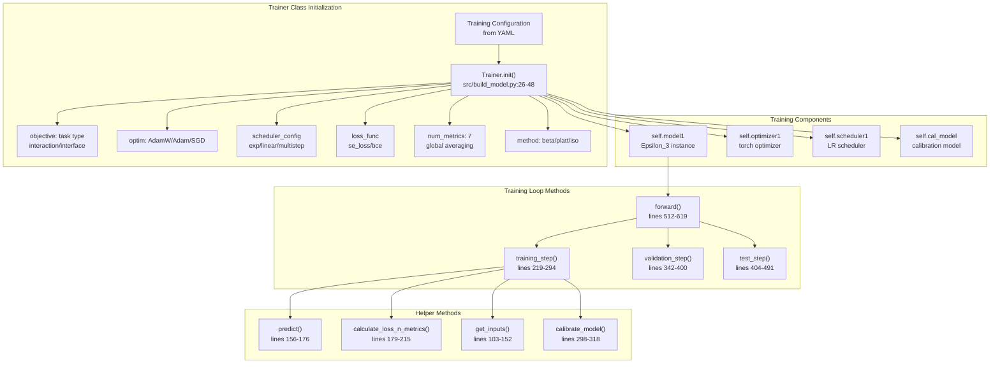
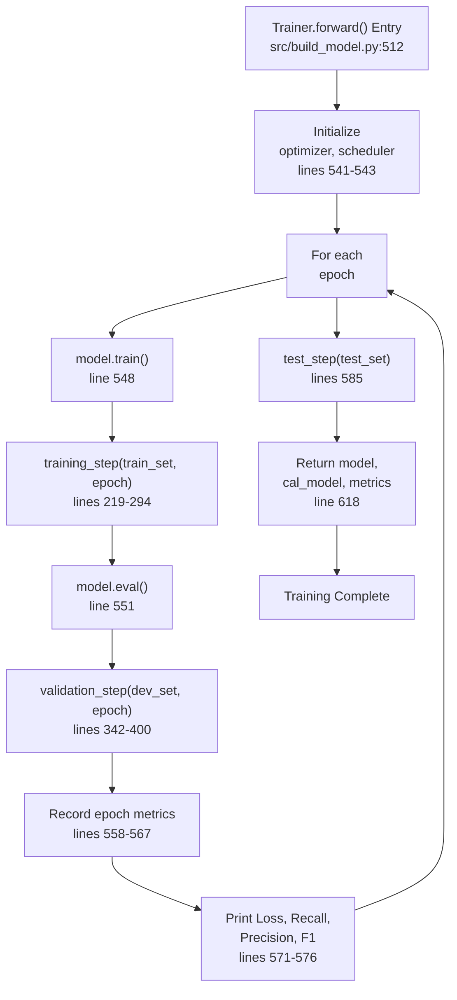
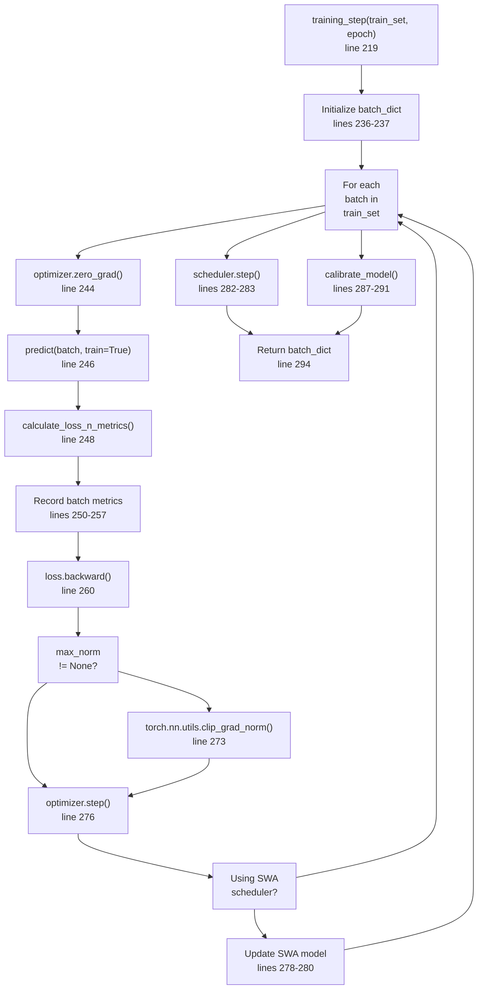
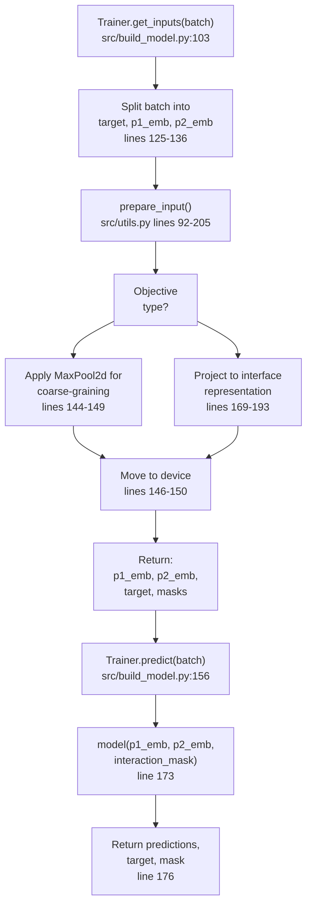
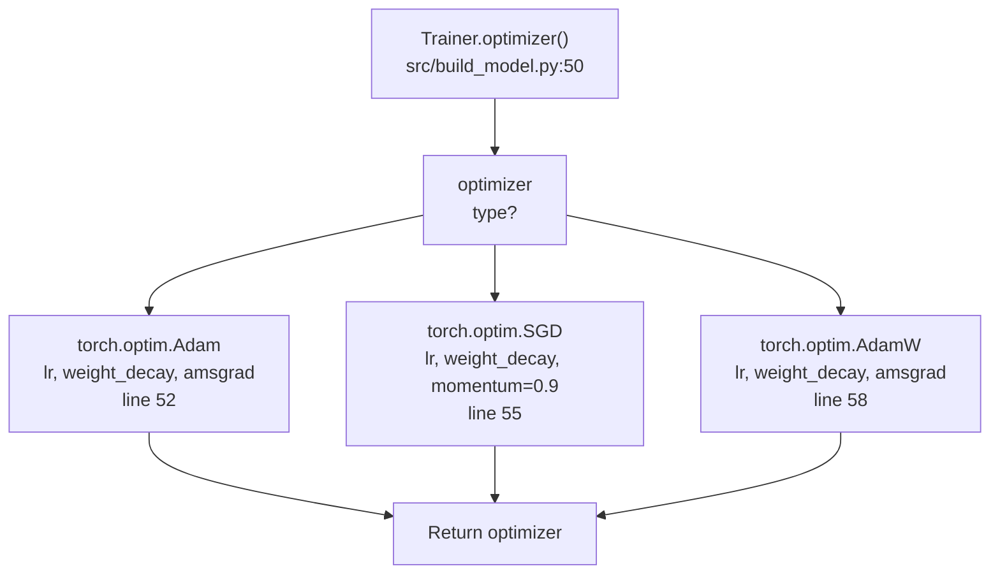
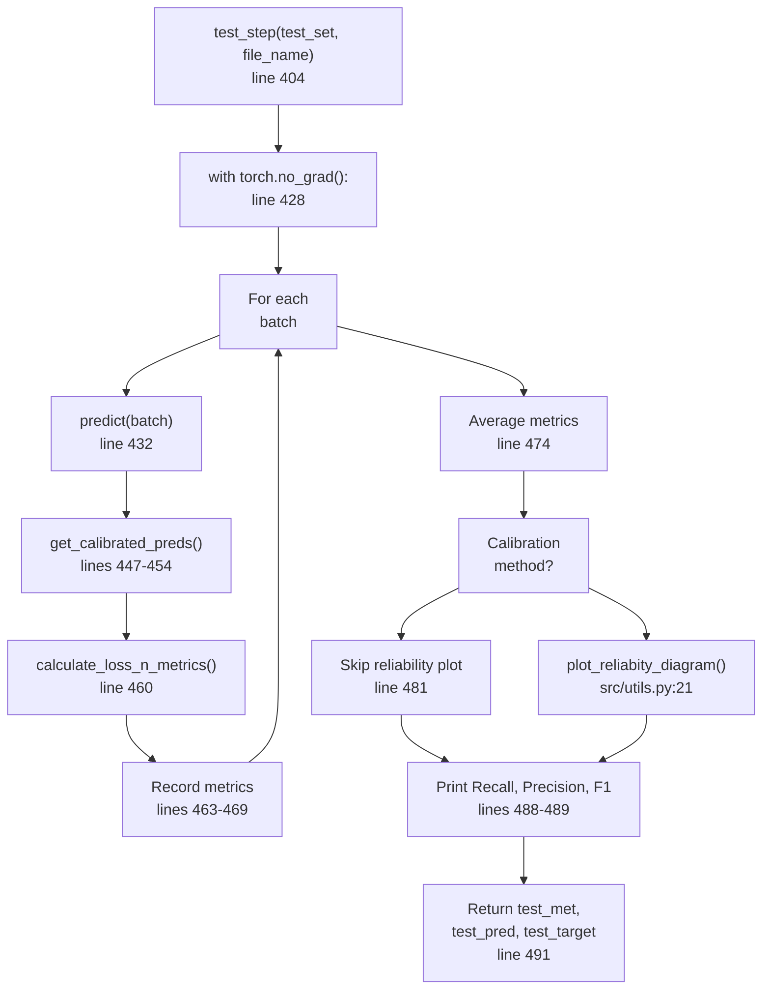

# Training Pipeline

> **Relevant source files**
> * [src/build_model.py](https://github.com/isblab/disobind/blob/5fffcf84/src/build_model.py)
> * [src/dataset_loaders.py](https://github.com/isblab/disobind/blob/5fffcf84/src/dataset_loaders.py)
> * [src/hparams_search.py](https://github.com/isblab/disobind/blob/5fffcf84/src/hparams_search.py)
> * [src/loss.py](https://github.com/isblab/disobind/blob/5fffcf84/src/loss.py)
> * [src/metrics.py](https://github.com/isblab/disobind/blob/5fffcf84/src/metrics.py)
> * [src/utils.py](https://github.com/isblab/disobind/blob/5fffcf84/src/utils.py)

## Purpose and Scope

This document describes the training pipeline for Disobind models, focusing on the `Trainer` class and its orchestration of the model training process. The training pipeline handles optimization, learning rate scheduling, loss calculation, metrics tracking, and model calibration. For details about the model architecture being trained, see [Epsilon_3 Network Design](/isblab/disobind/4.1-epsilon_3-network-design). For information about model configuration parameters, see [Model Configuration Files](/isblab/disobind/4.2-model-configuration-files). For practical guidance on training your own models, see [Training Your Own Models](/isblab/disobind/4.5-training-your-own-models).

---

## Trainer Class Architecture

The `Trainer` class ([src/build_model.py L25-L619](https://github.com/isblab/disobind/blob/5fffcf84/src/build_model.py#L25-L619)

) is the central orchestrator for model training. It inherits from `nn.Module` and manages the complete training workflow including forward passes, backpropagation, optimization, validation, and calibration.

### Core Components

**Sources:** [src/build_model.py L25-L619](https://github.com/isblab/disobind/blob/5fffcf84/src/build_model.py#L25-L619)

### Key Attributes

| Attribute | Type | Description |
| --- | --- | --- |
| `objective` | list | Task specification: `[task_type, bin_size, pool_type, ...]` |
| `loss_func` | function | Loss function from `get_loss_function()` [src/build_model.py L38](https://github.com/isblab/disobind/blob/5fffcf84/src/build_model.py#L38-L38) |
| `optimizer1` | torch.optim | Optimizer instance (AdamW/Adam/SGD) [src/build_model.py L50-L59](https://github.com/isblab/disobind/blob/5fffcf84/src/build_model.py#L50-L59) |
| `scheduler1` | torch.optim.lr_scheduler | Learning rate scheduler [src/build_model.py L61-L100](https://github.com/isblab/disobind/blob/5fffcf84/src/build_model.py#L61-L100) |
| `cal_model` | sklearn model | Calibration model (LogisticRegression/IsotonicRegression/BetaCalibration) [src/build_model.py L298-L318](https://github.com/isblab/disobind/blob/5fffcf84/src/build_model.py#L298-L318) |
| `max_epochs` | int | Number of training epochs [src/build_model.py L43](https://github.com/isblab/disobind/blob/5fffcf84/src/build_model.py#L43-L43) |
| `threshold` | float | Classification threshold (default 0.5) [src/build_model.py L44](https://github.com/isblab/disobind/blob/5fffcf84/src/build_model.py#L44-L44) |
| `device` | str | 'cuda' or 'cpu' [src/build_model.py L45](https://github.com/isblab/disobind/blob/5fffcf84/src/build_model.py#L45-L45) |

**Sources:** [src/build_model.py L26-L48](https://github.com/isblab/disobind/blob/5fffcf84/src/build_model.py#L26-L48)

 [src/build_model.py L50-L100](https://github.com/isblab/disobind/blob/5fffcf84/src/build_model.py#L50-L100)

---

## Training Loop

The training loop executes for `max_epochs` iterations, performing training, validation, and optionally testing at each epoch. The `HparamSearch` class [src/hparams_search.py L52](https://github.com/isblab/disobind/blob/5fffcf84/src/hparams_search.py#L52-L52)

 typically manages the execution of this loop via the `Trainer.forward()` method [src/build_model.py L512](https://github.com/isblab/disobind/blob/5fffcf84/src/build_model.py#L512-L512)

### Main Training Flow

**Sources:** [src/build_model.py L512-L619](https://github.com/isblab/disobind/blob/5fffcf84/src/build_model.py#L512-L619)

 [src/hparams_search.py L173-L220](https://github.com/isblab/disobind/blob/5fffcf84/src/hparams_search.py#L173-L220)

### Training Step Details

The `training_step()` method processes all mini-batches in the training set provided by the `DatasetLoader` [src/dataset_loaders.py L69](https://github.com/isblab/disobind/blob/5fffcf84/src/dataset_loaders.py#L69-L69)

:

**Sources:** [src/build_model.py L219-L294](https://github.com/isblab/disobind/blob/5fffcf84/src/build_model.py#L219-L294)

 [src/dataset_loaders.py L106-L114](https://github.com/isblab/disobind/blob/5fffcf84/src/dataset_loaders.py#L106-L114)

---

## Input Preparation and Forward Pass

Before each forward pass, inputs must be prepared according to the training objective.

### Input Processing Pipeline

**Sources:** [src/build_model.py L103-L176](https://github.com/isblab/disobind/blob/5fffcf84/src/build_model.py#L103-L176)

 [src/utils.py L92-L205](https://github.com/isblab/disobind/blob/5fffcf84/src/utils.py#L92-L205)

### Coarse-Graining Process

For binned (coarse-grained) predictions, the input preparation in `prepare_input` [src/utils.py L92](https://github.com/isblab/disobind/blob/5fffcf84/src/utils.py#L92-L92)

 applies pooling operations:

| Objective | CG Level | Pooling Type | Implementation |
| --- | --- | --- | --- |
| `interaction_bin` | > 1 | `MaxPool2d` | `nn.MaxPool2d(kernel_size=bin_size, stride=bin_size)` [src/utils.py L144](https://github.com/isblab/disobind/blob/5fffcf84/src/utils.py#L144-L144) |
| `interface_bin` | > 1 | `MaxPool2d` | Applied to projected interface mask [src/utils.py L153](https://github.com/isblab/disobind/blob/5fffcf84/src/utils.py#L153-L153) |
| Embedding Averaging | > 1 | `AvgPool1d` | `nn.AvgPool1d` if `bin_input` is True [src/utils.py L136](https://github.com/isblab/disobind/blob/5fffcf84/src/utils.py#L136-L136) |

**Sources:** [src/utils.py L129-L156](https://github.com/isblab/disobind/blob/5fffcf84/src/utils.py#L129-L156)

---

## Optimization Strategy

### Optimizer Configuration

The `Trainer` supports three optimizers initialized in the `optimizer()` method [src/build_model.py L50](https://github.com/isblab/disobind/blob/5fffcf84/src/build_model.py#L50-L50)

:

**Sources:** [src/build_model.py L50-L59](https://github.com/isblab/disobind/blob/5fffcf84/src/build_model.py#L50-L59)

### Learning Rate Schedulers

The `scheduler()` method ([src/build_model.py L61-L100](https://github.com/isblab/disobind/blob/5fffcf84/src/build_model.py#L61-L100)

) configures various learning rate schedules based on the `scheduler_config` [src/build_model.py L33](https://github.com/isblab/disobind/blob/5fffcf84/src/build_model.py#L33-L33)

:

| Scheduler | Type | Key Parameters |
| --- | --- | --- |
| `swa` | Stochastic Weight Averaging | `swa_lr`, `swa_start` [src/build_model.py L64-L68](https://github.com/isblab/disobind/blob/5fffcf84/src/build_model.py#L64-L68) |
| `cycliclr` | Cyclic Learning Rate | `base_lr`, `max_lr`, `step_size_up` [src/build_model.py L69-L75](https://github.com/isblab/disobind/blob/5fffcf84/src/build_model.py#L69-L75) |
| `multistep` | MultiStep Decay | `milestones`, `gamma` [src/build_model.py L76-L80](https://github.com/isblab/disobind/blob/5fffcf84/src/build_model.py#L76-L80) |
| `exp` | Exponential Decay | `gamma` [src/build_model.py L82-L85](https://github.com/isblab/disobind/blob/5fffcf84/src/build_model.py#L82-L85) |
| `linear` | Linear Decay | `start_factor`, `end_factor`, `total_iters` [src/build_model.py L87-L94](https://github.com/isblab/disobind/blob/5fffcf84/src/build_model.py#L87-L94) |

**Sources:** [src/build_model.py L61-L100](https://github.com/isblab/disobind/blob/5fffcf84/src/build_model.py#L61-L100)

---

## Loss Functions

Disobind implements several loss functions in `src/loss.py` to handle the specific requirements of protein interaction prediction.

| Loss Class | Implementation | Use Case |
| --- | --- | --- |
| `BCE` | `nn.BCELoss` | Standard binary cross entropy [src/loss.py L55](https://github.com/isblab/disobind/blob/5fffcf84/src/loss.py#L55-L55) |
| `BCEwithLogits` | `nn.BCEWithLogitsLoss` | Weighted BCE with logit input [src/loss.py L104](https://github.com/isblab/disobind/blob/5fffcf84/src/loss.py#L104-L104) |
| `FocalLoss` | Custom implementation | Handles class imbalance by focusing on hard examples [src/loss.py L135](https://github.com/isblab/disobind/blob/5fffcf84/src/loss.py#L135-L135) |
| `SingularityEnhancedLoss` | Custom implementation | Specifically designed for contact prediction [src/loss.py L162](https://github.com/isblab/disobind/blob/5fffcf84/src/loss.py#L162-L162) |
| `InterfaceLoss` | Wrapper | Combines losses for dual interface predictions [src/loss.py L189](https://github.com/isblab/disobind/blob/5fffcf84/src/loss.py#L189-L189) |

The `get_loss_function()` helper in `src/loss.py` (referenced in [src/build_model.py L38](https://github.com/isblab/disobind/blob/5fffcf84/src/build_model.py#L38-L38)

) instantiates these classes based on the configuration.

**Sources:** [src/loss.py L1-L205](https://github.com/isblab/disobind/blob/5fffcf84/src/loss.py#L1-L205)

 [src/build_model.py L38](https://github.com/isblab/disobind/blob/5fffcf84/src/build_model.py#L38-L38)

---

## Validation and Testing

### Validation Step

The `validation_step()` method [src/build_model.py L342](https://github.com/isblab/disobind/blob/5fffcf84/src/build_model.py#L342-L342)

 evaluates the model on the development set without gradient updates. It also collects predictions for calibration during the final epoch [src/build_model.py L371-L379](https://github.com/isblab/disobind/blob/5fffcf84/src/build_model.py#L371-L379)

### Test Step

The `test_step()` method [src/build_model.py L404](https://github.com/isblab/disobind/blob/5fffcf84/src/build_model.py#L404-L404)

 generates final predictions on the test set and produces reliability diagrams using `plot_reliabity_diagram` [src/utils.py L21](https://github.com/isblab/disobind/blob/5fffcf84/src/utils.py#L21-L21)

**Sources:** [src/build_model.py L404-L491](https://github.com/isblab/disobind/blob/5fffcf84/src/build_model.py#L404-L491)

 [src/utils.py L21-L62](https://github.com/isblab/disobind/blob/5fffcf84/src/utils.py#L21-L62)

---

## Model Calibration

Calibration improves the reliability of predicted probabilities. The `Trainer` supports multiple calibration methods via `calibrate_model` [src/build_model.py L298](https://github.com/isblab/disobind/blob/5fffcf84/src/build_model.py#L298-L298)

### Calibration Methods Comparison

| Method | Implementation | Library |
| --- | --- | --- |
| `platt` | `LogisticRegression` | `sklearn.linear_model` [src/build_model.py L302](https://github.com/isblab/disobind/blob/5fffcf84/src/build_model.py#L302-L302) |
| `iso` | `IsotonicRegression` | `sklearn.isotonic` [src/build_model.py L307](https://github.com/isblab/disobind/blob/5fffcf84/src/build_model.py#L307-L307) |
| `beta-abm` | `BetaCalibration` | `betacal` [src/build_model.py L311](https://github.com/isblab/disobind/blob/5fffcf84/src/build_model.py#L311-L311) |
| `temp` | Temperature Scaling | Internal [src/build_model.py L318](https://github.com/isblab/disobind/blob/5fffcf84/src/build_model.py#L318-L318) |

Calibrated predictions are retrieved using `get_calibrated_preds()` [src/build_model.py L322](https://github.com/isblab/disobind/blob/5fffcf84/src/build_model.py#L322-L322)

 which applies the fitted `self.cal_model`.

**Sources:** [src/build_model.py L298-L338](https://github.com/isblab/disobind/blob/5fffcf84/src/build_model.py#L298-L338)