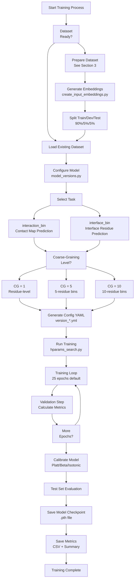
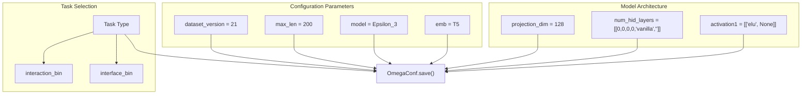
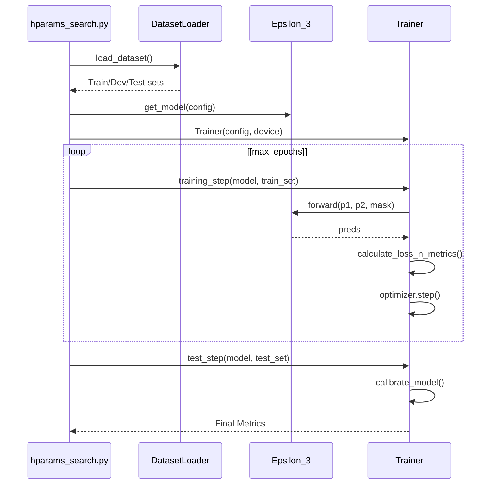
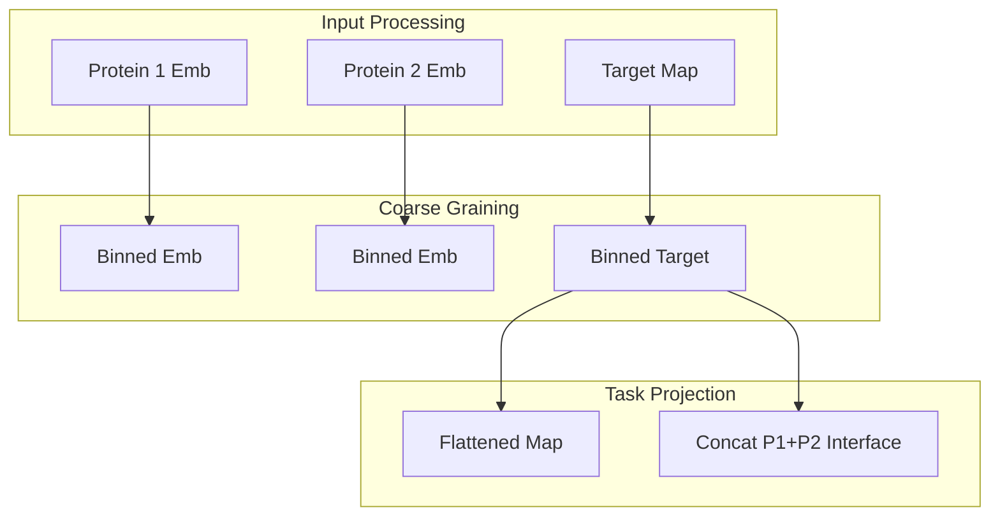

# Training Your Own Models

> **Relevant source files**
> * [src/build_model.py](https://github.com/isblab/disobind/blob/5fffcf84/src/build_model.py)
> * [src/hparams_search.py](https://github.com/isblab/disobind/blob/5fffcf84/src/hparams_search.py)
> * [src/model_versions.py](https://github.com/isblab/disobind/blob/5fffcf84/src/model_versions.py)
> * [src/models/Epsilon_3.py](https://github.com/isblab/disobind/blob/5fffcf84/src/models/Epsilon_3.py)
> * [src/models/get_model.py](https://github.com/isblab/disobind/blob/5fffcf84/src/models/get_model.py)
> * [src/utils.py](https://github.com/isblab/disobind/blob/5fffcf84/src/utils.py)

This page provides a step-by-step guide for training custom Disobind models on your own datasets. This includes preparing training data, configuring model hyperparameters, running the training pipeline, and evaluating results.

**Scope:** This page focuses on the practical workflow for training models. For details about the Epsilon_3 architecture, see [Epsilon_3 Network Design](/isblab/disobind/4.1-epsilon_3-network-design). For configuration file specifications, see [Model Configuration Files](/isblab/disobind/4.2-model-configuration-files). For internal training mechanics, see [Training Pipeline](/isblab/disobind/4.3-training-pipeline). For dataset preparation from PDB files, see [Dataset Creation Pipeline](/isblab/disobind/3-dataset-creation-pipeline).

---

## Training Workflow Overview



**Purpose:** This workflow illustrates the complete process from dataset preparation through model training to checkpoint generation. The key decision points are task selection (interaction vs interface) and coarse-graining level (1, 5, or 10).

**Sources:** [src/model_versions.py L1-L152](https://github.com/isblab/disobind/blob/5fffcf84/src/model_versions.py#L1-L152)

 [src/build_model.py L25-L48](https://github.com/isblab/disobind/blob/5fffcf84/src/build_model.py#L25-L48)

---

## Prerequisites

Before training models, ensure you have:

| Requirement | Description | Location |
| --- | --- | --- |
| **Training Dataset** | Non-redundant protein complex dataset with contact maps | `../database/v_21/` |
| **Embeddings** | T5/ESM2/BERT embeddings for all sequences | `../database/v_21/T5/global-None/` |
| **Split Files** | Pre-split train/dev/test sets (.npy format) | Same as embeddings directory |
| **Configuration Template** | Python script to generate YAML config | `src/model_versions.py` |
| **Training Script** | Main training execution script | `src/hparams_search.py` |
| **GPU Resources** | CUDA-enabled GPU recommended | Set in `model_versions.py` |

**Important:** The dataset must be prepared using the pipeline described in [Dataset Creation Pipeline](/isblab/disobind/3-dataset-creation-pipeline). Training requires pre-computed embeddings generated via [Generating Embeddings](/isblab/disobind/3.4-generating-embeddings).

**Sources:** [src/model_versions.py L17-L101](https://github.com/isblab/disobind/blob/5fffcf84/src/model_versions.py#L17-L101)

 [src/hparams_search.py L81-L91](https://github.com/isblab/disobind/blob/5fffcf84/src/hparams_search.py#L81-L91)

---

## Step 1: Prepare Training Dataset

### Dataset File Structure

Your training data should follow this structure:

```markdown
database/
└── v_21/                    # Dataset version
    └── T5/                  # Embedding type
        └── global-None/     # Embedding configuration
            ├── Train_set_global_v_21.npy
            ├── Dev_set_global_v_21.npy
            └── Test_set_global_v_21.npy
```

### Dataset Format

Each `.npy` file contains a NumPy array where each row represents one protein complex. The `Trainer.get_inputs` method handles slicing these arrays.

| Component | Logic | Description |
| --- | --- | --- |
| `prot1_embedding` | `batch[:,:,:1024]` | T5 embeddings for protein 1 |
| `prot2_embedding` | `batch[:,:,1024:-2*max_len]` | T5 embeddings for protein 2 |
| `target_contact_map` | `target[:,:,:max_len]` | Binary contact matrix |
| `target_mask` | `target[:,:,max_len:]` | Mask for padding positions |

**Note:** All sequences are typically padded to `max_len=200` residues as defined in `model_versions.py`.

**Sources:** [src/model_versions.py L19-L22](https://github.com/isblab/disobind/blob/5fffcf84/src/model_versions.py#L19-L22)

 [src/build_model.py L103-L153](https://github.com/isblab/disobind/blob/5fffcf84/src/build_model.py#L103-L153)

---

## Step 2: Configure Model Parameters

### Basic Configuration

Edit `model_versions.py` to set training parameters:



**Sources:** [src/model_versions.py L17-L88](https://github.com/isblab/disobind/blob/5fffcf84/src/model_versions.py#L17-L88)

 [src/model_versions.py L151](https://github.com/isblab/disobind/blob/5fffcf84/src/model_versions.py#L151-L151)

### Key Configuration Parameters

#### Task Objective Configuration

The `objective` parameter in `model_versions.py` controls what the model predicts:

```markdown
# Format: [task_type, coarse_grain_level, pool_type, bin_post_proj, bin_input, single_output]objective = ["interface_bin", 10, "avg", False, True, False]
```

**Parameter Explanation:**

| Index | Parameter | Options | Description |
| --- | --- | --- | --- |
| 0 | `task_type` | `"interaction_bin"`, `"interface_bin"` | Contact map vs interface prediction |
| 1 | `bin_size` | `1`, `5`, `10` | Coarse-graining level |
| 2 | `pool_type` | `"avg"` | Pooling method |
| 4 | `bin_input` | `True`/`False` | If True, averages input embeddings |

**Sources:** [src/model_versions.py L23-L41](https://github.com/isblab/disobind/blob/5fffcf84/src/model_versions.py#L23-L41)

 [src/utils.py L92-L120](https://github.com/isblab/disobind/blob/5fffcf84/src/utils.py#L92-L120)

#### Model Architecture Parameters

The `model_params` dictionary defines the `Epsilon_3` network structure.

```css
"model_params": {    "emb_size": 1024,                                  "projection_layer": [[128, "ln2", True, 1, ""]],     "input_layer": ["op-od", "vanilla", "avg2d"],  # avg2d is used for interface tasks    "num_hid_layers": [[0, 0, 0, 0, "vanilla", ""]],     "dropouts": [[0.2, 0, 0, 0, 0]],                   "activation1": [["elu", None]],                    "norm": [True, "LN"],                          }
```

**Key Logic:**

* **`projection_layer`**: Used in `create_projection_layers` to reduce embedding dimensionality. [src/models/Epsilon_3.py L64-L80](https://github.com/isblab/disobind/blob/5fffcf84/src/models/Epsilon_3.py#L64-L80)
* **`input_layer`**: The `avg2d` parameter in the third index is specifically for interface models to aggregate the 2D interaction tensor into 1D interface profiles. [src/models/Epsilon_3.py L83-L90](https://github.com/isblab/disobind/blob/5fffcf84/src/models/Epsilon_3.py#L83-L90)

**Sources:** [src/model_versions.py L51-L88](https://github.com/isblab/disobind/blob/5fffcf84/src/model_versions.py#L51-L88)

 [src/models/Epsilon_3.py L15-L128](https://github.com/isblab/disobind/blob/5fffcf84/src/models/Epsilon_3.py#L15-L128)

#### Training Parameters

The `train_params` dictionary defines the optimization strategy.

```
"train_params": {    "loss": "se_loss",                        "optimizer": "AdamW",                     "learning_rate": [2e-4],                  "max_epochs": 25,                         "scheduler": {        "apply": True,        "name": "exp",        "gamma": [0.9],    }}
```

**Sources:** [src/model_versions.py L102-L147](https://github.com/isblab/disobind/blob/5fffcf84/src/model_versions.py#L102-L147)

 [src/build_model.py L50-L100](https://github.com/isblab/disobind/blob/5fffcf84/src/build_model.py#L50-L100)

---

## Step 3: Run Training

### Command Line Execution

```
cd srcpython hparams_search.py -f version_14.2.yml -m manual
```

**Arguments:**

* `-f`: Path to configuration YAML file. [src/hparams_search.py L40-L42](https://github.com/isblab/disobind/blob/5fffcf84/src/hparams_search.py#L40-L42)
* `-m`: Mode (`manual` for single configuration). [src/hparams_search.py L43-L45](https://github.com/isblab/disobind/blob/5fffcf84/src/hparams_search.py#L43-L45)

### Training Execution Flow



**Sources:** [src/hparams_search.py L173-L205](https://github.com/isblab/disobind/blob/5fffcf84/src/hparams_search.py#L173-L205)

 [src/build_model.py L219-L294](https://github.com/isblab/disobind/blob/5fffcf84/src/build_model.py#L219-L294)

---

## Step 4: Monitor and Evaluate

### Calibration and Reliability

The training pipeline includes an optional calibration step using `calibration_curve` from `sklearn`.

```python
def plot_reliabity_diagram( uncal_preds, cal_preds, target, file_name ):    # Calculates fraction of positives vs mean predicted probability    target_prob1, cal_pred_prob = calibration_curve( target, cal_preds, n_bins = 10 )
```

**Sources:** [src/utils.py L21-L63](https://github.com/isblab/disobind/blob/5fffcf84/src/utils.py#L21-L63)

### Output Files

Upon completion, the `Trainer` and `HparamSearch` classes save results:

* **Checkpoints**: Saved via `torch.save` if `save_model` is True. [src/model_versions.py L144-L145](https://github.com/isblab/disobind/blob/5fffcf84/src/model_versions.py#L144-L145)
* **Metrics**: Dumped into CSV and text summaries. [src/hparams_search.py L202-L205](https://github.com/isblab/disobind/blob/5fffcf84/src/hparams_search.py#L202-L205)
* **Plots**: Reliability diagrams and performance curves. [src/utils.py L21-L63](https://github.com/isblab/disobind/blob/5fffcf84/src/utils.py#L21-L63)

---

## Advanced: Coarse-Graining Implementation

The `prepare_input` function in `utils.py` handles the data flow for custom coarse-grained models:



**Key Code Entity:**
`utils.prepare_input` implements the logic for `bin_size` (1, 5, 10) by applying `nn.AvgPool1d` to embeddings and `nn.MaxPool2d` to target contact maps.

**Sources:** [src/utils.py L92-L156](https://github.com/isblab/disobind/blob/5fffcf84/src/utils.py#L92-L156)

 [src/utils.py L169-L194](https://github.com/isblab/disobind/blob/5fffcf84/src/utils.py#L169-L194)