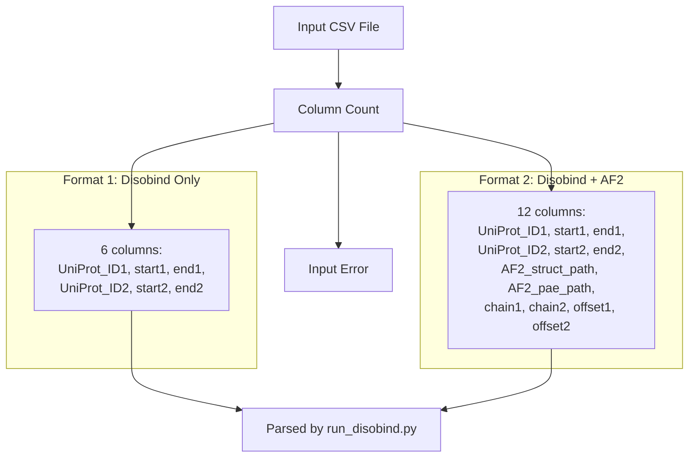
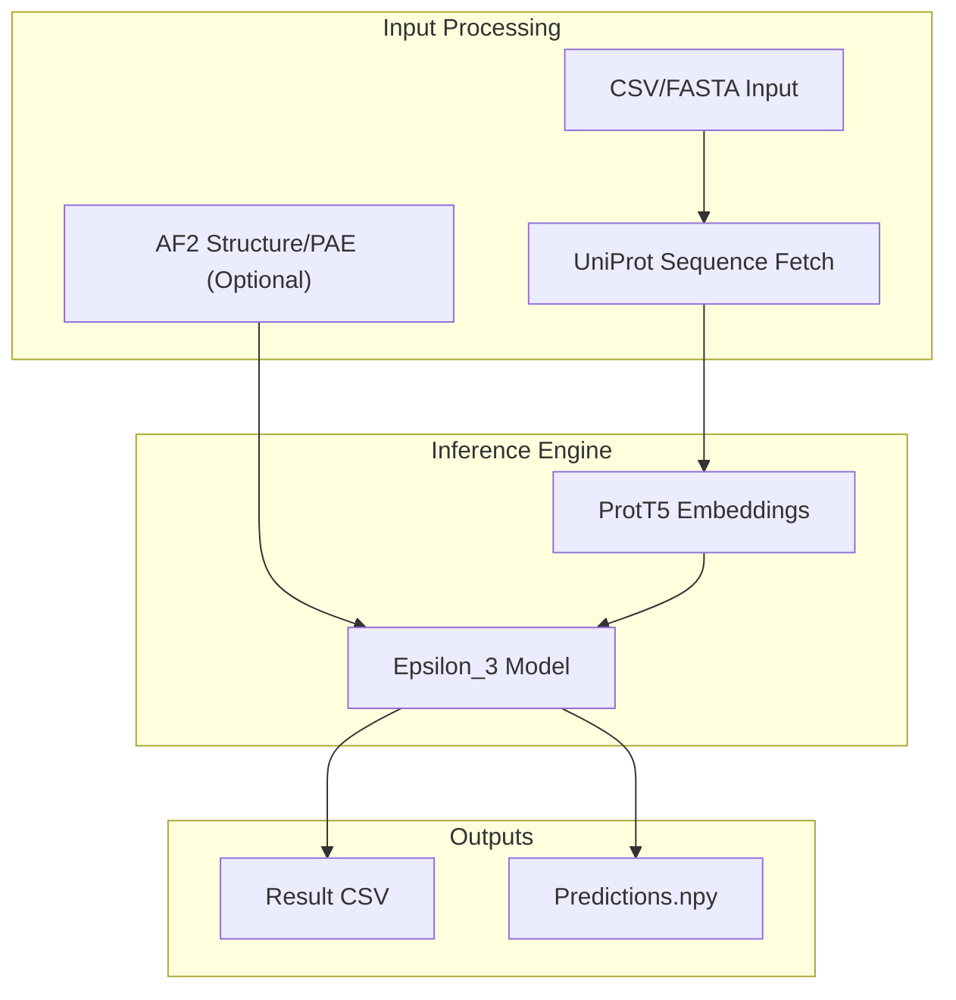

# Troubleshooting and FAQ

> **Relevant source files**
> * [README.md](https://github.com/isblab/disobind/blob/5fffcf84/README.md?plain=1)
> * [example/test.csv](https://github.com/isblab/disobind/blob/5fffcf84/example/test.csv)
> * [install.sh](https://github.com/isblab/disobind/blob/5fffcf84/install.sh)
> * [requirements.txt](https://github.com/isblab/disobind/blob/5fffcf84/requirements.txt)

This page provides solutions to common issues encountered when installing, configuring, and running Disobind. It covers installation problems, input format errors, runtime failures, AlphaFold integration issues, and performance optimization.

---

## Common Installation Issues

### Conda Environment Setup Failures

**Problem**: Installation script fails or environment creation errors.

**Solution**:

1. Ensure Conda is properly installed and in PATH.
2. Run installation commands sequentially:

```
cd disobind/chmod +x install.sh./install.sh
```

1. If the script fails, manually create the environment using the steps defined in the script [install.sh L15-L21](https://github.com/isblab/disobind/blob/5fffcf84/install.sh#L15-L21) :

```sql
conda create --name diso python=3.9conda activate disopip install -r ./requirements.txt
```

Sources: [README.md L19-L36](https://github.com/isblab/disobind/blob/5fffcf84/README.md?plain=1#L19-L36)

 [install.sh L1-L27](https://github.com/isblab/disobind/blob/5fffcf84/install.sh#L1-L27)

---

### CUDA and GPU Configuration

**Problem**: GPU not detected or CUDA errors during prediction.

**Solution**:

1. Verify CUDA toolkit version 11.8 is installed [README.md L38](https://github.com/isblab/disobind/blob/5fffcf84/README.md?plain=1#L38-L38)
2. Check NVIDIA driver compatibility.
3. Verify PyTorch CUDA installation:

```javascript
import torchprint(torch.cuda.is_available())  # Should return True
```

1. When running predictions, explicitly specify device using the `-d` flag [README.md L91](https://github.com/isblab/disobind/blob/5fffcf84/README.md?plain=1#L91-L91)

Sources: [README.md L38](https://github.com/isblab/disobind/blob/5fffcf84/README.md?plain=1#L38-L38)

 [README.md L91](https://github.com/isblab/disobind/blob/5fffcf84/README.md?plain=1#L91-L91)

 [requirements.txt L15](https://github.com/isblab/disobind/blob/5fffcf84/requirements.txt#L15-L15)

---

### Dependency Version Conflicts

**Problem**: Import errors or version incompatibility messages.

**Dependency Compatibility Matrix**

| Package | Required Version | Critical For |
| --- | --- | --- |
| `torch` | 2.0.1 | Model inference and training |
| `transformers` | 4.33.1 | ProtT5-XL-U50 embeddings |
| `biopython` | 1.81 | PDB/CIF parsing |
| `numpy` | 1.24.3 | Array operations |
| `omegaconf` | 2.2.2 | YAML configuration loading |
| `h5py` | 3.7.0 | Embedding storage |

**Solution**:

1. Install exact versions from `requirements.txt` [requirements.txt L1-L33](https://github.com/isblab/disobind/blob/5fffcf84/requirements.txt#L1-L33) :

```
pip install -r requirements.txt
```

1. If conflicts persist, create a fresh environment and reinstall.

Sources: [requirements.txt L1-L33](https://github.com/isblab/disobind/blob/5fffcf84/requirements.txt#L1-L33)

---

## Input Format and Validation Errors

### CSV Input Format Issues

**Problem**: Predictions fail due to malformed input files.

#### Valid Input Formats



**Solution**:

1. Verify column count is exactly 6 or 12 as specified in [README.md L56-L60](https://github.com/isblab/disobind/blob/5fffcf84/README.md?plain=1#L56-L60)
2. Ensure residue positions are integers.
3. Example valid inputs can be found in `example/test.csv` [example/test.csv L1-L2](https://github.com/isblab/disobind/blob/5fffcf84/example/test.csv#L1-L2)

Sources: [README.md L52-L65](https://github.com/isblab/disobind/blob/5fffcf84/README.md?plain=1#L52-L65)

 [example/test.csv L1-L2](https://github.com/isblab/disobind/blob/5fffcf84/example/test.csv#L1-L2)

---

### UniProt ID and Sequence Download Failures

**Problem**: The script hangs or errors while fetching sequences from UniProt.

**Solution**:

1. Verify UniProt IDs are valid at [uniprot.org](https://www.uniprot.org).
2. Check network connectivity; the script uses `requests` [requirements.txt L26](https://github.com/isblab/disobind/blob/5fffcf84/requirements.txt#L26-L26)  to fetch data.
3. Reduce the number of cores used for downloading to avoid rate-limiting [README.md L89](https://github.com/isblab/disobind/blob/5fffcf84/README.md?plain=1#L89-L89) :

```
python run_disobind.py -i csv -f ./example/test.csv -c 1
```

1. If a download fails, check the `output/` directory for `UniProt_seq.json` to see if some IDs were successfully cached.

Sources: [README.md L89](https://github.com/isblab/disobind/blob/5fffcf84/README.md?plain=1#L89-L89)

 [requirements.txt L26](https://github.com/isblab/disobind/blob/5fffcf84/requirements.txt#L26-L26)

---

## Runtime Prediction Errors

### Model Loading Failures

**Problem**: Model checkpoints cannot be found.

**Solution**:

1. Ensure you have run `install.sh` which unzips `ProtTrans.tar.gz` [install.sh L4](https://github.com/isblab/disobind/blob/5fffcf84/install.sh#L4-L4)
2. Check that model weights are present in the expected directories (e.g., `models/Epsilon_3/`).
3. If weights are missing, re-download them from Zenodo [README.md L9](https://github.com/isblab/disobind/blob/5fffcf84/README.md?plain=1#L9-L9)

Sources: [install.sh L4](https://github.com/isblab/disobind/blob/5fffcf84/install.sh#L4-L4)

 [README.md L9](https://github.com/isblab/disobind/blob/5fffcf84/README.md?plain=1#L9-L9)

---

### Memory Issues and Out-of-Memory (OOM) Errors

**Problem**: Prediction crashes with `RuntimeError: CUDA out of memory`.

**Solution**:

1. The ProtT5-XL-U50 model used for embeddings is large. If GPU memory is low, run on CPU [README.md L91](https://github.com/isblab/disobind/blob/5fffcf84/README.md?plain=1#L91-L91) :

```
python run_disobind.py -i csv -f ./example/test.csv -d cpu
```

1. Close other GPU-intensive applications.
2. Disobind supports batch processing; if processing a very large CSV, try splitting it into smaller files.

Sources: [README.md L91](https://github.com/isblab/disobind/blob/5fffcf84/README.md?plain=1#L91-L91)

 [requirements.txt L23](https://github.com/isblab/disobind/blob/5fffcf84/requirements.txt#L23-L23)

---

## AlphaFold Integration Issues

### Structure and PAE File Mismatches

**Problem**: AlphaFold-enhanced predictions fail or produce illogical results.

**Solution**:

1. Ensure the `chain1` and `chain2` IDs in the CSV match the labels in the PDB file [README.md L62](https://github.com/isblab/disobind/blob/5fffcf84/README.md?plain=1#L62-L62)
2. Verify the `offset` values. If the AF2 structure residue 1 corresponds to UniProt residue 10, the offset is 9 [README.md L63](https://github.com/isblab/disobind/blob/5fffcf84/README.md?plain=1#L63-L63)
3. The PAE file must be the `.json` output from AlphaFold [README.md L60](https://github.com/isblab/disobind/blob/5fffcf84/README.md?plain=1#L60-L60)

Sources: [README.md L59-L65](https://github.com/isblab/disobind/blob/5fffcf84/README.md?plain=1#L59-L65)

 [example/test.csv L2](https://github.com/isblab/disobind/blob/5fffcf84/example/test.csv#L2-L2)

---

## Frequently Asked Questions

### Q1: Can I predict interactions for more than two proteins?

**A**: Disobind is designed for binary complexes (AB). For complexes with more subunits (ABC), you must break them into binary pairs (AB, BC, AC) and run them individually [README.md L43](https://github.com/isblab/disobind/blob/5fffcf84/README.md?plain=1#L43-L43)

### Q2: What is the difference between contact map and interface residue prediction?

**A**:

* **Contact Map**: Predicts specific residue-residue interactions (e.g., Res 10 of P1 interacts with Res 40 of P2) [README.md L111](https://github.com/isblab/disobind/blob/5fffcf84/README.md?plain=1#L111-L111)  Enable with `-cm` flag [README.md L92](https://github.com/isblab/disobind/blob/5fffcf84/README.md?plain=1#L92-L92)
* **Interface Residues**: Predicts which residues are part of the binding interface generally, without specifying the exact partner residue [README.md L113](https://github.com/isblab/disobind/blob/5fffcf84/README.md?plain=1#L113-L113)  This is the default output.

### Q3: What do the coarse-grained (CG) levels mean?

**A**: Disobind can predict at different resolutions. `cg 1` is residue-level. `cg 5` and `cg 10` group residues into beads of 5 or 10 residues respectively to reduce computational complexity and noise [README.md L93](https://github.com/isblab/disobind/blob/5fffcf84/README.md?plain=1#L93-L93)

### Q4: How do I interpret the Predictions.npy file?

**A**: This file contains a nested dictionary where keys are the entry IDs from your input and values are the numerical prediction tensors. It is useful for downstream programmatic analysis [README.md L99](https://github.com/isblab/disobind/blob/5fffcf84/README.md?plain=1#L99-L99)

### Q5: Can I use FASTA files for proteins without UniProt IDs?

**A**: Yes. Use the `-i fasta` flag. The header of the FASTA must follow a specific format to include metadata like offsets and AF2 paths if applicable [README.md L66-L72](https://github.com/isblab/disobind/blob/5fffcf84/README.md?plain=1#L66-L72)

Sources: [README.md L43-L114](https://github.com/isblab/disobind/blob/5fffcf84/README.md?plain=1#L43-L114)

---

## Output Reference

### Prediction Result Flow



Sources: [README.md L47-L100](https://github.com/isblab/disobind/blob/5fffcf84/README.md?plain=1#L47-L100)

 [run_disobind.py L1-L50](https://github.com/isblab/disobind/blob/5fffcf84/run_disobind.py#L1-L50)

 (implied flow)