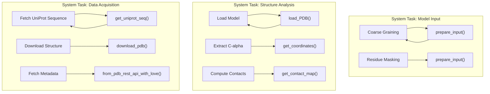

# Utility Functions

> **Relevant source files**
> * [dataset/from_APIs_with_love.py](https://github.com/isblab/disobind/blob/5fffcf84/dataset/from_APIs_with_love.py)
> * [dataset/utility.py](https://github.com/isblab/disobind/blob/5fffcf84/dataset/utility.py)
> * [src/build_model.py](https://github.com/isblab/disobind/blob/5fffcf84/src/build_model.py)
> * [src/utils.py](https://github.com/isblab/disobind/blob/5fffcf84/src/utils.py)

This page provides a comprehensive reference for utility functions used throughout the Disobind codebase. These functions support dataset creation, structure processing, API interactions, and data transformations. For higher-level dataset creation workflows, see [Dataset Creation Pipeline](/isblab/disobind/3-dataset-creation-pipeline). For embedding-specific operations within the `Embeddings` class, see [Generating Embeddings](/isblab/disobind/3.4-generating-embeddings).

The utility functions are primarily located in two modules:

* `dataset/utility.py` - Core data processing and structure analysis utilities.
* `dataset/from_APIs_with_love.py` - External API interactions and data retrieval.

---

## Function Organization

The utility functions are organized into the following categories:

| Category | Purpose | Primary Module |
| --- | --- | --- |
| PDB Structure Processing | Loading PDB/CIF files, extracting coordinates, computing contact maps | `utility.py` |
| Sequence Position Manipulation | Converting between coordinate systems, merging positions, checking overlaps | `utility.py` |
| Disorder Database Operations | Loading disorder annotations, finding disordered regions | `utility.py` |
| Embedding Generation | Creating T5/ESM/BERT embeddings from sequences | `utility.py` |
| API Data Retrieval | Fetching data from UniProt, PDB REST API, SIFTS | `from_APIs_with_love.py` |
| SIFTS Mapping | PDB-UniProt residue-level mapping | `from_APIs_with_love.py` |
| Data Type Conversion | String conversions, one-hot encoding, tokenization | `utility.py` |
| Clustering and Alignment | MMSeqs2 clustering, USalign structural alignment | `utility.py` |
| Model Training Helpers | Input preparation, oversampling, and reliability plotting | `src/utils.py` |

Sources: [dataset/utility.py L1-L25](https://github.com/isblab/disobind/blob/5fffcf84/dataset/utility.py#L1-L25)

 [dataset/from_APIs_with_love.py L1-L17](https://github.com/isblab/disobind/blob/5fffcf84/dataset/from_APIs_with_love.py#L1-L17)

 [src/utils.py L1-L20](https://github.com/isblab/disobind/blob/5fffcf84/src/utils.py#L1-L20)

---

## Utility Function Dependencies

```mermaid
flowchart TD

get_embeddings["get_embeddings()"]
ProtT5_embeddings["ProtT5_embeddings()"]
ESM_embeddings["ESM_embeddings()"]
protBERT_embeddings["protBERT_embeddings()"]
load_disorder_dbs["load_disorder_dbs()"]
consolidate_regions["consolidate_regions()"]
merge_overlapping_tuples["merge_overlapping_tuples()"]
find_disorder_regions["find_disorder_regions()"]
change_basis["change_basis()"]
remove_nulls2["remove_nulls2()"]
check_for_overlap["check_for_overlap()"]
merge_residue_positions["merge_residue_positions()"]
ranges["ranges()"]
load_PDB["load_PDB()"]
get_coordinates["get_coordinates()"]
get_contact_map["get_contact_map()"]
UniProtAPI["UniProt REST API"]
PDBAPI["PDB REST API"]
SIFTSServer["SIFTS Mapping Server"]
send_request["send_request()"]
get_uniprot_seq["get_uniprot_seq()"]
get_uniprot_entry["get_uniprot_entry()"]
download_pdb["download_pdb()"]
from_pdb_rest_api["from_pdb_rest_api_with_love()"]
sifts_map["sifts_map_shell_command()"]
get_sifts_mapping["get_sifts_mapping()"]

UniProtAPI --> send_request
PDBAPI --> send_request
SIFTSServer --> sifts_map

subgraph from_APIs_with_love.py ["from_APIs_with_love.py"]
    send_request
    get_uniprot_seq
    get_uniprot_entry
    download_pdb
    from_pdb_rest_api
    sifts_map
    get_sifts_mapping
    send_request --> get_uniprot_seq
    send_request --> get_uniprot_entry
    send_request --> download_pdb
    send_request --> from_pdb_rest_api
    sifts_map --> get_sifts_mapping
end

subgraph subGraph0 ["External APIs"]
    UniProtAPI
    PDBAPI
    SIFTSServer
end

subgraph subGraph5 ["utility.py - Embeddings"]
    get_embeddings
    ProtT5_embeddings
    ESM_embeddings
    protBERT_embeddings
    get_embeddings --> ProtT5_embeddings
    get_embeddings --> ESM_embeddings
    get_embeddings --> protBERT_embeddings
end

subgraph subGraph4 ["utility.py - Disorder Processing"]
    load_disorder_dbs
    consolidate_regions
    merge_overlapping_tuples
    find_disorder_regions
    consolidate_regions --> merge_overlapping_tuples
    find_disorder_regions --> consolidate_regions
    load_disorder_dbs --> find_disorder_regions
end

subgraph subGraph3 ["utility.py - Position Manipulation"]
    change_basis
    remove_nulls2
    check_for_overlap
    merge_residue_positions
    ranges
end

subgraph subGraph2 ["utility.py - Structure Processing"]
    load_PDB
    get_coordinates
    get_contact_map
    load_PDB --> get_coordinates
    get_coordinates --> get_contact_map
end
```

Sources: [dataset/utility.py L26-L1197](https://github.com/isblab/disobind/blob/5fffcf84/dataset/utility.py#L26-L1197)

 [dataset/from_APIs_with_love.py L19-L951](https://github.com/isblab/disobind/blob/5fffcf84/dataset/from_APIs_with_love.py#L19-L951)

---

## PDB Structure Processing Functions

### load_PDB()

Reads PDB or CIF files and returns all models using BioPython parsers.

**Location**: [dataset/utility.py L26-L59](https://github.com/isblab/disobind/blob/5fffcf84/dataset/utility.py#L26-L59)

**Signature**: `load_PDB(pdb, pdb_path) -> models`

**Parameters**:

* `pdb` (str): PDB ID.
* `pdb_path` (str): Directory containing PDB/CIF files.

**Returns**: BioPython structure object containing all models [dataset/utility.py L56-L59](https://github.com/isblab/disobind/blob/5fffcf84/dataset/utility.py#L56-L59)

---

### get_coordinates()

Extracts Cα atomic coordinates for specified residues from a chain.

**Location**: [dataset/utility.py L64-L103](https://github.com/isblab/disobind/blob/5fffcf84/dataset/utility.py#L64-L103)

**Signature**: `get_coordinates(chain, pdb_pos) -> coords`

**Parameters**:

* `chain`: BioPython chain object.
* `pdb_pos` (list): List of PDB residue positions to extract.

**Returns**: `np.array` of shape `(N, 3)` containing Cα coordinates [dataset/utility.py L103](https://github.com/isblab/disobind/blob/5fffcf84/dataset/utility.py#L103-L103)

**Behavior**:

* Skips HETATM entries (only processes ATOM records) [dataset/utility.py L85](https://github.com/isblab/disobind/blob/5fffcf84/dataset/utility.py#L85-L85)
* Handles missing residues or Cα atoms gracefully via try-except blocks [dataset/utility.py L89-L91](https://github.com/isblab/disobind/blob/5fffcf84/dataset/utility.py#L89-L91)

---

### get_contact_map()

Computes a binary contact map between two sets of coordinates using Euclidean distance.

**Location**: [dataset/utility.py L108-L124](https://github.com/isblab/disobind/blob/5fffcf84/dataset/utility.py#L108-L124)

**Signature**: `get_contact_map(coords1, coords2, contact_threshold) -> contact_map`

**Algorithm**: `np.linalg.norm( coords1[:, None] - coords2, axis = -1 )` followed by a threshold comparison [dataset/utility.py L121-L122](https://github.com/isblab/disobind/blob/5fffcf84/dataset/utility.py#L121-L122)

---

## Sequence Position Manipulation Functions

### change_basis() and change_basis2()

Convert residue positions between PDB and UniProt coordinate systems.

**Location**: [dataset/utility.py L971-L1010](https://github.com/isblab/disobind/blob/5fffcf84/dataset/utility.py#L971-L1010)

**Signature**: `change_basis(mapped_uni_pos, mapped_pdb_pos, target_pos, add="null", forward=True) -> modified_target`

**Parameters**:

* `forward` (bool): If `True`, converts PDB→UniProt; if `False`, converts UniProt→PDB [dataset/utility.py L976-L977](https://github.com/isblab/disobind/blob/5fffcf84/dataset/utility.py#L976-L977)

---

### remove_nulls2()

Segments a list into continuous fragments by removing null/missing residues.

**Location**: [dataset/utility.py L1013-L1044](https://github.com/isblab/disobind/blob/5fffcf84/dataset/utility.py#L1013-L1044)

**Signature**: `remove_nulls2(pdb_pos, indices) -> (fragments_list, indices_list)`

**Example**: If input `pdb_pos` has gaps marked by "null", it splits the list into a list of continuous lists [dataset/utility.py L1034-L1044](https://github.com/isblab/disobind/blob/5fffcf84/dataset/utility.py#L1034-L1044)

---

### check_for_overlap()

Efficiently checks if two residue position ranges overlap.

**Location**: [dataset/utility.py L709-L741](https://github.com/isblab/disobind/blob/5fffcf84/dataset/utility.py#L709-L741)

**Signature**: `check_for_overlap(uni_pos1, uni_pos2, ignore_boundary=True) -> bool`

**Algorithm**: Compares the start and end of two lists to determine if they intersect [dataset/utility.py L732-L739](https://github.com/isblab/disobind/blob/5fffcf84/dataset/utility.py#L732-L739)

---

## Disorder Database Operations

### find_disorder_regions()

Identifies disordered regions for given UniProt IDs across DisProt, IDEAL, and MobiDB.

**Location**: [dataset/utility.py L911-L966](https://github.com/isblab/disobind/blob/5fffcf84/dataset/utility.py#L911-L966)

**Workflow**:

1. Queries loaded disorder DataFrames for `uni_ids` [dataset/utility.py L922-L928](https://github.com/isblab/disobind/blob/5fffcf84/dataset/utility.py#L922-L928)
2. Consolidates overlapping regions using `consolidate_regions` [dataset/utility.py L950](https://github.com/isblab/disobind/blob/5fffcf84/dataset/utility.py#L950-L950)
3. Filters by `min_len` [dataset/utility.py L953](https://github.com/isblab/disobind/blob/5fffcf84/dataset/utility.py#L953-L953)

Sources: [dataset/utility.py L860-L966](https://github.com/isblab/disobind/blob/5fffcf84/dataset/utility.py#L860-L966)

---

## Embedding Generation Functions

### get_embeddings()

Dispatcher function for generating protein sequence embeddings using ProtTrans, ESM, or BERT.

**Location**: [dataset/utility.py L155-L182](https://github.com/isblab/disobind/blob/5fffcf84/dataset/utility.py#L155-L182)

**Signature**: `get_embeddings(emb_type, input_file, output_file, eval_=False)`

**Supported Models**:

* `T5`: Calls `ProtT5_embeddings` [dataset/utility.py L171](https://github.com/isblab/disobind/blob/5fffcf84/dataset/utility.py#L171-L171)
* `ESM2`: Calls `ESM_embeddings` [dataset/utility.py L177](https://github.com/isblab/disobind/blob/5fffcf84/dataset/utility.py#L177-L177)
* `BERT`: Calls `protBERT_embeddings` [dataset/utility.py L179](https://github.com/isblab/disobind/blob/5fffcf84/dataset/utility.py#L179-L179)

### ESM_embeddings()

Generates ESM2 embeddings. It loads the model via `load_esm_model` [dataset/utility.py L231-L247](https://github.com/isblab/disobind/blob/5fffcf84/dataset/utility.py#L231-L247)

 and extracts representations from the last hidden state [dataset/utility.py L292-L293](https://github.com/isblab/disobind/blob/5fffcf84/dataset/utility.py#L292-L293)

Sources: [dataset/utility.py L155-L304](https://github.com/isblab/disobind/blob/5fffcf84/dataset/utility.py#L155-L304)

---

## API Data Retrieval Functions

### send_request()

Core function for sending HTTP requests with retry logic and exponential backoff.

**Location**: [dataset/from_APIs_with_love.py L19-L76](https://github.com/isblab/disobind/blob/5fffcf84/dataset/from_APIs_with_love.py#L19-L76)

**Behavior**:

* Returns `"not_found"` for HTTP 404 [dataset/from_APIs_with_love.py L51](https://github.com/isblab/disobind/blob/5fffcf84/dataset/from_APIs_with_love.py#L51-L51)
* Returns `"bad_request"` for HTTP 400 [dataset/from_APIs_with_love.py L58](https://github.com/isblab/disobind/blob/5fffcf84/dataset/from_APIs_with_love.py#L58-L58)
* Implements a retry loop up to `max_trials` [dataset/from_APIs_with_love.py L42](https://github.com/isblab/disobind/blob/5fffcf84/dataset/from_APIs_with_love.py#L42-L42)

### from_pdb_rest_api_with_love()

Retrieves comprehensive metadata for a PDB entry, including chain mappings and entity details.

**Location**: [dataset/from_APIs_with_love.py L813-L907](https://github.com/isblab/disobind/blob/5fffcf84/dataset/from_APIs_with_love.py#L813-L907)

**Key Logic**:

* Fetches entry data from `https://data.rcsb.org/rest/v1/core/entry/{entry_id}` [dataset/from_APIs_with_love.py L829](https://github.com/isblab/disobind/blob/5fffcf84/dataset/from_APIs_with_love.py#L829-L829)
* Identifies chimeric entities and non-protein entities [dataset/from_APIs_with_love.py L868-L879](https://github.com/isblab/disobind/blob/5fffcf84/dataset/from_APIs_with_love.py#L868-L879)

Sources: [dataset/from_APIs_with_love.py L19-L907](https://github.com/isblab/disobind/blob/5fffcf84/dataset/from_APIs_with_love.py#L19-L907)

---

## Model Training and Analysis Utilities

Located in `src/utils.py`, these functions support the training loop in `Trainer` [src/build_model.py L25](https://github.com/isblab/disobind/blob/5fffcf84/src/build_model.py#L25-L25)

### prepare_input()

Transforms raw embeddings and targets into the specific format required for the training objective (e.g., interaction vs. interface).

**Location**: [src/utils.py L92-L225](https://github.com/isblab/disobind/blob/5fffcf84/src/utils.py#L92-L225)

**Key Transformations**:

* **Binning**: Applies `AvgPool1d` to inputs and `MaxPool2d` to targets if `bin_size > 1` [src/utils.py L136-L154](https://github.com/isblab/disobind/blob/5fffcf84/src/utils.py#L136-L154)
* **Objective Projection**: Reshapes targets to `(N, L1*L2)` for interaction tasks or `(N, L1+L2)` for interface tasks [src/utils.py L161-L193](https://github.com/isblab/disobind/blob/5fffcf84/src/utils.py#L161-L193)

### plot_reliabity_diagram()

Generates reliability curves to visualize model calibration using `sklearn.calibration.calibration_curve` [src/utils.py L21-L63](https://github.com/isblab/disobind/blob/5fffcf84/src/utils.py#L21-L63)

### oversample()

Implements synthetic minority oversampling using SMOTE or ADASYN [src/utils.py L68-L88](https://github.com/isblab/disobind/blob/5fffcf84/src/utils.py#L68-L88)

Sources: [src/utils.py L21-L225](https://github.com/isblab/disobind/blob/5fffcf84/src/utils.py#L21-L225)

---

## Mapping System to Code Entities

Sources: [dataset/utility.py L26-L124](https://github.com/isblab/disobind/blob/5fffcf84/dataset/utility.py#L26-L124)

 [dataset/from_APIs_with_love.py L158-L907](https://github.com/isblab/disobind/blob/5fffcf84/dataset/from_APIs_with_love.py#L158-L907)

 [src/utils.py L92-L225](https://github.com/isblab/disobind/blob/5fffcf84/src/utils.py#L92-L225)

---

## Summary of Utility Modules

| Module | Key Functions | Role in Disobind |
| --- | --- | --- |
| `dataset/utility.py` | `load_PDB`, `get_coordinates`, `get_embeddings`, `mmseqs_cluster` | Primary toolbox for structural data and sequence embedding generation. |
| `dataset/from_APIs_with_love.py` | `send_request`, `get_sifts_mapping`, `download_pdb` | Gateway for all external data dependencies (UniProt, PDB, SIFTS). |
| `src/utils.py` | `prepare_input`, `plot_reliabity_diagram`, `oversample` | Helpers for the `Trainer` class and model performance analysis. |

Sources: [dataset/utility.py L1-L5](https://github.com/isblab/disobind/blob/5fffcf84/dataset/utility.py#L1-L5)

 [dataset/from_APIs_with_love.py L1-L5](https://github.com/isblab/disobind/blob/5fffcf84/dataset/from_APIs_with_love.py#L1-L5)

 [src/utils.py L1-L5](https://github.com/isblab/disobind/blob/5fffcf84/src/utils.py#L1-L5)