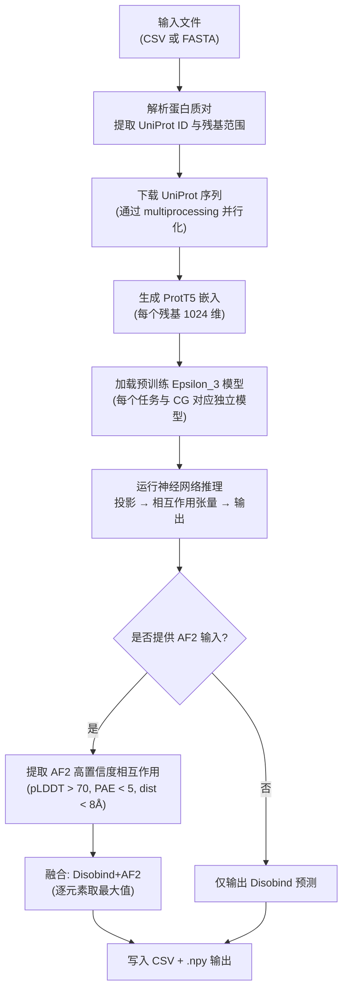
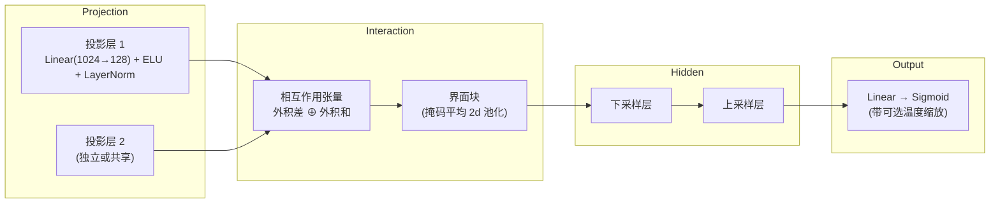

---
slug:1-overview
blog_type:normal
---


**Disobind** 是一种深度学习方法，仅利用氨基酸序列即可预测内在无序区域（IDR）及其结合伙伴的**蛋白质间接触图**和**界面残基**。它填补了计算结构生物学领域的一个关键空白：尽管 AlphaFold2 等工具已经能很好地处理折叠蛋白的相互作用，但无序蛋白的相互作用（其中一个蛋白伙伴缺乏稳定结构）仍然极难预测。Disobind 通过利用蛋白质语言模型嵌入（ProtT5）和自定义神经架构（Epsilon_3）来推断两个蛋白在残基分辨率水平上的相互作用位置，从而填补了这一细分领域。当结合 AlphaFold2 的结构预测（即 **Disobind+AF2** 模式）时，它可以通过融合基于序列和基于结构的置信度信号来进一步优化结果。


来源: [README.md](/README.md#L1-L10), [run_disobind.py](/run_disobind.py#L1-L14)

## Disobind 的预测内容

Disobind 作用于**二元蛋白质复合物**（蛋白质 A + 蛋白质 B），并产生两种不同的预测类型，每种类型均提供多种粗粒化（CG）分辨率：

| 预测类型 | 描述 | 输出格式 | CG 分辨率 |
|:---|:---|:---|:---|
| **相互作用（接触图）** | 蛋白质 1 中的哪个残基与蛋白质 2 中的哪个残基接触 | 接触概率的 `[L1 × L2]` 矩阵 | 1, 5, 10 |
| **界面残基** | 每个蛋白质中哪些残基参与了相互作用界面 | 界面概率的 `[L1 + L2]` 向量 | 1, 5, 10 |

在 **CG-1** 下，每个预测对应单个残基。在 **CG-5** 或 **CG-10** 下，残基被分组为由 5 或 10 个残基组成的“珠子”，预测值在每个珠子上取平均——这对于细粒度预测可能存在噪声的较长无序区域非常有用。默认情况下，Disobind 仅在 CG-1 下运行界面预测，这是最高分辨率设置。

来源: [run_disobind.py](/run_disobind.py#L130-L165), [run_disobind.py](/run_disobind.py#L831-L890)

## 预测流程概览

从原始蛋白标识符到最终残基水平预测的端到端工作流，遵循确定性的阶段序列。每个阶段都封装在 `run_disobind.py` 的 `Disobind` 类中。



来源: [run_disobind.py](/run_disobind.py#L111-L127), [run_disobind.py](/run_disobind.py#L168-L207), [run_disobind.py](/run_disobind.py#L667-L796)

## Epsilon_3 神经架构

所有 Disobind 模型共享 **Epsilon_3** 架构——一个专门用于处理蛋白质嵌入*对*的定制网络。该架构可分解为四个顺序块：



**投影块** — 每个蛋白质的 1024 维 ProtT5 逐残基嵌入被独立投影到低维空间（默认为 128 维），使用线性层后接 ELU 激活函数和 LayerNorm。两个投影层可以共享（绑定权重）或独立。

**相互作用张量** — 投影后的嵌入 `z1` 和 `z2` 通过两种互补的外积运算（逐元素差和逐元素和）组合成 4D 张量 `[N, L1, L2, 2C]`，从而捕获所有残基对之间互补和保守的相互作用特征。

**界面块** — 对于界面预测，4D 相互作用张量通过沿每个蛋白质轴的掩码二维平均池化进行降维，同时生成两个蛋白质的界面概率向量。对于接触图预测，张量被直接重塑为 2D 接触矩阵。

**隐藏与输出块** — 可选的下采样/上采样层（带残差连接）对特征进行处理，最后通过线性投影和 Sigmoid 激活生成逐残基（或逐珠子）的概率。

来源: [src/models/Epsilon_3.py](/src/models/Epsilon_3.py#L15-L151), [src/models/Epsilon_3.py](/src/models/Epsilon_3.py#L155-L178), [src/models/Epsilon_3.py](/src/models/Epsilon_3.py#L267-L296), [src/models/get_layers.py](/src/models/get_layers.py#L17-L84)

## 模型版本与配置

Disobind 提供了**六种预训练模型变体**，按预测目标和粗粒化分辨率进行划分。每个变体都是一个具有独立训练参数的 Epsilon_3 模型：

| 模型版本 | 目标 | CG 分辨率 | 配置文件 | 核心差异 |
|:---|:---|:---|:---|:---|
| Epsilon_3_6 | 相互作用（接触图） | CG-10 | `Model_config_Epsilon_3_6.yml` | 3 个下采样层，缩放因子 2 |
| Epsilon_3_6.1 | 相互作用 | CG-5 | `Model_config_Epsilon_3_6.1.yml` | 3 个下采样层，缩放因子 2 |
| Epsilon_3_6.2 | 相互作用 | CG-1 | `Model_config_Epsilon_3_6.2.yml` | 3 个下采样层，缩放因子 2 |
| Epsilon_3_16 | 界面残基 | CG-1 | `Model_config_Epsilon_3_16.yml` | 无隐藏层（直接投影→输出） |
| Epsilon_3_16.1 | 界面 | CG-5 | `Model_config_Epsilon_3_16.1.yml` | 无隐藏层 |
| Epsilon_3_16.2 | 界面 | CG-10 | `Model_config_Epsilon_3_16.2.yml` | 无隐藏层 |

相互作用模型（版本 6.x）使用下采样层在上采样回传之前压缩特征空间，而界面模型（版本 16.x）则完全绕过隐藏层——这是一种更简单的架构，直接将相互作用张量映射为界面概率。所有模型均使用 ProtT5 全局嵌入、ELU 激活函数、LayerNorm，以及带有指数学习率调度的 AdamW 优化器。

<CgxTip>调用 Disobind 时，系统会根据请求的目标和 CG 分辨率自动选择正确的模型变体——你无需手动指定模型版本。此映射关系定义在 `analysis/params.py` 中。</CgxTip>

来源: [analysis/params.py](/analysis/params.py#L1-L59), [params/Model_config_Epsilon_3_16.yml](/params/Model_config_Epsilon_3_16.yml#L1-L57), [params/Model_config_Epsilon_3_6.yml](/params/Model_config_Epsilon_3_6.yml#L1-L58)

## Disobind 与 AlphaFold2 集成

Disobind 的一个独特功能是其 **Disobind+AF2** 模式，该模式将基于序列的预测与来自 AlphaFold2（或 AlphaFold3）的结构预测相融合。当你提供 AF2 预测结构（PDB/CIF 文件）及其相关的 PAE（预测对齐误差）JSON 文件时，Disobind 会：

1. **提取高置信度的 AF2 相互作用** — 满足蛋白质间距离 < 8Å、逐残基 pLDDT > 70 且 PAE < 5 的残基对。
2. **融合预测** — 取 Disobind 概率图与二值化 AF2 接触图的逐元素最大值，结合两者互补的优势。

这一功能极具价值，因为 AF2 擅长预测折叠状态的相互作用，但在无序区域（低 pLDDT）上常常失效，而 Disobind 则是专门针对包含 IDR 的复合物进行训练的。这种融合充分发挥了各自方法的优势。

来源: [run_disobind.py](/run_disobind.py#L750-L783), [run_disobind.py](/run_disobind.py#L966-L988)

## 项目结构

```
disobind/
├── run_disobind.py          ← 主入口（预测命令行接口）
├── install.sh               ← Conda 环境设置
├── requirements.txt         ← Python 依赖
├── params/                  ← 各模型版本的 YAML 配置
├── models/                  ← 预训练模型权重 (.pth 文件)
│   └── Epsilon_3/           ← 按 Version_6, Version_16 等组织
├── src/                     ← 核心源码：模型架构、训练、损失函数
│   ├── models/              ← Epsilon_3 定义，层工厂
│   ├── build_model.py       ← 模型构建工具
│   ├── loss.py              ← 损失函数 (SE loss, BCE, count-regularized)
│   ├── metrics.py           ← 评估指标
│   └── model_versions.py    ← 训练的配置生成
├── dataset/                 ← 数据集构建流程 (4 步)
│   ├── 1_disobind_databases.py  ← 步骤 1: 从无序数据库收集 PDB ID
│   ├── 2_create_database_dataset_files.py  ← 步骤 2: 下载 PDB，创建二元复合物
│   ├── 3_create_merged_binary_complexes.py ← 步骤 3: 合并重叠复合物
│   ├── 4_create_non_redundant_dataset.py   ← 步骤 4: 非冗余训练/测试集划分
│   └── create_input_embeddings.py          ← ProtT5 嵌入生成
├── database/                ← 输入文件与原始数据库转储
│   ├── input_files/         ← 预处理的 CSV/TSV 文件
│   └── raw/                 ← 来自 DIBS, MFIB, DisProt 等的原始下载
├── analysis/                ← 分析脚本、基准测试、图表生成
└── example/                 ← 示例输入文件 (test.csv, test.fasta)
```

来源: [README.md](/README.md#L1-L10), [dataset/README.md](/dataset/README.md#L1-L27), [src/README.md](/src/README.md#L1-L11)

## 关键技术依赖

| 类别 | 包 | 用途 |
|:---|:---|:---|
| 深度学习 | PyTorch 2.0.1 | 模型推理与训练 |
| 蛋白质嵌入 | Transformers 4.33.1, ProtT5 (通过 HuggingFace) | 1024 维逐残基嵌入 |
| 结构解析 | Biopython 1.81 | 用于 AF2 集成的 PDB/CIF 文件解析 |
| 配置 | OmegaConf 2.2.2 | 基于 YAML 的模型配置管理 |
| 数据 | h5py 3.7.0, pandas 1.5.0, numpy 1.24.3 | 嵌入存储 (HDF5)，表格 I/O |
| 校准 | betacal 1.1.0 | 概率输出的 Beta 校准 |

来源: [requirements.txt](/requirements.txt#L1-L34), [install.sh](/install.sh#L1-L27)

## 目标受众与约束条件

Disobind 专为研究**内在无序蛋白相互作用**的研究人员设计。使用时需牢记三个重要约束：

- **仅限二元复合物** — Disobind 处理成对的蛋白质（AB）。对于高阶复合物（ABC），需独立运行每对组合（AB, AC, BC）。
- **蛋白质 1 必须为 IDR** — 假设对中的第一个蛋白质是无序的；蛋白质 2 可以无序，也可以不无序。
- **仅限相互作用对** — Disobind 预测两个蛋白在*何处*相互作用，而非*是否*相互作用。输入的蛋白质对应为已知或疑似存在结合关系的对。

<CgxTip>Disobind 既可测试也可并行化。UniProt 序列下载使用了多核并行，并通过 `-d cuda` 标志支持 GPU 推理。此外，还提供了 Google Colab 笔记本以实现零安装使用。</CgxTip>

来源: [README.md](/README.md#L40-L48), [run_disobind.py](/run_disobind.py#L44-L84)

## 后续阅读

现在你已经对 Disobind 是什么及其工作原理有了宏观的认识，可以按照以下逻辑顺序继续阅读：

1. **[快速入门](2-quick-start)** — 在 5 分钟内完成 Disobind 的安装与运行
2. **[输入格式与示例](3-input-formats-and-examples)** — 详细的 CSV 和 FASTA 格式规范及实例
3. **[架构概览](4-architecture-overview)** — 深入探究 Epsilon_3 模型设计与完整预测流程
4. **[输出解读](10-output-interpretation)** — 理解与后处理 Disobind 的预测结果