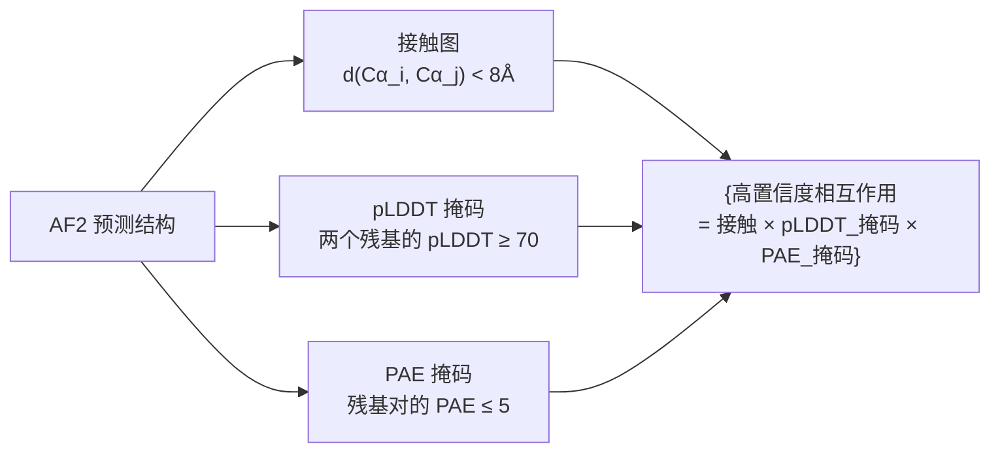
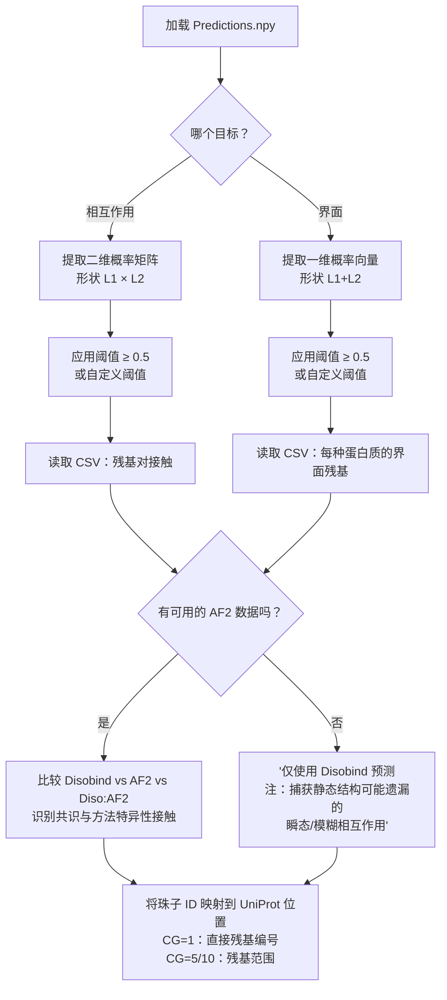

---
slug:10-output-interpretation
blog_type:normal
---


Disobind 产生多层预测输出，该输出编码了两种蛋白质在**何处**相互作用以及**哪些残基**介导了该相互作用，涵盖了三个独立的预测来源和多种粗粒化分辨率。理解这些输出的结构、语义和阈值，对于从原始数值预测中提取具有生物学意义的结论至关重要。

## 输出架构：任务、来源与分辨率

每次 Disobind 运行都会产生预测结果，这些结果沿三个正交轴进行组织：**目标**（预测什么）、**预测来源**（由哪种方法生成）和**粗粒化分辨率**（在何种粒度上）。`get_required_tasks` 方法通过将目标与粗粒化（CG）级别交叉来构建完整的任务列表，`predict` 方法则遍历所有有效组合以填充嵌套字典。

| 轴 | 值 | 含义 |
|---|---|---|
| **目标** | `interaction`, `interface` | 接触图（所有残基对之间）或逐残基界面分类 |
| **CG 分辨率** | `1`, `5`, `10` | 残基级别、5残基分箱或10残基分箱 |
| **预测来源** | `Disobind`, `AF2`, `Diso+AF2` | 神经网络预测、AlphaFold2 高置信度接触或两者的逐元素最大值 |

用户通过 `--cmaps` 标志（启用相互作用预测）和 `--coarse` 标志（选择 CG 分辨率；`0` 表示运行所有分辨率）来控制执行哪些任务。界面预测总是会运行。当未提供 `--cmaps` 时，任务列表中仅包含界面任务。

来源：[run_disobind.py](/run_disobind.py#L130-L165)，[run_disobind.py](/run_disobind.py#L667-L796)

## 预测输出字典结构

主要输出以名为 `Predictions.npy` 的 NumPy `.npy` 文件保存在输出目录中。此文件包含一个嵌套字典，其结构如下：

```
predictions {
    pair_id {                          # 例如 "P12345::--Q67890::"
        entry_id {                    # 例如 "P12345:1:100--Q67890:1:200_0"
            "{obj}_{cg}" {           # 例如 "interaction_1"，"interface_5"
                "Disobind"           → np.float32 数组 (原始概率)
                "AF2"                → np.float32 数组 (二值化高置信度接触)
                "Diso+AF2"           → np.float32 数组 (逐元素最大值)
                "Final_diso_preds"   → pd.DataFrame (经阈值处理的残基对)
                "Final_af2_preds"    → pd.DataFrame (经阈值处理的 AF2 对)
                "Final_af2_diso_preds" → pd.DataFrame (经阈值处理的组合对)
            }
        }
    }
}
```

`pair_id` 键使用双冒号语法（`UniID1::--UniID2::`）作为蛋白质对标识符，而 `entry_id` 则编码包含残基范围（`UniID1:start1:end1--UniID2:start2:end2_0`）在内的完整片段规格。这种分离允许将多个片段级别的预测归组到同一蛋白质对下。

来源：[run_disobind.py](/run_disobind.py#L126-L127)，[run_disobind.py](/run_disobind.py#L787-L794)

## 相互作用预测：接触概率矩阵

对于**相互作用**目标，模型输出形状为 `[L1, L2]` 的二维矩阵，其中 `L1` 和 `L2` 是粗粒化后蛋白质1和蛋白质2的有效长度。每个元素 `output[i, j]` 是一个概率 ∈ [0, 1]，表示模型对蛋白质1的残基（或珠子）`i` 与蛋白质2的残基（或珠子）`j` 相接触的置信度。神经网络输出的原始数据会从其扁平表示重新整形为此二维形式：

```python
# 模型输出是扁平的；重新整形为二维接触图
output = output.reshape(eff_len)   # eff_len = [L1_cg, L2_cg]
```

用于二值化的**默认概率阈值**为 **0.5**。只有预测概率 ≥ 0.5 的残基对才会被包含在 `Final_diso_preds` DataFrame 中。此阈值存储为 `self.threshold = 0.5`，并通过 `np.where(output >= self.threshold)` 应用。

来源：[run_disobind.py](/run_disobind.py#L70-L71)，[run_disobind.py](/run_disobind.py#L742-L743)，[run_disobind.py](/run_disobind.py#L919-L934)

## 界面预测：逐残基界面分类

对于**界面**目标，模型输出形状为 `[L1 + L2, 1]` 的一维向量。前 `L1` 项对应蛋白质1的残基，剩余 `L2` 项对应蛋白质2的残基。每个值都是该残基参与结合界面的**概率**。这是通过掩码二维平均操作从相互作用张量中推导得出的，该操作在遵守填充掩码的同时折叠了跨蛋白质维度：

```
I1[i] = Σ_j (tensor[i,j] × mask[i,j]) / Σ_j mask[i,j]    → 蛋白质1 界面得分
I2[j] = Σ_i (tensor[i,j] × mask[i,j]) / Σ_i mask[i,j]    → 蛋白质2 界面得分
output = concat(I1, I2)                                     → 形状 [L1 + L2, 1]
```

阈值处理与 CSV 提取过程会在 `L1` 边界处将此向量重新拆分：蛋白质1和蛋白质2的残基分别列在输出 DataFrame 的独立列中。

来源：[run_disobind.py](/run_disobind.py#L745-L746)，[run_disobind.py](/run_disobind.py#L936-L957)，[src/models/Epsilon_3.py](/src/models/Epsilon_3.py#L181-L200)

## 粗粒化：珠子与残基范围

粗粒化将残基聚合为**珠子**，以降低输出维度并捕获较低分辨率下的相互作用模式。珠子表示因 CG 级别而异：

| CG | 珠子格式 | 示例 | 含义 |
|---|---|---|---|
| **1** | 单残基位置 | `"42"` | 残基 42 |
| **5** | 残基范围（宽为5） | `"40-44"` | 残基 40 至 44 |
| **10** | 残基范围（宽为10） | `"40-49"` | 残基 40 至 49 |

对于 CG > 1，有效长度计算为 `ceil((L - (cg - 1)) / cg)`，模型输出矩阵的维度也会相应缩小。如果蛋白质长度不能被核大小整除，每个蛋白质中的最后一个珠子包含的残基数可能少于核大小。当 CG ∈ {5, 10} 时会发出警告，提醒用户如果蛋白质长度不是核大小的倍数，**C端残基可能会丢失**。

CSV 输出文件在 `Residue1` 和 `Residue2` 列中使用这些珠子标识符，使得无论 CG 级别如何，都能直接将预测映射回 UniProt 残基位置。

来源：[run_disobind.py](/run_disobind.py#L148-L151)，[run_disobind.py](/run_disobind.py#L831-L890)，[run_disobind.py](/run_disobind.py#L639-L643)

## CSV 输出文件：经阈值处理的预测

对于每个条目、目标和 CG 级别，Disobind 都会写入三个 CSV 文件（每个预测来源一个），其中包含经阈值处理且可解释的预测结果。文件命名约定为：

```
{source}_{entry_id}_{objective}_cg{cg}.csv
```

例如：`diso_P12345:1:100--Q67890:1:200_0_interaction_cg1.csv`

CSV 结构因目标而异：

**相互作用 CSV** — 列出高置信度的残基-残基接触：

| 列 | 内容 |
|---|---|
| `Protein1` | 蛋白质1标识符（例如 `P12345:1:100`） |
| `Residue1` | 蛋白质1中的珠子/残基标识符 |
| `Protein2` | 蛋白质2标识符（例如 `Q67890:1:200`） |
| `Residue2` | 蛋白质2中的珠子/残基标识符 |

**界面 CSV** — 列出高置信度的界面残基：

| 列 | 内容 |
|---|---|
| `Protein1` | 蛋白质1中的珠子/残基标识符 |
| `Protein2` | 蛋白质2中的珠子/残基标识符 |

界面 CSV 中的行按位置对齐：第 `i` 行显示每种蛋白质的第 `i` 个预测界面残基。较短的列表会用空字符串填充，以保持列长相等。

来源：[run_disobind.py](/run_disobind.py#L893-L960)，[run_disobind.py](/run_disobind.py#L958-L958)

## AlphaFold2 集成：经置信度过滤的结构接触

当提供 AF2 结构预测时（通过12列 CSV 输入格式），Disobind 使用对 AF2 预测结构应用的三向置信度过滤器来提取高置信度接触：



三个置信度标准及其默认阈值如下：

| 标准 | 阈值 | 依据 |
|---|---|---|
| **残基间距离** | < 8 Å | 标准接触定义；两个 Cα 原子距离在 8Å 以内表示空间邻近 |
| **pLDDT** | ≥ 70 | pLDDT ≥ 70 的残基被认为是高置信度建模的（AF2 的“高置信度”区间） |
| **PAE** | ≤ 5 | 低预测对齐误差表明链间相对定位具有高置信度 |

经过过滤后，AF2 的输出是**二值化**的（0 或 1），这与 Disobind 的连续概率输出不同。在解释组合预测时，这一区别非常重要。

来源：[run_disobind.py](/run_disobind.py#L72-L76)，[run_disobind.py](/run_disobind.py#L975-L980)，[run_disobind.py](/run_disobind.py#L1253-L1263)，[run_disobind.py](/run_disobind.py#L1285-L1308)

## 组合 Diso+AF2 预测：逐元素最大值

`Diso+AF2` 组合预测计算为 Disobind 和 AF2 输出的**逐元素最大值**：

```python
diso_af2 = np.stack([output.reshape(-1), af2_pred.reshape(-1)], axis=1)
diso_af2 = np.max(diso_af2, axis=1).reshape(m, n)
```

这种类似并集的组合方式捕获了由**任一**方法预测的接触。如果残基对在组合数组中超过 0.5 阈值，则会被包含在 `Final_af2_diso_preds` 中——这意味着它要么被 Disobind 高置信度预测（概率 ≥ 0.5），要么被 AF2 高置信度预测（二值化 = 1）。这是有意采取的宽松策略：组合输出是两种单独预测的超集，旨在最大化召回率，代价可能是较低的精确率。

<CgxTip>在解释组合的 Diso+AF2 预测时，请注意组合输出中概率为 1.0 的接触可能来源于任一来源。要区分来源，请与单独的 `Disobind` 和 `AF2` 数组进行比较：仅存在于 AF2 中的接触反映了缺乏序列支持的结构证据，而仅存在于 Disobind 中的接触可能捕获了 AF2 静态结构遗漏的瞬态或模糊相互作用。</CgxTip>

来源：[run_disobind.py](/run_disobind.py#L765-L768)

## 解释概率值：校准注意事项

Disobind 的原始输出值是经过 sigmoid 输出层的**校准概率**。模型支持**温度缩放**作为事后校准技术，其中学习到的温度参数 `T` 在 sigmoid 之前除以 logits：`σ(z/T)`。当 `T > 1` 时，概率被推向 0.5（置信度降低）；当 `T < 1` 时，概率被推向 0 或 1（置信度增加）。校准状态存储在模型检查点中。

开发期间使用的评估指标为预期性能提供了指导：

| 指标 | 衡量内容 | 与输出解释的相关性 |
|---|---|---|
| **召回率** | 恢复的真实接触比例 | 低召回率 → 输出中缺失许多真实接触 |
| **精确率** | 预测为真实接触的比例 | 低精确率 → 输出中存在许多假阳性 |
| **F1** | 精确率与召回率的调和平均值 | 两者的整体平衡 |
| **MCC** | 预测与真实值之间的相关性 | 对类别不平衡具有鲁棒性（接触稀疏） |
| **AUROC** | 所有阈值下的排序质量 | 较高的概率是否真正指示接触 |
| **平均精确率** | 精确率-召回率曲线下面积 | 在稀疏接触机制下的性能 |

<CgxTip>对于相互作用预测，接触图高度稀疏（大多数残基对不发生相互作用）。在这种背景下，0.5 的概率已经是一个强信号——不要将其视为弱预测。在设置自定义阈值时，请考虑蛋白质对中接触的基线比率。</CgxTip>

来源：[src/models/Epsilon_3.py](/src/models/Epsilon_3.py#L116-L122)，[src/metrics.py](/src/metrics.py#L15-L61)，[src/utils.py](/src/utils.py#L19-L62)

## 完整输出文件清单

在使用两个目标和所有 CG 分辨率进行完整的 Disobind 运行后（`--coarse 0 --cmaps`），输出目录包含：

| 文件 | 描述 |
|---|---|
| `Predictions.npy` | 完整的嵌套预测字典（所有任务，所有来源） |
| `diso_{entry}_interaction_cg{1,5,10}.csv` | 每个 CG 级别的 Disobind 相互作用接触 |
| `diso_{entry}_interface_cg{1,5,10}.csv` | 每个 CG 级别的 Disobind 界面残基 |
| `af2_{entry}_interaction_cg{1,5,10}.csv` | AF2 相互作用接触（若提供了 AF2 输入） |
| `af2_{entry}_interface_cg{1,5,10}.csv` | AF2 界面残基（若提供了 AF2 输入） |
| `diso_af2_{entry}_interaction_cg{1,5,10}.csv` | 组合 Diso+AF2 相互作用接触 |
| `diso_af2_{entry}_interface_cg{1,5,10}.csv` | 组合 Diso+AF2 界面残基 |
| `p1_p2_test.fasta` | 中间 FASTA 文件（每个批次处理后删除） |
| `p1_p2_test.h5` | 中间嵌入文件（每个批次处理后删除） |
| `UniProt_seq.json` | 输入蛋白质的缓存 UniProt 序列 |

来源：[run_disobind.py](/run_disobind.py#L92-L108)，[run_disobind.py](/run_disobind.py#L206-L206)

## 实际解释工作流

以下流程图总结了从 Disobind 原始输出到生物学洞察的推荐过程：



要深入了解产生这些输出的模型架构，请参阅 [Epsilon_3 模型架构](5-epsilon_3-model-1-Barchitecture) 和 [投影与相互作用张量](6-projection-and-interaction-tensor)。有关输出生成之前的流水线步骤，请参阅 [Disobind 与 Disobind+AF2 预测](9-disobind-and-disobind-af2-prediction)。有关用于评估输出质量的指标，请参阅 [评估指标](19-evaluation-metrics)。