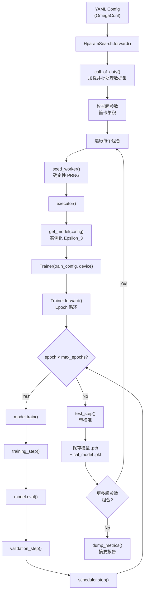

---
slug:11-model-training-workflow
blog_type:normal
---


Disobind 的训练流水线是一个**配置驱动、多阶段的过程**，由 `src/hparams_search.py` 中的 `HparamSearch` 负责编排，并将核心的 epoch 循环委托给 `src/build_model.py` 中的 `Trainer` 类。该流水线接收一个 YAML 配置文件，将所有超参数组合枚举为笛卡尔积，并为每个组合实例化 Epsilon_3 模型，执行完整的“训练-验证-测试”周期及事后校准，最后将神经网络权重和校准模型一同持久化保存。理解此工作流对于复现已发表的实验结果或将 Disobind 扩展到新的预测任务至关重要。

来源：[hparams_search.py](/src/hparams_search.py#L1-L359)，[build_model.py](/src/build_model.py#L1-L620)

## 训练流水线架构

端到端的训练工作流分为五个不同阶段，每个阶段均由通过 OmegaConf 加载的 YAML 配置进行管控。下图展示了从配置解析到模型持久化的控制流：



`HparamSearch` 类作为顶层的编排器。其 `forward()` 方法通过 `call_of_duty()` 加载数据集，在 `models/Epsilon_3_Train/Version_XX/` 下创建输出目录，并分派至 `manual_search()`（首选）或已弃用的 Optuna 路径。手动搜索会枚举所有可调超参数的组合——包括投影层配置、隐藏层深度、激活函数、学习率、接触阈值、对数权重、Dropout 计划、权重衰减以及调度器 gamma——随后为每个组合运行完整的训练周期。

来源：[hparams_search.py](/src/hparams_search.py#L312-L350)，[hparams_search.py](/src/hparams_search.py#L190-L310)

## 数据集加载与批处理

`DatasetLoader` 类期望获取**预先划分**好的训练集、开发集和测试集，并以 `.npy` 文件格式存储。数据集文件从 YAML 配置的 `dataset` 部分指定的路径中加载，转换为 PyTorch 张量，并封装为支持自定义批大小和混洗行为的 `DataLoader` 对象：

| 配置参数 | 描述 | 默认值 (v16.2) |
|---|---|---|
| `input_files` | 包含 `.npy` 划分文件的目录 | `../database/v_19/T5/global-None/` |
| `train_file` | 训练集文件名 | `Train_set_global_v_19.npy` |
| `dev_file` | 开发集文件名 | `Dev_set_global_v_19.npy` |
| `test_file` | 测试集文件名 | `Test_set_global_v_19.npy` |
| `batch_size` | 所有数据划分的小批量大小 | `64` |
| `batch_shuffle` | `[train, dev, test]` 的混洗标志 | `[True, False, False]` |

每个 `.npy` 文件包含形状为 `(N, L1+L2, C + C + 2*max_len)` 的拼接蛋白质对张量，其中前 `C` 列为 prot1 嵌入，接下来的 `C` 列为 prot2 嵌入，最后的 `2*max_len` 列编码目标接触图及其二值掩码。嵌入维度 `C` 由嵌入类型决定：T5/ProstT5/BERT 为 1024，ESM2-650M 为 1280，ProSE 为 6165。

来源：[dataset_loaders.py](/src/dataset_loaders.py#L69-L116)，[build_model.py](/src/build_model.py#L103-L152)

## 输入准备与目标路由

`Trainer` 中的 `get_inputs()` 方法根据配置的嵌入大小和 `max_seq_len`，将每个批次张量切片为 prot1 嵌入、prot2 嵌入、目标和目标掩码。这些组件随后通过 `src/utils.py` 中的 `prepare_input()` 进行路由，该方法根据**训练目标**对原始张量进行转换——训练目标是决定模型学习预测内容的核心配置轴：

| 目标 | 目标形状 | 描述 |
|---|---|---|
| `interaction` | `(N, L1×L2)` | 全残基对接触图预测 |
| `interface` | `(N, L1+L2)` | 逐残基界面标签预测 (prot1 ∪ prot2) |
| `interaction_bin` | `(N, ⌈L1/k⌉×⌈L2/k⌉)` | 核大小为 `k` 的粗粒度接触图 |
| `interface_bin` | `(N, ⌈L1/k⌉+⌈L2/k⌉)` | 核大小为 `k` 的粗粒度界面标签 |

对于粗粒度目标（`_bin` 后缀），将大小为 `bin_size` 的 `MaxPool2d` 核应用于目标接触图；若 `bin_input=True`，则将 `AvgPool1d` 应用于输入嵌入。`interaction_mask` 由目标掩码推导而来，并传递给模型的交互张量以将填充贡献置零。

来源：[build_model.py](/src/build_model.py#L103-L152)，[utils.py](/src/utils.py#L92-L200)

## Epoch 循环：训练与验证

`Trainer.forward()` 方法实现了核心训练循环。在每个 epoch 中，它依次执行**训练步骤**和**验证步骤**，然后推进学习率调度器：

### 训练步骤

在 `training_step()` 中，每个小批量依次经历：(1) 通过 `self.model1` 的前向传播，(2) 通过 `calculate_loss_n_metrics()` 计算损失，(3) 使用 `train_loss.backward()` 进行反向传播，(4) 当设置了 `max_norm` 时，通过 `clip_grad_norm_` 可选地进行梯度裁剪，(5) 通过 `self.optimizer1.step()` 更新参数。在**最后一个 epoch**（`epoch == max_epochs - 1`），会在所有批次中累积预测结果和目标值，用于**事后校准**——校准模型将在该 epoch 结束时基于训练集的预测结果进行拟合。

### 验证步骤

`validation_step()` 与训练步骤类似，但在 `torch.no_grad()` 下运行，不执行梯度计算或参数更新。与训练步骤一样，它也会在最后一个 epoch 累积预测结果，用于针对开发集的校准拟合。

### 逐 Epoch 日志

在每个 epoch 之后，训练器会计算所有小批量的平均指标，并以百分比形式报告训练/开发损失差距，同时报告两个数据划分的 Recall、Precision 和 F1-Score。日志结构为训练集存储 `[Loss, Recall, Precision, F1, AvgPrecision, MCC, AUROC, Accuracy, Epoch, Time]`，为开发集存储 `[Loss, Recall, Precision, F1, AvgPrecision, MCC, AUROC, Accuracy, Epoch]`。

来源：[build_model.py](/src/build_model.py#L219-L294)，[build_model.py](/src/build_model.py#L342-L400)，[build_model.py](/src/build_model.py#L512-L618)

## 事后校准

在训练结束时，`Trainer` 利用最后一个 epoch 累积的未校准预测结果来拟合一个**事后校准模型**。校准将原始模型输出映射为更准确的概率估计。该方法通过 `calibration` 配置参数进行选择：

| 方法 | 实现 | 配置值 |
|---|---|---|
| **Platt 缩放** | `sklearn.linear_model.LogisticRegression` | `platt` |
| **等保序回归** | `sklearn.isotonic.IsotonicRegression` | `iso` |
| **Beta 校准** | `betacal.BetaCalibration` | `beta-abm` / `beta-ab` |
| **温度缩放** | 恒等映射（无再校准） | `temp` |
| **None** | 不应用校准 | `None` |

在 `test_step()` 期间，通过 `get_calibrated_preds()` 获取校准后的预测结果，并绘制**可靠性图**，对比未校准与校准后的预测结果及正样本的真实比例，保存为 `Reliability_diagram_*.png`。

<CgxTip>校准模型默认基于**训练集**的预测结果进行拟合（在最后一个 epoch 的 `training_step` 内）。`validation_step` 也会在最后一个 epoch 基于开发集的预测结果拟合一个校准模型，但测试步骤的校准将使用最后设置的 `cal_model`。对于生产模型（v16.x, v16.2.x），校准设置为 `None`——Singularity Enhanced 损失函数本身即可提供无需事后调整的充分校准输出。</CgxTip>

来源：[build_model.py](/src/build_model.py#L298-L338)，[build_model.py](/src/build_model.py#L404-L491)

## 优化器与调度器配置

`Trainer` 支持三种优化器族，均可通过 YAML 的 `train_params` 部分进行配置：

| 优化器 | 配置 | 关键参数 |
|---|---|---|
| **AdamW** | `AdamW` | `lr`, `weight_decay`, `amsgrad` |
| **Adam** | `Adam` | `lr`, `weight_decay`, `amsgrad` |
| **SGD** | `SGD` | `lr`, `weight_decay`, `momentum=0.9` |

共有五种学习率调度器可用，由 `scheduler` 配置块控制。当 `scheduler.apply=True` 时，将实例化指定的调度器，并在每个 epoch 结束时调用其 `step()` 方法：

| 调度器 | 名称 | 关键参数 |
|---|---|---|
| **ExponentialLR** | `exp` | `gamma`（每次 epoch 的衰减） |
| **MultiStepLR** | `multistep` | `milestones`, `gamma` |
| **LinearLR** | `linear` | `start_factor`, `end_factor`, `total_iters` |
| **CyclicLR** | `cycliclr` | `base_lr`, `step_size_up`, `step_size_down` |
| **SWA** | `swa` | `swa_start`, `swa_lr` |

对于 SWA，会维护一个 `AveragedModel`，并在 `epoch > swa_start` 后的每个批次调用 `update_parameters()`。所有 epoch 完成后，如果 SWA 处于激活状态，则在进行最终测试步骤之前，平均模型将替换基础模型用于开发集评估。

来源：[build_model.py](/src/build_model.py#L50-L100)，[build_model.py](/src/build_model.py#L272-L283)

## 超参数搜索：手动网格

`HparamSearch` 中的 `manual_search()` 方法在 YAML 配置中指定的九个可调超参数轴上构建笛卡尔积，这些轴以**列表**形式表示。当参数为单个值（如 `learning_rate: [0.0002]`）时，它为乘积贡献一个元素；当包含多个值时，每个值将被独立探索：

```python
# 9 个可调轴及其 YAML 位置
for player in model_config.projection_layer:          # 1. 投影层配置
    for nlayers in model_config.num_hid_layers:        # 2. 隐藏层拓扑
        for activ1 in model_config.activation1:         # 3. 激活函数
            for lr in train_config.learning_rate:       # 4. 学习率
                for thresh in train_config.contact_threshold:  # 5. 接触阈值
                    for w1 in train_config.log_weight:  # 6. 损失加权
                        for drop in model_config.dropouts:    # 7. Dropout 计划
                            for wd in train_config.weight_decay:  # 8. 权重衰减
                                for g in train_config.scheduler.gamma:  # 9. 调度器 gamma
```

对于每种组合，搜索会运行具有不同随机种子（`global_seed + i*1111`）的 `Nruns` 次独立试验，计算多次运行的平均日志，将模型权重保存为 `.pth` 文件、校准模型保存为 `.pkl` 文件（通过 `joblib`），并通过 `create_plots()` 生成训练曲线图。所有组合完成后，由 `dump_metrics()` 写入摘要报告。

来源：[hparams_search.py](/src/hparams_search.py#L190-L310)

## 已发布的模型配置

Disobind 在 `models/Epsilon_3/` 下附带了六种已训练的模型配置，每种配置对应 `params/` 中的一个 YAML 文件。这些配置涵盖了两种分辨率级别下的两种预测任务，以及残基级基线：

| 版本 | 目标 | CG 大小 | 投影维度 | 隐藏层 | LR | Epochs | 调度器 γ |
|---|---|---|---|---|---|---|---|
| **6** | `interaction_bin` | 10 | 128 | 3 US, 2 DS blocks | 1e-4 | 30 | 0.97 |
| **6.1** | `interaction_bin` | 5 | 128 | 3 US, 2 DS blocks | 1e-4 | 30 | 0.97 |
| **6.2** | `interaction` | 1 | 256 | 3 US, 2 DS blocks | 4e-4 | 30 | 0.98 |
| **16** | `interface` | 1 | 128 | 0 hidden | 2e-4 | 30 | 0.98 |
| **16.1** | `interface_bin` | 5 | 128 | 0 hidden | 2e-4 | 25 | 0.87 |
| **16.2** | `interface_bin` | 10 | 128 | 0 hidden | 2e-4 | 20 | 0.87 |

**Version 6.x** 系列预测**接触图**（`interaction`）——完整的残基对交互矩阵；而 **Version 16.x** 系列预测**界面残基**（`interface`）——指示是否参与结合界面的逐残基二值标签。`_bin` 后缀表示粗粒度模型，这些模型在池化的残基组上操作，以空间分辨率换取计算效率和统计鲁棒性。

<CgxTip>与交互模型（v6.x，使用 3 个上游 + 2 个下游隐藏块）相比，界面模型（v16.x）采用了更简单的架构（0 个隐藏层，`input_layer: [op-od, vanilla, avg2d]`）。这反映了输出复杂性的内在差异：界面预测生成一维二值向量，而交互预测生成需要更深特征提取的二维接触矩阵。</CgxTip>

来源：[Model_config_Epsilon_3_6.yml](/params/Model_config_Epsilon_3_6.yml#L1-L126)，[Model_config_Epsilon_3_16.2.yml](/params/Model_config_Epsilon_3_16.2.yml#L1-L121)，[Model_config_Epsilon_3_16.yml](/params/Model_config_Epsilon_3_16.yml#L1-L121)，[Model_config_Epsilon_3_6.2.yml](/params/Model_config_Epsilon_3_6.2.yml#L1-L126)

## 模型持久化与可复现性

每次训练运行结束后，会保存两个制品：

- **神经网络权重**：`model_global-<hparam_key>__<run>.pth` —— 训练后的 Epsilon_3 模型的 `state_dict()`，通过 `torch.save()` / `torch.load()` 加载。
- **校准模型**：`model_global-<hparam_key>__<run>.pkl` —— 序列化的校准模型（Platt、Isotonic 或 Beta），通过 `joblib.dump()` 保存。仅当 `cal_model != None` 时才会创建此文件。

可复现性通过 `seed_worker()` 强制保证，该函数在每次试验前将 `torch.manual_seed()`、`torch.cuda.manual_seed_all()`、`np.random.seed()` 和 `random.seed()` 设置为相同的值。全局随机种子在 YAML 配置中指定（`Global_seed: 1`），第 i 次运行的逐试验种子推导为 `global_seed + i*1111`。

来源：[hparams_search.py](/src/hparams_search.py#L70-L77)，[hparams_search.py](/src/hparams_search.py#L258-L279)

## 调用训练

通过 `src/hparams_search.py` 并传入两个参数来启动训练：

```bash
python src/hparams_search.py \
    --Version_file params/Model_config_Epsilon_3_16.2.yml \
    --mode manual
```

`--Version_file` 标志接收 `params/` 中任意 YAML 配置的路径，`--mode` 则在 `manual`（对列出的超参数值进行网格搜索）和 `optuna`（已弃用的贝叶斯优化）之间选择。输出目录创建在 `models/Epsilon_3_Train/Version_XX/`，YAML 配置文件会被移入此目录以记录来源，所有日志、绘图和模型文件均写入该目录。

来源：[hparams_search.py](/src/hparams_search.py#L39-L46)，[hparams_search.py](/src/hparams_search.py#L312-L350)

## 后续步骤

训练工作流严重依赖于损失函数的选择和校准策略——请参阅 [损失函数与校准](12-loss-functions-and-calibration) 以了解 Singularity Enhanced 损失和校准流水线的数学公式。如需系统调节这九个超参数轴，请查阅 [超参数搜索](13-hyperparameter-search)。管控此整个流水线的 YAML 参数记录在 [YAML 配置参数](17-yaml-config-parameters) 中。