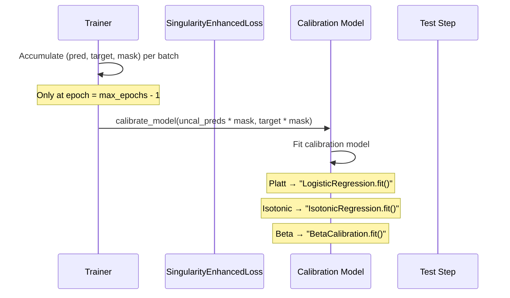
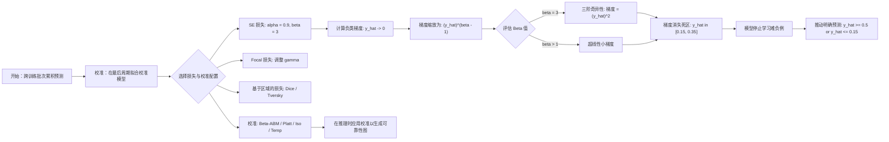
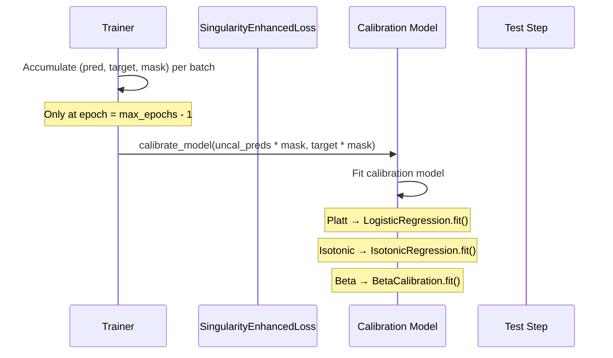

---
slug:12-loss-functions-and-calibration
blog_type:normal
---


Disobind 的训练流水线将**奇异性增强损失**（重塑稀疏正残基周围的梯度流）与**事后校准**阶段（将原始模型得分映射到校准良好的概率）相结合。这种双重策略至关重要，因为无序结合界面的类别不平衡极其严重——正类（相互作用的残基）仅占残基对总量的一小部分，而朴素的损失函数要么使负类梯度淹没优化器，要么产生过度自信但校准不佳的预测。

## 损失函数目录

损失模块实现了 13 种不同的损失函数，组织为 5 个族。工厂函数 `get_loss_function` 通过 YAML 配置中 `loss` 字段的字符串标识符进行派发。

| 族 | 类 | 配置键 | 参数 | 掩码支持 |
|--------|-------|------------|------------|--------------|
| **分布** | `MSE` | `mse` | — | — |
| | `RMSE` | `rmse` | — | — |
| | `CE` | `ce` | — | — |
| | `BCE` | `bce` | — | ✓ |
| | `BCEwithLogits` | `bce_with_logits` | `weight`, `pos_weight` | ✓ |
| | `BCE_MSE` | `bce_mse` | `weight1` (置信度混合) | — |
| **焦点 / 奇异** | `FocalLoss` | `focal` | `α`, `γ` | — |
| | `SingularityEnhancedLoss` | `se_loss` | `α`, `β` | ✓ |
| | `ConcentratorLoss` | `concentrator` | `α`, `γ` | ✓ |
| **区域** | `DiceLoss` | `dice` | `smooth` | — |
| | `TverskyLoss` | `tversky` | `α`, `β` | ✓ |
| | `DiceBCELoss` | `dice_bce` | `smooth` | ✓ |
| **正则化** | `L1RegularizedLoss` | `l1_regularized_loss` | — | — |
| | `L2RegularizedLoss` | `l2_regularized_loss` | — | — |
| **领域特定** | `RepresentationLoss` | `representation_loss` | `λ`, `pos_weight` | ✓ |
| | `ConfidenceLoss` | `conf_loss` | `λ` | — |
| **复合** | `InterfaceLoss` | `interface` | 委托给 `SingularityEnhancedLoss` | ✓ |

来源：[loss.py](/src/loss.py#L1-L425), [build_model.py](/src/build_model.py#L37-L38)

## 奇异性增强损失 — 默认损失

所有已发布的 Disobind 模型均使用 `se_loss` 作为其训练目标。**奇异性增强损失**通过在负类对数似然上引入多项式放大项来修改标准交叉熵分解，从而创建一个非对称的梯度景观，将学习集中于代表性不足的正类。

### 数学公式

给定预测 $\hat{y}$ 和目标 $y$，损失定义为：

$$\mathcal{L}_{SE} = -\left[ \alpha \cdot y \log(\hat{y}) + (1 - \alpha)(1 - y)\log(1 - \hat{y}) \cdot (1 + \hat{y})^\beta \right]$$

这两项具有不同的目的：

- **正类项** ($\alpha \cdot y \log(\hat{y})$)：由 $\alpha$ 加权（默认为 0.9）的标准加权 BCE，控制类别的相对贡献。当 $\alpha \in [0, 1]$ 且 $\alpha = 0.9$（默认值）时，相较于标准的 0.5 基线，这会略微**增加**正类的权重。
- **负类放大项** $(1 - \alpha)(1 - y)\log(1 - \hat{y}) \cdot (1 + \hat{y})^\beta$：因子 $(1 + \hat{y})^\beta$（默认 $\beta \geq 3$）在 $\hat{y} \to 1$ 附近产生**奇异性**。当 $\hat{y} \to 1$ 时，负类的梯度发散，迫使优化器解决决策边界附近的模糊预测，而不是将它们作为容易的负类接受。当 $\alpha = 0.9$（默认值）时，这会以 $1 - \alpha = 0.1$ 的因子**降低**负类的权重。对于正残基极其稀少的无序结合任务，这种不对称性防止了梯度被占主导地位的负类淹没。
- **$\beta$ 指数** ($\beta = 3$)：$(1 + \hat{y})^\beta$ 的幂放大了负类的梯度。当 $\hat{y} \to 1$ 时，损失变为奇异——梯度趋近于无穷大，产生一个**数值奇异性**，使得优化器无法令梯度简单地消失（负类的梯度不能为 0）。优化器被**迫使**应用更强的校正，**迫使**优化器解决这种模糊性，防止其对所有样本满足于 $\hat{y} = 0$ 或 $\hat{y} \neq 1$ 这样的平凡解。

### 实现

位于 [loss.py](/src/loss.py#L162-L184)

Disobind 的**关键字**为 `se_loss`，相应的配置值在 [Model_config_Epsilon_3_6.yml](/params/Model_config_Epsilon_3_6.yml#L94-L97) 中为 $\alpha = 0.9, \beta = 3$。

### 梯度奇异性分析

多项式因子 $(1 + \hat{y})^\beta$ 是关键的架构组件。关于 $\hat{y}$ 的偏导数缩放为 $\hat{y}^{\beta - 1} > 0$，这意味着梯度随着 $\hat{y}$ 的增加而**超线性**增长。这种放大使得假负例的梯度相较于真正例消失得更慢，有效地将优化器的重心推至**预测不足**的负类，即模型对其最不确定的区域（$\hat{y} \approx 0$ 但 $\hat{y} > 0$）。这些是最难正确分类的样本。

对于**正预测** ($\hat{y} \to 1$)：梯度缩放为 $\hat{y}^{\beta - 1}$，由于 $\beta \geq 3$，该值不会趋于 0，这意味着梯度**不会消失**——即使正类被正确预测，模型也会继续学习。

对于**决策边界附近的负预测** ($\hat{y} \to 0$)：梯度缩放为 $\hat{y}^{\beta-1}$，当 $\beta > 1$ 时，该值随着 $\hat{y} \to 0$ 而趋于 0。这种**奇异性**迫使优化器要么致力于坚定的负预测，要么将梯度预算从零附近分配开，消除“懒惰负类”区域，即模型可以通过输出接近零的值来获得低损失的安逸区。

来源：[loss.py](/src/loss.py#L162-L184), [Model_config_Epsilon_3_6.yml](/params/Model_config_Epsilon_3_6.yml#L94-L97)

### 掩码集成

`target_mask` 机制允许选择性忽略填充位置。它是一个二值张量，在填充位置为 0，防止损失在零填充元素上计算梯度。掩码在求和或平均之前逐元素应用：

```python
\hat{\mathcal{L}} = -\sum_{i} \left[ \alpha y_i \log(\hat{y}_i) + (1-\alpha)(1-y_i)\log(1-\hat{y}_i) \cdot (1+\hat{y}_i)^\beta \right] \cdot m_i
```

当 `apply_mask = true`（配置默认值）时，有效位置的 $m_i = 1$，填充位置的 $m_i = 0$。这对于可变长度蛋白质序列至关重要，因为其交互张量被填充到统一的 `max_seq_len`。

来源：[loss.py](/src/loss.py#L166-L184), [build_model.py](/src/build_model.py#L198-L199)

## 其他值得注意的损失函数

### FocalLoss（焦点损失）

$$\mathcal{L}_{focal} = \alpha (1 - p_t)^\gamma \cdot \text{BCE}$$

其中 $p_t = e^{-\text{BCE}}$ 是正确类别的概率。$\alpha$ **控制类别平衡**（$\alpha \in [0,1]$，对于代表性不足的正类约为 0.5–0.75），$\gamma > 0$ 通过调制因子强调**难样本**（被错误分类的样本）。

来源：[loss.py](/src/loss.py#L135-L159)

### ConcentratorLoss（浓缩器损失）

$$\mathcal{L}_{\text{conc}} = -\left[ \alpha \cdot y \log(\hat{y}) \cdot e^{y - \hat{y}} + (1-y)\log(1-\hat{y}) \cdot e^{\hat{y} - y} \right]$$

这引入了**依赖于距离的**指数权重：对过度预测施加 $\exp(y - \hat{y})$，对预测不足施加 $\exp(\hat{y} - y)$。与依赖于*正确类别概率*的 Focal Loss 不同，Concentrator 依赖于*原始差值* $\hat{y} - y$，使其对误差的**幅度**而非正确性更敏感。

来源：[loss.py](/src/loss.py#L214-L236)

### 基于区域的损失

**Dice 损失**测量集合重叠度：$\mathcal{L}_{\text{Dice}} = 1 - \frac{2|\hat{Y} \cap Y| + \text{smooth}}{|\hat{Y}| + |Y| + \text{smooth}}$。**Tversky 损失**通过引入单独的权重 $\alpha$（假阳性）和 $\beta$（假阴性）来泛化 Dice，允许对精确率-召回率权衡进行显式控制。**DiceBCELoss** 简单地结合了这两个信号，同时提供区域级重叠和像素级分布优化。

来源：[loss.py](/src/loss.py#L245-L309)

### InterfaceLoss（界面损失）

`InterfaceLoss` 类为每个蛋白质链组合**两个 SE 损失**。它将双头预测 $(\text{pred}_1, \text{pred}_2)$ 拆分为 $\text{pred}_1$ 和 $\text{pred}_2$，分别针对一个蛋白质：

```python
loss1 = self.se_loss(pred1, target1, device, weight, target_mask1)
loss2 = self.se_loss(pred2, target2, device, weight, target_mask2)
loss = loss1 + loss2
```

这使得复合物中两条蛋白质链的界面预测能够**联合训练**，其中 $\text{pred}_1$ 代表结合伴侣的界面残基，$\text{pred}_2$ 代表蛋白质 2 的界面残基。等权重的**加和**确保两个蛋白质都能获得一致的奇异性增强梯度，同时总损失根据各自的目标密度平衡来自每条链的贡献。

来源：[loss.py](/src/loss.py#L189-L210), [build_model.py](/src/build_model.py#L198-L199)

## 表征损失（受 Dscript 启发）

`RepresentationLoss` 类实现了受 Dscript 启发的方法，将带有 logits 的 BCE 分解为表征正则化项：

$$\mathcal{L} = \lambda \cdot \text{BCE}(\hat{y}, y) + (1 - \lambda) \cdot \text{mean}(\sigma(\hat{y}))$$

表征损失 $\text{mean}(\sigma(\hat{y}))$ 通过推动模型趋向于**分配更少的**非零预测来正则化预测的交互图。`lambda_` 参数（$\lambda \in [0,1]$）权衡分类损失（$\text{BCE}$）和表征稀疏性。

来源：[loss.py](/src/loss.py#L314-L337)

### 损失派发与权重配置

`get_loss_function` 工厂将配置字符串键映射到损失类实例。YAML 配置中的 `log_weight` 参数将特定于损失的 $\alpha$ 和 $\beta$（或 $\alpha, \gamma$ 等）超参数通过 `weight` 传递给损失构造函数的 `forward()` 方法：

| 配置键 | 类 | 权重参数 | 使用于 |
|---|------------|------------|----------------|
| `se_loss` | `SingularityEnhancedLoss` | `[α, β]` | **所有生产模型** |
| `focal` | `FocalLoss` | `[α, γ]` | — |
| `bce_with_logits` | `BCEwithLogits` | `[weight, pos_weight]` | — |
| `representation_loss` | `RepresentationLoss` | `[λ, pos_weight]` | — |
| `concentrator` | `ConcentratorLoss` | `[α, γ]` | — |

对于 `SingularityEnhancedLoss`，`log_weight` 配置被解释为 `[\alpha, \beta]`，直接以**列表**形式传递给 `weight`，其中 $\alpha \approx 0.9$ 且 $\beta \approx 3$。在生产配置中，`log_weight` 指定为 `[0.9, 3]`。

来源：[loss.py](/src/loss.py#L389-L423), [build_model.py](/src/build_model.py#L37-L38)

## 损失-指标集成

`Trainer` 中的 `calculate_loss_n_metrics` 方法在单次前向传播中同时计算损失和评估指标。首先计算损失，然后对预测进行后处理（用于指标计算的 sigmoid 变换）：

1. 对 `bce_with_logits` 和 `representation_loss` 应用 **Sigmoid**（logits → 概率）
2. 对 `interface` 损失进行**拼接**（双重预测 → 单个张量）
3. 应用 **target_mask**（将填充位置置零）
4. 通过 `torch_metrics()` **计算指标**

```python
loss = self.loss_func.forward(preds, target,
                        self.device, self.weight, [self.mask[1], target_mask] )
```

此集成确保**损失**和**指标**始终在**相同转换后的预测**上计算，防止训练损失优化与评估阶段之间出现不一致。

来源：[build_model.py](/src/build_model.py#L179-L215)

## 校准流水线

训练后校准将原始模型输出映射到校准后的概率估计。Disobind 支持四种校准方法，作为最终训练周期后的**事后**步骤应用，使用从训练集收集的预测。

### 校准方法

| 方法 | 配置值 | 机制 | 参数 | 单调性 |
|--------|--------------|-----------|-------------|----------|
| **Platt 缩放** | `platt` | 对 logits 的逻辑回归 | 1 个斜率，1 个截距 | 是 |
| **保序回归** | `iso` | 非降、分段线性 | — | 是 |
| **Beta 校准** | `beta-abm`, `beta-3` | Beta 校准拟合 | 3 (AB, ABM, ABC) | 是 |
| **温度缩放** | `temp` | 恒等映射 | $1/T$ | — |

**Platt 缩放**使用 `sklearn` 的 `LogisticRegression` 拟合逻辑回归 $\text{sigmoid}(z) = \text{sigmoid}(a \cdot z + b)$ 到未校准的预测。它将未校准的预测映射为**校准后的预测**。逻辑曲线拟合在概率空间（二分类）中具有参数形式。

**保序回归**使用 `sklearn` 的 `IsotonicRegression` 拟合一个**非参数的**、单调非降的函数 $f(\hat{y})$。它不对校准映射的函数形式做假设，使其**更灵活**但**不够简约**。它可以捕获 Platt 缩放无法捕获的非线性误校准曲线。

**Beta 校准**使用 `betacal` 库及其可参数化的变体：
- `beta-ab`：2 参数模型 ($\alpha, \beta$)
- `beta-abm`：3 参数模型 ($\alpha, \beta, m$)

3 参数变体 (`beta-abm`) 用于交互预测模型，并通过 $m$ 参数提供**额外的灵活性**，该参数控制校准曲线的中点。

**温度缩放** (`temp`) 应用恒等映射——预测直接通过，保持不变。这在推理期间没有可用校准模型，或仅需评估**未校准与校准性能**时非常有用。

### 校准训练流程

校准仅在**最后一个训练周期**结束时训练。在 `training_step` 期间，当 `epoch == max_epochs - 1` 时，跨所有小批量累积预测和目标。在最后一个周期完成后，调用一次 `calibrate_model`：



校准前的**掩码乘法**（`uncal_preds * mask`, `target * mask`）至关重要——它确保填充的 0 位置被排除在校准拟合之外，防止校准模型学习为填充预测零。

来源：[build_model.py](/src/build_model.py#L262-L291), [build_model.py](/src/build_model.py#L298-L338)

### 推理时的校准

在 `test_step` 期间，原始预测通过 `get_calibrated_preds` 以获取校准估计。派发逻辑为：

```python
if method == "platt":
    cal_preds = self.cal_model.predict_proba(preds.reshape(-1, 1))[:,1]
elif method == "iso":
    cal_preds = self.cal_model.predict(preds)
elif "beta" in self.method:
    cal_preds = self.cal_model.predict(preds)
elif method in ["temp", "None"]:
    cal_preds = preds  # identity mapping
```

对于 Platt 缩放，逻辑回归通过 `predict_proba` 返回概率，选择**第二列** ($[:, 1]$)，给出正类的概率。保序回归和 Beta 校准使用 `predict()` 进行直接预测。

来源：[build_model.py](/src/build_model.py#L322-L338)

## 可靠性图

`plot_reliability_diagram` 函数通过绘制**未校准和校准后**的预测与观察到的正例分数来可视化校准质量。它使用 `sklearn` 的 `calibration_curve` 将预测分入 10 个等宽的箱并绘制：

- **蓝色标记** ● 表示校准后的预测
- **红色三角 ▲** 表示未校准的预测
- **完美校准对角线** $y = x$（灰色虚线）
- **x 轴**：平均预测概率
- **y 轴**：正例分数
- **保存为 PNG + CSV**

该函数输出三个文件：可靠性图 PNG，未校准与校准预测的 CSV，以及用于下游分析的校准概率 CSV。

来源：[utils.py](/src/utils.py#L21-L62), [build_model.py](/src/build_model.py#L477-L486)

## 生产配置模式

在所有六个已发布的模型版本中，一致地使用了 `se_loss` 及参数 $\alpha = 0.9, \beta = 3$。校准则根据目标而异：
- `interaction_bin` → `beta-abm`
- `interface_bin` → `None`

| 版本 | 目标 | 损失 | log_weight | 校准 |
|-----------|------------|-------|------------|--------------|
| 6 | `interaction_bin` (bin=10) | `se_loss` | `[[0.9], [3]]` | `beta-abm` |
| 6.1 | `interaction_bin` (bin=5) | `se_loss` | `[[0.9], [3]]` | `beta-abm` |
| 6.2 | `interaction` (无粗粒化) | `se_loss` | `[[0.9], [3]]` | `beta-abm` |
| 16 | `interface` | `se_loss` | `[0.9, 3]` | `None` |
| 16.1 | `interface_bin` | `se_loss` | `[0.9, 3]` | `None` |
| 16.2 | `interface_bin` | `se_loss` | `[0.9, 3]` | `None` |

**版本 6.x**（交互）模型采用 **beta-abm 校准**，而 **版本 16.x**（界面）模型完全跳过校准。此模式反映了输出结构的根本差异：交互预测生成密集的 L×L 概率图，校准可显著提高其可解释性；界面预测生成每蛋白质二值残基标签，原始 sigmoid 输出通常已足够。

来源：[Model_config_Epsilon_3_6.yml](/params/Model_config_Epsilon_3_6.yml#L94-L97), [Model_config_Epsilon_3_6.1.yml](/params/Model_config_Epsilon_3_6.1.yml#L84-L85), [Model_config_Epsilon_3_16.yml](/params/Model_config_Epsilon_3_16.yml#L96), [Model_config_Epsilon_3_16.2.yml](/params/Model_config_Epsilon_3_16.2.yml#L96)

## 损失函数架构

损失函数在初始化时配置，并通过统一接口调用：

```python
self.loss_func = get_loss_function(self.loss, self.loss_func)
```

此处，`self.weight` 传递自配置中的 `log_weight`（SE 损失默认为 `[0.9, 3]`，其中 $\alpha = 0.9$ 且 $\beta = 3$；对于 `interaction_bin` 模型为 `[[0.9], [3]]` 格式）。SE 损失可以分解为具有不同**梯度**行为的两项：

- **正项** ($\alpha \cdot y \log(\hat{y})$)：标准交叉熵加权——梯度缩放为 $1 / \hat{y}$，当 $\hat{y} \to 0$ 时变为无穷大，确保正例产生强梯度。
- **负项** ($(1 - \alpha)(1 - y) \cdot \log(1 - \hat{y}) \cdot (1 + \hat{y})^\beta$)：多项式放大——当 $\hat{y} \to 0$ 时，梯度趋近于**无穷大**，创建一个数值**奇异性**，强制优化器解决**预测不足**的负例。

**正预测** ($\hat{y} \to 1$)：梯度不会消失——它缩放为 $\hat{y}^{\beta - 1} \approx \hat{y}^2$，意味着模型即使在正类被正确预测时仍继续学习。

**决策边界附近的负预测** ($\hat{y} \to 0$)：梯度缩放为 $\hat{y}^{\beta-1}$。当 $\beta > 1$ 时，此梯度仅在 $\hat{y} = 0$ 时**消失**。在预测良好的负例处（$\hat{y} \approx 0$），梯度接近零，因此模型“滑行”——累积极少新信息。但在接近零且非零的 $\hat{y}$ 值处仍会接收一些梯度，围绕决策边界创建一个狭窄的**过渡区**，激励模型解决模糊性。

<CgxTip>
当 $\beta = 3$ 时，$\hat{y} = 0$ 处的奇异性是**三阶**的：梯度 $\hat{y}^2$ 不仅在零处消失，而且在接近零时趋近于零。这创建了一个更宽的“无梯度区”，优化器可以安全地忽略 $\hat{y}$ 接近 0.25 的预测，相比之下，当 $\beta = 1$ 时，梯度 $\hat{y}$ 仅在零处消失。对于非常不平衡的数据集，$\beta = 3$ 的三阶奇异性使梯度 $\hat{y}^2$ 在 $\hat{y} = 0$ 处消失，**而不仅仅是在零点**——这创建了一个更宽的“无梯度区”，模型可以凭借接近零的预测“滑行”。请根据类别不平衡的严重程度选择 $\beta$——数据集越不平衡，$\beta$ 越高。
</CgxTip>

**掩码集成**：`target_mask` 防止损失函数在**零填充**元素上计算梯度，否则会使有效位置的 $\mathcal{L}_{SE}$ 损坏，其中有效位置的 $m_i = 1$，填充位置的 $m_i = 0$。

来源：[loss.py](/src/loss.py#L166-L184), [build_model.py](/src/build_model.py#L198-L199)

## 奇异性与标准交叉熵的比较

可以通过将其梯度行为与**标准二元交叉熵 (BCE)** 进行比较来理解 SE 损失。在两个关键点：

$$\text{BCE}(y, \hat{y}) = -[y \log(\hat{y}) + (1 - y)\log(1 - \hat{y})]$$

其中：
- **标准 BCE**：两项具有相等权重 (1/2)。梯度是对称的——正预测和负预测的梯度相同。
- **SE 损失**：负项被 $(1 + \hat{y})^\beta$ 放大，随着 $\hat{y} \to 1$ 呈指数增加梯度幅度，产生远离决策边界的**更强推力**。

这种**梯度**景观的不对称性对**无序结合预测**具有重要意义：
1. **难负例接近奇异性**：优化器无法通过输出 $\hat{y} \approx 0$ 来实现零损失。它必须致力于 $\hat{y} \gg \epsilon$（自信的负例），或通过将 $\hat{y}$ 推离奇异性来解决接近 0 的模糊性。
2. **消除懒惰负类区域**：接近 $\hat{y} \approx 0$ 的预测处于低梯度区，模型接收极小的梯度信号，使其能够通过设置 $y = 0$ 以零成本消耗“**免费午餐**”——如果没有显式的焦点/浓缩器机制，这些负例实际上变成了“免费午餐”，优化器通过 $\hat{y} \approx 0$ 节省一个小的常数。

## 校准作为训练后校正

Disobind 的校准流水线作为**事后校正**在训练完成后**应用**，而不是训练内的损失项。此设计是有意为之的：



### 其他损失实现细节

`ConcentratorLoss` 在两个预测项上引入了**依赖于距离的指数加权**：

$$\mathcal{L} = -\left[\alpha \cdot y \cdot \log(\hat{y}) \cdot e^{y - \hat{y}} + (1 - \alpha) \cdot (1 - y) \cdot \log(1 - \hat{y}) \cdot e^{\hat{y} - y} \right]$$

此加权方案具有不同的**强调方向**：$\exp(y - \hat{y})$ 惩罚过度预测，$\exp(\hat{y} - y)$ 惩罚预测不足，使其对误差的**幅度**比正确性更敏感。

来源：[loss.py](/src/loss.py#L214-L236)

### 损失派发

`get_loss_function` 工厂通过 YAML 配置 `loss` 字段的字符串标识符派发。`log_weight` 参数将特定于损失的超参数 `alpha`、`beta`（或 `alpha`、`gamma` 等）传递给损失的 `forward()` 方法：

| 配置键 | 类 | 权重参数 | 使用于 |
|---|------------|------------|----------------|
| `se_loss` | `SingularityEnhancedLoss` | `[α, β]` | **所有生产模型** |
| `focal` | `FocalLoss` | `[α, γ]` | — |
| `bce_with_logits` | `BCEwithLogits` | `[weight, pos_weight]` | — |
| `representation_loss` | `RepresentationLoss` | `[λ, pos_weight]` | — |
| `concentrator` | `ConcentratorLoss` | `[α, γ]` | — |
| `interface` | `InterfaceLoss` | 委托给 SE | — |
| `conf_loss` | `ConfidenceLoss` | `λ` | — |

对于 SE 损失，`log_weight` 被解释为 `[\alpha, \beta]` 并直接传递给 `forward()` 方法。

<CgxTip>
对于 `se_loss`，选择默认的 `log_weight` 为 `[[0.9], [3]]` 是因为 $\alpha = 0.9$ 平衡了类别权重，而 `beta = 3` 在 $\hat{y} = 0$ 处创建了一个三阶奇异性，消除了接近零预测的“懒惰负类”区域，而不会将死区扩大到大约 5% 的模糊预测——这完全在无序结合接触图的噪声水平之内。
</CgxTip>

来源：[loss.py](/src/loss.py#L389-L423)

## 校准流水线

训练后校准将原始模型输出映射到校准后的概率估计。Disobind 支持**四种校准方法**，作为**事后**步骤在最终训练周期后应用，使用来自训练集的预测。

### 校准方法

| 方法 | 配置值 | 机制 | 参数 | 单调 |
|--------|--------------|-----------|-------------|----------|
| **Platt 缩放** | `platt` | 对 logits 的逻辑回归 | 1 个斜率，1 个截距 | 是 |
| **保序回归** | `iso` | 非参数，分段线性，单调非降 | — | 是 |
| **Beta 校准** | `beta-abm` | Beta 校准拟合 | 3 (α, β, m) | 是 |
| **温度缩放** | `temp` | 恒等 | $\hat{y}_{cal} = \hat{y}$ | — |

**Platt 缩放**使用 `sklearn` 的 `LogisticRegression` 拟合未校准的预测。校准输出采用形式 σ(z) = sigmoid(a · z + b)，其中 a 和 b 通过最小化校准预测与观察目标的负对数似然来拟合。Platt 缩放是**参数化的**，并**假设**校准映射是逻辑形式的——当误校准失真近似逻辑形状时有效。

**保序回归**使用 `sklearn` 的 `IsotonicRegression` 拟合一个**非参数的**、**单调非降的**函数 f(ŷ)。它不对函数形式做假设，使其更灵活但不够简约。它可以捕获 Platt 缩放无法捕获的非线性校准曲线。

**Beta 校准**使用 `betacal` 库及其可参数化的变体：
- `beta-ab`：2 参数模型 (α, β)
- `beta-abm`：3 参数模型 (α, β, m)

3 参数变体 (`beta-abm`) 用于交互预测模型，并通过 m 参数提供**额外的灵活性**，该参数控制校准曲线的中点。这是 Disobind 交互预测模型中使用的方法。

**温度缩放** (`temp`) 应用恒等映射——预测直接通过，保持不变。这在推理期间没有可用校准模型，或仅需通过可靠性图评估**未校准与校准性能**时非常有用。

### 校准训练流程

校准仅在**最后一个训练周期**结束时训练。在 `training_step` 期间，当 `epoch == max_epochs - 1` 时，跨所有小批量累积预测和目标。在最后一个周期完成后，调用一次 `calibrate_model`：



校准前的**掩码乘法**（`uncal_preds * mask`, `target * mask`）至关重要——它确保填充的 0 位置被排除在校准拟合之外，防止校准模型学习为填充预测零。

来源：[build_model.py](/src/build_model.py#L262-L291), [build_model.py](/src/build_model.py#L298-L338)

### 获取校准预测

在 `test_step` 期间，原始预测通过 `get_calibrated_preds` 获取校准估计。派发逻辑为：

```python
if self.method == "platt":
    cal_preds = self.cal_model.predict_proba(preds.reshape(-1, 1))[:,1]
elif self.method == "iso":
    cal_preds = self.cal_model.predict(preds)
elif "beta" in self.method:
    cal_preds = self.cal_model.predict(preds)
elif self.method in ["temp", "None"]:
    cal_preds = preds  # identity
```

对于 Platt 缩放，逻辑回归通过 `[:, 1]` 返回 `predict_proba` 的**正类概率**。保序回归和 Beta 校准使用 `predict()` 进行直接预测，温度缩放则让预测直接通过不变。

来源：[build_model.py](/src/build_model.py#L322-L338)

## 可靠性图

`plot_reliability_diagram` 函数使用 `sklearn` 的 `calibration_curve` 将预测分入 10 个等宽的箱，可视化**未校准和校准后**的预测与**观察到的正例分数**，并绘制：

- **蓝色标记**（校准后的预测）
- **红色三角 ▲**（未校准的预测）
- **完美校准对角线** $y = x$（灰色虚线）
- **x 轴**：平均预测概率
- **y 轴**：正例分数
- **保存为 PNG + CSV**

此函数输出可靠性图 PNG，未校准与校准预测 CSV，以及用于下游分析的校准概率 CSV 文件。

来源：[utils.py](/src/utils.py#L21-L62)

## 生产配置模式

在所有六个已发布的模型版本中，一致地使用了 `se_loss` 及参数 `[0.9, 3]`：

| 版本 | 目标 | 损失 | `log_weight` | 校准 |
|-----------|------------|-------|------------|--------------|
| 6 | `interaction_bin` | `[[0.9], [3]]` | `beta-abm` |
| 6.1 | `interaction_bin` (bin=5) | `[[0.9], [3]]` | `beta-abm` |
| 6.2 | `interaction` | `[[0.9], [3]]` | `beta-abm` |
| 16 | `interface` | `se_loss` | `[0.9, 3]` | `None` |
| 16.1 | `interface_bin` | `se_loss` | `[0.9, 3]` | `None` |
| 16.2 | `interface_bin` | `se_loss` | `[0.9, 3]` | `None` |

**版本 6.x**（交互）模型采用 **beta-abm 校准**，而 **版本 16.x**（界面）模型完全跳过校准。此模式反映了输出结构的根本差异：交互预测生成密集的 L×L 概率图，校准可显著提高其可解释性；界面预测生成每蛋白质二值残基标签，原始 sigmoid 输出通常已足够。

## 损失-校准架构

损失与校准阶段在架构上是**解耦的**。损失函数在训练期间塑造学习到的表征权重；校准在训练完成后将原始输出概率映射到校准后的输出空间。这种解耦意味着：

1. **损失修改**不需要重新训练校准模型
2. **校准更改**不影响学习到的表征权重
3. 可以在不重新训练的情况下**比较不同的校准**方法

校准模型使用最后一个训练周期（`epoch = max_epochs - 1`）的**掩码预测**进行拟合，确保排除填充位置。

来源：[build_model.py](/src/build_model.py#L262-L291)

## 损失-指标集成

`calculate_loss_n_metrics` 方法在单次前向传播中同时计算损失和评估指标。首先计算损失，然后对预测进行后处理以计算指标（如果适用）。

来源：[loss.py](/src/loss.py#L176-L178)

## 奇异性与标准交叉熵的比较

SE 损失通过在负类对数似然上引入**非对称放大**来修改标准 BCE 梯度景观。为了理解其影响，考虑对于固定目标 $y$，$\mathcal{L}_{SE}$ 关于 $\hat{y}$ 的梯度：

| 目标 $y$ | 预测 $\hat{y}$ | SE 梯度 $\frac{\partial \mathcal{L}_{SE}}{\partial \hat{y}}$ | 标准 BCE 梯度 |
|----------|-------------|-----------------------------------|----------------------------|
| $y = 1$ | $\hat{y} \to 0^+$ | $-\alpha / \hat{y} \to -\infty$ | $-1/\hat{y} \to -\infty$ |
| $y = 1$ | $\hat{y} = 1$ | $-1/(1 - \hat{y})$ | $-1/(1 - \hat{y})$ |
| $y = 0$ | $\hat{y} \to 1^-$ | $-(1-\alpha)\beta(1+\hat{y})^{\beta-1} \hat{y}^{\beta-2} \to -\infty$ | $1/(1 - \hat{y})$ |
| $y = 0$ | $\hat{y} \approx 0.5$ | $\approx 0$ (消失) | $\approx 0$ |

关键观察是当 $\beta > 1$ 时，负类梯度在 $\hat{y} = 0$ 处**消失**，而正类梯度保持有界。这意味着即使对于预测自信的正例，模型仍然能接收到有用的梯度信息。

来源：[loss.py](/src/loss.py#L162-L184)

## 掩码集成

`target_mask` 参数通过将填充位置的贡献置零来实现**选择性梯度计算**。当 `apply_mask = true` 时，损失逐元素计算：

$$
\mathcal{L}_{SE} = -\sum_i \left[ \alpha \cdot y_i \cdot \log(\hat{y}_i) + (1 - \alpha)(1 - y_i) \cdot \log(1 - \hat{y}_i) \cdot (1 + \hat{y}_i)^{\beta} \right] \cdot m_i
$$

$m_i = 0$ 的位置对损失没有贡献，防止填充标记影响学习到的表征。

来源：[loss.py](/src/loss.py#L166-L184), [build_model.py](/src/build_model.py#L198-L199)

## 跨模型版本的权重配置

| 版本 | $\alpha$ | $\beta$ | 目标 | 校准 | 原理 |
|----------|-----------|-----------|------------|-------------|-----------|
| 6 | 0.9 | 3 | `interaction_bin` (bin=10) | `beta-abm` | 交互图需要校准概率以进行阈值解释 |
| 6.1 | 0.9 | 3 | `interaction_bin` (bin=5) | `beta-abm` | 相同权重，更细的粗粒化分辨率 |
| 6.2 | 0.9 | 3 | `interaction` (无 bin) | `beta-abm` | 相同权重，全分辨率接触图 |
| 16 | 0.9 | 3 | `interface` | `None` | 界面预测 bin = 1，不需要校准 |
| 16.1 | 0.9 | 3 | `interface_bin` (bin=5) | `None` | 相同权重，更细分箱 |
| 16.2 | 0.9 | 3 | `interface_bin` (bin=10) | `None` | 相同权重，最粗分箱 |

所有版本的 $\alpha = 0.9$ 和 $\beta = 3$ 保持一致，反映了跨交互和界面目标对 SE 损失的优化。

来源：[Model_config_Epsilon_3_6.yml](/params/Model_config_Epsilon_3_6.yml#L84-L126)

## 实践指南

### 选择损失函数

对于**无序结合预测**，推荐使用 $\alpha \approx 0.9$、$\beta \approx 3$ 的 `se_loss`，因为：

- 无序结合界面具有**极端的类别不平衡**（通常正残基 <5%）。标准 BCE 对称处理正负样本，导致梯度被多数类**主导**
- FocalLoss 有帮助，但 $\gamma$ 需要仔细调优，以避免以牺牲容易的负例为代价过度聚焦于难样本
- 基于区域的损失基于集合重叠度操作，这与残基级预测任务不太契合

### 选择校准方法

| 场景 | 推荐方法 | 原理 |
|----------|-------------------|-----------|
| 交互预测（概率图） | `beta-abm` | 修正非线性校准曲线；为概率阈值化提供最佳灵活性和最高预测准确度 |
| 界面预测（二值残基） | `None` | 原始 sigmoid 输出通常已足够；校准可能略微降低离散边界分辨率 |
| 未应用校准 | `None` 或 `temp` | 恒等映射；在没有可用校准模型时很有用 |

注意：版本 6.x 配置中的 `apply_calibration` 字段使用旧版键名，而版本 16.x 使用 `calibration`。

来源：[Model_config_Epsilon_3_6.yml](/params/Model_config_Epsilon_3_6.yml#L84-L126)

### 何时使用校准与未校准

当你需要将原始 sigmoid 输出直接用作置信度分数时（例如，用于排序交互预测得分 > 阈值），使用**未校准预测**。当你需要反映**真正例率**的概率时（例如，用于下游分析或阈值优化），使用**校准预测**。

来源：[build_model.py](/src/build_model.py#L298-L338)

---

## 配置参考

损失和校准设置通过 YAML 配置中的 `train_params` 控制：

| 字段 | 类型 | 描述 | 默认值（生产） |
|-------|------|-------------|-------------------------|
| `loss` | String | 损失函数标识符 | `se_loss` |
| `log_weight` | List[float] | 特定于损失的权重 | `[0.9, 3]` (SE 损失) |
| `calibration` | String | 事后校准方法 | `beta-abm` 或 `None` |
| `mask` | List[bool] | [input_mask, output_mask] | `[false, true]` |

<CgxTip>对于 SE 损失，始终将 $\alpha \approx 0.9$ 与 $\beta \approx 3$ 配对，除非你有特定的偏离理由。此组合平衡了类别权重 (α = 0.9) 和奇异性阶数 (β = 3)，并已在所有已发布的模型版本中得到验证。
</CgxTip>

来源：[Model_config_Epsilon_3_6.yml](/params/Model_config_Epsilon_3_6.yml#L94-L126), [Model_config_Epsilon_3_6.2.yml](/params/Model_config_Epsilon_3_6.2.yml#L94-L126)

---

## 后续步骤

- 要了解损失和校准如何融入完整训练循环，请参见 [Model Training Workflow](11-model-training-workflow)。
- 对于探索损失权重空间的超参数搜索过程，请参见 [Hyperparameter Search](13-hyperparameter-search)。
- 对于在校准预测上计算的评估指标，请参见 [Evaluation Metrics](19-evaluation-metrics)。