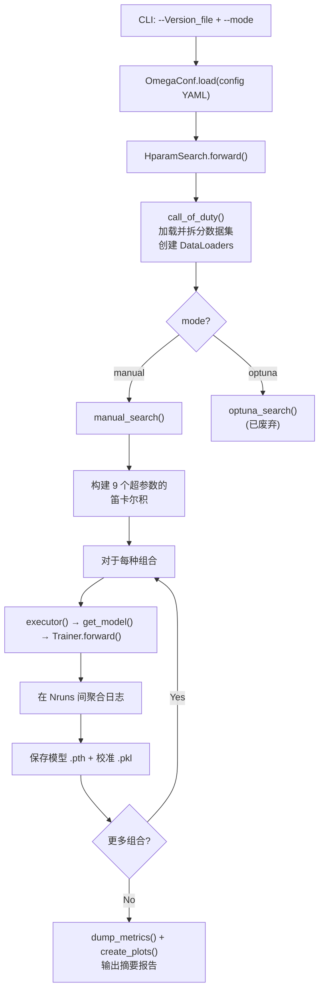

---
slug:13-hyperparameter-search
blog_type:normal
---


Disobind 采用**手动网格搜索** 框架进行超参数优化，由 `src/hparams_search.py` 中的 `HparamSearch` 类统筹协调。系统遍历 YAML 配置文件中定义的可调参数的笛卡尔积，为每种组合训练一个完整模型，并在多次随机运行中聚合指标——这是一种优先考虑穷举覆盖而非贝叶斯效率的暴力策略。代码库中存在一个基于 Optuna 的替代方案，但已完全废弃。

来源：[hparams_search.py](src/hparams_search.py#L1-L34)

## 搜索架构

超参数搜索流程由两个 CLI 参数驱动：特定版本的 YAML 配置文件和模式选择器。`forward` 方法统筹整个生命周期——数据集加载、输出目录准备，以及分派到 `manual_search` 或 `optuna_search`（已废弃）。



`call_of_duty` 方法通过 `seed_worker` 初始化确定性伪随机数生成器 (PRNG) 状态，然后委托 `DatasetLoader` 进行训练/验证/测试集划分并构建 `DataLoader`。此操作在搜索循环之前仅发生**一次**——所有超参数组合共享相同的数据集划分。

来源：[hparams_search.py](src/hparams_search.py#L70-L91), [hparams_search.py](src/hparams_search.py#L312-L349)

## 九个可调超参数

手动搜索在横跨模型架构和训练动态的**九个**超参数上构建完整的笛卡尔积。每个 YAML 配置将每个参数键的搜索空间编码为一个**列表**——单元素列表将该参数固定为特定值，而多元素列表则扩展网格。

| # | 超参数 | YAML 路径 | 领域 | 类型 | 示例值 |
|---|---------------|-----------|--------|------|----------------|
| 1 | **投影层** | `model_params.projection_layer` | 架构 | 列表 `[dim, type, bias, mult, sep]` | `[128, ln2, true, 1, '']`, `[256, ln2, true, 1, '']` |
| 2 | **隐藏层** | `model_params.num_hid_layers` | 架构 | 列表 `[US, DS, blocks, scale, block_type, residual]` | `[0,0,0,0,vanilla,'']`, `[0,3,0,2,vanilla,'']` |
| 3 | **激活函数 1** | `model_params.activation1` | 架构 | 列表 `[func, param]` | `[elu, null]` |
| 4 | **学习率** | `train_params.learning_rate` | 优化 | 浮点数 | `0.0001`, `0.0002`, `0.0004` |
| 5 | **接触阈值** | `train_params.contact_threshold` | 后处理 | 浮点数 ∈ (0,1) | `0.5` |
| 6 | **对数权重** | `train_params.log_weight` | 损失 | 浮点数或列表 `[pos_weight, neg_weight]` | `[0.9, 3]` |
| 7 | **Dropout** | `model_params.dropouts` | 正则化 | 列表 `[drop1, drop2, us_drop, ds_drop, mc_drop]` | `[0.2, 0, 0, 0, 0]` |
| 8 | **权重衰减** | `train_params.weight_decay` | 正则化 | 浮点数 | `0.05` |
| 9 | **Gamma (调度器)** | `train_params.scheduler.gamma` | 学习率调度 | 浮点数 | `0.87`, `0.91`, `0.97`, `0.98` |

总训练运行次数为 **∏|search_space_i| × Nruns**，其中 `|search_space_i|` 是第 *i* 个超参数的候选值数量，`Nruns` 控制使用不同种子的随机重复次数。

<CgxTip>`projection_layer` 和 `num_hid_layers` 参数是结构化列表而非标量。将它们添加到搜索网格时，整个列表元组会成为一个网格点——从而能够探索性质不同的架构（例如零隐藏层与三个隐藏层），而不仅仅是维度的微调。</CgxTip>

来源：[hparams_search.py](src/hparams_search.py#L202-L215), [model_versions.py](src/model_versions.py#L54-L148)

## 网格构建与执行

`manual_search` 方法通过 9 层嵌套循环构建笛卡尔积，将每种组合作为 9 元组追加到 `hparam_comb` 中。对于每种组合，通过用下划线连接所有元组元素（例如 `128_0_elu_0.0002_0.5_0.9_0.2_0.05_0.87`）来构建人类可读的**键**字符串。此键用于索引日志字典和文件名。

遍历 `trial_seeds` 的内循环控制多次运行的重复性。对于 `i ∈ [0, Nruns)`，种子按 `global_seed + i × 1111` 生成。每次运行的日志会被**累加**，并在给定组合的所有运行完成后按 `Nruns` **求平均**，从而在配置随机性下提供每个指标的蒙特卡洛估计。

```python
# 简化的核心循环结构
for comb in hparam_comb:
    for run, seed in enumerate(trial_seeds):
        self.seed_worker(seed)
        model, cal_model, train_logs, dev_logs, test_logs = self.executor(
            model_config, train_config, key )
        train_logs_dict[key] += train_logs
        # ... 累加验证和测试日志
        torch.save(model.state_dict(), f"{model_path}-{key}__{run}.pth")
    # 跨运行求平均
    train_logs_dict[key] = train_logs_dict[key] / Nruns
```

来源：[hparams_search.py](src/hparams_search.py#L190-L297)

## 配置到搜索空间的约定

YAML 配置具有双重目的：当参数字段包含**单元素列表**时，它是一个固定值；当包含**多元素**时，每个元素都是一个网格点。此约定在 `model_versions.py` 中建立，该文件生成将搜索空间编码为嵌套列表的版本配置（例如，`"projection_layer": [[128, "ln2", True, 1, ""]]`——外层列表定义网格，内层列表定义一种架构变体）。

下表显示了不同版本配置如何在已发布的模型版本中编码不同的搜索策略：

| 配置版本 | 目标 | 投影维度 | 隐藏层 | 学习率 | Gamma | 轮数 | 搜索策略 |
|---------------|-----------|---------------|---------------|-----|-------|--------|-----------------|
| 6 | `interaction_bin` (bin=10) | 128 | [0,3,0,2] | 0.0001 | 0.97 | 30 | 单点（接触图） |
| 6.1 | `interaction_bin` (bin=5) | 128 | [0,3,0,2] | 0.0002 | 0.97 | 30 | 单点（更细粒度） |
| 6.2 | `interaction` (bin=1) | 256 | [0,3,0,2] | 0.0004 | 0.98 | 30 | 单点（全分辨率） |
| 16 | `interface` (bin=1) | 128 | [0,0,0,0] | 0.0002 | 0.98 | 30 | 单点（界面，无隐藏层） |
| 16.1 | `interface_bin` (bin=5) | 128 | [0,0,0,0] | 0.0002 | 0.91 | 20 | 单点（分桶界面） |
| 16.2 | `interface_bin` (bin=10) | 128 | [0,0,0,0] | 0.0002 | 0.87 | 20 | 单点（粗粒度界面） |

<CgxTip>已发布的配置使用单点网格（每个参数一个值），这意味着 `manual_search` 恰好运行 Nruns × 1 个训练任务。要执行实际的网格搜索，请在 YAML 列表中添加多个候选值——例如，`learning_rate: [0.0001, 0.0002, 0.0004]` 会在学习率轴上创建三个网格点。</CgxTip>

来源：[Model_config_Epsilon_3_6.yml](params/Model_config_Epsilon_3_6.yml#L1-L126), [Model_config_Epsilon_3_16.2.yml](params/Model_config_Epsilon_3_16.2.yml#L1-L121), [model_versions.py](src/model_versions.py#L43-L151)

## 输出产物与报告

在完成所有网格组合后，搜索流程会在版本化的输出目录中生成四类产物：

| 产物 | 格式 | 内容 |
|----------|--------|---------|
| 模型权重 | 每次运行 `.pth` | `torch.save(model.state_dict())`，键为 `model_path-key__run` |
| 校准模型 | 每次运行 `.pkl` | 若应用校准，则为 `joblib.dump(cal_model)` |
| 指标图 | 每种组合 `.png` | 通过 `create_plots()` 绘制跨轮次的训练/验证损失及 7 项指标 |
| 计时日志 | `Total_time.yml` | 通过 `OmegaConf.save()` 记录每种组合的挂钟时间（小时） |
| 训练/验证日志 | 每个模型版本 `.npy` | 跨运行平均的指标数组 |
| 摘要报告 | `.txt` + `.csv` | 通过 `dump_metrics()` 生成人类可读与表格化的指标摘要 |

`dump_metrics` 函数计算**过拟合/欠拟合诊断**——即在最后 20% 的轮次中，训练损失与验证损失之差的百分比——为每种配置提供定量的泛化指标。`create_plots` 函数生成 4×2 的子图网格，绘制每个轮次的 Loss、Recall、Precision、F1、AvgPrecision、MCC、AUROC 和 Accuracy，同时包含训练集（蓝色）和验证集（红色）。

来源：[hparams_search.py](src/hparams_search.py#L270-L308), [utils.py](src/utils.py#L268-L383)

## 已废弃的 Optuna 集成

代码库保留了被注释掉的 `objective` 方法和 `optuna_search` 方法，它们曾经利用 Optuna 进行贝叶斯优化。目标函数对离散参数（激活函数、投影层、Dropout）使用 `trial.suggest_categorical`，对连续参数（权重衰减、学习率）使用对数尺度的 `trial.suggest_float`。剪枝通过 `MedianPruner` 处理，以验证集 F1 作为中间报告指标。此路径现已完全废弃——`optuna` 的导入已被注释掉，且所有配置中的 `optuna_trials` 字段均设为 `0`。

来源：[hparams_search.py](src/hparams_search.py#L93-L167)

## 调用

超参数搜索直接作为脚本启动：

```bash
python src/hparams_search.py -f params/Model_config_Epsilon_3_16.2.yml -m manual
```

该脚本加载 YAML 配置，实例化 `HparamSearch`，并调用 `forward(args)`。输出目录在 `conf.dataset.output_path/Version_{version}/` 处创建，并且在搜索开始前，配置 YAML 本身会被**移动**到该目录中以进行溯源追踪。

来源：[hparams_search.py](src/hparams_search.py#L352-L358), [hparams_search.py](src/hparams_search.py#L317-L342)

## 设计理念与权衡

手动网格搜索优先考虑**完备性与确定性**，而非采样效率。每种组合都使用固定种子训练至完成，产生可直接比较的日志，而不受贝叶斯方法中早停剪枝或采集函数噪声引入的随机性影响。其代价是计算成本：笛卡尔积呈乘法级增长——一个包含 2 个投影维度 × 3 个学习率 × 4 个 Gamma 的网格已产生 24 次完整训练运行 × Nruns。多次运行平均机制（由 `Nruns` 控制）可减轻种子敏感性，但会进一步增加成本。

要了解这些超参数如何流入模型构建，请参见 [Epsilon_3 模型架构](5-epsilon_3-model-architecture)。有关 `log_weight` 和 `loss` 搜索参数引用的损失函数，请参见 [损失函数与校准](12-loss-functions-and-calibration)。有关定义搜索空间的 YAML 参数定义，请参见 [YAML 配置参数](17-yaml-config-parameters)。