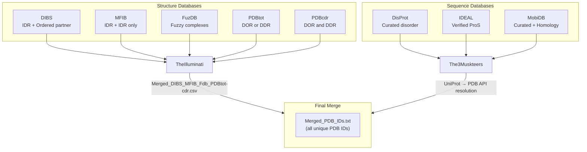

---
slug:14-disorder-protein-databases
blog_type:normal
---


Disobind 的训练数据源自内在无序蛋白（IDP）的**八个精选数据库**，这些数据被组织为两个不同的类别：**结构数据库**直接提供包含 IDR 复合物的 PDB 标识符；**序列数据库**则通过 PDB REST API 将其 UniProt 标识符解析为 PDB 条目。这种双重采集策略在保持筛选严谨性的同时，确保了对无序蛋白复合物结构覆盖面的最大化。

## 双类别数据库架构

`1_disobind_databases.py` 中的流程实现了两个解析器类，以反映这种基础的划分。**`TheIlluminati`** 处理五个以结构为中心的数据库，这些数据库已包含 PDB ID 和链级注释——DIBS、MFIB、FuzDB、PDBtot 和 PDBcdr。**`The3Musketeers`** 处理三个以序列为中心的数据库——DisProt、IDEAL 和 MobiDB——它们的 UniProt ID 必须通过中间 API 解析步骤映射到 PDB 条目。最终输出是写入 `Merged_PDB_IDs.txt` 的统一唯一 PDB 标识符集合。



来源: [1_disobind_databases.py](/dataset/1_disobind_databases.py#L30-L56), [1_disobind_databases.py](/dataset/1_disobind_databases.py#L419-L454), [1_disobind_databases.py](/dataset/1_disobind_databases.py#L1047-L1074)

## 结构数据库：直接提取 PDB

这五个结构数据库共享一个通用的输出模式——**PDB ID、链标识符（asym 和 auth）、UniProt 登录号以及 UniProt 边界**——从而能够将它们拼接为一个单一的数据框。然而，由于原始格式的异构性，每个数据库都需要一个定制的解析器。

### DIBS — 无序结合位点

DIBS 编录了**无序区域与有序伴侣结合**的复合物（例如，SH3 结构域、溴结构域）。链分配遵循严格的约定：`chain ID1:chain ID2`，其中冒号将无序链与有序链分隔开。原始文件使用类似 INI 的 `[Entry]` / `[Key]=Value` 格式。解析器（`convert_txt_to_dict`）提取两个伴侣的 PDB ID、链 ID、UniProt 登录号和 UniProt 边界。DIBS 条目包含生物物理元数据（Kd 值、实验技术），但这些数据不会带入最终数据集中。

来源: [1_disobind_databases.py](/dataset/1_disobind_databases.py#L58-L172), [DIBS_complete_17Apr24.txt](/database/raw/DIBS_complete_17Apr24.txt#L1-L35)

### MFIB — 结合诱导的相互折叠

MFIB 编录了**完全由无序蛋白形成的同源和异源二聚体复合物**——两个伴侣在结合时都经历从无序到有序的转变。由于不存在有序伴侣，DIBS 中由冒号分隔链的约定在此不适用。所有链均被视为无序链（`Auth Asym ID1`），`Auth Asym ID2` 则留空。解析器复用了 `convert_txt_to_dict`，该函数通过检查 `:` 分隔符来正确处理这种格式差异。

来源: [1_disobind_databases.py](/dataset/1_disobind_databases.py#L175-L221)

### FuzDB — 模糊复合物数据库

FuzDB 包含**模糊蛋白复合物**，其中结合伴侣即使在结合状态下仍保持构象异质性。与 DIBS/MFIB 不同，FuzDB 提供了 UniProt ID 和边界，但仅提供稀疏的链级注释。没有关联 PDB 结构的条目会被过滤掉。具有多个 PDB（在原始 TSV 中以逗号分隔）的条目会被**拆分为独立的行**，以便每个 PDB ID 成为一个单独的条目。由于 FuzDB 不提供链和 asym ID，它们被设置为 `"None"`。

来源: [1_disobind_databases.py](/dataset/1_disobind_databases.py#L224-L287)

### PDBtot 和 PDBcdr — FuzzPred 数据集

这两个数据集由 FuzzPred 开发者构建，并区分了两种结合模式：**DOR**（结合时由无序变为有序，即结合诱导折叠）和 **DDR**（结合时无序仍保持无序）。**PDBtot** 包含属于 DOR 或 DDR（但非同时具备）的蛋白。**PDBcdr** 包含在不同复合物中**同时表现出 DOR 和 DDR** 的蛋白——它们在原始 Excel 文件中被分成了两列（`Complex (PDB ID) DOR` 和 `Complex (PDB ID) DDR`），各自独立解析。PDBtot 和 PDBcdr 的组合解析从 513 个 PDBtot 和 324 个 PDBcdr（160 个 DOR + 164 个 DDR）未拆分条目中，共产出 2,858 个总条目。

| 数据集 | 未拆分条目 | 总条目（拆分后） |
|---------|:-:|:-:|
| PDBtot | 513 | 1,373 |
| PDBcdr (DOR) | 160 | — |
| PDBcdr (DDR) | 164 | — |
| **PDBtot + PDBcdr** | **837** | **2,858** |

来源: [1_disobind_databases.py](/dataset/1_disobind_databases.py#L290-L370), [Logs_PDBtot_cdr.txt](/database/input_files/Logs_PDBtot_cdr.txt#L1-L5)

### 结构数据库合并

`TheIlluminati` 的 `forward()` 方法通过 `pd.concat` 沿行轴拼接五个已解析的数据框，生成 `Merged_DIBS_MFIB_Fdb_PDBtot-cdr.csv`。在解析开始之前，会验证这五个数据库是否存在；缺失文件将引发显式异常。

来源: [1_disobind_databases.py](/dataset/1_disobind_databases.py#L373-L416)

## 序列数据库：UniProt 到 PDB 的解析

这三个序列数据库不直接引用 PDB 结构。相反，它们提供无序序列的 **UniProt 登录 ID 和无序区域边界**。流程通过 PDB REST API 将每个 UniProt ID 解析为其关联的 PDB 条目，然后将得到的 PDB ID 与来自结构数据库的 PDB ID 合并。

### DisProt — 精选无序注释

DisProt 是一个由社区精选的数据库，包含实验验证的无序区域。解析器读取 TSV 发布文件，并为每个条目提取三个字段：**DisProt ID、UniProt 登录号和无序区域边界**（起始-终止格式）。所使用的原始文件为 2023 年 12 月的发布版本，包含有歧义的证据。

来源: [1_disobind_databases.py](/dataset/1_disobind_databases.py#L521-L551)

### IDEAL — 具有详尽注释和文献的内在无序蛋白

IDEAL 提供实验验证的无序区域，重点关注 **proS（结合时由无序变为有序的含有无序区域的蛋白）**。解析器读取 XML 文件，并仅筛选包含**已验证的 ProS** 无序区域的条目——不包含已验证 ProS 的条目将被排除。一个关键的附加步骤是通过查询 UniProt REST API 来验证每个 UniProt ID：返回 `Inactive` 条目类型的 ID 被分类为**已废弃**，并隔离到单独的列中，而活跃的 ID 则被保留用于 PDB 解析。

来源: [1_disobind_databases.py](/dataset/1_disobind_databases.py#L588-L643)

### MobiDB — 综合流动性注释

MobiDB 是三个序列数据库中最大的一个，它聚合了两个证据级别下**四种证据类别**的无序注释：

| 类别 | 证据级别 | 总条目数 |
|----------|:-:|:-:|
| `curated-disorder-merge` | 精选 | 2,816 |
| `curated-lip-merge` | 精选 | 1,408 |
| `homology-disorder-merge` | 同源 | 311,079 |
| `homology-lip-merge` | 同源 | 167,972 |
| **总计（含重叠）** | — | **483,238** |

解析器以每分区 1,000 个条目的**并行批次**下载 MobiDB 数据，使用 10 个工作进程。每个批次查询 MobiDB REST API（`https://mobidb.org/api/download`）并提取 UniProt 登录号以及**优先共识无序/LIP 区域**。下载过程实现了指数退避重试逻辑：发生故障时，将从上次成功解析的条目处重新获取该批次，而不是从头开始。

来源: [1_disobind_databases.py](/dataset/1_disobind_databases.py#L646-L795), [Logs_MobiDB.txt](/database/input_files/Logs_MobiDB.txt#L1-L22)

## UniProt 到 PDB 的解析流程

解析完所有三个序列数据库后，`all_pdbs_from_all_uniprots()` 方法执行关键的映射步骤：

1. 从 DisProt、IDEAL 和 MobiDB 的 CSV 文件中**收集唯一的 UniProt ID**（在参考运行中有 357,734 个唯一 ID）。
2. 使用 `multiprocessing.Pool` **将每个 UniProt ID 解析为 PDB ID**，通过 `get_PDB_from_Uniprot_pdb_api()` 并行查询 PDB REST API。
3. **记录失败情况**：没有关联 PDB 结构的 UniProt ID（在参考运行中有 353,461 个）被记录在 `Logs_noPDB_in_Uniprot.txt` 中。
4. **与结构数据库的 PDB 合并**：将来自 `Merged_DIBS_MFIB_Fdb_PDBtot-cdr.csv` 和 `Merged_DisProt_IDEAL_MobiDB.csv` 的唯一 PDB ID 组合并去重，写入 `Merged_PDB_IDs.txt`。

由于海量的 UniProt ID 和 API 速率限制，解析步骤是计算开销最大的阶段——在参考运行中耗时约 **1.44 小时**。

来源: [1_disobind_databases.py](/dataset/1_disobind_databases.py#L982-L1044), [Logs_sequence_databases.txt](/database/input_files/Logs_sequence_databases.txt#L1-L6), [from_APIs_with_love.py](/dataset/from_APIs_with_love.py#L18-L76)

## 原始数据来源与存储

所有原始数据库文件位于 `database/raw/` 中，均**直接从原始网络服务器下载**，未经修改。流程要求在执行前预先放置这些文件。处理后的中间结果和合并输出被写入 `database/input_files/`。

| 原始文件 | 来源数据库 | 格式 | 最后更新 |
|----------|:-:|:-:|:-:|
| `DIBS_complete_17Apr24.txt` | DIBS | 类 INI `.txt` | 2024 年 4 月 17 日 |
| `MFIB_complete_17Apr24.txt` | MFIB | 类 INI `.txt` | 2024 年 4 月 17 日 |
| `browse_fuzdb.tsv` | FuzDB | TSV | — |
| `FP_pdbtot_modified.xlsx` | PDBtot (FuzzPred) | XLSX | — |
| `FP_pdbcdr_modified.xlsx` | PDBcdr (FuzzPred) | XLSX | — |
| `DisProt release_2023_12 with_ambiguous_evidences.tsv` | DisProt | TSV | 2023 年 12 月 |
| `IDEAL_17Apr24.xml` | IDEAL | XML | 2024 年 4 月 17 日 |
| MobiDB | MobiDB | JSON API | 实时下载 |

<CgxTip>MobiDB 是唯一未预先下载的数据库——它在流程执行期间通过 REST API 实时获取。其余七个数据库必须在运行 `1_disobind_databases.py` 之前手动放置在 `database/raw/` 中。</CgxTip>

来源: [1_disobind_databases.py](/dataset/1_disobind_databases.py#L46-L55), [1_disobind_databases.py](/dataset/1_disobind_databases.py#L436-L449)

## 执行

数据库采集流程作为数据集构建工作流的**第一步**被调用：

```bash
python 1_disobind_databases.py -c 250
```

`-c` 标志控制用于并行 UniProt 到 PDB 解析和 MobiDB 批量下载的 CPU 核心数。完成后，流程产出三个关键产物：`Merged_DIBS_MFIB_Fdb_PDBtot-cdr.csv`（结构数据库 PDB）、`Merged_DisProt_IDEAL_MobiDB.csv`（序列数据库 PDB）以及 `Merged_PDB_IDs.txt`（所有唯一 PDB 标识符的统一集合，将作为后续[四步数据集流程](15-four-step-dataset-pipeline)的输入）。