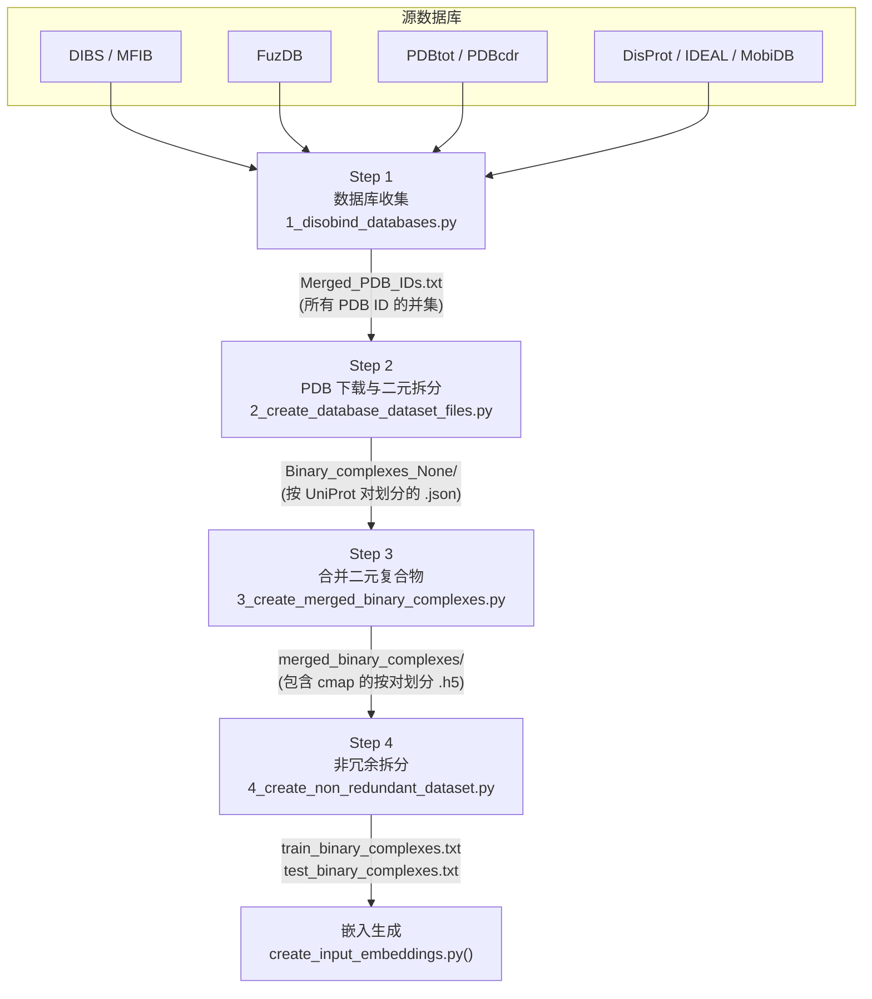
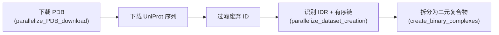
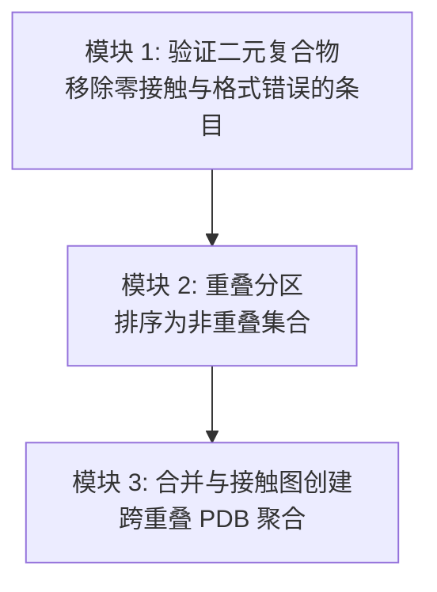
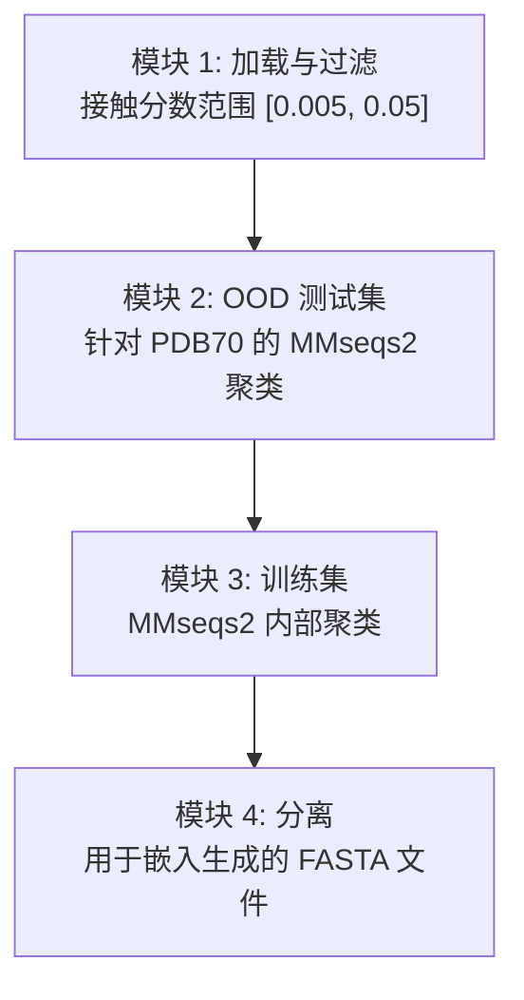

---
slug:15-four-step-dataset-pipeline
blog_type:normal
---


Disobind 数据集并非单次提取——它是一个**四阶段渐进式优化流水线**，将来自八个无序蛋白质数据库的原始条目转换为非冗余的二元复合物数据集，适用于模型训练和分布外（OOD）评估。每个阶段通过基于结构和生物学的过滤器缩小候选空间，产生逐步精炼的产物。流水线脚本位于 `dataset/` 目录中，并使用 `-c` 标志控制并行度顺序执行。

## 流水线架构



该流水线通过两种截然不同的收集范式处理数据——**结构数据库**（DIBS、MFIB、FuzDB、PDBtot、PDBcdr），直接提供无序复合物的 PDB ID；以及**序列数据库**（DisProt、IDEAL、MobiDB），提供 UniProt ID，其关联的 PDB 结构必须通过 PDB REST API 进行解析。这种双源策略在保持结构溯源的同时最大化了覆盖范围。

来源：[1_disobind_databases.py](/dataset/1_disobind_databases.py#L1-L50), [2_create_database_dataset_files.py](/dataset/2_create_database_dataset_files.py#L1-L50), [README.md](/dataset/README.md#L1-L20)

## 步骤 1 — 数据库收集

**脚本**：`1_disobind_databases.py` · **入口类**：`TheIlluminati`（结构数据库），`The3Muskteers`（序列数据库）

步骤 1 从所有八个无序蛋白质数据库中收集 PDB 标识符，并生成统一列表。这两个收集类基于根本不同的数据模型进行操作：

| 方面 | `TheIlluminati`（结构数据库） | `The3Muskteers`（序列数据库） |
|---|---|---|
| **数据库** | DIBS, MFIB, FuzDB, PDBtot, PDBcdr | DisProt, IDEAL, MobiDB |
| **输入格式** | TXT, TSV, XLSX（本地原始文件） | TSV, XML, REST API（远程 + 本地） |
| **主键** | PDB ID 直接可用 | UniProt ID → 通过 REST API 获取 PDB ID |
| **输出** | `Merged_DIBS_MFIB_Fdb_PDBtot-cdr.csv` | `Merged_DisProt_IDEAL_MobiDB.csv` |
| **关键字段** | PDB ID, Auth Asym IDs, UniProt acc, boundaries | UniProt ID, Disorder regions, Annotation |

**结构数据库解析** — `TheIlluminati.convert_txt_to_dict()` 方法解析 DIBS/MFIB 专有的 TXT 格式，其中条目由 `[Entry]` 标记分隔。DIBS 条目使用 `:` 将无序链 ID 与有序伴侣链分隔开，而 MFIB 条目（仅含无序的复合物）缺少此分隔符。FuzDB 从 TSV 格式解析，多 PDB 条目被拆分为单独的行。PDBtot/PDBcdr 从修改后的 XLSX 文件中读取，区分 DOR（无序到有序）和 DDR（无序到无序）结合模式。

**序列数据库解析** — `The3Muskteers` 类解析 DisProt（包含 `start`/`end` 列的 TSV）、IDEAL（通过 `ElementTree` 解析 XML）以及 MobiDB（在 `mobidb.org/api/download` 进行分页 REST API 下载，批大小为 1000，10 核并行度）。对于收集到的每个 UniProt ID，`get_PDBs_for_uniprot_id()` 查询 PDB REST API 以发现相关联的结构。最终合并生成 `Merged_PDB_IDs.txt`——一个包含来自两种范式所有唯一 PDB 标识符的逗号分隔并集。

来源：[1_disobind_databases.py](/dataset/1_disobind_databases.py#L58-L120), [1_disobind_databases.py](/dataset/1_disobind_databases.py#L200-L300), [1_disobind_databases.py](/dataset/1_disobind_databases.py#L400-L500)

## 步骤 2 — PDB 下载与二元复合物创建

**脚本**：`2_create_database_dataset_files.py` · **入口类**：`parse_pdbs_for_idrs`

步骤 2 下载 3D 结构，映射残基位置，识别无序链，并将多链复合物分解为成对的**二元复合物**。这是计算量最大的阶段，涉及网络 I/O、结构解析和无序注释。



### 关键参数与过滤器

| 参数 | 默认值 | 用途 |
|---|---|---|
| `max_len` | 200 | 最大蛋白质序列长度 |
| `min_len` | 20 | 最小蛋白质序列长度 |
| `min_disorder_percent` | 0.2 | 最少 20% 的残基必须是无序的 |
| `max_num_chains` | 0 | 链数过滤器（0 = 无限制） |
| `uni_max_len` | 10000 | 最大 UniProt 序列长度 |
| `fragment_exceeding_maxlen` | True | 允许超过 max_len 的片段 |

### 流水线阶段详解

**PDB 下载与验证** — `parallelize_PDB_download()` 下载每个 PDB/CIF 文件，同时查询 PDB REST API 以获取实体级别的元数据。如果条目是嵌合体、已弃用、仅包含非聚合物实体、缺乏 SIFTS 映射或是单体，则会被过滤掉。替代的 PDB ID 会被解析，以确保使用最新的结构版本。

**UniProt 序列检索** — 下载后，获取所有链的 UniProt 序列。废弃的 UniProt ID 和超过 `uni_max_len` 的序列将被移除，`pdb_info_df` 也会相应地进行过滤。

**无序识别与二元分解** — `parallelize_dataset_creation()` 使用与 DisProt、IDEAL 和 MobiDB 注释交叉引用的 SIFTS 残基级映射，识别每个 PDB 中的无序链与有序链。仅满足 `min_disorder_percent` 阈值的链被保留为 IDR 候选。随后，多链复合物被分解：对于每个无序链，每个有序伴侣链形成一个单独的**二元复合物**。它们按 UniProt ID 对（键为 `{uni_id1}--{uni_id2}`）存储在 `Binary_complexes_None/` 目录中。

来源：[2_create_database_dataset_files.py](/dataset/2_create_database_dataset_files.py#L46-L120), [2_create_database_dataset_files.py](/dataset/2_create_database_dataset_files.py#L200-L399)

## 步骤 3 — 合并二元复合物

**脚本**：`3_create_merged_binary_complexes.py` · **入口类**：`Dataset`

单个 UniProt ID 对可能出现在具有重叠残基覆盖率的多个 PDB 条目中。步骤 3 将这些重叠的二元复合物**合并**为统一的接触图，按 UniProt 对生成单一的整合表示。此阶段执行三个顺序模块：



### 模块 1 — 验证

对于每个 UniProt ID 对，检查所有关联的二元复合物。如果出现以下情况，条目将被拒绝： 接触图包含**零接触**， PDB 坐标与预期的残基计数不匹配（`excess_res_coords`），或 模型中缺少所需的链。多模型 PDB（例如 NMR 系综）会被优雅地处理——个别模型中缺失的链会被跳过，而不会使整个条目无效。

### 模块 2 — 重叠分区

同一 UniProt 对的二元复合物被排序并划分为**非重叠集合**，其中每个集合仅包含相互重叠的复合物（由无序蛋白质上的残基位置重叠决定）。这确保了合并仅组合相同相互作用界面的结构一致性视图。

### 模块 3 — 合并与接触图生成

对于每个非重叠集合，使用阈值为 **8 Å** 的 Cα-Cα 距离创建接触图。`create_contact_map()` 方法计算两条链的 Cα 原子之间的逐对距离，并生成二元接触矩阵。对于多模型 PDB，接触在**所有模型中聚合**（求和，而非逻辑或），从而捕获构象异质性。合并结果存储为 HDF5 文件，包含：`binary_cmap`、`prot1_seq`、`prot2_seq`、`prot1_length`、`prot2_length`、`contacts_count`、`prot1_uni_boundary`、`prot2_uni_boundary` 和 `merged_entries`（源 PDB 的可追溯性）。

| 参数 | 默认值 | 用途 |
|---|---|---|
| `contact_threshold` | 8 Å | 接触的 Cα-Cα 距离阈值 |
| `max_len` | 100 | 最大合并蛋白质长度 |
| `min_len` | 20 | 最小蛋白质长度 |
| `all_models` | True | 使用所有 NMR/模型，而不仅是第一个 |
| `no_hetero` | False | 对每对去重为一个构象体 |

来源：[3_create_merged_binary_complexes.py](/dataset/3_create_merged_binary_complexes.py#L36-L100), [3_create_merged_binary_complexes.py](/dataset/3_create_merged_binary_complexes.py#L200-L350), [utility.py](/dataset/utility.py#L56-L110)

## 步骤 4 — 非冗余数据集拆分

**脚本**：`4_create_non_redundant_dataset.py` · **入口类**：`NonRedundantDataset`

步骤 4 应用**序列级冗余缩减**，将合并的二元复合物划分为训练集和分布外（OOD）测试集。同时在三个层级控制冗余，确保 OOD 集不仅在 Disobind 内部具有结构新颖性，而且相对于 AF2 PDB70 模板数据库也具有结构新颖性。



### 模块 1 — 基于接触的选择

加载合并的二元复合物，并按**接触分数**进行过滤——接触残基对与总可能残基对的比率。仅保留范围在 `[0.005, 0.05]` 内的复合物，移除会降低模型训练质量的极其稀疏（近零接触）和极其密集（近全接触）条目。

### 模块 2 — OOD 测试集创建

使用 **MMseqs2** `easy-cluster` 在三个层级构建 OOD 集，使其非冗余：

1. **内部非冗余** — 在 20% 序列一致性（`ood_ID_cutoff = 0.2`）下对 Disobind 数据集进行内部聚类。单例聚类（无序列邻居）优先，因为它们代表最具结构新颖性的条目。
2. **相对训练集非冗余** — 确保没有任何 OOD 条目与任何训练条目共享显著的序列相似性。
3. **相对 PDB70 非冗余** — 使用 `mmseqs2` 与 AlphaFold2 PDB70 模板集进行比较。具有 PDB70 序列匹配的条目被排除，保证测试集衡量对真正新颖折叠的泛化能力。

`ood_fraction = 0.015` 参数控制将过滤后数据集的多少比例分配给 OOD 集。

### 模块 3 — 训练集创建

如果 `redundancyreduce_train = True`，剩余条目（排除 OOD）在 40% 序列一致性（`train_ID_cutoff = 0.4`）下进行内部聚类。训练集采用较宽松的截断值，在减少冗余的同时保留了更多数据。

### 模块 4 — 输出分离

训练和测试条目被分离，并为每个二元复合物中的每个蛋白质生成 FASTA 文件。这些文件作为嵌入生成步骤（`create_input_embeddings.py`）的输入。

| 参数 | 默认值 | 用途 |
|---|---|---|
| `ood_ID_cutoff` | 0.2 | OOD 聚类的序列一致性截断值 |
| `train_ID_cutoff` | 0.4 | 训练集聚类的序列一致性截断值 |
| `ood_fraction` | 0.015 | 分配给 OOD 测试的数据集比例 |
| `contact_range` | [0.005, 0.05] | 最小/最大接触分数过滤器 |
| `mmseqs_algo` | `easy-cluster` | MMseqs2 算法选择 |
| `mmseqs_cluster_mode` | 1 | 聚类连通性模式 |

来源：[4_create_non_redundant_dataset.py](/dataset/4_create_non_redundant_dataset.py#L30-L130), [4_create_non_redundant_dataset.py](/dataset/4_create_non_redundant_dataset.py#L200-L399)

## 数据流总结

下表追踪了在每个流水线阶段生成的主要产物及其下游消费者：

| 步骤 | 主要输出 | 格式 | 消费者 |
|---|---|---|---|
| 1 | `Merged_PDB_IDs.txt` | 逗号分隔的 PDB ID | 步骤 2 |
| 1 | `Merged_DIBS_MFIB_Fdb_PDBtot-cdr.csv` | 包含 PDB + UniProt 元数据的 CSV | 步骤 1（合并） |
| 1 | `Merged_DisProt_IDEAL_MobiDB.csv` | 包含 UniProt + 无序区的 CSV | 步骤 1（合并） |
| 2 | `Binary_complexes_None/*.json` | 按 UniProt 对划分的二元复合物 | 步骤 3 |
| 2 | `Uniprot_seq.json` | UniProt ID → 序列映射 | 步骤 3, 4 |
| 2 | `Selected_PDBs_info.h5` | 包含 PDB 元数据的 HDF5 | 内部 |
| 3 | `merged_binary_complexes/*.h5` | 合并的接触图 + 序列 | 步骤 4 |
| 3 | `merged_binary_complexes.txt` | 所有合并对的键 | 步骤 4 |
| 4 | `train_binary_complexes.txt` | 训练集键 | 嵌入生成 |
| 4 | `test_binary_complexes.txt` | OOD 测试集键 | 嵌入生成 |

<CgxTip>该流水线是完全**可恢复的**——每个阶段在重新计算之前会检查其输出文件是否存在。日志状态在每个阶段边界被序列化为 JSON（`Logs_*.json`），允许在不重复已完成工作的情况下重新启动。这对于步骤 2 至关重要，由于 PDB/UniProt API 下载，该步骤可能需要数小时。</CgxTip>

<CgxTip>`utility.py` 模块提供了步骤 2–4 共享的结构原语：`load_PDB()` 透明地处理 PDB 和 mmCIF 格式，`get_coordinates()` 提取经过 HETATM 过滤的 Cα 位置，`get_contact_map()` 从坐标数组计算二元接触矩阵。步骤 4 中的 `mmseqs_cluster()` 和 `usalign()` 包装器分别与用于序列和结构聚类的外部工具进行交互。</CgxTip>

来源：[utility.py](/dataset/utility.py#L1-L60), [README.md](/dataset/README.md#L1-L58)

## 执行

每个步骤从 `dataset/` 目录调用，使用 `-c` 标志指定用于并行处理的 CPU 核心数：

```bash
cd dataset
python 1_disobind_databases.py -c 250
python 2_create_database_dataset_files.py -c 250
python 3_create_merged_binary_complexes.py -c 200
python 4_create_non_redundant_dataset.py -c 100
```

核心数在各步骤中递减，因为计算特征发生了变化：步骤 1–2 是 I/O 密集型（API 调用、文件下载），步骤 3 是混合型（结构解析 + 接触计算），步骤 4 是 CPU 密集型（MMseqs2 聚类）。在步骤 4 之后，运行 `create_input_embeddings.py` 为最终确定的训练/测试拆分生成 ProtT5 嵌入。

有关馈入步骤 1 的数据库来源，请参阅 [Disorder Protein Databases](14-disorder-protein-databases)。有关冗余缩减逻辑和 OOD 设计原理，请参阅 [Non-Redundant Dataset Splitting](16-non-redundant-dataset-splitting)。要了解生成的数据集如何馈入模型训练，请参阅 [Model Training Workflow](11-model-training-workflow)。