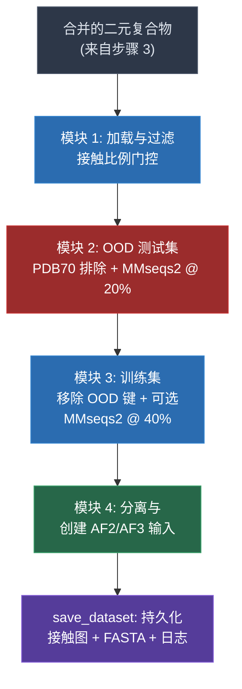

---
slug:16-non-redundant-dataset-splitting
blog_type:normal
---


Disobind 数据集流水线的第四个也是最后一个阶段，将合并后的二元复合物转换为严格非冗余的训练集和分布外（OOD）测试集划分。这一步是整个数据集构建过程的架构基石：它通过 **MMseqs2 聚类**和 **PDB70 结构数据库**排除机制，在划分之间强制执行序列同一性分离，确保 OOD 测试集与训练数据之间产生真正的分布偏移。该流程的调度逻辑封装在单一类 `NonRedundantDataset` 中，其 `forward()` 方法依次执行四个模块，每个模块均设置了检查点，以便在中断时保留中间状态。

来源: [4_create_non_redundant_dataset.py](/dataset/4_create_non_redundant_dataset.py#L1-L29)

## 执行入口与流水线调度

该脚本从 `dataset` 目录下调用，需传入版本标识符和核心数：

```bash
python 4_create_non_redundant_dataset.py -v <version> -c 100
```

`NonRedundantDataset(version, cores)` 构造函数会初始化所有路径引用、聚类阈值和数据容器，随后 `forward()` 按严格顺序执行这四个模块。每个模块都启用了**检查点机制**：如果其输出文件已存在于磁盘上，则跳过该模块并加载预计算的结果。这种设计使得流水线在应对计算密集型的 MMseqs2 聚类阶段时具备容错能力。

来源: [4_create_non_redundant_dataset.py](/dataset/4_create_non_redundant_dataset.py#L1015-L1024), [4_create_non_redundant_dataset.py](/dataset/4_create_non_redundant_dataset.py#L145-L249), [README.md](/dataset/README.md#L19-L22)

## 流水线架构

这四个模块构成了一条线性的数据精炼链，每个阶段逐步对数据集施加约束，以提供更强的非冗余保证：



来源: [4_create_non_redundant_dataset.py](/dataset/4_create_non_redundant_dataset.py#L145-L249)

## 模块 1 — 接触比例过滤与数据加载

模块 1 从[步骤 3](15-four-step-dataset-pipeline) 生成的 HDF5 文件中加载所有合并后的二元复合物，并应用**接触密度门控**。接触比例（接触数量 ÷ 接触图大小）落在 `[0.005, 0.05]` 范围之外的二元复合物将被丢弃。这种双侧过滤会同时移除接近平凡的复合物（过于稀疏，缺乏信息量）和接近稠密的复合物（噪声过大，无法代表特定的结合界面）。对于每个保留下来的复合物，其蛋白质序列、UniProt 边界以及合并时的源 PDB ID 集合将被存储在 `self.entry_dict` 中。过滤前后均会生成接触和蛋白质长度的分布图。

| 参数 | 值 | 用途 |
|---|---|---|
| `contact_range[0]` | 0.005 | 最小接触比例（拒绝稀疏图） |
| `contact_range[1]` | 0.05 | 最大接触比例（拒绝过密图） |
| `entry_dict` | `dict` | 存储每个条目的 `prot1_seq`、`prot2_seq`、`prot1_uni_boundary`、`prot2_uni_boundary`、`merged_pdbs` |

来源: [4_create_non_redundant_dataset.py](/dataset/4_create_non_redundant_dataset.py#L312-L374)

## 模块 2 — 分布外测试集构建

模块 2 是架构上最重要的阶段。它对 OOD 测试集施加了**三个独立的非冗余约束**，从而生成在分布上具有新颖性保证的条目：

### 约束 1：PDB70 结构排除

AlphaFold2 的训练数据库 (PDB70) 代表了潜在信息泄漏的来源——如果测试条目的结构在 AF2 训练期间已被见过，其预测结果可能会异常准确。`get_difference_PDB_set()` 方法会读取 `pdb70_clu.tsv` 聚类文件，提取 PDB70 中存在的所有 PDB ID，并计算 Disobind 数据集中合并的 PDB 与 PDB70 之间的**集合差**。只有那些*整个*合并源 PDB 集都不在 PDB70 中的条目，才有资格进入 OOD 集。

来源: [4_create_non_redundant_dataset.py](/dataset/4_create_non_redundant_dataset.py#L380-L402), [4_create_non_redundant_dataset.py](/dataset/4_create_non_redundant_dataset.py#L536)

### 约束 2：20% 阈值下的 MMseqs2 序列同一性聚类

构建一个包含每个条目中 **prot1 和 prot2 序列**以及所有 PDB70 代表序列（带有 `AF_` 前缀）的 FASTA 文件。每个序列都有一个唯一的头部，编码了条目 ID、UniProt ID 和残基边界（例如 `{entry_id}:{uni_id}-{boundary}`）。随后以 `--min-seq-id 0.2` 和 `--cluster-mode 1`（连通分量聚类，产生最多聚类，从而实现最严格的划分）调用 MMseqs2 的 `easy-cluster`。

从生成的聚类中，通过 `get_singleton_doublet_clusters()` 提取两类结果：

- **单例聚类**：仅包含一个序列且无 PDB70 成员的聚类——这些序列与组合数据集中*所有*其他序列的同一性均 <20%。
- **双例聚类**：仅包含两个序列且无 PDB70 成员的聚类——双例中的两个序列互为近似副本，但与其余所有序列的同一性均 <20%。

| MMseqs2 参数 | 值 | 效果 |
|---|---|---|
| `algo` | `easy-cluster` | 贪心集合覆盖聚类 |
| `ood_ID_cutoff` | 0.2 | 20% 最小序列同一性阈值 |
| `cluster_mode` | 1 | 连通分量（最严格划分） |

来源: [4_create_non_redundant_dataset.py](/dataset/4_create_non_redundant_dataset.py#L548-L593), [utility.py](/dataset/utility.py#L1325-L1351)

### 约束 3：成对条目验证

一个条目（UniProt ID 对）只有在**两个**蛋白质序列同时满足聚类约束时，才具备进入 OOD 集的资格。具体而言，`get_seq_nr_ood_pairs()` 要求：

- **chk1**：该条目的所有合并 PDB ID 均属于 PDB70 差集（结构排除）。
- **chk2**：prot1 和 prot2 的头部均出现在单例聚类中，或者它们共同构成一个双例对（序列排除）。

这种成对要求至关重要——它防止了复合物中一个蛋白质具有新颖性而其结合伴侣却冗余的情况，这种情况会导致测试性能虚高。此验证过程通过 `multiprocessing.Pool` 在所有条目上进行了并行化处理。

### OOD 子集采样

过滤后，将对符合条件条目的子集进行采样，作为最终测试集。如果序列非冗余对的数量超过 `ood_fraction × total_entries`（默认值：0.015 = 1.5%），则进行无放回的随机采样。否则，将使用所有符合条件的条目。

| 参数 | 值 | 用途 |
|---|---|---|
| `ood_fraction` | 0.015 | 测试集占总条目的目标比例 |
| `ood_keys` | `list` | 最终的 OOD 测试条目键 |

来源: [4_create_non_redundant_dataset.py](/dataset/4_create_non_redundant_dataset.py#L506-L639)

## 模块 3 — 非冗余训练集构建

模块 3 通过首先移除所有 OOD 测试条目，然后可选地应用额外的冗余缩减，来生成训练划分：

### 默认模式（无训练集冗余缩减）

当 `redundancyreduce_train = False`（默认值）时，**所有不在 OOD 集中的条目**均被保留用于训练。这最大化了训练数据量，同时依赖严格的 OOD 构建来保证测试集的新颖性。

### 可选模式（40% 阈值下的训练集冗余缩减）

当 `redundancyreduce_train = True` 时，将对非 OOD 序列以 `--min-seq-id 0.4` 执行单独的 MMseqs2 聚类。随后，`get_seq_nr_train_pairs()` 方法将选择满足以下条件的条目：

- prot1 和 prot2 的头部**均为聚类代表**（由 MMseqs2 选择的规范成员），或者
- prot1 和 prot2 属于**同一聚类**（它们在该配对内互为近似副本）。

基于代表序列的选择确保了每个聚类只有一个规范条目，而同聚类规则则保留了两个蛋白质本质上相似的配对（例如，同源二聚体相互作用）。

| 参数 | 值 | 用途 |
|---|---|---|
| `redundancyreduce_train` | `False` | 训6练集冗余缩减的开关 |
|<br>`train_ID_cutoff` | 0.4 | 训6%练集聚类的-类聚的同一性阈值 |

来源: [4_create_non_redundant_dataset.py](/dataset/4_create_non_redundant_dataset.py#L646-L753)

## 模块 4 — 分离与 AF2/AF3 输入生成

模块 4 从 HDF5 加载二元接触图，将条目划分为 `self.train_dict` 和 `self.test_dict`，并为下游结构预测创建输入文件：

- **AlphaFold2 输入**：每个测试条目对应一个 FASTA 文件，包含带有 UniProt 边界头部的两个蛋白质序列。路径汇总在 `AF2_input.txt` 中以进行批处理。
- **AlphaFold3 输入**：每批 20 个条目的 JSON 数据，按照 AF3 服务器规范格式化（`modelSeeds`、`proteinChain` 序列）。

来源: [4_create_non_redundant_dataset.py](/dataset/4_create_non_redundant_dataset.py#L860-L9084_create_non_redundant_dataset.py#L760+L858)

## 持久化与输出产物

`save_dataset()` 方法以一致的格式写入最终的训练集和测试集：

| (出文件 | 格式 | 内容 |
|---|---|---|
| `Target_bcmap_{split}_{version}.h5` | HDF5 | 以条目头部为键的二元!-二元接触图 |
| `prot_1-2_{split}_{version}.csv` | CSV | 条目头部（UniProt ID + 边界编码） |
| `test_binary_complexes.txt` | Text | *逗号*逗号分隔的 OOD 测试条目键 |
| `train_binary_complexes.txt` | Text | 逗号*逗号分隔的训练*条目键 |
| `Logs_OOD_{version}.json` | JSON | 已设检查点的*计-时和计数指标 |
| `Logs_OOD{version}.txt` | Text | 带*设设置、*计'计时和计数*的人*的可读日志 |

FASTA 头部格式8格式为 `{UniID1}:{start1}:{end1}--{UniID2}:{start2}:{end2}_{copy_num}`，同时编码了 UniProt 登录号和残基边界。该头部格式将在下游的嵌入生成步骤（[使用 ProtT5 生成嵌入F-生成嵌入](8-embedding-generation-with-prott5)）中被使用。

来源: [4_create_non_redundant_dataset.py](/dataset/4_create_non_redundant_dataset.py#L908-L1011)

## 非冗余保证 — 总结7总结

下表概-总结了在这两个划分中执行的所有非冗余保证：

| 保证 | 机制 | 阈值 | 范围 |
|---|>9|?|---|
| OOD vs. PDB70 (结构) | PDB ID 上的集差 | 二?二元（入/出） | 每个条目的所有-合并 PDB |
| OOD vs. 完整数据集 (序列) | MMseqs2 单例/双例聚类 | < 20% 同一性 | prot1 和 prot2 双方 |
| OOD vs. PDB70 (序列) | 同一 MMseqs2 运行中的 PDB70 序列 | < 20% 同一性 | 通过 AF_ 前缀过滤隐式保证 |
| OOD vs. 训练集 (结构) | PDB70 差集 | 二元（入/出） | 训练集使用与 PDB70 重叠的 PDB |
| OOD vs. 训练集 (序列) | 在构建训练集之前移除 OOD 条目BD 条目 |> 严格排除 | 条目级划分 |
| 训练集自冗余 (可选) | MMseqs2 代表选择 | < 40% 同一性 | prot1 和 prot-2 双方 |

<Cgx(1CgxTip>OOD 集的三约束设计（结构排除 + 针对完整数据集和$与 PDB70 的序列聚类）是使 Disobind 的评估真正成为分-布外评估的关键。OOD 的 20% 同一1?同一/同一?同一性阈值B一性截断值与训练集的 40% 反映了-一种-F5刻意的不对称设计：测试集必须严格分离以检测泛化失败，而训练集可以容忍适度的冗余以保留数据量。</CgxTip>

<CgxTip>`forward()` 中的检查点策略——在执行每个模块之前检查输出文件是否存在——对于实际应用至关重要。在整个数据集加上-与 PDB70 上运行 MMseq2 聚类可能需要数小/:时，而 `get_seq_nr_ood_pairs()` 中的多进程处理是内存密集E-内存密集型的。预计算的中间文件允许从任何阶段恢复而@!而无需重新@重新计算。</CgxTip>

来源: [4_create_non_redundant_dataset.py](/dataset/4_create_non_redundant_dataset.py#L31-L143), [utility.py](/dataset/utility.py#L1325-L1368)

## 与相邻流水线步骤的关系

本阶段消$)消耗了由[四步数据集流水E-流水线](15-four-step-dataset-pipeline)步骤 3 生成的(7合并二元复合物，并生成最终的数据集文件，这些文件随后将供嵌入生成步骤使用。位于 `database/input_files/` 中的 PDB70 聚类文件 (`pdb70_clu.tsv`) 和代表 FASTAB'FASTA 文件 (`pdb70_rep_fasta_file.txt`) 是定义结构非冗余边界的至关重要5'至关重要的外部依赖。完整的数据集构建工作流请参阅[四步数据集流水B;流水线](15-four-step-dataset-pipeline)；关于生成的划分如何被嵌入，请参阅[使用 ProtT5 生成嵌入7 7 7 7生成嵌入](8-embedding-generation-with-prott5)。