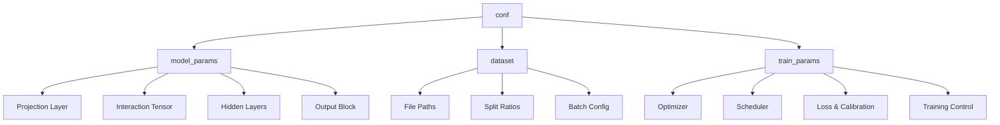
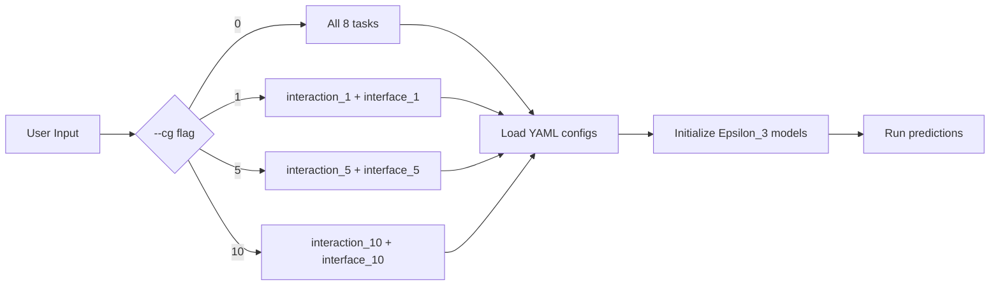

---
slug:17-yaml-config-parameters
blog_type:normal
---


每个 Disobind 模型变体均由单个 YAML 配置文件控制，该文件编码了模型架构、数据集路由及训练超参数的完整规范。这些文件位于 [`params/`](params) 目录中，在训练时由 [`hparams_search.py`](src/hparams_search.py#L48-L49) 通过 OmegaConf 调用，在推理时由 [`params.py`](analysis/params.py#L6-L11) 调用，后者将每个预测任务映射到其对应的已训练模型检查点。理解配置模式（schema）对于复现已发表结果、运行消融实验或创建新模型变体至关重要。

来源: [hparams_search.py](src/hparams_search.py#L48-L49), [params.py](analysis/params.py#L6-L11)

## 配置文件命名约定

文件遵循 `Model_config_<Model>_<Version>.yml` 的命名模式，其中 **Model** 为架构名称（`Epsilon_3`），**Version** 编码了任务族和粗粒度分辨率。已发表的六个配置分为两个任务族：

| 版本 | 任务族 | CG 核大小 | 预测任务 | 配置文件 |
|---------|-------------|----------------|-----------------|-------------|
| 6 | Interaction (bin) | 10 | CG-10 下的接触图 | `Model_config_Epsilon_3_6.yml` |
| 6.1 | Interaction (bin) | 5 | CG-5 下的接触图 | `Model_config_Epsilon_3_6.1.yml` |
| 6.2 | Interaction (res) | 1 | 残基水平的接触图 | `Model_config_Epsilon_3_6.2.yml` |
| 16 | Interface (res) | 1 | 残基水平的界面残基 | `Model_config_Epsilon_3_16.yml` |
| 16.1 | Interface (bin) | 5 | CG-5 下的界面残基 | `Model_config_Epsilon_3_16.1.yml` |
| 16.2 | Interface (bin) | 10 | CG-10 下的界面残基 | `Model_config_Epsilon_3_16.2.yml` |

版本编号约定为：**整数部分**区分任务族（6 = interaction，16 = interface），**小数部分**区分该族内的 CG 分辨率（0 = CG-1 残基水平，1 = CG-5，2 = CG-10）。

来源: [params.py](analysis/params.py#L14-L59), [Model_config_Epsilon_3_6.yml](params/Model_config_Epsilon_3_6.yml#L1-L6)

## 顶层元数据

每个配置以五个元数据字段开头，用于标识模型变体并控制可复现性：

| 参数 | 类型 | 描述 | 示例 |
|-----------|------|-------------|---------|
| `Version` | string | 模型版本标识符 | `'6.1'` |
| `Embedding` | string | 用于生成嵌入的蛋白质语言模型 | `'T5'` |
| `Emb_type` | string | 嵌入范围 — `'global'`（全序列）或 `'local'`（逐残基） | `'global'` |
| `Model` | string | 神经网络架构类 | `'Epsilon_3'` |
| `System` | string | 生成配置的主机名（用于记录存档） | `b'ev'` |
| `Global_seed` | int | 用于 NumPy、PyTorch 和 Python 跨可复现性的随机种子 | `1` |

`Embedding` 字段决定了输入维度（`emb_size`）：T5 和 BERT 生成 1024 维嵌入，ESM2-650M 生成 1280 维嵌入，ProSE 生成 6165 维嵌入。

来源: [Model_config_Epsilon_3_6.yml](params/Model_config_Epsilon_3_6.yml#L1-L6), [model_versions.py](src/model_versions.py#L21-L24), [build_model.py](src/build_model.py#L129-L136)

## `conf` 块结构

所有操作参数均位于 `conf` 键下，组织为三个与训练流水线阶段相对应的子块：



来源: [Model_config_Epsilon_3_6.yml](params/Model_config_Epsilon_3_6.yml#L7-L8), [hparams_search.py](src/hparams_search.py#L199-L200)

## 模型参数 (`conf.model_params`)

此块定义了 Epsilon_3 架构。每个字段都通过 [`get_model`](src/models/get_model.py#L4-L26) 直接传递给 [`Epsilon_3.__init__`](src/models/Epsilon_3.py#L15-L20) 构造函数。

### 核心架构

| 参数 | 类型 | 描述 | 支持的值 |
|-----------|------|-------------|------------------|
| `Model` | string | 架构类名称 | `'Epsilon_3'` |
| `emb_size` | int | 来自蛋白质 LM 的输入嵌入维度 | `1024` (T5), `1280` (ESM2) |
| `output_dim` | int | 每个位置的输出值数量 | `1`（二元预测） |
| `max_seq_len` | int | 最大序列长度（填充/截断） | `100` |
| `device` | string | 计算设备 | `'cuda'`, `'cpu'` |

### 投影层

`projection_layer` 列表控制原始嵌入在交互计算前如何投影：

| 索引 | 名称 | 描述 | 示例 |
|-------|------|-------------|---------|
| 0 | `projection_dim` | 投影的输出维度 | `128` 或 `256` |
| 1 | `layer_type` | 归一化放置策略 | `'ln2'`（激活后 LayerNorm） |
| 2 | `bias` | 线性层是否包含偏置 | `true` |
| 3 | `multiplier` | 自动调整投影大小的缩放因子 | `1` |
| 4 | `separate_proj` | 对 prot1/prot2 使用独立投影 | `''`（共享）或 `'separate'` |

`layer_type` 决定了投影块的组合方式，在 [`create_projection_layers`](src/models/get_layers.py#L17-L84) 中实现：

| `layer_type` | 架构 |
|--------------|-------------|
| `vanilla` | Linear → Activation |
| `ln1` | LayerNorm → Linear → Activation |
| `ln2` | Linear → Activation → LayerNorm |
| `in1` | InstanceNorm1d → Linear → Activation |
| `in2` | Linear → Activation → InstanceNorm1d |
| `bn1` | BatchNorm1d → Linear → Activation |
| `bn2` | Linear → Activation → BatchNorm1d |

<CgxTip>交互模型族（v6.x）在残基水平 CG-1 下使用 projection_dim=256，而在分箱 CG-5/CG-10 下使用 128。界面模型族（v16.x）在所有分辨率下统一使用 projection_dim=128。</CgxTip>

来源: [Epsilon_3.py](src/models/Epsilon_3.py#L22-L23), [get_layers.py](src/models/get_layers.py#L17-L84), [Model_config_Epsilon_3_6.2.yml](params/Model_config_Epsilon_3_6.2.yml#L11-L16)

### 交互张量构建 (`input_layer`)

`input_layer` 列表控制如何将来自两个蛋白质的投影嵌入组合成交互张量：

| 索引 | 名称 | 描述 | 示例 |
|-------|------|-------------|---------|
| 0 | `aggregate_ops` | 由 `-` 连接的两个聚合算子 | `'op-od'` |
| 1 | `concat_mode` | 如何组合两个聚合结果 | `'vanilla'` 或 `'concat'` |
| 2 | `interface_reduce` | 界面任务的降维方式 | `''`, `'avg2d'`, `'avg1d'`, `'lin'` |

`aggregate_ops` 字符串从以下集合中指定两个操作（在 [`capture_interaction`](src/models/Epsilon_3.py#L228-L263) 中实现）：

| 算子 | 公式 | 张量形状 |
|----------|---------|-------------|
| `op` (外积) | z1.unsqueeze(2) × z2.unsqueeze(1) | [N, H, W, C] |
| `od` (外差) | \|z1.unsqueeze(2) − z2.unsqueeze(1)\| | [N, H, W, C] |
| `os` (外和) | z1.unsqueeze(2) + z2.unsqueeze(1) | [N, H, W, C] |
| `add` | z1 + z2 | [N, L, C] |
| `substract` | z1 − z2 | [N, L, C] |
| `multiply` | z1 × z2 | [N, L, C] |
| `dot` | Σ(z1 × z2) | [N, 1] |
| `cosine` | cosine_similarity(z1, z2) | [N, 1] |

默认的 `'op-od'` 沿特征维度拼接外积和外差，生成形状为 [N, H, W, 2C] 的交互张量。`interface_reduce` 字段仅用于界面预测任务：`'avg2d'` 在交互张量上执行带掩码的二维平均，以生成每个蛋白质的界面分数，而 `'lin'` 应用可学习的线性降维。

来源: [Epsilon_3.py](src/models/Epsilon_3.py#L228-L296), [Epsilon_3.py](src/models/Epsilon_3.py#L205-L225), [Model_config_Epsilon_3_6.yml](params/Model_config_Epsilon_3_6.yml#L18-L22)

### 隐藏层 (`num_hid_layers`)

此 6 元素列表配置交互张量和输出之间的上/下采样块：

| 索引 | 名称 | 描述 | 默认值 | 默认值 |
|-------|------|-------------|----------------------|---------------------|
| 0 | `num_upsample_layers` | 扩展特征维度的层数 | `0` | `0` |
| 1 | `num_downsample_layers` | 压缩特征维度的层数 | `3` | `0` |
| 2 | `num_blocks` | 残差块数量（若为残差） | `0` | `0` |
| 3 | `scale_factor` | 每个上/下层的特征缩放比例 | `2` | `0` |
| 4 | `block_type` | `'vanilla'` 或 `'residual'` | `'vanilla'` | `'vanilla'` |
| 5 | `residual_connection` | `'addnorm'`、`'addactivnorm'` 或 `''` | `''` | `''` |

交互族（v6.x）使用 3 个下采样层且 scale_factor=2，将拼接的 2×128=256 特征通过 256→128→64→32 进行压缩。界面族（v16.x）完全不使用隐藏层——交互张量直接馈入输出线性层。

来源: [Epsilon_3.py](src/models/Epsilon_3.py#L26-L30), [Epsilon_3.py](src/models/Epsilon_3.py#L49-L54), [Model_config_Epsilon_3_6.yml](params/Model_config_Epsilon_3_6.yml#L24-L30)

### 正则化与归一化

| 参数 | 类型 | 描述 | 示例 |
|-----------|------|-------------|---------|
| `bias` | bool | 线性层中的偏置 | `true` |
| `dropouts` | list[float×5] | `[proj_dropout, hidden_dropout, us_dropout, ds_dropout, mc_dropout]` | `[0.2, 0, 0, 0, 0]` |
| `norm` | list | `[apply_norm, norm_type]`，其中 type ∈ {`LN`, `BN`, `IN`} | `[true, 'LN']` |
| `temperature` | float\|null | 温度缩放值（null = 禁用） | `null` |
| `num_samples` | int | Monte Carlo dropout 样本数（0 = 禁用） | `0` |

在已发表的配置中，只有投影 dropout（索引 0）不为零。MC dropout 和温度缩放虽可用，但在发布的模型中未使用。

来源: [Epsilon_3.py](src/models/Epsilon_3.py#L34-L38), [Model_config_Epsilon_3_6.yml](params/Model_config_Epsilon_3_6.yml#L32-L41)

### 激活与输出

| 参数 | 类型 | 描述 | 示例 |
|-----------|------|-------------|---------|
| `activation1` | list | 隐藏激活的 `[name, param]` | `['elu', null]` |
| `activation2` | list | 输出激活的 `[name, apply]` | `['sigmoid', true]` |
| `output_layer` | string | 输出层变体 | `'vanilla'` |

`activation1` 应用于投影、上采样和下采样层。`activation2` 控制最终的输出变换——当 `apply=true` 时，应用 sigmoid 生成 [0,1] 范围内的概率。支持的激活函数包括：`elu`、`relu`、`leakyrelu`、`gelu`、`celu`、`prelu`、`silu`、`mish`、`sigmoid`、`tanh`、`softmax` 和 `logistic_activation`。

来源: [get_activation.py](src/models/get_activation.py#L27-L76), [Epsilon_3.py](src/models/Epsilon_3.py#L39-L43)

### 目标规范

`objective` 列表定义了预测任务和粗粒化策略。它包含 6 个元素：

| 索引 | 名称 | 描述 | 值 |
|-------|------|-------------|--------|
| 0 | `task` | 预测目标 | `'interaction'`、`'interface'`、`'interaction_bin'`、`'interface_bin'` |
| 1 | `bin_size` | 粗粒化核大小 | `1`（残基）、`5` 或 `10` |
| 2 | `pool_type` | CG 分箱的池化方式 | `'avg'` 或 `''` |
| 3 | `bin_post_proj` | 投影后对箱嵌入进行处理 | `false`（已弃用） |
| 4 | `bin_input` | 对输入应用分箱 | 对 `_bin` 任务为 `true`，否则为 `false` |
| 5 | `single_output` | 单输出模式 | `false`（已弃用） |

`_bin` 后缀表示粗粒化预测。`bin_size` 为 1 且无 `_bin` 后缀表示残基水平预测。此字段同时出现在 `model_params` 和 `train_params` 中，且必须保持一致。

来源: [model_versions.py](src/model_versions.py#L24-L41), [build_model.py](src/build_model.py#L140-L144), [utils.py](src/utils.py)

## 数据集参数 (`conf.dataset`)

| 参数 | 类型 | 描述 | 示例 |
|-----------|------|-------------|---------|
| `train_set_size` | float | 用于训练的数据比例 | `0.9` |
| `dev_set_size` | float | 用于验证的数据比例 | `0.05` |
| `test_set_size` | float | 用于测试的数据比例 | `0.05` |
| `model_type` | string | 模型变体标签 | `'vanilla'` |
| `input_files` | string | 包含数据集 `.npy` 文件的目录路径 | `'../database/v_19/T5/global-None/'` |
| `train_file` | string | 训练集文件名 | `'Train_set_global_v_19.npy'` |
| `dev_file` | string | 验证集文件名 | `'Dev_set_global_v_19.npy'` |
| `test_file` | string | 测试集文件名 | `'Test_set_global_v_19.npy'` |
| `output_path` | string | 保存模型检查点的目录 | `'../models/Epsilon_3_Train/'` |
| `batch_size` | int | 小批量大小 | `64` |
| `batch_shuffle` | list[bool×3] | [train, dev, test] 加载器的混洗设置 | `[true, false, false]` |

数据集被预先划分为 train/dev/test `.npy` 文件。`input_files` 路径编码了数据集版本、嵌入类型和范围。默认情况下，仅对训练加载器进行混洗。

来源: [Model_config_Epsilon_3_16.yml](params/Model_config_Epsilon_3_16.yml#L57-L71), [hparams_search.py](src/hparams_search.py#L81-L86)

## 训练参数 (`conf.train_params`)

### 目标与损失

| 参数 | 类型 | 描述 | 示例 |
|-----------|------|-------------|---------|
| `objective` | list | 与 `model_params` 中相同的 6 元素目标规范 | `['interface_bin', 10, 'avg', false, true, false]` |
| `emb` | string | 嵌入类型（必须与顶层 `Embedding` 匹配） | `'T5'` |
| `loss` | string | 损失函数名称 | `'se_loss'` |
| `log_weight` | list | 奇异增强损失的损失加权参数 `[alpha, beta]` | `[[0.9, 3]]` 或 `[0.9, 3]` |
| `mask` | list[bool×2] | `[apply_padding_mask_to_input, apply_padding_mask_to_target]` | `[false, true]` |
| `confidence` | bool | 是否训练置信度头 | `false` |
| `invert` | list | 标签反转标志 | `[0]` |

默认损失 `se_loss`（奇异性增强损失，Singularity Enhanced Loss）实现了一种加权的 BCE 变体：`−α·t·log(p) − (1−α)·(1−t)·log(1−p)·(1+p)^β`，其中 α 和 β 来自 `log_weight`。其他可用的损失包括 `bce`、`bce_with_logits`、`focal_loss` 和 `representation_loss`。

来源: [loss.py](src/loss.py#L162-L184), [build_model.py](src/build_model.py#L37-L39), [Model_config_Epsilon_3_6.yml](params/Model_config_Epsilon_3_6.yml#L73-L96)

### 优化器配置

| 参数 | 类型 | 描述 | 示例 |
|-----------|------|-------------|---------|
| `optimizer` | string | 优化器类 | `'AdamW'` |
| `amsgrad` | bool | 使用 AMSGrad 变体 | `true` |
| `weight_decay` | list[float] | L2 正则化强度 | `[0.05]` |
| `learning_rate` | list[float] | 初始学习率 | `[0.0002]` |
| `max_norm` | float\|null | 梯度裁剪范数（null = 禁用） | `null` |

支持的优化器：`Adam`、`AdamW`、`SGD`。`learning_rate` 和 `weight_decay` 被包装在列表中，以支持在超参数调优期间对多个值进行网格搜索。

来源: [build_model.py](src/build_model.py#L50-L58), [Model_config_Epsilon_3_6.yml](params/Model_config_Epsilon_3_6.yml#L98-L102)

### 学习率调度器

`scheduler` 子字典控制学习率衰减策略：

| 参数 | 类型 | 描述 | 示例 |
|-----------|------|-------------|---------|
| `apply` | bool | 是否使用调度器 | `true` |
| `name` | string | 调度器类型 | `'exp'` |
| `gamma` | list[float] | 乘法衰减因子（用于 exp/multistep） | `[0.97]` |
| `milestone` | list | 轮次里程碑（用于 multistep） | `[null]` |
| `start_factor` | float\|null | 起始乘数（用于 linear） | `null` |
| `end_factor` | float\|null | 终止乘数（用于 linear） | `null` |
| `total_iters` | int\|null | 总迭代次数（用于 linear） | `null` |
| `swa_start` | int\|null | SWA 开始轮次 | `null` |
| `swa_lr` | float\|null | SWA 学习率 | `null` |
| `base_lr` | float\|null | 基础学习率（用于 cycliclr） | `null` |
| `step_size_up` | int\|null | 上升步长（用于 cycliclr） | `null` |
| `step_size_down` | int\|null | 下降步长（用于 cycliclr） | `null` |

支持的调度器：`'exp'`（ExponentialLR）、`'multistep'`（MultiStepLR）、`'linear'`（LinearLR）、`'cycliclr'`（CyclicLR）、`'swa'`（随机权重平均）。所有发布的模型均使用指数衰减，但 gamma 值随 CG 分辨率的不同而有显著差异：

| 模型版本 | 调度器 Gamma | 30 轮后的有效衰减 |
|---------------|----------------|-------------------------------|
| v6 (CG-10) | 0.97 | ~0.40 |
| v6.1 (CG-5) | 0.97 | ~0.40 |
| v6.2 (CG-1) | 0.98 | ~0.55 |
| v16 (CG-1) | 0.98 | ~0.55 |
| v16.1 (CG-5) | 0.91 | ~0.06 |
| v16.2 (CG-10) | 0.87 | ~0.01 |

来源: [build_model.py](src/build_model.py#L61-L100), [Model_config_Epsilon_3_6.yml](params/Model_config_Epsilon_3_6.yml#L105-L119)

### 校准与训练控制

| 参数 | 类型 | 描述 | 示例 |
|-----------|------|-------------|---------|
| `apply_calibration` | string | 事后校准方法 | `'beta-abm'` 或 `'None'` |
| `calibration` | string | 校准方法（v16 族） | `'None'` |
| `max_epochs` | int | 最大训练轮数 | `30` 或 `20` |
| `contact_threshold` | list[float] | 接触分类的决策阈值 | `[0.5]` |
| `num_metrics` | list | `[num_metrics, averaging_mode]` | `[7, 'global']` |
| `Nruns` | int | 独立训练运行次数 | `1` |
| `save_model` | bool | 是否保存检查点 | `true` |
| `model_path` | string | 检查点文件名前缀 | `'model_global'` |
| `optuna_trials` | int | Optuna 试验计数（已弃用） | `0` |

校准选项包括 `'beta-abm'`（带 AMSGrad 的 Beta 校准）、`'platt'`（Platt 缩放）、`'temp'`（温度缩放）和 `'None'`。交互族（v6.x）应用 `beta-abm` 校准，而界面族（v16.x）使用 `None`。v6 族训练 30 轮，而 v16 族训练 20 轮。

来源: [Model_config_Epsilon_3_6.yml](params/Model_config_Epsilon_3_6.yml#L83-L125), [Model_config_Epsilon_3_16.yml](params/Model_config_Epsilon_3_16.yml#L71-L120)

## 跨配置对比：交互族 vs. 界面族

下表突出了两个模型族之间关键的架构差异：

| 方面 | 交互族 (v6.x) | 界面族 (v16.x) |
|--------|--------------------------|--------------------------|
| **目标** | `interaction` / `interaction_bin` | `interface` / `interface_bin` |
| **隐藏层** | 3 个下采样层 (256→32) | 无隐藏层 |
| **input_layer[2]** (interface_reduce) | `''`（未使用） | `'avg2d'`（带掩码的二维平均） |
| **投影维度** | 128 (CG-5/10) 或 256 (CG-1) | 128（所有分辨率） |
| **校准** | `beta-abm` | `None` |
| **最大轮数** | 30 | 20 |
| **log_weight 格式** | 嵌套列表 `[[-0.9, 3]]` | 平坦列表 `[0.9, 3]` |

<CgxTip>交互族需要更深的隐藏处理（3 个下采样层），因为它必须输出完整的接触图 [L1×L2]，而界面族仅预测逐残基的界面标签 [L1+L2] —— 这是一项更简单的任务，不需要隐藏压缩。</CgxTip>

来源: [Model_config_Epsilon_3_6.yml](params/Model_config_Epsilon_3_6.yml#L18-L57), [Model_config_Epsilon_3_16.yml](params/Model_config_Epsilon_3_16.yml#L18-L56), [Epsilon_3.py](src/models/Epsilon_3.py#L131-L151)

## 推理时配置如何被调用

在预测时，[`run_disobind.py`](run_disobind.py#L82) 调用 [`parameter_files(19)`](analysis/params.py#L6-L11)，后者返回一个嵌套字典，将每个任务映射到其已训练的模型检查点路径。[`get_required_tasks`](run_disobind.py#L130-L165) 中的调度逻辑根据用户的 `--cg` 标志决定要运行的任务，然后加载相应的 YAML 配置和模型权重：



每个任务映射到特定的版本：interaction CG-1 → v6.2、interaction CG-5 → v6.1、interaction CG-10 → v6、interface CG-1 → v16、interface CG-5 → v16.1、interface CG-10 → v16.2。

来源: [params.py](analysis/params.py#L14-L59), [run_disobind.py](run_disobind.py#L130-L165)

## 创建自定义配置

可以使用 [`model_versions.py`](src/model_versions.py#L1-L154) 以编程方式生成新的配置文件，该脚本构建完整的 YAML 结构并通过 `OmegaConf.save` 保存。要创建新变体，请修改脚本顶部的变量：

```python
# Core selections
model = "Epsilon_3"
emb = "T5"               # ["T5", "ProstT5", "ProSE", "BERT"]
emb_type = "global"      # ["global", "local"]
objective = ["interface_bin", 10, "avg", False, True, False]
```

或者，复制现有的 YAML 文件并直接修改相关字段。[`model_versions.py`](src/model_versions.py#L54-L88) 脚本包含记录每个参数有效选项的内联注释，并作为模式（schema）的权威参考。

来源: [model_versions.py](src/model_versions.py#L1-L154)

---

**下一步**：有关版本标识符如何映射到已训练模型检查点的详细信息，请参阅 [模型版本注册表](18-model-version-registry)。有关使用这些配置的训练循环，请参阅 [模型训练工作流](11-model-training-workflow)。有关 `loss` 参数引用的损失函数，请参阅 [损失函数与校准](12-loss-functions-and-calibration)。