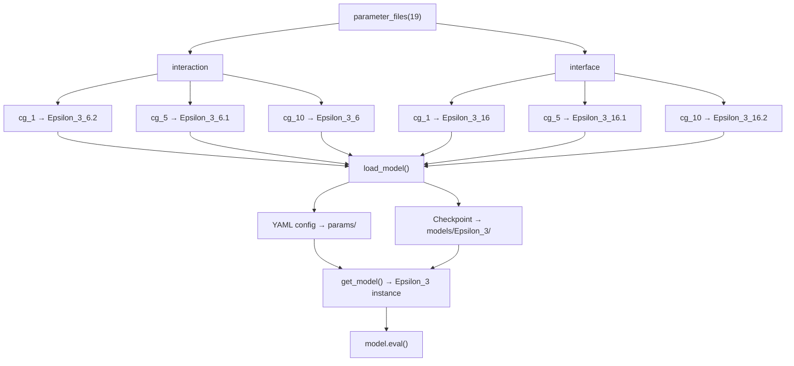
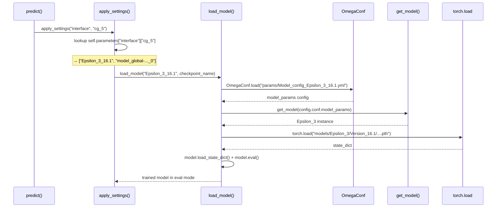

---
slug:18-model-version-registry
blog_type:normal
---

模型版本注册表是核心路由机制，它将每个 Disobind 预测任务（interaction 与 interface）在每个粗粒度分辨率（CG=1, 5, 10）下，映射到特定的已训练模型版本、其 YAML 配置及其序列化检查点。Disobind 并非采用单一的单体模型，而是部署了**六个专用的 Epsilon_3 变体**——每个变体均针对特定的“目标-分辨率”组合进行了独立优化——而注册表则是推理管道查询以解析加载哪个变体的权威索引。

## 注册表架构

该注册表在 `analysis/params.py` 中作为一个纯 Python 字典工厂实现。入口点 `parameter_files(model_version)` 构建了一个两级嵌套字典，首先按**任务**（`interaction`、`interface`）索引，其次按 **CG 级别**（`cg_1`、`cg_5`、`cg_10`）索引。每个叶节点值是一个包含两个元素的列表：`[model_version_tag, checkpoint_filename]`。在推理时，`Disobind.apply_settings()` 从该字典中读取，以选择正确的模型变体和检查点路径。

`model_version` 参数当前仅接受 `19`，它对应于用于训练所有生产检查点的数据集版本 `v_19`。提供任何其他值将引发 `ValueError`。

来源：[params.py](analysis/params.py#L1-L60), [run_disobind.py](run_disobind.py#L534-L564)

## 版本目录

六个生产模型被组织为两个**版本系列**——用于 interaction（接触图）预测的**版本 6 系列**和用于 interface 预测的**版本 16 系列**。在每个系列中，次版本后缀（`.1`、`.2`）编码了粗粒化分辨率，而无后缀的基础版本同样是专用的。下表提供了完整的注册表映射：

| 注册表键 | 模型版本 | 目标 | CG 大小 | 投影维度 | 隐藏层 | 学习率 | LR γ (exp) |
|---|---|---|---|---|---|---|---|
| `interaction.cg_1` | `Epsilon_3_6.2` | `interaction` | 1 | 256 | [0,3,0,2] | 4e-4 | 0.98 |
| `interaction.cg_5` | `Epsilon_3_6.1` | `interaction_bin` | 5 | 128 | [0,3,0,2] | 2e-4 | 0.97 |
| `interaction.cg_10` | `Epsilon_3_6` | `interaction_bin` | 10 | 128 | [0,3,0,2] | 1e-4 | 0.97 |
| `interface.cg_1` | `Epsilon_3_16` | `interface` | 1 | 128 | [0,0,0,0] | 2e-4 | 0.98 |
| `interface.cg_5` | `Epsilon_3_16.1` | `interface_bin` | 5 | 128 | [0,0,0,0] | 2e-4 | 0.91 |
| `interface.cg_10` | `Epsilon_3_16.2` | `interface_bin` | 10 | 128 | [0,0,0,0] | 2e-4 | 0.87 |

来源：[params.py](analysis/params.py#L14-L59), [Model_config_Epsilon_3_6.yml](params/Model_config_Epsilon_3_6.yml#L1-L126), [Model_config_Epsilon_3_6.1.yml](params/Model_config_Epsilon_3_6.1.yml#L1-L126), [Model_config_Epsilon_3_6.2.yml](params/Model_config_Epsilon_3_6.2.yml#L1-L126), [Model_config_Epsilon_3_16.yml](params/Model_config_Epsilon_3_16.yml#L1-L121), [Model_config_Epsilon_3_16.1.yml](params/Model_config_Epsilon_3_16.1.yml#L1-L121), [Model_config_Epsilon_3_16.2.yml](params/Model_config_Epsilon_3_16.2.yml#L1-L121)

## 版本系列差异

两个版本系列在**三个结构轴**上存在差异，这反映了 interaction 与 interface 预测任务之间的根本区别：

**隐藏层拓扑。** 版本 6 系列使用 `num_hid_layers = [0, 3, 0, 2]`，即具有缩放因子 2 的 3 个下采样层——interaction 张量在输出前通过一个压缩-扩展路径。版本 16 系列使用 `num_hid_layers = [0, 0, 0, 0]`，完全消除了所有隐藏处理层；interface 模型依赖于其 interface 块中的 `avg2d` 池化，而非学习式下采样。

**输入层构成。** 版本 6 配置指定 `input_layer: [op-od, vanilla, '', '']`——interaction 张量通过 `op-od`（外积-外差）聚合与 vanilla 拼接形成，没有特定于 interface 的池化。版本 16 配置指定 `input_layer: [op-od, vanilla, avg2d]`——添加了 `avg2d` 池化算子，该算子将二维 interaction 张量折叠为两个蛋白质的一维 interface 向量。

**CG=1 时的投影维度。** 只有 `Epsilon_3_6.2`（细粒度分辨率下的 interaction）使用 **256** 而非 128 的投影维度。与分箱或 interface 变体相比，这种加倍适应了全分辨率接触图（L₁ × L₂ 预测）显著更大的输出空间。

来源：[Model_config_Epsilon_3_6.yml](params/Model_config_Epsilon_3_6.yml#L18-L31), [Model_config_Epsilon_3_16.yml](params/Model_config_Epsilon_3_16.yml#L18-L29), [Model_config_Epsilon_3_6.2.yml](params/Model_config_Epsilon_3_6.2.yml#L11-L16)

## 模型加载管道

推理时的模型解析遵循严格的顺序。当 `Disobind.predict()` 遍历所需任务（例如 `interaction_1`、`interface_5`）时，它会为每个任务调用 `apply_settings(obj, cg)`。此方法：(1) 从 `self.parameters[obj][cg]` 读取 `[model_ver, params_file]`，(2) 调用 `load_model(model_ver, params_file)`，后者通过 `OmegaConf.load()` 加载 YAML 配置，通过 `get_model()` 实例化 `Epsilon_3` 架构，最后从 `models/Epsilon_3/` 下的版本目录加载 `.pth` 状态字典。

检查点路径通过在下划线 `_` 处拆分版本标签来构建：前缀（例如 `Epsilon_3`）成为模型目录名，后缀（例如 `16.1`）成为 `Version_` 子目录。完整路径模式为：`./models/{model}/Version_{ver}/{params_file}.pth`。

<CgxTip>检查点文件名是对关键超参数的结构化编码：`model_{emb_type}-[projection_layer]_[num_hid_layers]_[activation1]_[lr]_[threshold]_[log_weight]_[dropouts]_[weight_decay]_[gamma]__[run].pth`。此命名约定允许直接从文件名明确识别训练配置，而无需打开 YAML 配置。</CgxTip>

来源：[run_disobind.py](run_disobind.py#L534-L606), [get_model.py](src/models/get_model.py#L1-L27)

## 配置生成器：`model_versions.py`

脚本 `src/model_versions.py` 充当训练新模型版本的**配置工厂**。它在推理时不被使用——其目的是生成输入到超参数搜索和训练管道的 `version_*.yml` 文件。该脚本将完整的配置模式定义为嵌套的 Python 字典，并通过 `OmegaConf.save()` 对其进行序列化。

控制生成配置的关键顶层变量：

| 变量 | 默认值 | 用途 |
|---|---|---|
| `dataset_version` | 21 | 用于训练的数据集版本 |
| `max_len` | 200 | 训练的最大序列长度 |
| `model` | `"Epsilon_3"` | 来自 `src/models/` 的模型架构类 |
| `emb` | `"T5"` | 嵌入类型：T5, ProstT5, ProSE, BERT |
| `emb_type` | `"global"` | 嵌入范围：全局或局部 |
| `objective` | `["interface_bin", 10, "avg", False, True, False]` | 任务目标向量 |
| `ablations_dir` | `""` | 消融子目录（空 = 无） |

`objective` 列表是包含六个组件的主控制向量：`[obj, bin_size, pool_type, bin_post_proj, bin_input, single_output]`。`obj` 上的 `_bin` 后缀选择粗粒化变体；`bin_size` 设置卷积核大小（1、5 或 10）；对于 CG 任务，`bin_input` 必须为 `True`；`bin_post_proj` 和 `single_output` 已弃用，应保持为 `False`。

<CgxTip>创建新版本时，使用所需的 `objective` 和超参数修改 `model_versions.py`，然后执行它以生成 `version_*.yml`。训练完成并保存检查点后，通过向 interaction 或 interface 参数字典添加适当的条目，在 `analysis/params.py` 中注册新版本——否则推理管道将无法发现它。</CgxTip>

来源：[model_versions.py](src/model_versions.py#L1-L154)

## 所有版本的公共参数

尽管存在结构差异，所有六个生产版本共享一组稳定的基础参数，这些参数定义了 Disobind 模型系列的标识：

| 参数 | 值 | 描述 |
|---|---|---|
| `Model` | `Epsilon_3` | 架构类 |
| `emb_size` | 1024 | ProtT5 嵌入维度 |
| `Embedding` | `T5` | 嵌入编码器 |
| `Emb_type` | `global` | 全局（全序列）嵌入 |
| `bias` | `True` | 线性层中的偏置 |
| `dropouts` | `[0.2, 0, 0, 0, 0]` | 主 Dropout=0.2；其余全为零 |
| `norm` | `[True, "LN"]` | 启用层归一化 |
| `activation1` | `["elu", None]` | 隐藏层中的 ELU 激活 |
| `activation2` | `["sigmoid", True]` | Sigmoid 输出激活 |
| `output_layer` | `"vanilla"` | 标准输出投影 |
| `loss` | `se_loss` | 平方误差损失 |
| `optimizer` | `AdamW` | 带权重衰减的 Adam |
| `weight_decay` | 0.05 | L2 正则化强度 |
| `log_weight` | `[0.9, 3]` | 类别平衡损失加权 |
| `max_seq_len` | 100 | 推理时的最大序列长度 |
| `dataset_version` | 19 | 训练数据集版本 |

来源：[Model_config_Epsilon_3_6.yml](params/Model_config_Epsilon_3_6.yml#L1-L126), [Model_config_Epsilon_3_16.yml](params/Model_config_Epsilon_3_16.yml#L1-L121)

## 扩展注册表

要向注册表添加新模型版本，必须同步创建或更新三个构件：

1. **训练与检查点**：使用 `src/model_versions.py` 生成配置，运行训练管道，并确保 `.pth` 文件按照既定的文件名约定保存在 `models/Epsilon_3/Version_{new_ver}/` 下。

2. **YAML 配置**：将生成的 `version_*.yml` 复制到 `params/Model_config_Epsilon_3_{new_ver}.yml`。此文件在推理时由 `load_model()` 读取以重构架构。

3. **注册表条目**：将 `[model_version_tag, checkpoint_filename]` 对添加到 `analysis/params.py` 中相应的字典内。如果新版本针对已存在的任务/CG 组合，则替换现有条目。如果针对新组合，则向相应的参数字典添加新键（例如 `"cg_20"`）。

如果新版本是在不同的数据集版本上训练的，则还必须更新或扩展 `parameter_files()` 的 `model_version` 整型参数。当前仅支持版本 `19`；添加新数据集版本需要在 `get_interaction_params_dict()` 和 `get_inteface_params_dict()` 中添加新的条件分支。

来源：[params.py](analysis/params.py#L6-L59), [run_disobind.py](run_disobind.py#L534-L564)

有关支撑每个版本的 YAML 参数模式，请参见 [YAML 配置参数](17-yaml-config-parameters)。有关每个版本实例化的 Epsilon_3 架构，请参见 [Epsilon_3 模型架构](5-epsilon_3-model-architecture)。