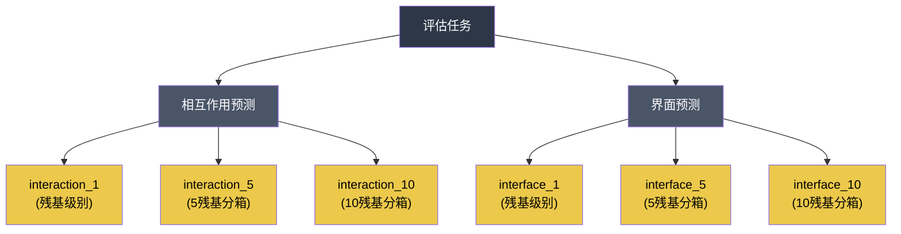

---
slug:19-evaluation-metrics
blog_type:normal
---


Disobind 采用基于 `torchmetrics` 构建的**七指标评估套件**，严格评估**相互作用**（接触图）和**界面**（残基级别）预测任务中的二分类性能。这些指标涵盖了依赖阈值的分类器和基于排序的度量，为本质上不平衡的蛋白质-蛋白质相互作用数据提供了模型质量的完整图景。

## 指标套件概述

核心评估函数 [`torch_metrics`](src/metrics.py#L15-L61) 会在单次传递中计算全部七个指标，并按固定顺序返回：

| 索引 | 指标 | 类 | 类型 | 不平衡安全？ |
|:-----:|--------|-------|------|:---------------:|
| 0 | **Recall** | `BinaryRecall` | 依赖阈值 | 部分 |
| 1 | **Precision** | `BinaryPrecision` | 依赖阈值 | 部分 |
| 2 | **F1-score** | `BinaryF1Score` | 依赖阈值 | 是（平衡的） |
| 3 | **Average Precision** | `BinaryAveragePrecision` | 基于排序 | 是 |
| 4 | **MCC** | `BinaryMatthewsCorrCoef` | 依赖阈值 | **是** |
| 5 | **AUROC** | `BinaryAUROC` | 基于排序 | 部分 |
| 6 | **Accuracy** | `BinaryAccuracy` | 依赖阈值 | **否** |

来源: [metrics.py](src/metrics.py#L1-L62)

### 依赖阈值的指标

**Recall**（敏感性 / 真正例率）衡量模型正确识别的实际相互作用残基的比例。在 Disobind 的语境中，高召回率意味着遗漏的相互作用更少——这对于生物学发现至关重要，因为假负例代表着未被检测到的结合位点。

**Precision**（正例预测值）衡量在预测的相互作用中真正发生相互作用的比例。高精确度意味着在假正例预测上浪费的实验验证更少。

**F1-score** 是召回率和精确度的调和平均值，提供了一个单一的平衡度量。这是整个分析流程中使用的**主要排序指标**——它驱动稀疏性与性能的绘图、特定案例的逐样本分析以及 OOD 基准比较。

**马修斯相关系数 (MCC)** 通过合并混淆矩阵的四个条目（TP、TN、FP、FN），生成一个介于 −1 和 +1 之间的相关系数。对于**不平衡数据集**上的二分类，MCC 是信息量最大的单一指标——这种机制在蛋白质相互作用预测中占主导地位，其中相互作用残基对的数量远少于非相互作用残基对。

包含 **Accuracy** 仅为保证完整性，但在源代码文档中明确指出它**对不平衡数据集具有误导性**。它出现在完整的指标数组中，但在下游分析中被弱化。

来源: [metrics.py](src/metrics.py#L13-L26)

### 基于排序的指标

**平均精度 (AP)** 通过对每个召回率阈值下的精确度进行积分，计算精确率-召回率曲线下的面积。与 AUROC 不同，AP 对类别不平衡敏感，能直接反映在**正（少数）类**上的性能。它通过 `BinaryAveragePrecision(thresholds=10)` 使用 10 个阈值区间进行计算。

**AUROC**（受试者工作特征曲线下面积）衡量随机选择的正实例排序高于随机选择的负实例的概率。虽然有助于评估整体区分能力，但在高度不平衡的数据上，AUROC 可能会被**乐观地高估**——这使得 AP 成为 Disobind 评估中更可靠的基于排序的指标。

来源: [metrics.py](src/metrics.py#L31-L37)

## 平均策略

`multidim_avg` 参数控制指标如何在一个批次的样本间聚合——这是一个关键的设计选择，会影响训练诊断和最终评估：

| 模式 | 行为 | 用例 |
|------|----------|----------|
| `global` | 将所有样本展平到一个池中；计算单一指标 | **最终 OOD 评估**——将整个测试集视为一个总体 |
| `samplewise` | 计算逐样本指标，然后在样本间求**均值** | 聚合的逐蛋白质报告 |
| `samplewise_none` | 返回逐样本指标**不求平均** | 特定案例分析（例如，Misc 数据集上的逐条目 F1） |

在 `global` 模式下，函数直接返回标量张量。在 `samplewise` 模式下，返回前会对每个逐样本指标张量应用 `torch.mean()`。`samplewise_none` 模式返回原始的逐样本张量，支持对单个蛋白质级别性能的下游检查。

全局平均策略是训练验证步骤和 OOD 基准评估的默认策略，确保了模型选择与最终报告之间的一致性。

来源: [metrics.py](src/metrics.py#L39-L61)

## 二值化与阈值化

所有预测值都是 [0, 1] 区间内的连续值。分类阈值由 `contact_threshold` 参数控制（默认值：**0.5**），它具有双重作用：

1. **目标二值化**——在计算指标前，通过 `torch.where(target > threshold, 1, 0)` 对目标进行阈值化，确保生成干净的二值真实标签。
2. **预测阈值化**——所有依赖阈值的 `torchmetrics` 类都会接收 `threshold=contact_threshold`，在相同的截断点对连续预测进行二值化。

该阈值在 YAML 参数中配置（例如，`contact_threshold: 0.5`），并在训练期间通过 `Trainer` 类、在分析期间通过 `JudgementDay` 类进行传递。对于 MORFchibi 等竞争方法，应用了不同的阈值 (0.775)，这反映了其校准后的输出尺度。

来源: [metrics.py](src/metrics.py#L27-L36), [analysis.py](analysis/analysis.py#L38-L46), [Model_config_Epsilon_3_16.2.yml](params/Model_config_Epsilon_3_16.2.yml#L116-L117)

## 评估任务结构

Disobind 跨**六个任务**评估指标，这些任务由两个预测目标和三个粗粒化级别的笛卡尔积构成：



**相互作用**任务评估完整的接触图（L₁ × L₂ 矩阵），而**界面**任务则展平为逐残基的二值向量（L₁ + L₂），从接触图中提取界面残基。对于粗粒化任务 (CG > 1)，在计算指标前，会对目标应用具有相应核大小的 `MaxPool2d`。

来源: [analysis.py](analysis/analysis.py#L125-L178)

## 评估中的模型

`JudgementDay` 流水线同时计算多个预测来源的指标，从而实现直接比较：

| 模型键 | 来源 | 描述 |
|-----------|--------|-------------|
| `Disobind` | Disobind 预测 | 独立的 Disobind 输出 |
| `AF2_pLDDT_PAE` | AlphaFold2-Multimer | 通过 pLDDT+PAE 置信度过滤的 AF2 预测 |
| `AF3_pLDDT_PAE` | AlphaFold3 | 通过 pLDDT+PAE 置信度过滤的 AF3 预测 |
| `Disobind_AF2` | 组合 | Disobind 和 AF2 预测的逐元素**最大值** |
| `Random_baseline` | 随机 | 从训练集正例比例中提取的预测 |

对于 **interface_1** 任务，还评估了三种额外的独立于伴侣的方法：**AIUPred**、**DeepDISOBind** 和 **MORFchibi**。这些方法与 Disobind 预测的 prot1-only 切片进行比较，因为它们在没有伴侣上下文的情况下预测单个蛋白质的界面残基。

来源: [analysis.py](analysis/analysis.py#L319-L351), [analysis.py](analysis/analysis.py#L559-L598)

## 子集级别评估

除了聚合指标外，流水线还执行**基于掩码的子集评估**，以评估在具有生物学意义的子区域上的性能：

- **IDR-IDR vs. 有序**——分别针对涉及无序残基 (IDR-IDR) 和有序残基的相互作用计算指标，揭示 Disobind 的优势是否具体源于无序区域预测。
- **残基类型掩码**——在促进无序的、芳香族的、疏水性的和极性的氨基酸残基上的性能，提供对预测质量的物理化学决定因素的洞察。
- **LIPs（线性相互作用肽）**——评估限制在已知参与相互作用的短线性基序上。

每个子集都是通过预测和目标与相应二值掩码的逐元素相乘生成的，然后在掩码数组上计算指标。

来源: [analysis.py](analysis/analysis.py#L354-L412)

## 训练时指标计算

在模型训练期间，会在 `training_step` 和 `validation_step` 的每个小批量中计算相同的七指标套件。`calculate_loss_n_metrics` 方法应用 sigmoid 激活（用于 `bce_with_logits` 损失）、目标掩码，然后使用配置的 `multidim_avg` 策略调用 `torch_metrics`。生成的 7 元素指标向量与每个批次的损失一起记录：

```
batch_dict shape: (num_batches, 8)  # 1 损失 + 7 指标
```

在最后一个 epoch，收集未校准的预测结果，用于使用 Platt 缩放、等渗回归或 Beta 校准进行**事后校准**——校准后的预测随后用于测试时评估。

来源: [build_model.py](src/build_model.py#L179-L215), [build_model.py](src/build_model.py#L219-L294), [build_model.py](src/build_model.py#L342-L398)

<CgxTip>在解读 Disobind 评估结果时，请优先考虑 **F1-score** 和 **MCC**，而非 Accuracy。相互作用预测问题极度不平衡（接触图 >95% 为零），使得 Accuracy 轻件地高且毫无意义。F1-score 是所有分析图和模型比较中使用的主要指标；MCC 为这种不平衡机制提供了最稳健的单一数值摘要。</CgxTip>

<CgxTip>`samplewise_none` 模式专为 Misc 数据集上的特定案例分析而设计——它返回未聚合的逐样本 F1 分数，这些分数可以与 PDB 标识符连接以供单个蛋白质检查。这能够识别 Disobind+AF2 表现优异或失败的案例，从而指导生物学解释。</CgxTip>

## 稀疏度-性能关系

流水线生成一张**稀疏度与 F1 分数关系图**，将数据集稀疏度（1 − 正例比例，表示为百分比）与 Disobind 在所有任务中的 F1 分数相关联。此图揭示了预测难度如何随类别不平衡而变化——较高的稀疏度（较少的真实接触）通常对应较低的 F1 分数，该关系的斜率量化了模型对极端不平衡的鲁棒性。

来源: [analysis.py](analysis/analysis.py#L670-L705)

## 下一步

- 关于这些指标如何在 OOD 基准上将 Disobind 与 AIUPred、DeepDISOBind 和 MORFchibi 进行比较，请参阅 [OOD 基准分析](20-ood-benchmark-analysis)。
- 有关所有竞争方法的详细数值比较和排名，请参阅 [竞争方法比较](21-competing-method-comparisons)。
- 有关在训练期间优化这些指标的损失函数，请参阅 [损失函数与校准](12-loss-functions-and-calibration)。