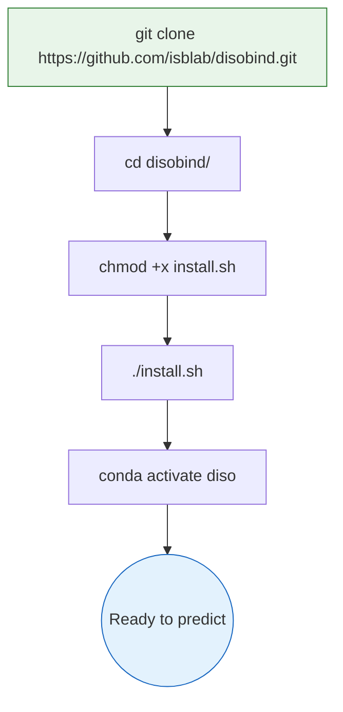
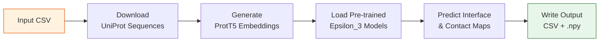

---
slug:2-quick-start
blog_type:normal
---


在五分钟内让 Disobind 运行起来——从克隆仓库到生成你的第一个内在无序区 (IDR) 结合预测。本页将引导你完成安装、使用内置示例进行首次预测，以及介绍你日常会使用的命令行界面。

## 前提条件

在安装 Disobind 之前，请确保你的系统满足以下要求：

| 要求 | 规格 |
|:---|:---|
| **Python** | 3.9（由 conda 环境强制指定） |
| **Conda** | 已安装 Miniconda 或 Anaconda |
| **CUDA** *(可选)* | CUDA Toolkit 11.8 + NVIDIA 驱动（用于 GPU 加速） |
| **Git** | 用于克隆仓库 |
| **网络** | 首次运行时需要，用于下载 UniProt 序列和 ProtT5 嵌入 |

<CgxTip>Disobind 在运行时会从 UniProt API 获取蛋白质序列。当首次使用 UniProt ID 运行预测时，请确保具备出站网络访问权限——后续运行将会在本地缓存结果。</CgxTip>

来源: [install.sh](/install.sh#L14-L26), [requirements.txt](/requirements.txt#L1-L33)

## 安装

安装过程会创建一个名为 `diso` 的隔离 conda 环境，安装所有 Python 依赖项，并配置 `PYTHONPATH` 以便内部模块导入能够正确解析。



在终端中执行以下命令：

```bash
# 1. 克隆仓库
git clone https://github.com/isblab/disobind.git

# 2. 进入项目目录
cd disobind/

# 3. 赋予安装脚本执行权限并运行
chmod +x install.sh
./install.sh

# 4. 激活 conda 环境（每次会话均需执行此操作）
conda activate diso
```

安装脚本在后台执行三项操作：解压 ProtTrans 归档文件，将项目根目录追加到你的 `~/.bash_profile` 中的 `PYTHONPATH`，以及根据 `requirements.txt` 创建包含所有依赖项的 `diso` conda 环境。核心依赖项包括 **PyTorch 2.0.1**、**HuggingFace Transformers 4.33.1**（用于 ProtT5 嵌入）、**BioPython 1.81**（用于结构解析）和 **OmegaConf 2.2.2**（用于 YAML 模型配置）。

来源: [install.sh](/install.sh#L1-L27), [requirements.txt](/requirements.txt#L1-L33)

## 你的首次预测

Disobind 在 `example/` 目录中附带了一个开箱即用的示例。文件 `example/test.csv` 包含两行数据：一行用于 **仅 Disobind** 预测，另一行用于 **Disobind+AF2** 预测，两者均使用朊病毒蛋白（UniProt ID `P04273`，残基 95–193）。

### 运行示例

```bash
python run_disobind.py -i csv -f ./example/test.csv
```

这一条命令即可触发完整的预测流程：读取 CSV 输入、下载 UniProt 序列、生成 ProtT5 嵌入、加载预训练的 Epsilon_3 模型，并将预测结果写入 `./output/` 目录。

### 刚才发生了什么？



运行完成后，检查输出目录：

```bash
ls ./output/
```

你将看到：

| 文件 | 描述 |
|:---|:---|
| `diso_<entry_id>_interface_cg1.csv` | 粗粒度分辨率 1 下的 Disobind 界面残基预测 |
| `af2_<entry_id>_interface_cg1.csv` | AlphaFold2 界面预测 *（仅限 Disobind+AF2 行）* |
| `diso_af2_<entry_id>_interface_cg1.csv` | 合并的 Disobind+AF2 预测 *（仅限 Disobind+AF2 行）* |
| `Predictions.npy` | 包含所有预测的完整嵌套字典（使用 `np.load(..., allow_pickle=True)` 加载） |
| `UniProt_seq.json` | 缓存的 UniProt 序列，供复用 |
| `p1_p2_test.fasta` | 用于生成嵌入的中间 FASTA 文件 |

来源: [run_disobind.py](/run_disobind.py#L111-L126), [run_disobind.py](/run_disobind.py#L785-L796), [example/test.csv](/example/test.csv#L1-L2)

## 命令行界面

所有预测均通过 `run_disobind.py` 调用。下表汇总了所有可用的标志：

| 标志 | 短标志 | 默认值 | 描述 |
|:-----|:------|:--------|:------------|
| `--input_type` | `-i` | *(必填)* | 输入文件格式：**`csv`** 或 **`fasta`** |
| `--input` | `-f` | *(必填)* | 输入文件的路径 |
| `--max_cores` | `-c` | `2` | 用于并行下载 UniProt 序列的 CPU 核心数 |
| `--output_dir` | `-o` | `output` | 输出目录的名称 |
| `--device` | `-d` | `cpu` | 计算设备：**`cpu`** 或 **`cuda`** |
| `--cmaps` | `-cm` | `False` | 若设置此标志，除界面残基外，还将预测蛋白质间**接触图** |
| `--coarse` | `-cg` | `1` | 粗粒度分辨率：**`1`**、**`5`**、**`10`**，或 **`0`** 表示同时预测全部三种 |

### 常见用法示例

```bash
# 仅 Disobind：CG-1 下的界面残基（最快，默认）
python run_disobind.py -i csv -f ./example/test.csv

# 同时预测接触图和界面残基
python run_disobind.py -i csv -f ./example/test.csv -cm

# 以所有粗粒度分辨率 (1, 5, 10) 运行
python run_disobind.py -i csv -f ./example/test.csv -cg 0

# 使用 GPU 加速
python run_disobind.py -i csv -f ./example/test.csv -d cuda

# 自定义输出目录并使用 4 核心并行下载
python run_disobind.py -i csv -f ./example/test.csv -o my_results -c 4

# 使用 FASTA 输入代替 CSV
python run_disobind.py -i fasta -f ./example/test.fasta
```

<CgxTip>当使用 `-cg 5` 或 `-cg 10` 时，如果蛋白质长度不是卷积核大小的整数倍，C 端残基将被丢弃。使用 `-cg 1` 可获得残基级别的精度，或使用 `-cg 0` 以比较所有分辨率下的预测。</CgxTip>

来源: [run_disobind.py](/run_disobind.py#L1312-L1357), [run_disobind.py](/run_disobind.py#L130-L165)

## 准备你的输入

Disobind 接受两种输入格式。对于具有 UniProt 入库号的蛋白质批量预测，推荐使用 **CSV**；**FASTA** 则支持没有 UniProt 条目的自定义序列。

### CSV 格式——批量预测

每行代表一对蛋白质。根据你希望进行仅 Disobind 预测还是 Disobind+AF2 预测，存在两种变体：

| 模式 | 列布局 |
|:-----|:-------------|
| **仅 Disobind** | `UniProt_ID1, start1, end1, UniProt_ID2, start2, end2` |
| **Disobind+AF2** | `UniProt_ID1, start1, end1, UniProt_ID2, start2, end2, AF2_struct_path, AF2_pae_path, chain1, chain2, offset1, offset2` |

内置示例在单个文件中演示了两种模式：

```csv
P04273,95,193,P04273,95,192
P04273,95,193,P04273,95,193,./example/unrelaxed_model_4_multimer_v3_pred_4.pdb,./example/pae_model_4_multimer_v3_pred_4.json,B,C,0,0
```

**需要记住的关键约束：**

- **蛋白质 1 必须是 IDR**（内在无序区）；蛋白质 2 可以是无序的，也可以不是。
- 输入的蛋白质对**被假定是相互作用的**——Disobind 预测的是它们在=何处=相互作用，而非=是否=相互作用。
- 对于**非二元复合物**（例如 ABC），需将其分解为二元对（AB、BC、AC）并分别运行。
- `offset` 值用于修正 AF2 结构与 UniProt 编号之间的残基位置差异。如果<font></font> AF2 结构覆盖了完整的 UniProt 序列或恰好覆盖指定的片段，则设置为 `0`。

### FASTA 格式——自定义序列

对于没有 UniProt 入库号的蛋白质，可直接提供序列：

:```
>ID1, start1, end1, AF2_struct_path@, AF2_pae(D_path, chain1, offset1
PROTEIN1SEQUENCE...
>ID2, start2, end2, AF2_struct_path, AF2_pae_path, chain2, offset2
PROTEIN2SEQUENCE...
```

一个 FASTA 文件必须包含**恰好两条目**（每个文件一对蛋白质）。对于仅 Disobind 的预测，省略 AF2 字段：`>ID, start, end`。

来源: [example/test.csv](/example/test.csv#L1-L2), [example/test.fasta](/example/test.fasta#L1-L5), [run_disobind.py](/run_disobind.py#L312-L359), [run_disobind.py](/run_disobind.py#L240-L308)

## 理解输出

对于每对输入的蛋白质，Disobind 会生成包含四列的 CSV 文件：

| 列 | 含义 |
|:-------|:--------|
| **Protein1** | 蛋白质 1（即 IDR）的标识符 |
| **Residue1** | 预测参与结合的蛋白质 1 的残基位置 |
| **Protein2** | 蛋白质 2（即结合搭档A伙伴）的标识符 |
| **Residue2** | 预测参与结合的蛋白质 2 的残基位置 |

**不同预测类型的解释方式不同：**

- **接触图**（`-cm` 标志）：每行指定一个具体的成对相互作用——例如，蛋白质 1 的残基 10 与蛋白质 2 的残基 40 相互作用。
- **界面残基**（默认）：各行列出了参与界面的两侧残基——例如，蛋白质 1 的残基 10、14、125 与蛋白质 2 的残基 40、44、80 中的*一个或多个*相互作用。

当使用 Disobind+AF2 时，会生成三种 CSV 变体：`diso_`（仅 Disobind）、`af2_`（AlphaFold2 高置信度接触）和 `diso_af2_`（两种方法逐元素的最大值）。

来源: [run_disobind.py](/run_disobind.py#L893-L960), [README.md](/README.md#L103-L113)

## 常见问题排查

| 问题 | 原因 | 解决方案 |
|:--------|:------|:---------|
| `src` 或 `dataset` 的 `ModuleNotFoundError` | 未设置 `PYTHONPATH` | 运行 `source ~/.bash_profile` 或手动执行 `export PYTHONPATH=/path/to/disobind:$PYTHONPATH` |
| `Unable to download seq for Uniprot ID` | 网络问题或无效的 UniProt ID | 在 [uniprot.org](https://www.uniprot.org) 验证 UniProt ID；检查网络连接 |
| `Incorrect input format` | CSV 列数错误 | 使用准确的 6 列（仅 Disobind）或 12 列（Disobind+AF2） |
| `Incorrect coarse-grained resolution` | 无效的 `-cg` 值 | 从 `0`、`1`、`5` 或 `10` 中选择 |
| CUDA 内存不足 | GPU 上的蛋白质过大 | 切换至 `-d cpu` 或减小批处理大小 |
| `Output directory already exists` | 重复运行写入了同一输出文件夹 | 回答 `n` 以继续，或指定新的 `-o` 目录名称 |

来源: [run_disobind.py](/run_disobind.py#L94-L98), [run_disobind.py](/run_disobind.py#L224-L236), [run_disobind.py](/run_disobind.py#L144-L146), [install.sh](/install.sh#L7-L11)

## 接下来去哪

现在你已经让 Disobind 运行起来了，可以浏览以下页面以加深理解：

1. **[输入格式与示例](3-input-formats-and-examples)** — 详细的 CSV/FASTA 规范及更多示例
2. **[架构概览](4-architecture-overview)** — Epsilon_3 神经网络如何将蛋白质嵌入处理为接触预测
3. **[输出解读](10-output-interpretation)** — 阅读和可视化 Disobind 预测的深入指南
4. **[Disobind 与 Disobind+AF2 预测](9-disobind-and-disobind-af2-prediction)** — 何时以及如何将 Disobind 与 AlphaFold2 结构预测相结合