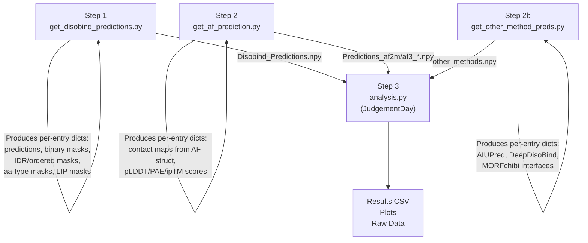

---
slug:20-ood-benchmark-analysis
blog_type:normal
---


分布外（OOD）评估是 Disobind 可信度的基石——它旨在衡量基于 PDB 衍生的结构化复合物训练的模型，在不存在结构同源物的内无序蛋白质组上的泛化能力。本文档记录了完整的 OOD 基准测试流水线：预测生成、指标计算、子集分解、竞争方法对比以及诊断绘图。

## OOD 测试集定义

OOD 测试集在非冗余数据集划分阶段构建（参见[非冗余数据集划分](16-non-redundant-dataset-splitting)），并以 `prot_1-2_test_v_{version}.csv` 格式存储。每条记录遵循 `UniID1:start1:end1--UniID2:start2:end2_copyNum` 的格式，编码了每个二元复合物的 UniProt 标识符、残基范围和拷贝数。数据集版本参数（`data_version = 19`）控制所有文件路径，并通过 `MAX_LEN_DICT` 进行集中管理，该字典将每种模式和版本映射至其最大蛋白质长度——**OOD 为 100 个残基**，Misc 数据集为 200 个残基。

一项关键的排除策略移除了 8 对在 20% 序列一致性下与 PDB70 存在序列冗余的 UniProt 对（例如 `P0DTC9--P0DTD1_2`、`Q96PU5--Q96PU5_0`），以及 1 条导致 AF2-multimer 崩溃的记录（`P0DTD1:1743:1808--P0DTD1:1565:1808_1`）。这些排除规则在流水线的每个阶段均被严格执行，以确保评估的一致性。

来源：[analysis.py](/analysis/analysis.py#L39-L42)，[analysis.py](/analysis/analysis.py#L225-L240)

## 三步分析流水线

基准测试分析作为一个严格的三步流水线执行，由独立的脚本协调调度，每一步都会生成供下一阶段消费的中间 `.npy` 产物：



**第 1 步**在 OOD 测试集上生成 Disobind 预测及所有辅助二值掩码（无序/有序区域、氨基酸类型、LIPs）。**第 2 步**获取 AF2-multimer 和 AF3 的预测结构，在指定的 `iptm_cutoff` 下，经 pLDDT/PAE/ipTM 置信度过滤后将其转换为接触图和界面预测，并保存结果。**第 2b 步**收集来自三种竞争界面预测器的预测结果。**第 3 步**是核心的 `JudgementDay` 类，负责加载所有预测产物，将其分解为特定任务的子集，计算指标，并生成所有输出文件和图表。

来源：[README.md](/analysis/README.md#L1-L30)，[analysis.py](/analysis/analysis.py#L72-L120)

## 任务分类体系

OOD 基准测试评估由两个预测目标和三种粗粒化分辨率通过笛卡尔积构成的**六项任务**：

| 目标 | CG 分辨率 | 任务键 | 输出形状 | 描述 |
|-----------|--------------|----------|-------------|-------------|
| **相互作用** | 1 | `interaction_1` | (L₁, L₂) | 全分辨率的残基-残基接触图 |
| **相互作用** | 5 | `interaction_5` | (L₁/5, L₂/5) | 粗粒化至 5 残基区间的接触图 |
| **相互作用** | 10 | `interaction_10` | (L₁/10, L₂/10) | 粗粒化至 10 残基区间的接触图 |
| **界面** | 1 | `interface_1` | (L₁+L₂, 1) | 全分辨率的逐残基界面标签 |
| **界面** | 5 | `interface_5` | (L₁/5+L₂/5, 1) | 5 残基区间的界面标签 |
| **界面** | 10 | `interface_10` | (L₁/10+L₂/10, 1) | 10 残基区间的界面标签 |

**相互作用**目标预测一个二值接触图，若残基 i 和 j 存在接触，则 `C[i,j]=1`。**界面**目标将其折叠为逐残基的二值标签：若某残基与伙伴链上的任何残基存在接触，则该残基即为界面残基。粗粒化过程应用具有指定核大小与步长的 `MaxPool2d`（相互作用）或 `MaxPool1d`（界面），确保只要构成残基中**存在任何一个**为正，则粗粒化区间即为正。

来源：[analysis.py](/analysis/analysis.py#L122-L127)，[analysis.py](/analysis/analysis.py#L129-L165)

## 待评估模型

该基准测试评估五种主要模型配置以及三种竞争方法：

| 模型 | 键 | 预测类型 | 评估范围 |
|-------|-----|----------------|--------------|
| **Disobind** | `Disobind` | 依赖伙伴 | 全部 6 项任务 |
| **AF2-multimer** | `AF2_pLDDT_PAE` | 衍生结构 | 全部 6 项任务 |
| **AF3** | `AF3_pLDDT_PAE` | 衍生结构 | 全部 6 项任务 |
| **Disobind+AF2** | `Disobind_AF2` | 组合 | 全部 6 项任务 |
| **随机基线** | `Random_baseline` | 随机 | 全部 6 项任务 |
| AIUPred | `Aiupred` | 独立伙伴 | 仅 `interface_1` |
| DeepDISOBind | `Deepdisobind` | 独立伙伴 | 仅 `interface_1` |
| MORFchibi | `Morfchibi` | 独立伙伴 | 仅 `interface_1` |

**Disobind+AF2** 的组合预测采用逐元素取最大值的方式：对于每个接触元素，`combined[i,j] = max(Disobind[i,j], AF2[i,j])`。这利用了 Disobind 在无序区域上的优势和 AF2 在结构化区域上的优势。**随机基线**根据每项任务训练集中的正样本比例进行参数化的伯努利分布采样，提供了一种任务感知的下界。

竞争方法（AIUPred、DeepDISOBind、MORFchibi）是**独立伙伴**的界面预测器，它们仅在不知道结合伙伴的情况下基于 IDR 序列进行操作。这些方法仅在 `interface_1` 任务上接受评估，其中 MORFchibi 使用其文献指定的 0.775 专属阈值以及 4 残基的最小窗口过滤。

来源：[analysis.py](/analysis/analysis.py#L295-L310)，[analysis.py](/analysis/analysis.py#L246-L260)，[get_other_method_preds.py](/analysis/get_other_method_preds.py#L79-L105)，[get_other_method_preds.py](/analysis/get_other_method_preds.py#L162-L188)

## 子集分解

OOD 分析的一个显著特征是**无序分层评估**，它将预测分解为具有生物学意义的子集。此操作仅在具备细粒度残基级掩码的 `interaction_1` 和 `interface_1` 任务中执行：

### 无序与有序相互作用

OOD 记录按其相互作用残基的无序含量进行划分：

| 子集 | 掩码键 | 定义 |
|--------|----------|------------|
| **IDR-IDR** | `IDR-IDR` | 相互作用残基**均**位于内无序区域的相互作用 |
| **有序** | `order` | 涉及至少一个有序（非 IDR）残基的相互作用 |

预测和目标与这些掩码进行逐元素相乘，因此指标仅反映选定残基子集上的性能。这揭示了 Disobind 相较于 AF2 的优势是否如假设般集中在 IDR-IDR 接触上。

来源：[analysis.py](/analysis/analysis.py#L262-L289)

### 残基类型与基序分析

除了二元的无序/有序划分之外，预测还进一步按氨基酸理化类别和基序隶属关系进行分解：

| 掩码 | 键 | 构建方式 |
|------|-----|-------------|
| **促无序氨基酸** | `disorder_promoting_aa` | 各链促无序残基 (A, R, Q, S, P, E, G, K) 掩码的外积 |
| **芳香族氨基酸** | `aromatic_aa` | 各链芳香族残基 (F, W, Y) 掩码的外积 |
| **疏水氨基酸** | `hydrophobic_aa` | 各链疏水残基 (V, I, L, M, F, W, C) 掩码的外积 |
| **极性氨基酸** | `polar_aa` | 各链极性残基 (S, T, N, Q) 掩码的外积 |
| **LIPs** | `lips` | 线性相互作用肽——IDR 中结合时发生无序到有序转变的短基序 |

对于相互作用任务，掩码由各链向量的外积构建（两个残基必须同属该类别）。对于界面任务，各链掩码被拼接。LIP 掩码源自 ELM 数据库，代表了 SLiMs 中一个具有生物学关键意义的子集。

来源：[analysis.py](/analysis/analysis.py#L291-L330)

## 复合物类型分类（辅助分析）

`side_analysis.py` 脚本基于复合物的**结构异质性**，提供了 OOD 记录的一种正交分解：

- **DOR（无序-有序）**复合物：所有观察到的接触均存在于**所有**构象中（加和的接触图在所有接触位置上的值等于总构象数），表明存在单一主导的结合模式
- **DDR（无序-无序）**复合物：至少有一个接触在不同构象间存在差异，表明存在构象异质性或模糊结合
- **全 IDR** 复合物：prot1 在其整个残基范围内**100%** 无序（无序残基比例 = 1.0）

这些分类被写入独立的 CSV 文件（`ooddor_v_19.csv`、`oodddr_v_19.csv`、`oodidr_v_19.csv`），可用于筛选记录以进行针对性评估。`MAX_LEN_DICT` 支持这些模式（`"ooddor"`、`"oodddr"`、`"oodidr"`）作为有效的 OOD 子集。

来源：[side_analysis.py](/analysis/side_analysis.py#L46-L100)，[side_analysis.py](/analysis/side_analysis.py#L103-L155)

## 指标计算

所有指标均通过[评估指标](19-evaluation-metrics)中的 `torch_metrics` 进行计算，该模块封装了 `torchmetrics` 的分类类。`JudgementDay.calculate_metrics` 方法返回一个包含 7 个元素的数组：

| 索引 | 指标 | 平均方式 |
|-------|--------|-----------|
| 0 | 召回率 | `global` 或 `samplewise` |
| 1 | 精确率 | `global` 或 `samplewise` |
| 2 | F1 分数 | `global` 或 `samplewise` |
| 3 | 平均精确率 | 10 个阈值 |
| 4 | MCC | — |
| 5 | AUROC | 10 个阈值 |
| 6 | 准确率 | `global` 或 `samplewise` |

**全局**平均模式在计算指标前聚合整个 OOD 集上的所有预测和目标，赋予每个残基/残基对相同的权重。**样本级**模式计算每条记录的指标后再取平均，赋予每个复合物相同的权重。`case_specific_analysis` 方法使用 `samplewise_none` 来保留 Misc 数据集的逐条 F1 分数。

用于二值化 Disobind 预测的接触阈值默认为 **0.5**（`contact_threshold = 0.5`），而 MORFchibi 根据其发布指南使用 **0.775**。

来源：[analysis.py](/analysis/analysis.py#L700-L730)，[metrics.py](/src/metrics.py#L17-L62)

## 输出产物

`JudgementDay` 流水线生成以下输出，组织存放于 `Analysis_{MODE}_{VERSION}_{IPTM}/` 目录中：

### 结果表

| 文件 | 内容 |
|------|---------|
| `Results_OOD_set_{v}.csv` | 完整结果：所有模型和子集的目标、CG、模型、召回率、精确率和 F1 分数 |
| `Results_OOD_set_subset_{v}.csv` | 限制于无序分层子集的结果 |
| `Results_other_methods_{v}.csv` | AIUPred、DeepDISOBind、MORFchibi 与 Disobind 在 `interface_1` 上的对比结果 |
| `Case_sp_analysis_{v}.csv` | Disobind、AF2、Disobind+AF2 的逐条 F1 分数（Misc 模式） |

### 诊断图与原始数据

| 文件 | 描述 |
|------|-------------|
| `AF_confidence_plot_{v}.png` / `.csv` | AF2-ipTM 对 AF3-ipTM 的散点图，附有对角参考线和截断标记 |
| `Confident_AF_preds_{v}.txt` | 在各种 ipTM 阈值下的置信预测计数（≤ 截断值、≥ 0.8、AF2 > AF3） |
| `Sparsity_F1_plot_{v}.png` / `.csv` | 数据集稀疏度（1 − 正样本比例）与 Disobind 在各任务上的 F1 分数对比 |
| `Misc_dict_{v}.json` | Disobind+AF2 在 CG=1 下的逐条预测和目标界面（Misc 模式） |

来源：[analysis.py](/analysis/analysis.py#L96-L117)，[analysis.py](/analysis/analysis.py#L620-L680)

## AlphaFold 置信度过滤

AF2 和 AF3 的预测在转换为接触图之前，会通过三项置信度标准进行过滤：

| 标准 | 默认阈值 | 效果 |
|-----------|------------------|--------|
| **pLDDT** | 70 | pLDDT < 70 的残基被排除在接触之外（局部置信度低） |
| **PAE** | 5 | PAE > 5 的残基对被排除（结构域间置信度低） |
| **ipTM** | 可配置（`iptm_cutoff`） | 若 ipTM ≤ 截断值，则丢弃整个预测 |

`iptm_cutoff` 参数在 `JudgementDay` 构造函数中设置，并传播至文件命名（例如 `Predictions_af2m_results_0.0.npy`）。`count_confident_AF_predictions` 方法统计在各种截断值下存留的记录数量，并生成 AF2 与 AF3 的置信度散点图，从而能够评估 AF2 和 AF3 在预测置信度上的一致频率。

对于 AF3，附加标志 `use_af3_struct` 控制接触图是源自预测的 3D 结构（`True`），还是源自原始接触概率矩阵（`False`），为 AF3 输出提供了两种评估视角。

来源：[get_af_prediction.py](/analysis/get_af_prediction.py#L30-L46)，[analysis.py](/analysis/analysis.py#L580-L640)

## 执行协议

完整的 OOD 基准测试按以下步骤执行：

```bash
# 第 1 步：生成 Disobind 预测 + 辅助掩码
cd analysis
python get_disobind_predictions.py    # 请先检查构造函数路径

# 第 2 步：生成 AF2/AF3 预测（设置 af_model 和 iptm_cutoff）
python get_af_prediction.py           # 运行两次：先 af_model="AF2"，再 "AF3"

# 第 2b 步：生成竞争方法预测（需提前准备输入）
python get_other_method_preds.py

# 第 3 步：运行完整分析
python analysis.py                    # 请先检查构造函数路径
```

<CgxTip>每个脚本构造函数中的 `mode` 参数必须在所有步骤中保持一致——在 `"ood"` 和 `"misc"` 之间切换会更改输入文件、目标接触图、最大蛋白质长度和输出目录。`"ood"` 模式在 OOD 测试集上进行评估；`"misc"` 模式则在具有生物学意义的杂项数据集上进行评估。</CgxTip>

<CgxTip>8 对序列冗余的 UniProt 对和 1 条 AF2 崩溃记录在 `analysis.py` 和 `side_analysis.py` 中被硬编码为排除列表。如果 OOD 集组成发生变化（新数据集版本），则必须审查并更新这些列表，以维护评估的完整性。</CgxTip>