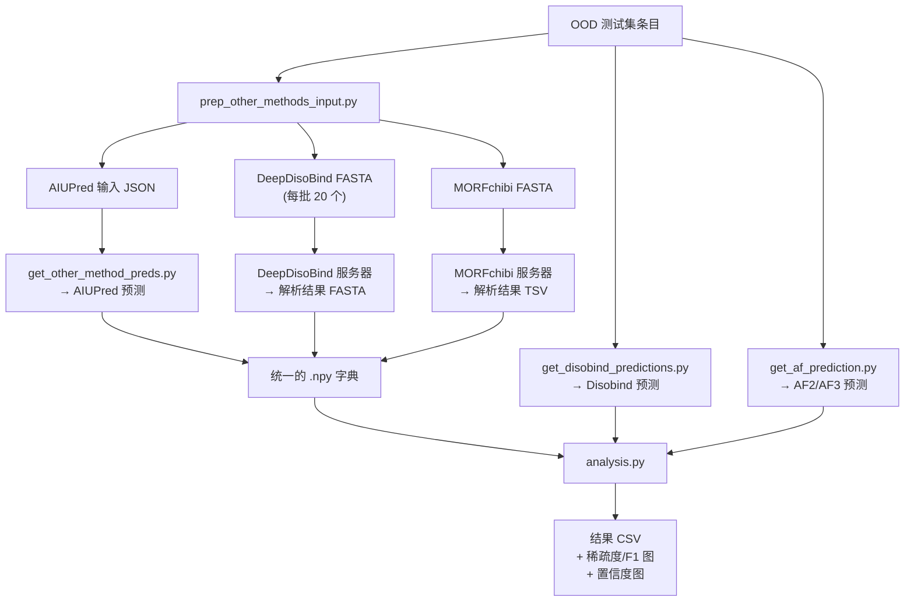

---
slug:21-competing-method-comparisons
blog_type:normal
---


Disobind 在一个分布外（OOD）测试集上，与横跨两种范式的**五种竞争方法**进行了基准测试，这两种范式分别是：不依赖搭档的界面预测器（AIUPred、DeepDisoBind、MORFchibi）和基于结构的预测器（AlphaFold2-Multimer、AlphaFold3）。比较架构被刻意设计为不对称的：不依赖搭档的方法在没有搭档上下文的情况下，预测单个无序序列的结合倾向；而 Disobind 和 AlphaFold 变体则利用搭档信息来生成成对相互作用图。本页面详细剖析了每个竞争方法集成到评估流程的方式、它们的预测格式、二值化策略，以及在相互作用/界面目标、粗粒度分辨率和残基类型分解等维度上评估所有方法的多维分析框架。

## 竞争方法概况

本仓库评估了组织为三个功能类别的六种预测器。**不依赖搭档的预测器**（AIUPred、DeepDisoBind、MORFchibi）在单个蛋白质序列上操作，并返回每个残基的结合倾向——这对于结合搭档可能未知的无序区域至关重要。**基于结构的预测器**（AF2-Multimer、AF3）预测完整的复合物结构，并使用基于置信度的过滤从中推导出接触图和界面。**Disobind** 占据了独特的生态位：它使用两个搭档的 ProtT5 嵌入来直接预测成对相互作用图，无需结构输入，同时感知两个搭档的序列。第七种复合预测器 **Disobind+AF2**，通过取 Disobind 和 AF2 预测的逐元素最大值，结合了这两种范式。

| 方法 | 输入 | 输出 | 搭档感知 | 类型 |
|---|---|---|---|---|
| **Disobind** | ProtT5 嵌入 (prot1 + prot2) | 接触图 / 每种 CG 的界面 | ✅ | 基于嵌入 |
| **AF2-Multimer** | 序列 (prot1 + prot2) | 3D 结构 → 过滤后的接触图 | ✅ | 基于结构 |
| **AF3** | 序列 (prot1 + prot2) | 3D 结构 / 接触概率 → 过滤后的接触图 | ✅ | 基于结构 |
| **AIUPred** | 单个序列 | 每个残基的结合倾向 | ❌ | 嵌入回归 |
| **DeepDisoBind** | 单个序列 (FASTA) | 每个残基的结合倾向 (多任务) | ❌ | 深度学习 |
| **MORFchibi** | 单个序列 (FASTA, 最小长度 26) | 每个残基的 MoRF 倾向 | ❌ | 集成预测器 |

来源: [get_other_method_preds.py](/analysis/get_other_method_preds.py#L1-L13), [get_af_prediction.py](/analysis/get_af_prediction.py#L1-L30), [analysis.py](/analysis/analysis.py#L1-L40)

## 预测获取流程

竞争方法的评估遵循严格的三阶段流程。首先，从 OOD 测试集条目中准备不依赖搭档的方法的输入文件。其次，获取每种方法的预测，并将其归一化为统一的格式。第三，在核心分析脚本中将所有预测一起评估。



### 不依赖搭档方法的输入准备

`CreateInput` 类从测试拆分文件中提取所有 OOD 条目 ID，并检索相应的 UniProt 序列。对于每个二元复合物条目 `{uni_id1}:{start1}:{end1}--{uni_id2}:{start2}:{end2}_{copy_num}`，两个蛋白质序列都被提取为**单独的输入**——因为不依赖搭档的方法无法利用成对上下文。每个序列都带有对其父级 OOD 条目 ID 的引用存储，以便在评估期间重新组装。该类产生三种输出格式：用于 AIUPred 的 JSON 文件（在 Python 中直接加载）、用于 DeepDisoBind 的分批 FASTA 文件（服务器限制：每次作业 ≤20 个序列），以及用于 MORFchibi 网页提交的单个 FASTA 文件。

来源: [prep_other_methods_input.py](/dataset/prep_other_methods_input.py#L1-L152)

## AIUPred 集成

AIUPred（AI 驱动的无结构蛋白预测器）使用基于 Transformer 的嵌入回归模型来预测每个残基的结合倾向。集成调用 `aiupred_lib.predict_binding()`，设置 `binding=True` 和 `smoothing=True` 以获得平滑的结合倾向，然后按照 AIUPred 论文中的规定，以 **0.5** 的阈值进行二值化。源代码中记录了一个关键的实现细节：默认的 `binding=False` 返回的是平滑的无序预测而不是结合预测，而且 GitHub 文档错误地遗漏了 `binding=True` 参数。`aiupred_lib.low_memory_predict_disorder()` 和 `aiupred_lib.predict_binding()` 函数都包含一个 bug，即在 `savgol_filter` 调用中 `transformed_pred` 未定义——这需要谨慎的版本固定。

```python
# 正确用法（在源码中记录的变通方法）：
prediction = aiupred_lib.predict_binding(
    sequence, embedding_model, reg_model, device,
    binding=True, smoothing=True
)
# 以 0.5 阈值进行二值化
prediction = np.where(prediction > 0.5, 1, 0)
```

来源: [get_other_method_preds.py](/analysis/get_other_method_preds.py#L67-L95)

## DeepDisoBind 集成

DeepDisoBind 是一个多任务深度学习预测器，从单个 FASTA 输出蛋白质、DNA 和 RNA 相互作用的结合倾向。集成解析从 DeepDisoBind 服务器返回的结果 FASTA 文件，通过在 `"protein_binary:"` 和 `"DNA_propensity"` 标记之间分割输出字符串来提取 `protein_binary` 字段。由于服务器每次提交最多接受 20 个序列，结果文件被分割成六个批次，覆盖范围分别为 `0-20`、`20-40`、`40-60`、`60-80`、`80-100` 和 `100-107` 个序列。`protein_binary` 值已经过二值化（作为字符串字符 `'0'`/`'1'`），因此无需应用额外的阈值处理。

来源: [get_other_method_preds.py](/analysis/get_other_method_preds.py#L97-L120)

## MORFchibi 集成

MORFchibi（分子识别特征预测器）识别 MoRF（无序区域内的短结合基序），并且在所有竞争方法中需要最细致的后处理。预测从 `mc2.msl.ubc.ca` 网络服务器获取，并从 TSV 格式的输出文件中解析（跳过前 9 行注释/表头）。二值化遵循 MORFchibi 论文的规定：应用 **0.775** 的截断值，并且至关重要的是，**少于 4 个连续残基高于截断值的片段被排除**，作为无效的 MoRF。这是通过 `valid_morf()` 方法实现的，该方法检查包含当前残基的任何 4 残基窗口是否所有值都 ≥ 0.775。无效残基的倾向被设置为 0，以防止 torchmetrics 将它们计为真阳性。此外，MORFchibi 要求**最小序列长度为 26**；不满足此约束的条目将收到零数组占位符。

```python
# MORFchibi 4 残基验证窗口
morfchibi_cutoff = 0.775
for i, prop in enumerate(pred_interface):
    if prop >= morfchibi_cutoff:
        valid = self.valid_morf(idx=i, interface_array=pred_interface, cutoff=morfchibi_cutoff)
        if not valid:
            processed_interface.append(0)  # 使孤立预测无效
```

来源: [get_other_method_preds.py](/analysis/get_other_method_preds.py#L122-L175)

## AlphaFold2-Multimer 和 AlphaFold3 集成

AF2-Multimer 和 AF3 的预测通过一个共享流程处理，该流程将预测的 3D 结构转换为二元接触图，然后在所有粗粒度分辨率下推导出相互作用和界面预测。转换应用了三个连续的置信度过滤器：**pLDDT ≥ 70**（每个残基的置信度）、**PAE ≤ 5**（结构域间的位置置信度）和 **ipTM 截断**（可配置，默认为 0.0）。过滤后的接触图计算为 `pred × pLDDT_mask × PAE_mask`，其中 pLDDT 掩码是每条链二元掩码的外积，PAE 掩码是 PAE 矩阵右上和左下象限的平均值。对于 AF3，另一种模式（`use_af3_struct = False`）可以直接从 JSON 输出中的 `contact_probs` 字段推导接触图，而不是从原子坐标推导，即将平均概率以 0.5 阈值化。最佳模型通过 `ranking_debug.json`（AF2）或 `fold_*_summary_confidences_0.json`（AF3）中最高的 ipTM+ptm 排名来选择。

来源: [get_af_prediction.py](/analysis/get_af_prediction.py#L1-L498)

## Disobind+AF2 复合预测器

`combine_diso_af_preds()` 方法通过取 Disobind 和 AF2-Multimer 预测的**逐元素最大值**来创建复合预测器。两个预测张量都被重塑为 `(batch, L1×L2)`，沿新轴堆叠，并在重塑回去之前取最大值。这种联合策略捕获了由任一方法预测的相互作用——它以牺牲精确度为代价提高了召回率，当 Disobind 捕获了 AF2 由于低 pLDDT 而遗漏的无序区域相互作用，而 AF2 捕获了 Disobind 基于嵌入的方法可能预测不足的有序区域相互作用时，这尤其有效。

```python
# 逐元素最大值组合
af_diso = np.stack([af.reshape(b, m*n), diso.reshape(b, m*n)], axis=1)
af_diso = np.max(af_diso, axis=1).reshape(b, m, n)
```

来源: [analysis.py](/analysis/analysis.py#L285-L298)

## 统一评估框架

`JudgementDay` 类通过 `create_ood_set_tensors()` 生成器协调所有比较，该生成器为所有 6 个任务（`{interaction,interface}_{1,5,10}`）生成特定于任务的字典。对于每个任务，生成器组装一个字典，其以下键从各自的来源填充：

| 字典键 | 来源 | 范围 |
|---|---|---|
| `Disobind` | Disobind 预测 .npy | 所有任务 |
| `AF2_pLDDT_PAE` | AF2-Multimer 预测 .npy | 所有任务 |
| `AF3_pLDDT_PAE` | AF3 预测 .npy | 所有任务 |
| `Random_baseline` | 从 fraction_positives 采样 | 所有任务 |
| `Aiupred` | 其他方法 .npy | 仅界面任务 (OOD 模式) |
| `Deepdisobind` | 其他方法 .npy | 仅界面任务 (OOD 模式) |
| `Morfchibi` | 其他方法 .npy | 仅界面任务 (OOD 模式) |
| `IDR-IDR` / `order` | Disobind 预测（掩码） | interaction_1, interface_1 |
| `lips` / `aa_type` | Disobind 预测（掩码） | interaction_1, interface_1 |

不依赖搭档的方法（AIUPred、DeepDisoBind、MORFchibi）**仅在 `interface` 任务且 CG=1 时进行评估**，因为它们生成的是每个残基的预测，无法填充成对接触图。对于相互作用任务和 CG > 1，它们收到零数组占位符。八个序列冗余条目（与 PDB70 有 ≥20% 相似度）被排除在评估之外，以防止训练-测试泄漏。

来源: [analysis.py](/analysis/analysis.py#L208-L280)

## 不依赖搭档与依赖搭档评估的不对称性

比较框架中的一个基本设计决策是如何针对依赖搭档的目标评估不依赖搭档的预测。由于 AIUPred、DeepDisoBind 和 MORFchibi 为每个蛋白质（而不是每对）生成单个界面向量，`assemble_interfaces_for_ood_entries()` 方法通过拼接两个蛋白质的预测来构建成对界面：`[pred_prot1, pred_prot2]`。对于同源条目（单个唯一序列），相同的预测被复制。对于异源条目，每个蛋白质的预测通过 OOD 条目标识符与其 UniProt ID 匹配。

在评估期间，`get_other_method_preds()` 方法仅从目标和预测中切片出 **prot1 界面**（IDR 搭档）用于指标计算——因为竞争方法从根本上是为 IDR 结合预测而设计的。这确保了公平比较：当直接与不依赖搭档的方法比较时，Disobind 的 prot1 预测也被切片至 `[:,:self.max_len]`，而完整的成对评估（prot1 + prot2）则用于主结果表。

来源: [get_other_method_preds.py](/analysis/get_other_method_preds.py#L215-L297), [analysis.py](/analysis/analysis.py#L370-L392)

## 多维分解分析

除了聚合指标外，框架还通过**无序上下文**和**残基类型**分解预测，以揭示方法特有的优势。`get_preds_for_disorder_order_residues()` 方法通过 IDR-IDR 相互作用掩码（两个搭档均无序）和有序掩码对预测和目标进行掩码处理，产生四个子评估：`Disobind_IDR-IDR`、`Disobind_order`、`AF2_IDR-IDR`、`AF2_order`，以及它们的 Disobind+AF2 组合。`get_preds_for_interaction_types()` 方法进一步按氨基酸特性分解：**促无序**残基、**芳香族**残基、**疏水**残基、**极性**残基和 **LIPs**（线性相互作用协议 / 短线性基序）。这些分解仅针对 `interaction_1` 和 `interface_1` 任务计算，例如，可以揭示 Disobind 相对于 AF2 的优势是否集中在 IDR-IDR 接触中的促无序残基相互作用上。

来源: [analysis.py](/analysis/analysis.py#L300-L368)

## 指标与输出产物

所有方法均使用通过 `torchmetrics` 计算的七种二元分类指标进行评估：**召回率**、**精确度**、**F1 分数**、**平均精度**、**MCC**（马修斯相关系数）、**AUROC** 和 **准确率**。除 MORFchibi（0.775）外，所有方法的预测阈值均为 0.5。评估支持三种平均模式：`global`（跨所有样本聚合）、`samplewise`（每个样本指标的均值）和 `samplewise_none`（不聚合的每个样本指标，用于 Misc 数据集上的特定案例分析）。

流程按评估模式产生以下输出产物：

| 产物 | 内容 | 格式 |
|---|---|---|
| `Results_OOD_set_*.csv` | 所有模型 × 所有任务的完整指标 | CSV |
| `Results_other_methods_*.csv` | AIUPred/DeepDisoBind/MORFchibi 与 Disobind 的 Interface_1 指标 (仅 prot1) | CSV |
| `AF_confidence_plot_*.png/csv` | AF2 ipTM 与 AF3 ipTM 散点图 + 原始分数 | PNG + CSV |
| `Sparsity_F1_plot_*.png/csv` | 数据集稀疏度与 Disobind F1 分数 | PNG + CSV |
| `Case_sp_analysis_*.csv` | Misc 上 Disobind/AF2/Disobind+AF2 的每条目 F1 | CSV |
| `Misc_dict_*.json` | 用于 ChimeraX 可视化的每条目 Disobind+AF2 预测和目标 | JSON |

<CgxTip>MORFchibi 的 4 残基最小窗口和 0.775 截断值是论文规定的约束，而非任意选择——违反它们会产生虚假的单残基 "MoRF"，从而夸大假阳性率。在将比较扩展到新的不依赖搭档的方法时，请确保忠实地实现其论文规定的二值化规则，而不是使用通用的 0.5 阈值。</CgxTip>

来源: [analysis.py](/analysis/analysis.py#L394-L520), [metrics.py](/src/metrics.py#L1-L62)

## OOD 测试集保障

比较框架在 OOD 测试集上强制执行两项保障。首先，排除八个与 PDB70 在 20% 序列相似度上序列冗余的 UniProt 对条目：`P0DTC9--P0DTD1_2`、`Q96PU5--Q96PU5_0`、`P0AG11--P0AG11_4`、`Q9IK92--Q9IK91_0`、`Q16236--O15525_0`、`P12023--P12023_0`、`O85041--O85043_0`、`P25024--P10145_0`。其次，排除条目 `P0DTD1:1743:1808--P0DTD1:1565:1641_1`，因为 AlphaFold2-Multimer 在预测期间崩溃。这些排除项在所有方法评估中一致应用，以确保一个公共基数数据集。`side_analysis.py` 脚本进一步将 OOD 条目分类为 **DOR**（无序到有序，所有接触在各构象中相同）和 **DDR**（无序到无序，接触在各构象中变化）复合物，以及 prot1 100% 无序的条目，从而实现子集特定的性能分析。

来源: [analysis.py](/analysis/analysis.py#L240-L260), [side_analysis.py](/analysis/side_analysis.py#L39-L100)

## 方法比较总结

| 维度 | Disobind | AF2-M / AF3 | AIUPred | DeepDisoBind | MORFchibi |
|---|---|---|---|---|---|
| **预测粒度** | 成对 (L1×L2) | 成对 (L1×L2) | 每残基 (L) | 每残基 (L) | 每残基 (L) |
| **粗粒度支持** | CG 1, 5, 10 | CG 1, 5, 10 | 仅 CG 1 | 仅 CG 1 | 仅 CG 1 |
| **任务支持** | 相互作用 + 界面 | 相互作用 + 界面 | 仅界面 | 仅界面 | 仅界面 |
| **二值化阈值** | 0.5 | 距离 ≤ 8Å + pLDDT/PAE 过滤器 | 0.5 | 预二值化 | 0.775 + 4残基窗口 |
| **需要结构输入** | 否 | 是 (预测的) | 否 | 否 | 否 |
| **搭档信息** | 是 (两个嵌入) | 是 (两个序列) | 否 | 否 | 否 |
| **评估范围 (OOD)** | 完整 prot1 + prot2 | 完整 prot1 + prot2 | 仅 Prot1 (IDR) | 仅 Prot1 (IDR) | 仅 Prot1 (IDR) |
| **最小序列长度** | 1 | 1 | 1 | 1 | 26 |

<CgxTip>在解释比较结果时，请注意不依赖搭档的方法存在固有的劣势：它们无法区分哪些结合位点用于特定搭档而非所有可能的搭档。Disobind 感知搭档的预测在特异性上应胜出；有意义的比较在于，不依赖搭档的方法是否能在合理的召回率下恢复任何相同的结合残基。</CgxTip>

来源: [get_other_method_preds.py](/analysis/get_other_method_preds.py#L1-L297), [analysis.py](/analysis/analysis.py#L1-L742), [get_af_prediction.py](/analysis/get_af_prediction.py#L1-L498)

## 相关页面

- **评估指标**: [评估指标](19-evaluation-metrics) — 所有七项指标及其 torchmetrics 配置的详细规范
- **OOD 基准**: [OOD 基准分析](20-ood-benchmark-analysis) — OOD 测试集的构建和非冗余性保证
- **Disobind+AF2 流程**: [Disobind 和 Disobind+AF2 预测](9-disobind-and-disobind-af2-prediction) — Disobind 和复合预测器如何生成预测
- **数据集流程**: [四步数据集流程](15-four-step-dataset-pipeline) — OOD 测试集条目如何构建和过滤